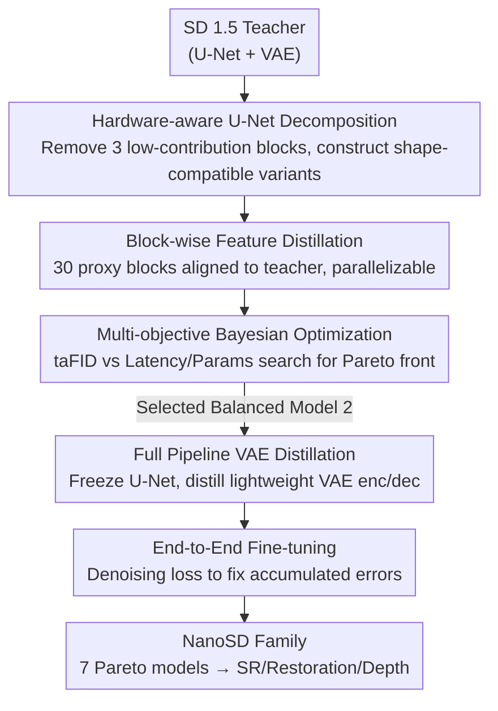

# NanoSD: Edge Efficient Foundation Model for Real Time Image Restoration

**Conference**: CVPR2026  
**arXiv**: [2601.09823](https://arxiv.org/abs/2601.09823)  
**Code**: To be confirmed  
**Area**: 3D Vision  
**Keywords**: Diffusion model distillation, edge deployment, image restoration, super-resolution, model compression, multi-objective optimization, Stable Diffusion

## TL;DR

NanoSD is proposed as a family of Pareto-optimal lightweight diffusion foundation models (130M–315M parameters, fastest 12ms inference) constructed through hardware-aware U-Net decomposition, block-wise feature distillation, and multi-objective Bayesian optimization. It serves as a drop-in backbone achieving SOTA performance in tasks such as super-resolution, face restoration, deblurring, and monocular depth estimation.

## Background & Motivation

**Restoration Capability vs. Deployment Paradox of Diffusion Models**: Latent Diffusion Models (LDM) like SD 1.5 possess powerful generative priors valuable for image restoration, but their full pipeline (U-Net + VAE) is computationally prohibitive for real-time execution on edge devices.

**Existing Lightweight Methods Limited to Single Tasks**: Current edge-efficient methods (AdcSR, TinySR, PocketSR, etc.) primarily target super-resolution using limited datasets, failing to fully leverage the rich priors in pretrained T2I models, leading to suboptimal architectures or poor perceptual details.

**Theoretical FLOPs $\neq$ Actual Latency**: NPUs are optimized for specific operator patterns (e.g., GEMM). Reducing FLOPs/GMACs does not guarantee a proportional decrease in actual latency, necessitating a hardware-centric re-evaluation of architecture design.

**Lack of Unified Conditional Mechanism Support**: Different restoration tasks require various control strategies (LoRA, ControlNet, visual prompts, etc.). Existing lightweight models lack flexible compatibility with these control plugins.

**Importance of Latent Space Preservation**: Previous methods mostly compress the denoising U-Net or shorten diffusion trajectories, which disrupts the underlying latent manifold and limits cross-task generalization.

**Lack of End-to-End Pipeline Co-optimization**: Most works only compress the U-Net while ignoring the VAE encoder-decoder, leaving the overall pipeline bulky.

## Method

### Overall Architecture

NanoSD addresses the contradiction between the value of SD 1.5 priors and the heavy computation of its U-Net+VAE pipeline on edge NPUs. Instead of manual pruning, it decomposes SD 1.5 into replaceable modules, pre-distills several lightweight variants for each module, and uses multi-objective search to automatically assemble a family of Pareto-optimal small models. The pipeline follows five steps: hardware-aware U-Net decomposition (removing low-contribution blocks and creating shape-compatible variants for retained stages); block-wise feature distillation to align with SD 1.5 teacher blocks; encoding module selection into discrete vectors for multi-objective Bayesian optimization to find the Pareto front; distilling a matching VAE while freezing the U-Net; and finally, end-to-end fine-tuning to eliminate accumulated errors.

### Key Designs

**1. Hardware-aware U-Net Decomposition: Making FLOPs Savings Reflect in Latency**

NPUs are optimized for specific operator patterns like GEMM. Purely reducing FLOPs does not proportionally reduce latency, and manual simplification risk damaging generative priors. NanoSD (Sec 3.1) first removes the least contributory components (encoder-4, middle block, decoder-4) from SD 1.5, retaining 3 encoders and 3 decoders. It then derives a set of variants for each stage (e.g., pure residual, reduced attention) that strictly maintain input/output tensor shapes. Shape compatibility is crucial—it ensures any module combination works without adapters, allowing $4 \times 4 \times 4 \times 8 \times 8 \times 8 = 32,768$ candidate architectures in the search space.

**2. Block-wise Feature Distillation: "Divide and Conquer" for Efficient Training**

Training 32K architectures from scratch is infeasible. NanoSD (Sec 3.2) independently performs L2 feature matching distillation for each candidate variant against its corresponding SD 1.5 teacher block: $\mathcal{L}_{\text{distill}}^{(i,j)} = \|O_S - O_T\|_2^2$. This requires training only 30 distillation proxy blocks ($3+3+3+7+7+7$), which is highly parallelizable and efficient. During assembly, these pretrained blocks are reused, eliminating the need to retrain entire candidate networks.

**3. Multi-objective Bayesian Optimization: Searching the Pareto Front**

NanoSD (Sec 3.4) defines Teacher-aligned FID (taFID) to measure divergence from the SD 1.5 output distribution. It performs dual-objective optimization (taFID vs. latency; taFID vs. parameters) by relaxing discrete module selection into a continuous space $\mathbf{x} \in [0,1]^6$, modeling objectives with Gaussian Processes, and sampling via Expected Hypervolume Improvement (EHVI). This identifies 7 Pareto-optimal models, such as NanoSD-Prime (Model 2: 315M params, 27ms latency, taFID=10), demonstrating that parameter count and latency are not strictly correlated.

**4. Full-pipeline VAE Distillation: Extending Compression Beyond the U-Net**

Prior edge methods often neglect the VAE, leaving the latent diffusion pipeline heavy and damaging the latent manifold. NanoSD (Sec 3.5) freezes the searched Pareto U-Net and performs feature matching distillation on the VAE. The student VAE utilizes Tiny ResNet blocks with a fixed 64-channel width and lightweight up/downsampling, replacing the 64→128→256→512 structure of the teacher. This compresses the encoder/decoder to ~2M/1.3M parameters (10ms/8ms in FP16). The final end-to-end fine-tuning with standard denoising loss corrects accumulated errors from block-wise assembly.

### Main Results

**Super-Resolution (DIV-2K Val)**:

| Method | PSNR↑ | SSIM↑ | LPIPS↓ | FID↓ | NIQE↓ | MUSIQ↑ | MACs(G) | Para.(M) |
|------|-------|-------|--------|------|-------|--------|---------|----------|
| Edge-SD-SR | 24.10 | 0.617 | 0.249 | 25.37 | - | 69.58 | - | 169 |
| AdcSR | 23.74 | 0.602 | 0.285 | 25.52 | 4.36 | 68.00 | 496 | 456 |
| TinySR | - | 0.572 | 0.279 | 22.94 | 4.15 | 69.90 | 427 | 341 |
| **Nano-S3Diff** | 23.13 | 0.573 | **0.278** | **22.34** | **4.09** | **70.44** | **285** | **318** |
| **Nano-OSEDiff** | **24.29** | **0.628** | 0.296 | 27.46 | 4.92 | 66.41 | 340 | 448 |

**Face Restoration (CelebA-Test)**:

| Method | LPIPS↓ | NIQE↓ | MUSIQ↑ | FID↓ | LMD↓ | MACs(G) | Para.(M) |
|------|--------|-------|--------|------|------|---------|----------|
| OSDFace | 0.336 | 3.884 | 75.64 | 45.41 | 5.286 | 2465 | 1887 |
| **Nano-OSDFace** | 0.341 | 3.913 | **76.01** | 45.92 | **5.172** | **479** | **415** |

Nano-OSDFace achieves ~5x reduction in MACs and ~4.5x reduction in parameters while outperforming the original OSDFace in MUSIQ and LMD.

### Ablation Study

- **Pareto Front Analysis**: 7 NanoSD variants cover 12ms–41ms latency and 130M–315M parameters. Manual models and Segmind TinySD are far from the Pareto front, proving manual simplification fails to retain priors effectively.
- **Latency vs. Parameter Inconsistency**: Model 5 has the lowest latency (12ms/170M), while Model 7 has the fewest parameters (27ms/130M), validating that parameter count is not a direct proxy for latency.
- **Multi-task Versatility**: The same NanoSD backbone is successfully integrated into OSEDiff, S3Diff, OSDFace, DiffBIR, Diff-Plugin, and Marigold frameworks.

## Highlights

- First to co-compress the entire SD 1.5 pipeline (U-Net + VAE) rather than just the denoising network.
- Highly efficient "divide and conquer" strategy: 30 proxy blocks enable assembly of 32K architectures.
- Strict hardware-aware design: Shape-compatible variants eliminate the need for adapters.
- Universal foundation model: Backbone is compatible with LoRA, ControlNet, and various condition plugins.
- Real-world deployment: 27ms verified on Qualcomm NPU with 8-bit weights/16-bit activations.

## Limitations & Future Work

- Distillation is based solely on SD 1.5; compression potential of SDXL or SD3 remains unexplored.
- taFID only measures distribution divergence from the teacher and may not directly correlate with downstream task metrics.
- Performance gap exists in depth estimation compared to full-sized Marigold (AbsRel 7.2 vs 5.5).
- Latency measurements are specific to Qualcomm NPUs; applicability to other platforms (Apple ANE, MediaTek APU) is unverified.
- Lack of detailed VAE distillation specifics in the main text hinders full reproducibility.

## Related Work & Insights

- **Diffusion Restoration**: StableSR, DiffBIR, and SeeSR use T2I priors but are computationally heavy.
- **Single-step Acceleration**: SinSR (bidirectional distillation), OSEDiff (variational score distillation), and S3Diff.
- **Architecture Compression**: SnapFusion (module contribution), MobileDiff (Transformer relocation), and SnapGen.
- **Edge-efficient SR**: AdcSR, Edge-SD-SR, TinySR, and PocketSR.
- **Segmind TinySD**: A manually simplified SD 1.5 that is significantly outperformed by NanoSD on the Pareto front.

## Rating

- Novelty: ⭐⭐⭐⭐
- Experimental Thoroughness: ⭐⭐⭐⭐⭐
- Writing Quality: ⭐⭐⭐⭐
- Value: ⭐⭐⭐⭐⭐

<!-- RELATED:START -->

## Related Papers

- [\[CVPR 2026\] Foundry: Distilling 3D Foundation Models for the Edge](foundry_distilling_3d_foundation_models_for_the_edge.md)
- [\[CVPR 2026\] ESAM++: Efficient Online 3D Perception on the Edge](esam_efficient_online_3d_perception_on_the_edge.md)
- [\[AAAI 2026\] RTGaze: Real-Time 3D-Aware Gaze Redirection from a Single Image](../../AAAI2026/3d_vision/rtgaze_real-time_3d-aware_gaze_redirection_from_a_single_image.md)
- [\[CVPR 2026\] SwiftTailor: Efficient 3D Garment Generation with Geometry Image Representation](swifttailor_efficient_3d_garment_generation_with_geometry_image_representation.md)
- [\[CVPR 2026\] Depth Any Panoramas: A Foundation Model for Panoramic Depth Estimation](depth_any_panoramas_a_foundation_model_for_panoramic_depth_estimation.md)

<!-- RELATED:END -->
