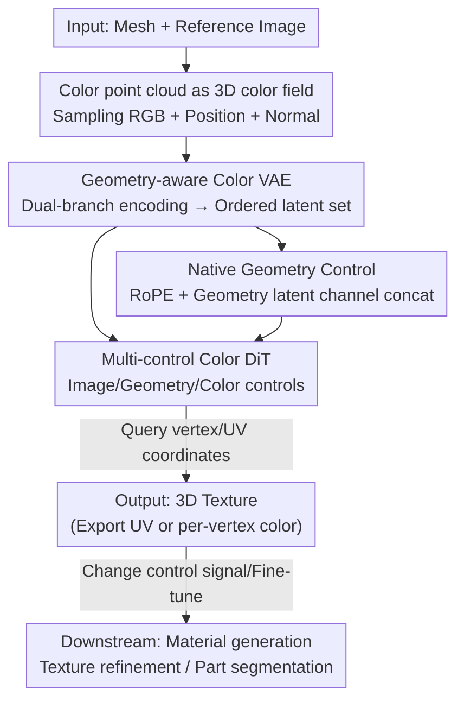

# NaTex: Seamless Texture Generation as Latent Color Diffusion

**Conference**: CVPR 2026  
**Paper**: [CVF Open Access](https://openaccess.thecvf.com/content/CVPR2026/html/Lai_NaTex_Seamless_Texture_Generation_as_Latent_Color_Diffusion_CVPR_2026_paper.html)  
**Code**: Project page https://natex-ldm.github.io (Code TBD)  
**Area**: 3D Vision / Texture Generation / Diffusion Models  
**Keywords**: 3D Texture Generation, Color Point Cloud, Latent Diffusion, Geometric Control, DiT

## TL;DR
NaTex redefines "coloring 3D meshes" as predicting a color field directly in 3D space. By using a geometry-aware color point cloud VAE to compress textures into an ordered latent set and applying a multi-control DiT for latent color diffusion, it completely bypasses the inherent defects of the multi-view diffusion (MVD) baking route regarding occlusion, alignment, and cross-view consistency. It significantly outperforms previous methods in texture coherence and alignment.

## Background & Motivation

**Background**: The current mainstream approach for automatically coloring 3D assets is "multi-view texturing." The workflow is intuitive: use geometry-conditioned Multi-View Diffusion (MVD) models to generate geometry-aligned 2D images from several viewpoints, then back-project and bake these 2D images onto the 3D surface using camera parameters. Its primary advantage is the direct reuse of powerful pre-trained 2D image generation models, resulting in good quality and diversity, making it the de facto standard for many research and commercial products (Rodin, Tripo, Hunyuan3D, etc.).

**Limitations of Prior Work**: However, the "2D lifting" path has three unavoidable flaws: (1) a lack of robust completion schemes for occluded regions, as no set of viewpoints can cover the entire surface, leading to ghosting or incorrect filling if inpainting fails; (2) difficulty in precisely aligning texture features with fine geometric details, where latent space diffusion introduces errors and 2D normal control is imprecise, often causing misalignments at boundaries; (3) difficulty in maintaining consistency in content, color, and lighting across multiple views, which even SOTA video models struggle to resolve. These errors accumulate through the projection and baking stages, eventually manifesting as artifacts on the texture map.

**Key Challenge**: The fundamental cause is the **cascading errors brought by modality change**. Projecting 3D shapes to 2D views naturally loses information (depth/normal maps discard occluded areas and structural details), and baking back from limited 2D views makes information loss and inconsistency structurally inevitable. Even works that switch to UV maps, point features, or Gaussian Splatting representation still suffer from data inefficiency and cascading errors.

**Goal**: Is it possible to treat 3D texture as a "first-class citizen" and generate colors natively in 3D space to eliminate modality changes at the source? Furthermore, can this paradigm be made scalable, similar to image, video, and geometry generation?

**Key Insight**: The authors observe that latent diffusion has been extremely successful in image, video, and 3D shape generation, but has not yet been applied to "texture generation." If texture can be represented in a 3D format suitable for diffusion, this successful paradigm can be transferred.

**Core Idea**: Treat texture as a "dense color point cloud"—a continuous color field $f(x)=c$ in 3D space (predicting color $c\in\mathbb{R}^3$ given coordinates $x\in\mathbb{R}^3$)—and generate it using **latent color diffusion**. This is supported by two components: a geometry-aware color VAE and a multi-control color DiT, both trained from scratch on 3D data.

## Method

### Overall Architecture
NaTex follows the standard two-stage latent diffusion structure but shifts the target from images/UV maps to 3D color point clouds. The input is a mesh (from an artist or geometry generators like Hunyuan3D) plus a reference image, and the output is the texture directly formed on the surface (which can be decoded into a UV map or queried for per-vertex/per-face colors).

The pipeline consists of two parts: (1) The **Geometry-aware Color VAE** handles "compression and reconstruction"—encoding color point clouds sampled from textured meshes (comprising RGB, positions, and normals, $P_c\in\mathbb{R}^{N\times 9}$) into a set of ordered latent vectors, while a parallel geometry branch extracts shape cues to guide color compression; during decoding, the color field can be restored by querying arbitrary coordinates. (2) The **Multi-control Color DiT** performs rectified flow diffusion in this latent space, flexibly receiving three types of signals: image control, geometry control, and color control to generate texture latent sets. During inference, UV coordinates/vertex positions are first converted to point clouds with normals, encoded by the geometry branch to obtain geometry latents and corresponding positions, which are then fed into the generator along with the input image for texture sampling.

### Key Designs

**1. Color Point Cloud as Native 3D Color Field: Eliminating Modality Change at the Source**

This is the foundational paradigm of the paper, directly addressing the "cascading errors from modality change" challenge. Previous methods either modeled in the projected 2D image space or the UV space, both requiring 3D-to-2D projection (losing information) or relying on UV unwrapping quality. NaTex defines texture as a continuous color field in 3D space: by densely sampling color point clouds from textured meshes, the goal is to learn a mapping $f(x)=c$ to predict RGB for any 3D coordinate. Because color is generated directly on the geometric surface, occluded regions are naturally covered, **eliminating the need for inpainting**; furthermore, as it bypasses 2D projection, cross-view consistency issues do not exist. Compared to UV space, it is independent of UV quality, more structurally coherent, and better suited for generative modeling. Additionally, this representation is a "universal container"—any modality representable as RGB-like data (e.g., PBR materials mapping metalness/roughness to modified albedo, or semantic part labels) can be fitted into the same latent space.

**2. Geometry-aware Color VAE: Tight Coupling for 80× Compression**

Performing diffusion directly on dense color point clouds is computationally expensive, necessitating compression. However, texture generation faces a unique challenge: how to inject fine-grained geometric conditions during generation. NaTex adopts the VecSet architecture from 3DShape2VecSet with two key modifications. First, **Ordered Latent Sets**: while the original shape autoencoder used unordered latent sets, NaTex point queries are known at test time (sampled from input geometry), making the latent sets naturally ordered and enabling "per-point geometric conditioning." Second, **Dual-branch Tight Coupling**: instead of using an independent ShapeVAE, a geometry VAE branch is added in parallel to the color VAE. The geometry encoder takes only positions and normals, while the color encoder takes positions, normals, and colors. The geometric latent set produced by the geometry branch serves as queries to guide the color encoder, allowing shape cues to deeply participate in color compression. Both branches share the Hunyuan3D-VAE backbone and are optimized jointly. The training loss includes three terms (Eq. 2):

$$L = \lambda_{KL}L_{KL} + \lambda_{color}L_{color} + \lambda_{udf}L_{UDF}$$

where $L_{color}$ supervises query points both **on the surface** and **near the surface** (near-surface points are obtained by random offsets within threshold $\gamma$ along the normal), ensuring color field continuity. $L_{UDF}$ uses truncated UDF (Eq. 1, where $o(x)$ is 1 if $udf(x)>s$ and $udf(x)/s$ otherwise). UDF is used instead of standard SDF because it is difficult to correspond color point clouds with watertight meshes. This design achieves over **80× compression**, paving the way for DiT scaling and supporting decoding at any resolution.

**3. Native Geometry Control: Perfect Geometric Alignment**

Multi-view texturing relies on "fragmented" geometry control (per-view normals/positions) and requires complex consistency modules, yet 3D structures remain ambiguous in single-view projections. NaTex proposes native geometry control via two complementary injection methods: (1) Applying **RoPE** positional encoding to the sampling query positions for coarse structural guidance; (2) Using the **geometry latent set** from the VAE geometry branch as fine-grained guidance. Crucially, the geometry latent set is **isomorphic** to the texture latent set (originating from the same ordered point queries), allowing it to be **concatenated along the channel dimension** to the noisy texture latents. This "intertwining of geometry and color tokens" ensures the model is continuously constrained by precise surface prompts during generation, achieving alignment at geometric boundaries that other methods cannot match.

**4. Multi-control Color DiT: Unified Generator for Downstream Applications**

The generator utilizes a rectified flow DiT architecture with double stream and single stream blocks. it flexibly handles three types of control: **Image Control** using Dinov2-Giant's last layer embeddings (without class token) at a resolution of 1022 (higher than Hunyuan3D-2's 518 to capture detail) while using binary masks to maintain aspect ratios; **Geometry Control** via RoPE and geometry latent concatenation; **Color Control**, where an initial texture is sampled as a color point cloud, passed through the VAE, and concatenated as conditional color latents. It uses flow matching loss. For albedo generation, it incorporates an illumination invariance loss from MaterialMVP (Eq. 3):

$$L = \|\epsilon_{pred}-\epsilon_{gt}\|_2^2 + \gamma\|\epsilon_{pred}-\epsilon_{pred2}\|_2^2$$

restricting the model's sensitivity to lighting. The "color control" switch allows the same framework to cover texture generation, material generation, texture refinement, and part segmentation with minimal changes. Part segmentation can even be **training-free** by feeding 2D segmentations into the model to generate textures aligned with 3D parts.

### Loss & Training
The VAE stage jointly optimizes KL, color regression (surface + near-surface supervision), and truncated UDF losses (Eq. 1, 2). The DiT stage uses flow matching loss, with an additional illumination invariance term for albedo tasks (Eq. 3). **NaTex-2B** was trained primarily for texture generation. Notably, while trained on up to 6144 tokens, it supports different token counts and sampling steps during inference and can achieve **one-step generation** without distillation, which the authors attribute to the strong conditional signals.

## Key Experimental Results

### Main Results

Reconstruction quality improves consistently with latent set size (Table 1); note the model is trained on 6144 tokens but benefits from larger latent sizes (* indicates calculation on six orthogonal views):

| Latent Size | PSNR↑ | PSNR↑∗ | SSIM↑∗ | LPIPS↓∗ |
|---------|-------|--------|--------|---------|
| 6144 × 64 | 28.74 | 31.70 | 0.980 | 0.0492 |
| 12288 × 64 | 29.95 | 33.19 | 0.984 | 0.0445 |
| 24576 × 64 | 30.86 | 34.30 | 0.987 | 0.0411 |

In image-conditioned texture generation (comparing Albedo using MaterialMVP's protocol), NaTex leads across cFID, CMMD, and LPIPS (Table 2):

| Method | cFID↓ | CMMD↓ | CLIP↑ | LPIPS↓ |
|------|-------|-------|-------|--------|
| Paint3D | 26.86 | 2.400 | 0.887 | 0.126 |
| TexGen | 28.23 | 2.447 | 0.882 | 0.133 |
| Hunyuan3D-2 | 26.43 | 2.318 | 0.889 | 0.126 |
| RomanTex | 24.78 | 2.191 | 0.891 | 0.121 |
| MaterialMVP | 24.78 | 2.191 | **0.921** | 0.121 |
| **NaTex (Ours)** | **21.96** | **2.055** | 0.908 | **0.102** |

### Ablation Study

| Configuration | Observation | Explanation |
|------|------|------|
| Full Model | Good alignment with image and geometry | Presence of RoPE and tight-coupled geometry embedding |
| w/o RoPE | Degraded image-texture alignment | Removal of RoPE on query point positions |
| Decoupled ShapeVAE | Degraded texture-geometry alignment | Validates necessity of tight-coupled geometry branch |

### Key Findings
- **Geometric alignment is NaTex's standout advantage**: Visual comparisons show other methods (including closed-source commercial models like Rodin-Gen2/Tripo 3.0) consistently misalign at geometric boundaries and produce artifacts in non-occluded regions, whereas NaTex achieves near-perfect alignment.
- **Complementary geometric conditions**: RoPE mainly improves image-texture alignment, while tight-coupled geometry embeddings improve texture-geometry alignment; both are essential.
- **Efficient inference from strong conditioning**: Higher token counts yield better quality/alignment, but the model can generate in one step without distillation. Refinement tasks require only 5 steps.
- **Neural completion outperforms traditional methods**: In occluded areas, NaTex generates cleaner, better-aligned textures compared to traditional interpolation (e.g., OpenCV).

## Highlights & Insights
- **Paradigm Redefinition**: Reconceptualizing "texture" as a "3D dense color point cloud" eliminates occlusion, consistency, and alignment issues at a structural level.
- **Ordering of VecSets**: Turning the latent set from unordered to ordered (since point queries are known) is the technical prerequisite for per-point geometric conditioning.
- **Isomorphism → Channel Concatenation**: Since geometry and texture latents are isomorphic, geometric guidance can be "pasted" into noisy latents with zero sequence overhead.
- **Unified VAE for Multimodality**: Mapping PBR and part labels into the same RGB-like latent space allows switching tasks by simply changing control signals.

## Limitations & Future Work
- **Dependence on Input Geometry**: NaTex colors provided meshes; errors in geometry generation (from external tools like Hunyuan3D) directly limit texture quality.
- **All-from-scratch 3D Training**: By abandoning the 2D lifting route, it forfeits the benefits of massive 2D pre-trained models. The long-term diversity relies on the scale of 3D texture data.
- **Preliminary Downstream Verification**: Tasks like material generation and part segmentation lack systematic quantitative comparisons with specialized SOTAs.
- **Albedo-Centric Evaluation**: Most quantitative comparisons focus on Albedo; evidence for full PBR quality remains less extensive.

## Related Work & Insights
- **vs. Multi-view Diffusion (Hunyuan3D-2 / MaterialMVP, etc.)**: These methods suffer from projection-based errors; NaTex avoids these by generating natively in the 3D color field.
- **vs. Other Native 3D Methods (Trellis / UniTEX, etc.)**: Others rely on octrees, triplanes, or UV-as-image, which are limited by resolution or efficiency. NaTex is the first to apply scalable latent diffusion to native color point clouds.
- **Architectural Lineage**: Inherits the VAE logic from 3DShape2VecSet, DiT from rectified flow transformers, and image conditioning from Dinov2. It serves as a model for migrating 2D/3D generative components to a new 3D color field representation.

## Rating
- Novelty: ⭐⭐⭐⭐⭐ 
- Experimental Thoroughness: ⭐⭐⭐⭐ 
- Writing Quality: ⭐⭐⭐⭐⭐ 
- Value: ⭐⭐⭐⭐⭐ 

<!-- RELATED:START -->

## Related Papers

- [\[CVPR 2026\] MatLat: Material Latent Space for PBR Texture Generation](matlat_material_latent_space_for_pbr_texture_generation.md)
- [\[CVPR 2026\] CaliTex: Geometry-Calibrated Attention for View-Coherent 3D Texture Generation](calitex_geometry-calibrated_attention_for_view-coherent_3d_texture_generation.md)
- [\[CVPR 2026\] StableMTL: Repurposing Latent Diffusion Models for Multi-Task Learning from Partially Annotated Synthetic Datasets](stablemtl_repurposing_latent_diffusion_models_for_multi-task_learning_from_parti.md)
- [\[CVPR 2026\] Color-Encoded Illumination for High-Speed Volumetric Scene Reconstruction](color-encoded_illumination_for_high-speed_volumetric_scene_reconstruction.md)
- [\[CVPR 2026\] CraftMesh: High-Fidelity Generative Mesh Manipulation via Poisson Seamless Fusion](craftmesh_high-fidelity_generative_mesh_manipulation_via_poisson_seamless_fusion.md)

<!-- RELATED:END -->
