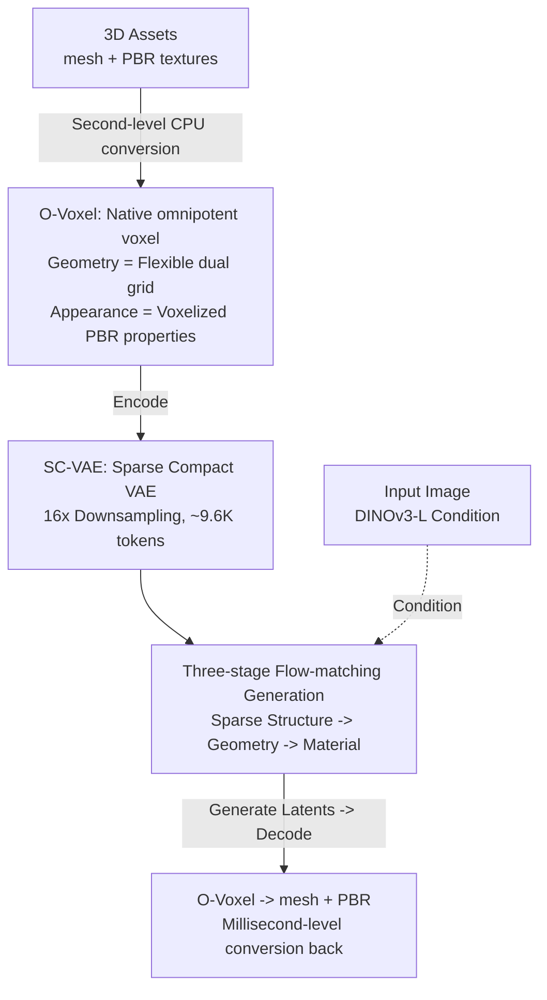

# Native and Compact Structured Latents for 3D Generation

**Conference**: CVPR 2026 (Best Student Paper)  
**arXiv**: [2512.14692](https://arxiv.org/abs/2512.14692)  
**Code**: [GitHub](https://github.com/microsoft/TRELLIS.2) (Open-sourced; i.e., TRELLIS.2, with the TRELLIS.2-4B model available on HuggingFace)  
**Project Page**: [microsoft.github.io/TRELLIS.2](https://microsoft.github.io/TRELLIS.2/)  
**Demo**: [HuggingFace Spaces - TRELLIS.2](https://huggingface.co/spaces/microsoft/TRELLIS.2)  
**Area**: 3D Vision  
**Keywords**: 3D Generation, Native 3D Latent Space, Sparse Voxel, PBR Material, Flow Matching

## TL;DR

Under the name of TRELLIS.2, this work is a follow-up by the original TRELLIS team, proposing a structured latent representation learned directly from native 3D data. Its core is a field-free, versatile voxel representation termed O-Voxel, which encodes geometry of arbitrary topology and PBR materials into a unified flexible dual grid. Furthermore, a Sparse Compact VAE (SC-VAE) is designed to achieve $16\times$ spatial downsampling, compressing $1024^3$ fully-textured assets into approximately 9.6K tokens. Finally, a three-stage Flow-matching model with around 4B parameters is trained for image-to-3D generation, significantly outperforming existing methods in reconstruction fidelity, material quality, and generation speed.

## Background & Motivation

**Background**: In recent years, large-scale 3D generation (such as CLAY, TRELLIS, Dora, Direct3D, SparseFlex) has progressed rapidly. The mainstream paradigm first encodes 3D assets into a compact latent space and then trains a latent generative model within it, achieving reconstruction and generation quality near industry-readiness.

**Limitations of Prior Work**: The primary bottleneck lies in the representation layer. First, geometric representations are mostly based on isosurface fields (SDF, Flexicubes, etc.), which naturally fail to handle open surfaces, non-manifold geometries, and enclosed internal structures, while requiring expensive preprocessing such as SDF evaluation, flood-filling, and iterative optimization. Second, most works focus purely on shape, neglecting appearance and materials that are highly correlated with shape. Even though TRELLIS jointly models geometry and appearance, it relies on multi-view 2D image features as inputs and learns through pure rendering supervision, leading to insufficient capture of complex structures and materials. Third, structured latent spaces based on sparse voxels (such as TRELLIS and SparseFlex) achieve high geometric accuracy but generate an enormous number of tokens ($225\text{K}$ tokens for SparseFlex at $1024^3$), indicating a low compression rate that hinders scaling to high resolutions.

**Key Challenge**: "Unstructured latent spaces" (Perceiver-style, e.g., 3DShape2VecSet/CLAY) offer high compression ratios but suffer from limited reconstruction fidelity, whereas "structured sparse latent spaces" achieve high fidelity but suffer from excessively large token counts and low compression. Neither pathway achieves both compactness and high fidelity, and both bypass learning appearance/materials directly from native 3D data.

**Key Insight**: The goal is to construct a native 3D representation that can faithfully represent the "full spectrum" of information (arbitrary-topology geometry + complete materials) of any 3D asset while being efficiently compressed into a compact latent space by a neural network, thereby supporting high-resolution, end-to-end, shape-material aligned generation. To this end, this work abandons isosurface fields and returns to "voxels + dual grids"—an explicit, discrete structure that allows instant mutual conversion with meshes. Both geometry and materials are "packed" into sparse voxels, termed the field-free O-Voxel. Incorporating the residual autoencoding mechanics of 2D image DC-AE, a sparse convolutional VAE (SC-VAE) with a high compression ratio is designed to learn a compact "native structured latent space." Finally, a three-stage Flow-matching model is run on this space to directly generate fully textured 3D assets.

## Method

### Overall Architecture

The methodology is built around three consecutive blocks: first, defining a native 3D representation (O-Voxel) that can accommodate arbitrary geometry and materials; second, learning a highly compressed latent space (SC-VAE); and third, training a generative model (three-stage Flow DiT) within this latent space. Given an input image, the model sequentially generates three sets of latents in the compact latent space: "occupancy structure → geometry → material", decodes them back to O-Voxel, and instantly converts them (in milliseconds) back to a mesh with PBR materials. These three parts precisely correspond to Sections 3.1, 3.2, and 3.3 of the paper.

### Key Designs

**1. O-Voxel: Native Encoding of Arbitrary Topology Geometry and PBR Materials with Field-Free Omnipotent Voxels**

Addressing the limitation that "field representations cannot handle open/non-manifold/enclosed surfaces and only manage geometry," O-Voxel represents each active sparse voxel as a feature tuple $\boldsymbol{f}=\{(\boldsymbol{f}^{\text{shape}}_i,\boldsymbol{f}^{\text{mat}}_i,\boldsymbol{p}_i)\}_{i=1}^L$, where geometry and material are aligned with the grid, and empty voxels are marked as inactive.

On the geometry side, it leverages a **Flexible Dual Grid**, inspired by Dual Contouring (DC), but with a critical difference: **it avoids any field evaluation entirely**. Instead, it directly uses the mesh surface to determine the intersections between voxel edges and the surface, assigning Hermite data (intersection point $\boldsymbol{q}_i$ and normal $\boldsymbol{n}_i$). Any edge intersecting the mesh activates the corresponding dual face. The geometric feature $\boldsymbol{f}^{\text{shape}}_i$ of each active voxel includes three components: the dual vertex $\boldsymbol{v}_i\in\mathbb{R}^3_{[0,1]}$, intersection signs along three predefined X/Y/Z edges $\boldsymbol{\delta}_i\in\{0,1\}^3$, and a splitting weight $\gamma_i$. The dual vertex $\boldsymbol{v}$ is solved in closed form by a Quadratic Error Function (QEF):

$$\min_{\boldsymbol{v}\in\text{voxel}} e(\boldsymbol{v})=\sum_i d_{\Pi,i}^2 + \lambda_{\text{bound}}\sum_j d_{L,j}^2 + \lambda_{\text{reg}}\, d_{\hat{\boldsymbol{q}}}^2 .$$

The first term $d_{\Pi,i}^2=(\boldsymbol{n}_i\cdot(\boldsymbol{v}-\boldsymbol{q}_i))^2$ is the point-to-plane distance existing in the original DC. This work introduces the second term (distance from the vertex to the open boundary edge of the mesh) specifically to pull the dual vertices toward boundaries and improve the expression of open surfaces, and the third term (bringing the vertex closer to the mean intersection point $\bar{\boldsymbol{q}}$) for regularization to stabilize the QEF solver and avoid singularities. This brings three direct benefits: **instant bi-directional mesh↔O-Voxel conversion** (no SDF evaluation, flood-filling, or iterative optimizations needed, taking only seconds on a CPU to encode and tens of milliseconds to decode); **arbitrary topology capability** (free from watertight/manifold constraints, making it capable of handling self-intersections and enclosed inner cavities); and **sharp feature preservation** (dual vertices naturally align with geometric features, and $\boldsymbol{v}$ and $\gamma$ can be further refined by the network using rendering losses).

The above describes the mesh $\rightarrow$ O-Voxel encoding. Conversely, **O-Voxel $\rightarrow$ mesh** decoding reconstructs the mesh by extracting these three features: first, the intersection signs $\boldsymbol{\delta}_i$ of each voxel determine which adjacent dual vertices should connect to form quadrilateral faces—$\boldsymbol{\delta}$ encodes the connectivity topology of the reconstructed mesh; next, these dual vertices $\boldsymbol{v}_i$ are connected to form quadrilaterals; finally, each quadrilateral is adaptively split into two triangles according to the splitting weight $\gamma_i$ to conform to local geometry, yielding a triangular mesh. This entire process takes tens of milliseconds without iteration or field evaluations. In short: $\boldsymbol{v}$ controls where the vertices are placed, $\boldsymbol{\delta}$ controls who connects to whom, and $\gamma$ governs the triangulation; together, they losslessly reconstruct the mesh.

On the material side, it stores **voxelized PBR properties**: each active voxel stores a 6-channel vector $\boldsymbol{f}^{\text{mat}}_i=(\boldsymbol{c}_i,m_i,r_i,\alpha_i)$—base color, metallic, roughness, and opacity. This goes beyond the limitation of "texture color only", especially with $\alpha$ (opacity) enabling the expression of semi-transparent materials (like glass), which was absent in prior methods. The texture $\leftrightarrow$ O-Voxel conversion is performed via simple and fast projection sampling + trilinear interpolation, allowing the decoded mesh to be directly renderable without post-processing.

**2. SC-VAE: Sparse Convolution + Residual Autoencoding to Compress O-Voxel by 16x**

To support high-resolution generation, the latent space must be extraordinarily compact. SC-VAE is a U-shaped, **fully sparse convolutional** VAE (unlike the Transformer architectures in TRELLIS/SparseFlex), which is computationally efficient at high resolutions and generalizes well across scales. It achieves a rare **$16\times$ spatial downsampling** for voxel-based methods—compressing a $1024^3$ fully-textured asset into only around 9.6K tokens with almost negligible perceptual loss. It achieves this high level of compression without sacrificing quality through three key components:

First, the **Sparse Residual Autoencoding Layer**: This ports the 2D image DC-AE's residual autoencoding mechanism to sparse voxels, introducing non-parametric residual shortcuts in down/upsampling blocks and rearranging information between spatial and channel dimensions to mitigate optimization difficulties under extreme compression. Downsampling (by a factor of 2) aggregates the 8 children nodes of each voxel into the channel dimension: $F_{\text{coarse}}^{\text{raw}}=\operatorname{stack}(F_{\text{child}_1},\dots,F_{\text{child}_8})\in\mathbb{R}^{8C}$, which is then grouped and averaged ($\operatorname{avg\_groups}$) into $\mathbb{R}^{C'}$ (where missing voxels contribute zero vectors); upsampling symmetrically scatters channels back to neighbors.

Second, the **Early-Pruning Upsampler**: Prior to each upsampling step, it predicts a binary mask $\boldsymbol{\hat{\rho}}\in\{0,1\}^8$ indicating which sub-voxels are active, entirely skipping inactive nodes to drastically reduce runtime and GPU memory consumption.

Third, the **Optimized Residual Block**: Sparse convolutions suffer from low computational/parameter efficiency on highly sparse data. Inspired by ConvNeXt, this block simplifies "two convolutional layers" into "one convolutional layer + a wide point-wise MLP" (similar to a Transformer's FFN), enhancing non-linear expression and reconstruction quality without increasing computational overhead.

Additionally, to support sequential "shape-then-material" generation (which also facilitates generating materials individually for a given shape), the paper trains **two decoupled SC-VAEs**: one for shaping geometry, and the other for modeling materials conditioned on the upsampled tessellation structure of the shape VAE.

**3. Three-Stage Flow-matching Native Generation: Sparse Structure -> Geometry -> Material**

Within the learned latent space, following the overall design of TRELLIS, the authors train a full DiT using Flow Matching, dividing the generative process into three models and three stages: ① sparse structure generation, which predicts the occupancy layout of the sparse voxel grid; ② geometry generation, which produces geometric latent codes within active voxels; and ③ material generation, which outputs material latent codes aligned with the geometric structure. While the first two stages largely inherit from TRELLIS to establish the geometric skeleton, **the third stage is the critical new addition**—a sparse DiT conditioned jointly on the "input image + generated geometry latent codes" to model PBR materials directly in the native 3D space. This unifies geometry and materials in the same native 3D latent space, guaranteeing spatial alignment under arbitrary topologies and bypassing view-dependent post-processing like "multi-view baking of textures onto a generated mesh."

In implementation, the DiT leverages AdaLN-single modulation + RoPE to improve scalability and cross-resolution generalization, with image conditioning features extracted from DINOv3-L. Thanks to the high compression from SC-VAE, the sparse DiT discards the convolutional packing and skip connections of TRELLIS, collapsing into a simpler and more efficient vanilla DiT. Each DiT contains approximately 1.3B parameters (width 1536, 30 layers, 12 heads, MLP width 8192), culminating in ~4B parameters across the entire framework. A **progressive training** strategy is adopted: the model first learns coarse occupancy priors using a $512\times512$ conditioning image, and subsequently scales up the geometry/material generators from $512^3$ output ($32^3$ latent resolution) to $1024^3$ output ($64^3$ latent resolution), while synchronously upgrading the conditioning image resolution to 1024.

### Loss & Training

SC-VAE is trained in two stages. In the first stage, it employs a direct O-Voxel reconstruction loss + KL at low resolution to quickly stabilize learning: MSE is used for dual vertices $\boldsymbol{v}$ on geometry, BCE for dual face indicators $\boldsymbol{\delta}$, L1 for material $\boldsymbol{f}^{\text{mat}}$, and BCE for pruning masks $\boldsymbol{\rho}$:

$$\mathcal{L}_{\text{s1}}=\lambda_{\text{v}}|\hat{\boldsymbol{v}}-\boldsymbol{v}|_2^2+\lambda_{\delta}\operatorname{BCE}(\hat{\boldsymbol{\delta}},\boldsymbol{\delta})+\lambda_{\boldsymbol{\rho}}\operatorname{BCE}(\hat{\boldsymbol{\rho}},\boldsymbol{\rho})+\lambda_{\text{mat}}|\hat{\boldsymbol{f}}^{\text{mat}}-\boldsymbol{f}^{\text{mat}}|_1+\lambda_{\text{KL}}\mathcal{L}_{\text{KL}} .$$

The second stage introduces rendering-perceptual supervision at high resolution, $\mathcal{L}_{\text{s2}}=\mathcal{L}_{\text{s1}}+\mathcal{L}_{\text{render}}$, where rendered masks/depth/normals are supervised by L1, with normals additionally monitored by SSIM and LPIPS. Material properties are rendered and supervised via perceptual losses. Random camera positioning with a very shallow near-plane is used to cut through surfaces, forcing the model to learn both outer and inner structural details. Generative models are trained using AdamW (lr $1\times10^{-4}$, weight decay 0.01) + classifier-free guidance (drop rate 0.1).

## Key Experimental Results

### Main Results

Shape reconstruction is evaluated on two unseen test sets, Toys4K and Sketchfab Featured, in comparison with Dora, TRELLIS, Direct3D-S2, and SparseFlex. The paper utilizes three sets of metrics: **MD** (Mesh Distance, bi-directional point-to-mesh distance + F1, **including internal structures**, lower is better), **CD** (Chamfer Distance + F1, sampled only on the visible **outer surface**, lower is better), and **PSNR/LPIPS of rendered normal maps** (measuring surface quality). The table below extracts the most intuitive normal map PSNR/LPIPS (decoding time is evaluated on an A100 GPU):

| Method | #Token | Downsampling | Decode (s) | Toys4K Normal PSNR↑ | Toys4K LPIPS↓ | Sketchfab Normal PSNR↑ | Sketchfab LPIPS↓ |
|------|--------|--------|---------|-------------------|----------------|----------------------|-------------------|
| TRELLIS | 9.6K | 4× | – | 30.29 | 0.067 | 24.31 | 0.110 |
| Direct3D-S2 1024 | 17K | 8× | – | 27.38 | 0.134 | 23.82 | 0.138 |
| SparseFlex 1024 | 225K | 4× | 3.21 | 37.34 | 0.042 | 32.12 | 0.036 |
| **Ours 512** | 2.2K | 16× | 0.077 | 39.54 | 0.013 | 31.00 | 0.034 |
| **Ours 1024** | 9.6K | 16× | 0.301 | **43.11** | **0.005** | **35.26** | **0.013** |

Ours $1024^3$ utilizes only 9.6K tokens (equivalent to TRELLIS, and only 1/23 of SparseFlex 1024) while dramatically leading in every metric, with its decoding speed being an order of magnitude faster (0.301s vs. SparseFlex 3.21s). Crucially, the division between MD and CD validates the claim of "representing internal structures": field-based baselines perform acceptably when measured by CD (which only evaluates outer surfaces), but falter on MD which incorporates internal structures—on Toys4K, TRELLIS's All-Surface F1 (@1e-8) is only 0.074, whereas Ours 1024 reaches 0.971, proving that former methods cannot depict closed cavities/inner surfaces, whereas the field-free O-Voxel representation can. No comparable baseline exists for material reconstruction; Ours alone reports: PBR attribute map 38.89 dB / 0.033, shaded map 38.69 dB / 0.026, demonstrating sound shape-appearance alignment.

Image-to-3D generation comparison (CLIP/CLIP-N/ULIP-2/Uni3D, higher is better; Pref indicates user preference rates from ~40 human evaluators across 100 AI-generated prompt images):

| Method | CLIP↑ | CLIP-N↑ | ULIP-2↑ | Uni3D↑ | Pref %↑ | Pref-N %↑ |
|------|-------|---------|---------|--------|--------|----------|
| TRELLIS | 0.876 | 0.748 | 0.470 | 0.414 | 6.40% | 2.82% |
| Step1X-3D | 0.875 | 0.738 | 0.464 | 0.411 | 11.8% | 0.47% |
| Hunyuan3D 2.1 | 0.869 | 0.753 | 0.474 | 0.427 | 13.3% | 7.51% |
| **Ours** | **0.894** | **0.758** | **0.477** | **0.436** | **66.5%** | **69.0%** |

Ours achieves the highest performance in all alignment metrics and overwhelmingly dominates in user preference at 66.5% / 69.0% (with the second-highest being only 13.3%). Additionally, the third stage can independently serve as a 3D PBR texture generator given "mesh + reference image". Compared with multi-view baking (Hunyuan3D-Paint) and UV-mapping methods (TEXGen), it can natively reason about appearance directly in 3D, creating sharper textures, cross-view consistency, and coloring capability even for occluded/non-manifold internal surfaces.

### Ablation Study

SC-VAE architecture ablation (evaluated on Sketchfab assets at $256^3$, MD lower is better):

| Configuration | #Token | MD↓ | Normal PSNR↑ | Description |
|------|--------|------|-----------|------|
| SC-VAE f16c32 (Full) | 503 | 1.032 | 27.26 | 16x compression full model |
| w/o Sparse Residual Autoencoding | 503 | 1.747 | 26.73 | MD +69%, PSNR -0.5dB |
| w/o Optimized Residual Block | 503 | 1.198 | 26.67 | MD +16%, PSNR -0.6dB, runtime unchanged |
| SC-VAE f32c128 (Full) | 118 | 1.405 | 26.65 | 32x compression full model |
| w/o Sparse Residual Autoencoding | 118 | 7.394 | 25.01 | MD +526%, PSNR -1.6dB |

### Key Findings

- **Sparse Residual Autoencoding is critical for high compression ratios**: Without it, MD increases by 69% at $16\times$ compression and breaks down completely at $32\times$ compression (MD +526%, PSNR -1.6dB). The higher the compression ratio, the more critical it becomes to maintain high fidelity under severe spatial bottlenecks.
- **Optimized residual blocks offer "free" quality improvements**: Replacing standard dual convolutions with "one convolution + a wide point-wise MLP" reduces MD by 16% and improves PSNR by 0.6dB with virtually no change in runtime, indicating that a wider MLP is more cost-effective than stacking convolutions on highly sparse data.
- **A compact latent space enables test-time scaling**: The small token count allows cascading reuse of the second-stage generator. By downsampling the generated $1024^3$ O-Voxel to a $96^3$ sparse structure and re-running geometry generation, it is possible to extrapolate to $1536^3$, out-of-distribution to the original training resolution. Within the training resolution, cascade inference can similarly correct local errors, offering a controllable trade-off between "compute and quality".
- **Speed**: Generating assets takes ~3s at $512^3$, ~17s at $1024^3$, and ~60s at $1536^3$ using an H100, which is significantly faster than contemporaneous large models of similar scale.

## Highlights & Insights

- **"Field-free" is the key emancipation**: Abandoning SDFs/isosurfaces untethers the geometric representation from watertight/manifold constraints. Open surfaces, non-manifold geometry, and enclosed cavities can all be represented, and mesh conversion drops from "second-level optimization" to "instant." The choice of representation directly determines how much information can be preserved and how expensive the preprocessing will be.
- **Porting 2D compression expertise to 3D**: DC-AE's residual autoencoding is natively a technique for 2D image VAEs. The authors adapt it to sparse voxels and combine it with ConvNeXt-style residual blocks, achieving a rare $16\times$ compression ratio for voxel-based methods—exemplifying cross-modal migration of mature modules.
- **Grid-aligned, shared latent space for both materials and geometry**: Voxelizing PBR (including opacity) directly and introducing an individual material generation stage inside the native 3D space natively solves stitching, ghosting, and cross-view inconsistency found in multi-view baking. This "material generation stage" can be migrated to any existing shape generator for plug-and-play 3D texturing.
- **Compactness Equals Scalability**: A smaller token count not only saves computational costs but also unlocks cascading inference and out-of-distribution generation beyond training resolutions. This causal relationship of "compression ratio $\rightarrow$ test-time scaling" is highly instructive for other generative 3D works.

## Limitations & Future Work

- **Dependence on mesh quality and intersection checks**: O-Voxel conversion directly uses mesh surfaces to determine intersections and Hermite data, which can drift for broken, degenerate, or extremely thin meshes and noisy normals. The paper leaves robustness on non-mesh inputs (like point clouds and scans) under-explored.
- **Materials limited to the standard 6-channel PBR**: Materials of higher complexity beyond base color, metallic, roughness, and opacity (e.g., subsurface scattering, anisotropy, transmission IOR) are not yet covered, and semi-transparency is simplified via single-channel $\alpha$.
- **High computational barrier**: Training 4B parameter models on 16/32 H100 GPUs translates to high reproduction costs. Despite open-sourcing commitments, the barrier for downstream fine-tuning and customizing materials remains considerable.
- **Decoupled dual VAEs and three-stage cascades**: Distributing shape and material into two separate VAEs and cascading generation across three stages lengthens the pipeline and risks error accumulation (e.g., imprecise geometry degrades subsequent material alignment). End-to-end joint optimization is a promising direction.

## Related Work & Insights

- **vs. TRELLIS (SLAT)**: The prior work by the same authors. TRELLIS's structured latent space is derived from **multi-view 2D image features** and supervised via pure rendering, and its asset extraction still relies on multi-view baking to combine meshes and 3D Gaussians. This work transitions to learning the latent space (O-Voxel) directly from **native 3D data**; it achieves $16\times$ compression, outputs fully textured assets end-to-end, eliminates all view-dependent post-processing, and comprehensively improves geometric and material fidelity.
- **vs. SparseFlex / Direct3D-S2**: Also built on structured sparse voxels to yield high geometric accuracy, but still limited by field primitives (preventing description of open/non-manifold surfaces) and hindered by enormous token counts (reaching $225\text{K}$ for SparseFlex at $1024^3$). In contrast, this work is field-free, compresses elements by $16\times$ to 9.6K tokens, is both more compact and higher in fidelity, and incorporates material modeling.
- **vs. CLAY / Dora (Unstructured Latent Spaces)**: Perceiver-style or 3DShape2VecSet approaches offer high compression rates but suffer from compromised reconstruction quality. This work's structured sparse prior provides a distinct advantage in fidelity while scaling up the compression ratio via residual autoencoding.
- **vs. Hunyuan3D / Step1X-3D (Two-Stage "Shape + Multi-View Textures")**: These depend on powerful 2D diffusion backbones but demand complex multi-view rendering, baking, and alignment, which are highly susceptible to appearance inconsistencies. This work operates natively end-to-end, directly generating aligned materials in 3D.

## Rating

- Novelty: ⭐⭐⭐⭐⭐ Field-free omnipotent voxel O-Voxel + native 3D latent space, rethinking the concept from the representation layer to unify geometry and PBR materials.
- Experimental Thoroughness: ⭐⭐⭐⭐⭐ Covers three categories of tasks (reconstruction, generation, texturing) with multiple baseline comparisons, user studies, model ablations, and test-time scaling statistics, yielding solid data.
- Writing Quality: ⭐⭐⭐⭐ Clear structure with detailed diagrammatic algorithms; however, dense notations and tables present a slightly steep initial reading threshold.
- Value: ⭐⭐⭐⭐⭐ Delivers $16\times$ compression, massive fidelity improvements, fast speeds, and a commitment to open-sourcing models, code, and data, promising a high impact on the 3D generation community.

<!-- RELATED:START -->

## Related Papers

- [\[CVPR 2025\] Structured 3D Latents for Scalable and Versatile 3D Generation](../../CVPR2025/3d_vision/structured_3d_latents_for_scalable_and_versatile_3d_generation.md)
- [\[CVPR 2026\] TEXTRIX: Latent Attribute Grid for Native Texture Generation and Beyond](textrix_latent_attribute_grid_for_native_texture_generation_and_beyond.md)
- [\[CVPR 2026\] SGI: Structured 2D Gaussians for Efficient and Compact Large Image Representation](sgi_structured_2d_gaussians_for_efficient_and_compact_large_image_representation.md)
- [\[CVPR 2026\] Grounded Latents for Entity-Centric 4D Scene Generation](grounded_latents_for_entity-centric_4d_scene_generation.md)
- [\[CVPR 2026\] PoseMaster: A Unified 3D Native Framework for Stylized Pose Generation](posemaster_a_unified_3d_native_framework_for_stylized_pose_generation.md)

<!-- RELATED:END -->
