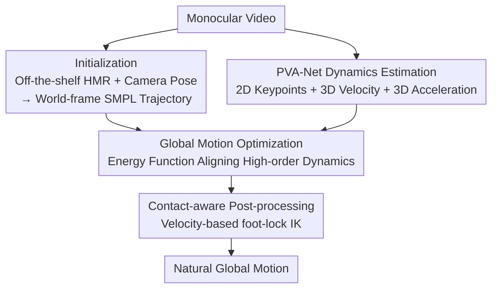

# Natural Human Motion Recovery by Aligning High-Order Temporal Dynamics from Monocular Videos

**Conference**: CVPR 2026  
**arXiv**: [2605.26879](https://arxiv.org/abs/2605.26879)  
**Code**: https://zju3dv.github.io/htd-refine/ (project page)  
**Area**: 3D Vision / Human Motion Recovery (HMR)  
**Keywords**: Monocular Motion Recovery, High-Order Temporal Dynamics, Velocity/Acceleration Fields, Global Trajectory Optimization, Post-processing Refinement

## TL;DR
Addressing the issue where monocular human motion recovery results have accurate joint positions but appear either jittery or over-smoothed, this paper proposes HTD-Refine. It uses a lightweight temporal network, PVA-Net, to explicitly predict the 3D velocity and acceleration of each joint from video. These high-order dynamics serve as soft constraints to optimize global trajectories. This plug-and-play approach reduces jitter, suppresses over-smoothing, and improves global accuracy for existing methods like TRAM, GVHMR, and Human3R.

## Background & Motivation
**Background**: The goal of world-grounded human motion recovery (HMR) is to reconstruct 3D trajectories in a global coordinate system from ordinary video. Mainstream approaches fall into three categories: estimating camera first then converting to global (SLAHMR, TRAM), direct autoregressive global motion prediction (WHAM, GVHMR), and joint human-scene reconstruction (JOSH, Human3R). These methods have pushed joint position errors (MPJPE metrics) to the centimeter level.

**Limitations of Prior Work**: However, "positional accuracy" does not equate to "natural motion." Trajectories with similarly low position errors may exhibit significant **jitter** (TRAM, Human3R) or have high-frequency details erased by **over-smoothing** (GVHMR). The authors observe that human motion is extremely sensitive to small numerical errors—slight pose deviations accumulate along the kinematic chain, severely damaging dynamical fidelity even when position errors are low. Compounding this, training and evaluation typically use 30 FPS data, which fails to capture high-frequency transients, leading models to systematically underfit fast actions.

**Key Challenge**: Existing remedies regularize dynamics "implicitly," leading to trade-offs. **Temporal smoothing** methods (network continuity in TRAM, autoregressive prediction in WHAM, or Gaussian filtering) are too weak to recover high-frequency changes, and filtering often suppresses real motion. **Generative priors** (Diffusion in RoHM, VAE priors in HuMoR) produce plausible sequences but struggle to balance global consistency with frame-by-frame 2D evidence, proving both unstable and expensive. The fundamental problem is the lack of **reliable high-order temporal cues (velocity, acceleration)**—precisely the first/second-order signals that define momentum, rhythm, and high-frequency detail.

**Goal / Core Idea**: Instead of implicit regularization, this work proposes **explicitly estimating** velocity-acceleration fields to serve as "hard evidence" for refinement. In short: **predict the 3D velocity and acceleration of each joint directly from video, then use them as soft constraints to align the high-order dynamics of existing reconstruction results.** This enables jitter reduction, over-smoothing suppression, and the restoration of physically plausible motion without retraining the backbones.

## Method

### Overall Architecture
HTD-Refine is a **post-processing refinement framework** that can be attached to any off-the-shelf HMR pipeline without modifying the backbone. Given a monocular video of length $T$, global motion is represented by SMPL/SMPL-X parameters $\{\boldsymbol{\theta}^t,\boldsymbol{\beta},\boldsymbol{\tau}_w^t,\Gamma_w^t\}$. The process consists of three steps:

(a) **Initialization**: An off-the-shelf mesh recovery model (TRAM/GVHMR) and a camera pose estimator provide frame-wise camera-relative poses and camera extrinsics. Camera-frame motion is converted to the world frame via $\Gamma_w^t=\mathbf{R}_c^t\Gamma_c^t$ and $\boldsymbol{\tau}_w^t=\mathbf{t}_c^t+(\mathbf{R}_c^t(\boldsymbol{\tau}_c^t+\mathbf{t}_{\text{root}})-\mathbf{t}_{\text{root}})$. This step yields a consistent global trajectory but lacks high-order temporal cues.

(b) **High-order Dynamics Estimation**: The core PVA-Net module predicts 2D keypoints, camera-frame 3D velocity $V_c^t$, and camera-frame 3D acceleration $A_c^t$ directly from the video to serve as "dynamical anchors" for subsequent optimization.

(c) **Global Motion Optimization**: Velocity/acceleration are calculated from the current global motion using finite differences. An optimization iterates $\{\boldsymbol{\theta}_w^t,\Gamma_w^t,\boldsymbol{\tau}_w^t\}$ for $N$ steps using Adam to align with PVA-Net predictions while minimizing re-projection loss, jerk smoothness, and parameter regularization. An optional contact-aware post-processing step performs foot-lock IK.

### Key Designs

**1. PVA-Net: Direct Regression of 2D Keypoints + 3D Velocity + 3D Acceleration**

This serves as the "signal source" to fix the lack of high-order cues in the initialization. PVA-Net is a lightweight temporal transformer: a ViT backbone (frozen) initialized with ViTPose-L extracts spatial features frame-by-frame, followed by an 8-block trainable temporal transformer. Three small prediction heads output $\{K^t\in\mathbb{R}^{J\times2}\}_{t=1}^T$, $\{V_c^t\in\mathbb{R}^{J\times3}\}_{t=2}^T$, and $\{A_c^t\in\mathbb{R}^{J\times3}\}_{t=2}^{T-1}$. Rotary Positional Encoding (RoPE) is introduced in the temporal attention to provide continuous, geometry-aware encoding of time offsets, helping the model capture high-order patterns like motion starts, reversals, and rhythmic cycles while remaining robust to sequence length and phase shifts. Outputting stable 2D keypoints is also critical, as single-frame detectors (ViTPose-L) often jitter or fail during occlusions.

**2. Camera-frame Prediction & Second-order (Acceleration) Primacy to Avoid Scale/Drift**

Unlike world-frame dynamics, monocular 3D velocity is directly proportional to the unknown global scale—different heights or focal lengths scale the velocity field proportionally. Velocity is also prone to contamination by low-frequency camera drift. The authors address this via two layers: first, **all quantities are predicted in the per-frame camera coordinate system** ($V_c^t=\frac{\mathbf{J}_c^t-\mathbf{J}_c^{t-1}}{\Delta t}$, $A_c^t=\frac{\mathbf{J}_c^{t+1}-2\mathbf{J}_c^t+\mathbf{J}_c^{t-1}}{(\Delta t)^2}$), decoupling from global scale and camera ego-motion. Second, **acceleration (second-order difference) is emphasized as a cleaner supervision signal**, as it attenuates slowly varying global trends like camera drift while amplifying significant temporal events (starts/stops, direction reversals) that are less sensitive to scale.

**3. Global Motion Optimization via Dynamic Alignment**

Refinement is formulated as an energy minimization problem. Fixing shape $\boldsymbol{\beta}$, the optimization updates pose $\boldsymbol{\theta}$, global translation $\boldsymbol{\tau}$, and global orientation $\Gamma$. Each iteration calculates world-frame joints, projects them to 2D, and computes 3D velocity/acceleration via finite differences to minimize:

$$E=\lambda_V E_V+\lambda_A E_A+\lambda_K E_K+\lambda_{\text{jerk}} E_{\text{jerk}}+\lambda_{\text{reg}} E_{\text{reg}}$$

where $E_V, E_A, E_K$ are L2 consistency losses between the current motion and PVA-Net predictions. Velocity and acceleration act as **soft but informative constraints** that preserve high-frequency detail and correct temporal inconsistencies, proving more reliable than pure filtering or clip-level generative priors when camera poses are noisy.

**4. Contact-aware Post-processing: Velocity-based foot-lock IK**

To prevent foot/hand sliding, the authors use a velocity threshold rule. Given a threshold $\xi_v=0.1$, a stationary probability $p_s=\max(0,1-\|\mathbf{V}^t\|/\xi_v)$ is calculated from predicted camera-frame velocity. This is used to interpolate target joint positions $\hat{\mathbf{J}}^t=p_s\mathbf{J}^t+(1-p_s)\mathbf{J}^{t+1}$ for a single-step Inverse Kinematics (IK) refinement. This is an **optional** step, as it reduces foot sliding but may occasionally propagate contact point errors to other joints.

### Loss & Training
PVA-Net is trained on video datasets with 3D annotations (BEDLAM, RICH, H36M), with the **ViT backbone frozen and only the temporal transformer/heads trained**. The total loss is:
$$L_{\text{total}}=\alpha_H L_H+\alpha_V L_V+\alpha_A L_A+\alpha_{tgm}L_{tgm}$$
where $L_V, L_A$ are L2 regressions for velocity/acceleration, $L_H$ is per-joint heatmap regression, and $L_{tgm}$ is a temporal gradient matching loss to encourage 2D consistency. Note that refinement optimization is performed **online per video** during inference.

## Key Experimental Results

### Main Results
Evaluation was conducted on EMDB-2 (moving camera) and the RICH test set (static camera). Metrics include stability (Jitter m/s³, FS foot sliding mm), global accuracy (WA-MPJPE, W-MPJPE, RTE), and new dynamical fidelity metrics: **MPJVE** (Mean Per-Joint Velocity Error) and **MPJAE** (Acceleration Error).

EMDB-2 (moving camera) results — HTD-Refine provides plug-and-play gains for each baseline:

| Model | Jitter↓ | FS↓ | MPJVE↓ | MPJAE↓ | WA-MPJPE↓ | W-MPJPE↓ |
|------|---------|-----|--------|--------|-----------|----------|
| TRAM (w/ traj filter) | 25.1 | 12.0 | 0.6 | 12.3 | 78.8 | 221.3 |
| **TRAM + HTD-Refine** | **6.6** | **7.5** | **0.4** | **8.0** | **71.7** | **204.9** |
| GVHMR | 17.2 | 4.0 | 0.6 | 10.4 | 118.7 | 292.7 |
| **GVHMR + HTD-Refine** | **7.2** | 5.7 | **0.4** | **7.9** | **69.2** | **192.4** |
| Human3R | 529.6 | 60.0 | 2.9 | 143.3 | 169.0 | 367.1 |
| **Human3R + HTD-Refine** | **132.5** | **23.2** | **1.3** | **39.4** | **156.2** | 391.4 |

Across baselines, Jitter dropped by 58.1%–75.0% and FS (TRAM/Human3R) by 37.5%–61.3%. Compared to other refinement methods like RoHM (diffusion-based), HTD-Refine significantly outperforms in stability under noisy camera poses.

### Ablation Study
Breakdown on EMDB (Baseline: TRAM):

| Configuration | Jitter↓ | FS↓ | MPJAE↓ | WA-MPJPE↓ | PA-MPJPE↓ | Description |
|------|---------|-----|--------|-----------|-----------|------|
| TRAM + Traj-Filter | 25.1 | 12.0 | 12.3 | 78.8 | 36.4 | Pure Gaussian smoothing |
| w/o vel & acc | 10.1 | 10.5 | 9.8 | 73.4 | 36.7 | 2D constraints only |
| w/o acc | 9.7 | 8.0 | 8.6 | 73.0 | 34.6 | No acceleration supervision |
| **Full** | **6.6** | **7.5** | **8.0** | 71.7 | 34.1 | Complete model |

### Key Findings
- **Acceleration is key for jitter reduction**: Removing acceleration supervision caused Jitter to rise from 6.6 to 9.7; second-order dynamics are essential to suppress oscillations.
- **Velocity governs first-order/contact consistency**: Removing velocity increased FS the most (7.5 to 8.8). Velocity and acceleration are complementary.
- **Pure 2D is insufficient**: Without velocity/acceleration, optimization distorts local poses to satisfy re-projection, indicating the limitations of 2D evidence in depth-ambiguous scenarios.

## Highlights & Insights
- **Diagnosis of "Position $\neq$ Dynamics"**: Attributing the issue to a lack of high-order temporal cues and solving it via explicit prediction is a clean and interpretable approach compared to black-box generative priors.
- **Physical Intuition of 2nd-order Differences**: Using acceleration as the primary supervision signal is clever, as it naturally attenuates slow camera drift while amplifying significant motion events.
- **New Metrics (MPJVE / MPJAE)**: Quantifying "dynamical fidelity" through velocity/acceleration errors fills a gap in HMR evaluation usually dominated by position metrics.

## Limitations & Future Work
- **Dependency on Initialization**: As a refinement framework, HTD-Refine's success depends on the initial trajectory; it cannot recover from completely failed reconstructions.
- **Foot-lock Trade-off**: Locking feet reduces sliding but can propagate bias, affecting global accuracy.
- **Low FPS Root Cause**: While the paper notes that 30 FPS data causes underfitting of high-frequency motion, PVA-Net is still trained on such data. Using high-FPS datasets or temporal super-resolution may further push the limits.

## Related Work & Insights
- **vs. Temporal Smoothing**: While methods like TRAM or Gaussian filtering suppress high frequencies, HTD-Refine uses explicit predictors to preserve real high-order motion.
- **vs. Generative Priors**: Generative models like RoHM can introduce per-clip inconsistencies in noisy camera settings, whereas HTD-Refine's deterministic alignment is more robust.
- **vs. Direct Global Reconstruction**: Methods like WHAM/GVHMR do not explicitly supervise per-joint velocity/acceleration fields; HTD-Refine provides this missing piece as a modular enhancement.

## Rating
- Novelty: ⭐⭐⭐⭐ 
- Experimental Thoroughness: ⭐⭐⭐⭐ 
- Writing Quality: ⭐⭐⭐⭐ 
- Value: ⭐⭐⭐⭐ 

<!-- RELATED:START -->

## Related Papers

- [\[CVPR 2026\] MetricHMSR: Metric Human Mesh and Scene Recovery from Monocular Images](metrichmsr_metric_human_mesh_and_scene_recovery_from_monocular_images.md)
- [\[CVPR 2026\] Mocap-2-to-3: Multi-view Lifting for Monocular Motion Recovery with 2D Pretraining](mocap-2-to-3_multi-view_lifting_for_monocular_motion_recovery_with_2d_pretrainin.md)
- [\[CVPR 2025\] HumanMM: Global Human Motion Recovery from Multi-shot Videos](../../CVPR2025/human_understanding/humanmm_global_human_motion_recovery_from_multi-shot_videos.md)
- [\[CVPR 2026\] SAM 3D Body: Robust Full-Body Human Mesh Recovery](sam_3d_body_robust_full-body_human_mesh_recovery.md)
- [\[CVPR 2026\] UniDex: A Robot Foundation Suite for Universal Dexterous Hand Control from Egocentric Human Videos](unidex_a_robot_foundation_suite_for_universal_dexterous_hand_control_from_egocen.md)

<!-- RELATED:END -->
