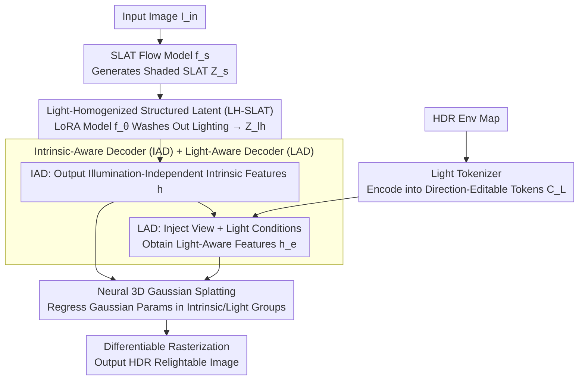

# NeAR: Coupled Neural Asset–Renderer Stack

**Conference**: CVPR 2026  
**arXiv**: [2511.18600](https://arxiv.org/abs/2511.18600)  
**Code**: [https://near-project.github.io/](https://near-project.github.io/) (Project Page)  
**Area**: 3D Vision / Diffusion Models  
**Keywords**: Neural Rendering, Illumination Homogenization, 3D Gaussian Splatting, Relightable, Asset-Renderer Co-design

## TL;DR
NeAR proposes co-designing neural asset creation and neural rendering as a coupled stack. It utilizes an illumination-homogenized structured 3D latent (LH-SLAT) to eliminate baked lighting from input images, followed by a light-aware neural decoder to synthesize relightable 3D Gaussian fields in real-time. The method outperforms existing approaches across four tasks: forward rendering, reconstruction, relighting, and novel-view relighting.

## Background & Motivation

1. **Background**: Current neural graphics follows two independent trajectories: neural asset creation (synthesizing 3D assets with generative models) and neural rendering (mapping assets to images). These are typically developed in isolation—asset generation assumes a fixed renderer, while renderers are trained for static asset distributions.

2. **Limitations of Prior Work**: (a) PBR-decomposition-based methods (e.g., Hunyuan3D) are prone to material misclassification (e.g., wood as metal), where decomposition errors are amplified in non-linear rendering pipelines, leading to inconsistent baked shadows and lighting; (b) Diffusion-based 2D relighting methods (e.g., DiLightNet, IC-Light) lack 3D consistency and incur high computational costs; (c) Existing SLAT representations blindly encode appearance including shadows and highlights, rendering them unsuitable for direct relighting.

3. **Key Challenge**: Shadows, highlights, and inter-reflections in assets are inherently entangled with geometry and material properties. Fragile explicit PBR inverse decomposition is unreliable in practical scenarios, while completely black-box neural generation lacks controllability.

4. **Goal**: How to achieve high-quality, controllable single-image relightable 3D generation while avoiding unstable PBR inverse decomposition?

5. **Key Insight**: The authors propose a "homogenize-then-synthesize" strategy—co-designing the asset representation and the rendering process to establish a robust "contract" through a shared illumination-homogenized latent space.

6. **Core Idea**: Jointly design an illumination-homogenized 3D latent representation and a light-aware neural renderer to form a coupled asset-renderer stack, replacing the conventional decoupled paradigm of asset generation plus independent rendering.

## Method

### Overall Architecture
NeAR consists of two stages: **Stage 1** utilizes a rectified-flow model fine-tuned with LoRA to lift a single input image under arbitrary lighting into an illumination-homogenized SLAT (LH-SLAT), removing baked shadows and unstable highlights; **Stage 2** employs a feed-forward decoder to synthesize the LH-SLAT into a relightable 3D Gaussian Splatting field under target lighting and viewpoint conditions. The entire pipeline requires no per-object optimization and supports real-time inference.

### Key Designs

**1. Light-Homogenized Structured Latent (LH-SLAT): "Washing out" light via flow models instead of explicit inverse PBR**

Shadows, highlights, and inter-reflections are naturally entangled with geometry and materials. Forcing models to explicitly solve for PBR materials is an ill-posed problem—methods like Hunyuan3D often misidentify wood as metal, with errors amplified during non-linear rendering. NeAR bypasses this by defining a standard "homogenized illumination" $E_h$ (white uniform ambient light) as a neutral reference frame shared by all assets. Specifically, a pre-trained SLAT flow model $f_s$ generates a Shaded SLAT $Z_s$ from the input image, and a LoRA-adapted model $f_\theta$ guides $Z_s$ in sparse voxel space toward the homogenized version $Z_{\text{lh}} = f_\theta(Z_s, I_{\text{in}})$. The ground truth for training this step comes from rendering 3D assets under uniform light for multiple views, paired with inputs rendered under random light. Consequently, the model learns the mapping from "arbitrary lighting back to neutral lighting." For highly reflective materials, a Base Color SLAT $Z_{\text{bc}}$ can be appended for extra information. In essence, de-lighting relies on latent space learning rather than fragile inverse decomposition—ensuring robustness while preserving essential geometry-material-light interaction information for downstream rendering.

**2. Light Tokenizer: Encoding HDR environment maps as direction-editable tokens**

If a standard VAE is used to compress the entire environment map into a latent code, directional information is blurred, preventing light repositioning when changing views. NeAR decomposes the environment map into three explicit representations—an LDR tone-mapped map $\mathbf{E}_{\text{ldr}}$, a normalized log-intensity map $\mathbf{E}_{\text{log}}$, and camera-space directional encoding $\mathbf{E}_{\text{dir}}$. Features are extracted via ConvNeXt, while directional maps are processed using NeRF positional encoding. Spatial cross-attention fuses directional information with visual features, followed by self-attention to generate lighting condition tokens $C_L \in \mathbb{R}^{4096 \times 768}$. The advantage of explicit directional embedding is that lighting directions remain editable and are not permanently baked into the appearance.

**3. Intrinsic-Aware Decoder (IAD) + Light-Aware Decoder (LAD): Splitting decoding into illumination-independent and dependent stages**

Final rendering requires both stable geometry/materials and an appearance that varies flexibly with lighting. Combining these in a single decoder causes mutual interference. NeAR separates them: IAD uses a Transformer with shifted window attention to process the LH-SLAT and introduces 16 register tokens via global cross-attention to capture global context, outputting intrinsic features $\boldsymbol{h}$ independent of view and light. LAD then calculates viewing angle embeddings (NeRF positional encoding of ray distance and direction) and adds them to the intrinsic features to obtain $\boldsymbol{h}^v$. Stacked cross-attention blocks then inject lighting conditions $C_L$ to obtain light-aware features $\boldsymbol{h}^e$. Notably, explicit view injection is used instead of spherical harmonics to more accurately model view-dependent specular highlights.

**4. Neural 3D Gaussian Splatting: Regressing Gaussian parameters in intrinsic and light groups**

Continuing the decoupling strategy, NeAR splits 3DGS parameters into two groups for regression. Intrinsic features $\boldsymbol{h}$ decode illumination-independent parameters: position offset, base color, roughness, metallic, scale, rotation, and opacity. Light-aware features $\boldsymbol{h}^e$ decode 48-dimensional color features, light scaling, and shadows. Finally, a shallow MLP combines normal positional encoding and color features to predict radiance values, which are output as HDR images via differentiable rasterization. Since materials and lighting are separated at the parameter level, relighting only requires swapping the light-related group while keeping geometry and material properties fixed.

### Loss & Training

**Stage 1**: Conditional flow matching loss $\mathcal{L}_{\text{stage1}} = \mathbb{E}\|\boldsymbol{v}_\theta(\boldsymbol{z}, Z_s, I_{\text{in}}, t) - (\boldsymbol{\epsilon} - \boldsymbol{z}_0)\|_2^2$.

**Stage 2**: HDR reconstruction loss (L1 in log space + LPIPS + D-SSIM) $\mathcal{L}_{\text{hdr}}$ + PBR material auxiliary supervision $\mathcal{L}_{\text{pbr}}$ + shadow supervision $\mathcal{L}_{\text{shadow}}$.

Training data: 87K 3D assets with PBR textures + 2K 4K-resolution HDR environment maps, rendered using Blender EEVEE Next.

## Key Experimental Results

### Main Results (PSNR↑ Comparison across Four Tasks)

| Task | Method | ADT | DTC | Objaverse | Glossy Syn. |
|------|------|-----|-----|-----------|-------------|
| G-buffer Forward Rendering | DiffusionRenderer | 24.41 | 27.16 | 27.09 | 25.46 |
| | **Ours** | **29.15** | **31.59** | **32.23** | **30.47** |
| Random Light Reconstruction | DiLightNet | 21.11 | 23.53 | 25.65 | 24.09 |
| | **Ours** | **22.89** | **24.68** | **26.53** | **25.32** |
| Unknown Light Relighting | DiffusionRenderer | 21.91 | 22.99 | 23.75 | 22.13 |
| | **Ours** | **21.95** | **23.47** | **24.38** | **22.61** |
| New-View Relighting | Hunyuan3D-2.1 | 22.30 | 24.89 | 25.47 | 22.26 |
| | **Ours** | **22.87** | **25.53** | **25.97** | **22.94** |

### Ablation Study

| Input SLAT Type | PSNR↑ | SSIM↑ | LPIPS↓ |
|---------------|-------|-------|--------|
| Shaded SLAT | 28.95 | 0.9281 | 0.0813 |
| Base Color SLAT | 30.38 | 0.9541 | 0.0564 |
| LH-SLAT | 32.02 | 0.9631 | 0.0494 |
| **LH + Base Color** | **32.54** | **0.9649** | **0.0442** |

| LAD Layers (IAD=12) | PSNR | FPS |
|-------------------|------|-----|
| 1 layer | 31.56 | 48 |
| 3 layers | 32.35 | 38 |
| **6 layers** | **32.54** | **30** |
| 9 layers | 32.56 | 23 |

### Key Findings
- LH-SLAT outperforms Shaded SLAT by 3+ dB in PSNR, confirming the necessity of illumination homogenization.
- The combination of LH-SLAT + Base Color SLAT yields the best performance, as Base Color supplements information for highly reflective materials.
- 6 LAD layers represent the optimal trade-off between performance and speed (PSNR 32.54, 30 FPS).
- Architectures that inject view information before baking light (Fig 9, configs c+d+g) significantly outperform those baking light before considering view.
- HY3D-2.1 misidentifies wood as metal (incorrect metallicity maps); NeAR's LH-SLAT correctly recovers material properties.

## Highlights & Insights
- **Asset-Renderer Co-design Paradigm**: Instead of treating asset generation and rendering as independent components, they form a "contract" through a shared latent space. This approach provides a new perspective for designing neural graphics stacks.
- **Illumination Homogenization Strategy**: By learning to remove light in latent space rather than performing explicit PBR decomposition, the method gracefully bypasses the ill-posed nature of inverse rendering.
- **Texture Style Transfer Application**: LH-SLAT can accept stylized image inputs, achieving semantically consistent style transfer combined with realistic relighting, demonstrating the representation's flexibility.

## Limitations & Future Work
- Hardships persist with transparent objects (e.g., helmets); although the neural renderer mitigates this, it is not fully resolved.
- Training requires extensive multi-illumination renderings of 3D assets, incurring high data preparation costs.
- Evaluation is limited to static objects; dynamic scenes and human bodies are not yet addressed.
- Real-time performance at 30 FPS may be insufficient for some high-demand applications.

## Related Work & Insights
- **vs Trellis**: Trellis uses SLAT but encodes lighting blindly; NeAR proposes LH-SLAT to explicitly eliminate lighting, creating a stable representation better suited for relighting.
- **vs DiffusionRenderer**: DiffusionRenderer performs 2D rendering based on G-buffers and lacks 3D structure info; NeAR's 3D Gaussian fields are more accurate in shadow and highlight details.
- **vs HY3D-2.1**: HY3D's decoupled PBR decomposition leads to material misestimation (e.g., metallic errors); NeAR avoids the fragility of explicit decomposition.

## Rating
- Novelty: ⭐⭐⭐⭐ The asset-renderer coupling concept is innovative, and LH-SLAT is an original representation.
- Experimental Thoroughness: ⭐⭐⭐⭐⭐ Comprehensive coverage across four sub-tasks, four datasets, multiple baseline comparisons, ablations, and application showcases.
- Writing Quality: ⭐⭐⭐⭐ Clear structure with insightful comparative analysis.
- Value: ⭐⭐⭐⭐ Provides a significant design paradigm shift for neural rendering and 3D generation fields.

<!-- RELATED:START -->

## Related Papers

- [\[CVPR 2026\] Easy3E: Feed-Forward 3D Asset Editing via Rectified Voxel Flow](easy3e_feed-forward_3d_asset_editing_via_rectified_voxel_flow.md)
- [\[CVPR 2026\] Evidential Neural Radiance Fields](evidential_neural_radiance_fields.md)
- [\[CVPR 2026\] Neural Dynamic GI: Random-Access Neural Compression for Temporal Lightmaps in Dynamic Lighting Environments](neural_dynamic_gi_random-access_neural_compression_for_temporal_lightmaps_in_dyn.md)
- [\[CVPR 2026\] Neural Gabor Splatting: Enhanced Gaussian Splatting with Neural Gabor for High-frequency Surface Reconstruction](neural_gabor_splatting.md)
- [\[NeurIPS 2025\] PhysX-3D: Physical-Grounded 3D Asset Generation](../../NeurIPS2025/3d_vision/physx-3d_physical-grounded_3d_asset_generation.md)

<!-- RELATED:END -->
