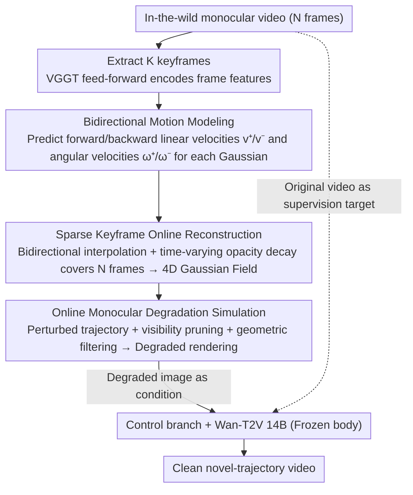

# NeoVerse: Enhancing 4D World Model with in-the-wild Monocular Videos

**Conference**: CVPR 2026  
**arXiv**: [2601.00393](https://arxiv.org/abs/2601.00393)  
**Code**: [https://neoverse-4d.github.io](https://neoverse-4d.github.io) (Coming soon)  
**Area**: 3D Vision  
**Keywords**: 4D World Model, Gaussian Splatting, Monocular Video, Novel View Synthesis, Feed-forward Reconstruction

## TL;DR

NeoVerse proposes a scalable 4D world model. By utilizing feed-forward pose-free 4DGS reconstruction and online monocular degradation simulation, the training pipeline can leverage massive (millions) in-the-wild monocular videos, achieving SOTA in both 4D reconstruction and novel-trajectory video generation.

## Background & Motivation

1. **Background**: 4D world modeling (a hybrid paradigm of reconstruction + generation) holds significant potential in fields like autonomous driving and digital content creation. Existing methods typically reconstruct 3D/4D representations first, then use geometric priors to guide video generation models to ensure spatiotemporal consistency and precise viewpoint control.

2. **Limitations of Prior Work**: The core bottleneck of current solutions lies in **insufficient scalability**, manifested at two levels:
    - **Poor data scalability**: For instance, ViewCrafter only handles static scenes, while SynCamMaster/ReCamMaster rely on expensive multi-view dynamic videos, which are costly to acquire and limit generalization;
    - **Poor training scalability**: TrajectoryCrafter, FreeSim, and others require offline preprocessing (heavy depth estimation, offline reconstruction of Gaussian fields), leading to high computational overhead, high storage consumption, and inflexible training schemes.

3. **Key Challenge**: Massive inexpensive in-the-wild monocular videos cannot be directly utilized due to the lack of multi-view supervision signals and efficient online processing pipelines.

4. **Goal**: To make the entire 4D world model training pipeline fully scalable to diverse in-the-wild monocular videos.

5. **Key Insight**: Authors observe that any monocular video can be converted into training data if (a) pose-free feed-forward 4D reconstruction and (b) efficient online degradation rendering simulation are realized.

6. **Core Idea**: High-scale expansion of the 4D world model pipeline to millions of in-the-wild monocular videos via feed-forward 4DGS reconstruction and online monocular degradation simulation.

## Method

### Overall Architecture

NeoVerse addresses the issue where 4D world models require both reconstruction and generation, but existing methods fail to scale due to expensive multi-view dynamic videos and "heavy" offline reconstruction. The strategy involves making both stages online and scalable. In the reconstruction stage, VGGT serves as the backbone, taking a monocular video as input and outputting a motion-informed 4D Gaussian field feed-forward (without requiring camera poses). In the generation stage, "degraded" images are rendered along a new camera trajectory from this Gaussian field, acting as conditions for a video generation model (Wan-T2V 14B plus a control branch) to generate clean videos of the new trajectory. Crucially, the generation stage does not rely on extra annotations; instead, it uses the original monocular video as the supervision target by reconstructing and then degrading that same video online.

### Key Designs

**1. Bidirectional Motion Modeling: Enabling sparse keyframes to interpolate Gaussians at any timestamp**

Since per-frame feed-forward inference is too slow, only a few keyframes are reconstructed, with the rest filled via interpolation. To ensure accuracy, the motion of each Gaussian must be known. NeoVerse splits the frame features $\{F_t\}$ from VGGT into two groups along the time dimension for cross-attention, encoding forward motion ($t\to t+1$) and backward motion ($t\to t-1$). These are then used to predict forward/backward linear velocities $v^+, v^-$ and angular velocities $\omega^+, \omega^-$ for each Gaussian. With bidirectional velocities, Gaussians at keyframes can propagate forward or backward via linear interpolation to any non-keyframe. Compared to 4DGT's unidirectional motion, this design allows rendering N frames from only K frames (predicting both forward and backward), reducing online reconstruction costs while supporting controllable temporal editing.

**2. Sparse Keyframe Online Reconstruction: Leveraging the "fast rendering, slow inference" contrast to boost training efficiency**

Reconstruction must run repeatedly during training. If feed-forwarding is done per frame for long videos, inference becomes the bottleneck. The key observation is that feed-forward networks are slow, but Gaussian rendering is extremely fast. For an N-frame video, only K keyframes are processed via feed-forward reconstruction. Bidirectional motion interpolates Gaussians to the remaining frames. Transitions are controlled by a time-varying opacity decay function:

$$\alpha_i(t_q) = \alpha_i \exp\!\left(-\gamma \cdot d(t_q, t)^{1/(1-\tau_i)}\right)$$

This ensures that the opacity of each Gaussian decays naturally as the query timestamp $t_q$ moves further from its corresponding keyframe timestamp $t$. Practically, this allows reconstructing 81 frames using only 11 keyframes in about 2 seconds—slashing expensive feed-forward calls from 81 to 11 with minimal quality loss.

**3. Online Monocular Degradation Simulation: Creating "degraded-clean" training pairs from scratch**

Once the 4D Gaussian field is reconstructed, the supervision challenge for generation arises: multi-view datasets provide ground truth for different views, but monocular videos only have one trajectory. NeoVerse creates degradations online from the 4D Gaussian field using three complementary modes: (a) **Visibility-based Gaussian pruning**: Randomly transform the camera trajectory and prune Gaussians occluded under the new trajectory based on depth information, then render back to the original view to simulate occlusion holes; (b) **Average geometric filter**: Mean filtering on the new view depth map, followed by moving Gaussian centers accordingly to simulate "flying pixels" at depth discontinuities; (c) Utilizing a larger filter kernel on top of (b) to simulate wider depth estimation errors. These degradations are derived from first principles of geometric occlusion and depth error, eliminating the need to learn an additional noise model.

### Mechanism: How a monocular video becomes a supervision signal

Training process for an 81-frame monocular video:

1. **Reconstruction**: Extract 11 keyframes, feed them into the model to encode features, and predict $v^+, v^-, \omega^+, \omega^-$. Interpolate to cover all 81 frames, obtaining a 4D Gaussian field in ~2s.
2. **Trajectory Selection & Degradation**: Perturb the original camera trajectory and render along it. Apply visibility pruning and geometric filtering to create "broken" degraded images.
3. **Supervision**: Feed the degraded image as a condition to the Wan-T2V control branch to reconstruct a clean video. The clean supervision target is the original monocular video itself.

This requires no multi-view labels or offline preprocessing, enabling the use of millions of internet monocular videos.

### Loss & Training

- **Reconstruction Loss**: $\mathcal{L}_{recon} = \mathcal{L}_{rgb} + \lambda_1\mathcal{L}_{camera} + \lambda_2\mathcal{L}_{depth} + \lambda_3\mathcal{L}_{motion} + \lambda_4\mathcal{L}_{regular}$, including photometric loss (L2 + LPIPS), camera parameter loss, depth loss, bidirectional velocity supervision, and opacity regularization.
- **Loss & Training**: Employs Rectified Flow based on Wan-T2V 14B. Trains the control branch while freezing the main generation model (compatible with distilled LoRA).
- **Two-stage training**: Stage 1 (150K iterations) for the reconstruction model; Stage 2 (50K iterations) for the generation model using 32 A800 GPUs.
- **Global motion tracking**: During inference, dynamic and static Gaussians are separated via cross-frame visibility weighted max velocity, applying different temporal aggregation strategies.

## Key Experimental Results

### Main Results

| Dataset | Metric | Ours | AnySplat | NoPoSplat |
|--------|------|----------|----------|-----------|
| VRNeRF (Static) | PSNR↑ | **20.73** | 18.02 | 11.27 |
| VRNeRF (Static) | LPIPS↓ | **0.352** | 0.366 | 0.620 |
| Scannet++ (Static) | PSNR↑ | **25.34** | 22.79 | 8.69 |
| ADT (Dynamic) | PSNR↑ | **32.56** | - | - |
| DyCheck (Dynamic) | PSNR↑ | **11.56** | - | 9.32 |

| Method | Total Inference Time(s) | Subj. Consist. | Back. Consist. | Imag. Quality |
|------|-------------|----------------|----------------|---------------|
| TrajectoryCrafter | 146 | 83.02 | 88.58 | 54.59 |
| ReCamMaster | 168 | 88.21 | 91.60 | 58.87 |
| Ours (11 key) | **20** | 88.43 | 92.27 | 59.75 |
| Ours (21 key) | **21** | **88.73** | **92.43** | 60.01 |

### Ablation Study

| Configuration | DyCheck PSNR↑ | SSIM↑ | LPIPS↓ |
|------|-------------|-------|--------|
| w/o Bidirectional Motion | 11.27 | 0.285 | 0.570 |
| w/o Opacity Regularization | 10.86 | 0.244 | 0.576 |
| Complete Reconstruction Model | 11.56 | 0.293 | 0.558 |
| Complete Pipeline (+ Gen) | **14.59** | **0.323** | **0.501** |

### Key Findings

- Bidirectional motion modeling contributes significantly; removing it reduces DyCheck PSNR by 0.29.
- The generation stage vastly improves final quality (PSNR 11.56 → 14.59), validating the hybrid reconstruction-generation paradigm.
- Sparse keyframes (11 frames vs 81 frames) have minimal impact on generation quality but reduce inference time from 28s to 20s (7x faster than TrajectoryCrafter).
- In VBench evaluation, NeoVerse outperforms TrajectoryCrafter and ReCamMaster across subjective consistency, background consistency, and image quality.

## Highlights & Insights

- **Core Insight**: The bottleneck for 4D world models is scalability of data and training rather than architecture. Online degradation simulation effectively turns monocular videos into multi-view training pairs, bypassing dependency on expensive data.
- **Sparse Keyframe Reconstruction** is clever—exploiting the fact that Gaussian rendering is much faster than network inference to reduce feed-forward costs multi-fold with minimal quality loss.
- **Freezing the Generation Model** in the control branch allows the model to be compatible with distilled LoRA, enabling generation in just 18 seconds.
- Degradation simulation is based on first principles (geometric occlusion, depth averaging), removing the need for auxiliary noise models.

## Limitations & Future Work

- Current resolution is fixed at 336×560, falling short of high-resolution application needs.
- Global motion tracking relies on thresholding to separate dynamic/static components, which may be imprecise for slow-moving objects.
- Degradation simulation, while principle-based, is still an approximation; real-world novel view rendering may have more complex degradation modes.
- Training requires 32 A800 GPUs, presenting a high cost for academic laboratories.

## Related Work & Insights

- **vs TrajectoryCrafter**: Both are hybrid reconstruction-generation methods, but TrajectoryCrafter relies on offline preprocessing, limiting scale. NeoVerse uses a fully online flow, scaling to millions of videos and performing 7x faster in inference.
- **vs ReCamMaster**: Pure generation methods have good visual quality but lack precise trajectory control. NeoVerse achieves both high quality and precise control.
- **vs AnySplat**: AnySplat focuses on pose-free reconstruction for static scenes. NeoVerse extends this to 4D dynamic scenes, outperforming it by 2.7dB in PSNR.
- This work provides a viable path for training world models using massive internet videos.

## Rating

- Novelty: ⭐⭐⭐⭐ The combination of bidirectional motion and online degradation is clever, though individual components are not entirely original.
- Experimental Thoroughness: ⭐⭐⭐⭐⭐ Comprehensive coverage across static/dynamic reconstruction, generation quality, efficiency, and ablation.
- Writing Quality: ⭐⭐⭐⭐ Clear structure, well-argued motivation, and consistent notation.
- Value: ⭐⭐⭐⭐⭐ Solves the data bottleneck for 4D world model training, yielding significant practical impact.

<!-- RELATED:START -->

## Related Papers

- [\[CVPR 2026\] Learning Explicit Continuous Motion Representation for Dynamic Gaussian Splatting from Monocular Videos](learning_explicit_continuous_motion_representation_for_dynamic_gaussian_splattin.md)
- [\[NeurIPS 2025\] 4DGT: Learning a 4D Gaussian Transformer Using Real-World Monocular Videos](../../NeurIPS2025/3d_vision/4dgt_learning_a_4d_gaussian_transformer_using_realworld_mono.md)
- [\[CVPR 2026\] Recovering Physically Plausible Human-Object Interactions from Monocular Videos](recovering_physically_plausible_human-object_interactions_from_monocular_videos.md)
- [\[CVPR 2026\] RHINO: Reconstructing Human Interactions with Novel Objects from Monocular Videos](rhino_reconstructing_human_interactions_with_novel_objects_from_monocular_videos.md)
- [\[CVPR 2026\] Iris: Bringing Real-World Priors into Diffusion Model for Monocular Depth Estimation](iris_bringing_realworld_priors_into_diffusion_model_for_monocular_depth_estimation.md)

<!-- RELATED:END -->
