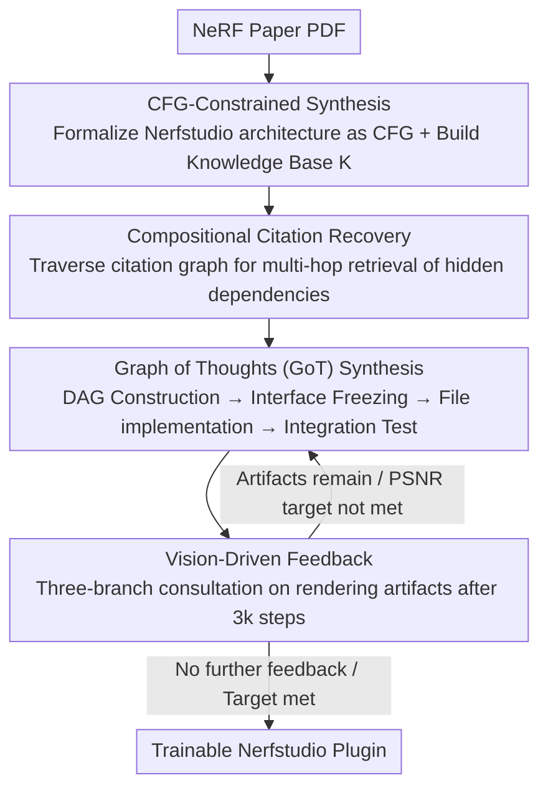

# Nerfify: A Multi-Agent Framework for Turning NeRF Papers into Code

**Conference**: CVPR 2026  
**arXiv**: [2603.00805](https://arxiv.org/abs/2603.00805)  
**Code**: Coming Soon  
**Area**: 3D Vision / Code Generation  
**Keywords**: NeRF, paper-to-code, multi-agent, code synthesis, context-free grammar

## TL;DR
Ours proposes Nerfify, a multi-agent framework that automatically converts NeRF papers into trainable Nerfstudio plug-in code through context-free grammar constraints, Graph of Thoughts code synthesis, and compositional citation recovery. It achieves a 100% execution rate on a 30-paper benchmark, with visual quality differing from expert implementations by only $\pm 0.5$ dB PSNR.

## Background & Motivation
**Background**: The NeRF field has seen over 1000 follow-up papers since 2020. However, most lack public code or standardized implementations, requiring significant manual effort to re-implement existing methods for subsequent research.

**Limitations of Prior Work**: General paper-to-code systems (e.g., Paper2Code, AutoP2C) fail significantly in the NeRF domain—the current best system, O1, achieves only 26.6% accuracy on complex papers and generally fails to produce trainable NeRF code. Frontiers like GPT-5 only generate syntactically correct code that lacks convergence.

**Key Challenge**: NeRF implementation requires expertise across volume rendering, computer vision, and neural optimization. A single incorrect activation function or improper ray-sphere intersection can lead to failures ranging from NaN gradients to degenerate solutions. Compounding this is the deep citation dependency in modern NeRF papers—for instance, "we adopt the distortion loss from [3]" requires tracing multiple papers to extract the correct implementation.

**Goal**: How to automatically transform NeRF research papers into standardized code that is trainable, convergent, and matches the visual quality of expert implementations.

**Key Insight**: Replace general paper-to-code methods with a domain-specific multi-agent framework, formalizing the Nerfstudio architecture as a context-free grammar to constrain code generation.

**Core Idea**: By encoding the Nerfstudio architecture into CFG-constrained LLM synthesis, employing Graph of Thoughts for topologically ordered multi-file repository generation, and using compositional citation recovery to automatically trace dependency papers, Ours achieves reliable conversion from NeRF papers to trainable code.

## Method

### Overall Architecture
Nerfify converts NeRF papers to code via four stages: (1) CFG-constrained synthesis, formalizing the Nerfstudio architecture as a Context-Free Grammar (CFG) and constructing a knowledge base $\mathcal{K}$; (2) Compositional citation recovery, traversing the citation graph to perform multi-hop retrieval of hidden dependency components; (3) Graph of Thoughts (GoT) code synthesis, coordinating multi-file repository generation in topological order; (4) Vision-driven feedback, iteratively improving implementation quality using visual analysis from training runs. These four stages correspond to the four key designs below.

### Key Designs

**1. Context-Free Grammar (CFG) Constrained Synthesis: Ensuring Compilation Correctness by Construction**

Code generated by general LLMs is often syntactically correct but suffers from incorrect module wiring or flawed mathematical implementations due to a lack of domain knowledge. Nerfify formalizes Nerfstudio's module compositions and interface specifications as a CFG—specifically, a repository $\mathcal{C} = (F, G)$ where $F = \{f_1, f_2, \ldots, f_n\}$ is the set of files and $G = \text{BuildRepoDAG}(F)$ is the directed acyclic dependency graph. LLM synthesis is constrained by this CFG to ensure compilation correctness by construction.

**2. Compositional Citation Recovery: Automatically Tracing Hidden Dependencies**

NeRF papers are inherently compositional; a single paper may implicitly depend on technical components from dozens of others. Nerfify constructs a citation dependency graph $G' = (V', E')$ and performs iterative multi-hop retrieval on the target paper through: dependency discovery $\rightarrow$ recursive parsing $\rightarrow$ component extraction $\rightarrow$ termination judgment. For example, K-Planes requires extracting components like proposal networks, hash encoders, and VM decomposition from 7 direct citations and 12 transitive dependencies.

**3. Graph of Thoughts (GoT) Code Synthesis: Coordinating Multi-file Generation via Topological Order**

In a NeRF pipeline, files for configuration, data management, fields, models, and training are tightly coupled. Monolithic generation often leads to interface inconsistencies. Nerfify utilizes a primary synthesis agent to coordinate multiple specialized file agents through four stages: DAG construction maps the paper to Nerfstudio components; Interface freezing establishes API specifications in topological order; Implementation generates code for each node verified by type signatures and tensor shapes; Integration testing performs smoke tests and automated bug fixes.

**4. Vision-Driven Feedback: Analyzing Artifacts via Three-Branch Consultation**

Trainable code does not guarantee correct rendering. The fourth stage executes actual training for 3k iterations, followed by a three-branch analysis of results: the Metric branch calculates local window PSNR/SSIM maps to locate high-error regions; the Geometry branch implements Cross-View Artifact Consensus to flag floater and ghosting artifacts; the Semantic branch utilizes a Qwen3 VLM to analyze artifact triplets and output structured diagnostics and patches. Iterative refinement continues until no further feedback is generated, the maximum iterations are reached, or the target PSNR reported in the paper is achieved.

**Mechanism**: **Example: Turning K-Planes into a Trainable Plugin**
Taking K-Planes as an example: First, the paper is formalized via CFG, identifying missing components such as the proposal network, hash encoder, and VM decomposition. Next, the citation graph is traversed from 7 direct citations to 12 transitive dependencies to complete these component implementations. These are then mapped to a component DAG, where interfaces are frozen. Files are synthesized and verified by tensor shapes in topological order, followed by smoke tests. Finally, after 3k training steps, the three-branch consultation identifies low PSNR regions and floaters, prompting the VLM to generate patches until the paper's original metrics are matched. This produces a trainable Nerfstudio plugin identical to the official implementation.

## Key Experimental Results

### Main Results

| Paper | Dataset | Expert PSNR↑ | Nerfify PSNR↑ | Expert SSIM↑ | Nerfify SSIM↑ |
|------|--------|-----------|--------------|-----------|-------------|
| KeyNeRF | Blender | 25.70 | 26.12 | 0.89 | 0.90 |
| mi-MLP NeRF | Blender | 22.64 | 22.85 | 0.87 | 0.87 |
| ERS | DTU | 26.87 | 27.02 | 0.90 | 0.90 |
| TVNeRF | Blender | 26.81 | 27.30 | 0.92 | 0.92 |

All baselines (Paper2Code, AutoP2C, GPT-5, R1) **failed to generate trainable code**.

### Ablation Study

| Configuration | Executability | Key Findings |
|------|---------|---------|
| Nerfify (Full) | 100% | Gap with expert implementation $\pm 0.5$ dB PSNR |
| Paper2Code | 5% | Compilable but not trainable |
| AutoP2C | 0% | Unresolved imports |
| GPT-5 | 0% | Compilable but training does not converge |
| No Citation Recovery | Partial | Missing critical dependency components |
| No Vision Feedback | 100% | Larger performance gap |

### Key Findings
- Nerfify achieves visual quality comparable to expert implementations even on papers never previously implemented (Set 1).
- For papers with existing Nerfstudio implementations, Nerfify generates code identical to the official repositories.
- The citation dependency graph for K-Planes involved 7 direct dependencies and a total of 12 transitive dependencies.

## Highlights & Insights
- First demonstration that a domain-aware multi-agent framework can reliably transform complex vision papers into trainable code.
- CFG constraints are critical—encoding framework architecture into formal grammars ensures code correctness by construction.
- Compositional citation recovery addresses the pervasive hidden dependency problem in NeRF research.
- Implementation time is reduced from weeks to minutes, democratizing reproducibility in NeRF research.

## Limitations & Future Work
- Currently specialized for the Nerfstudio framework; expanding to others requires redefining the CFG.
- Reliance on high-quality PDF parsing (e.g., MinerU); parsing errors in math or diagrams may propagate.
- Vision-driven feedback requires 3k training iterations, incurring non-zero computational overhead.
- For entirely original NeRF methods not based on existing components, citation recovery is less effective.

## Related Work & Insights
- **Paper2Code/AutoP2C**: General systems lacking domain-specific constraints.
- **Scene Language**: Similarly uses CFG constraints for vision program synthesis.
- **Graph of Thoughts**: Generalizes reasoning into directed graphs; Nerfify applies this to code generation.
- Insight: Any domain with standardized frameworks (e.g., MMDetection, HuggingFace Transformers) could utilize similar methods to build paper-to-code systems.

## Rating
- Novelty: ⭐⭐⭐⭐⭐ First automatic NeRF paper-to-code conversion; unique combination of CFG, GoT, and citation recovery.
- Experimental Thoroughness: ⭐⭐⭐⭐ 30-paper benchmark including unseen papers with comprehensive comparisons.
- Writing Quality: ⭐⭐⭐⭐ Clear structure and rigorous four-stage logic.
- Value: ⭐⭐⭐⭐⭐ Highly practical; expected to accelerate reproducibility in the NeRF community.

<!-- RELATED:START -->

## Related Papers

- [\[CVPR 2026\] Think, Then Verify: A Hypothesis-Verification Multi-Agent Framework for Long Video Understanding](think_then_verify_a_hypothesis-verification_multi-agent_framework_for_long_video.md)
- [\[CVPR 2026\] CarePilot: A Multi-Agent Framework for Long-Horizon Computer Task Automation in Healthcare](carepilot_a_multi-agent_framework_for_long-horizon_computer_task_automation_in_h.md)
- [\[CVPR 2026\] MMBench-GUI: A Unified Hierarchical Evaluation Framework for Multi-Platform GUI Agents](mmbench-gui_a_unified_hierarchical_evaluation_framework_for_multi-platform_gui_a.md)
- [\[ACL 2025\] METAL: A Multi-Agent Framework for Chart Generation with Test-Time Scaling](../../ACL2025/llm_agent/metal_a_multi-agent_framework_for_chart_generation_with_test-time_scaling.md)
- [\[ACL 2025\] MAM: Modular Multi-Agent Framework for Multi-Modal Medical Diagnosis via Role-Specialized Collaboration](../../ACL2025/llm_agent/mam_modular_multi-agent_framework_for_multi-modal_medical_diagnosis_via_role-spe.md)

<!-- RELATED:END -->
