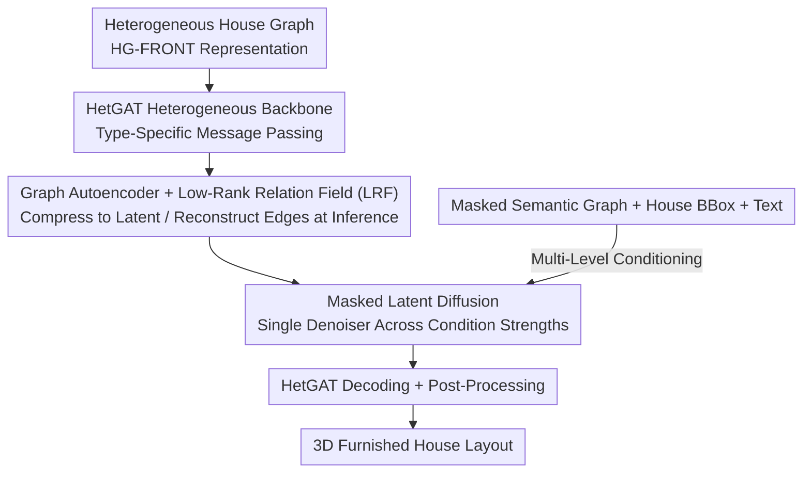

# Nestwork: Conditional 3D Furnished House Layout Generation through Latent Heterogeneous Graph Diffusion

**Conference**: CVPR 2026  
**Paper**: [CVF Open Access](https://openaccess.thecvf.com/content/CVPR2026/html/Miao_Nestwork_Conditional_3D_Furnished_House_Layout_Generation_through_Latent_Heterogeneous_CVPR_2026_paper.html)  
**Code**: Yes (The paper states "Code available at: GitHub repository", not specified, ⚠️ subject to the original text)  
**Area**: 3D Vision / Indoor Scene Generation  
**Keywords**: 3D Layout Generation, Heterogeneous Graph Diffusion, Latent Diffusion, Scene Graph Conditioning, Furniture Placement

## TL;DR
Nestwork represents the entire "room + furniture" house as a **heterogeneous scene graph** and trains a **masked** diffusion denoiser on its latent space. This allows a single model to generate a **one-pass, fully furnished** 3D house from a complete semantic graph, topology-only, or pure text descriptions. It reduces the FID of the two-stage pipeline on 3D-FRONT from 41.9 to 7.3.

## Background & Motivation
**Background**: Using scene graphs to constrain 3D layout generation is a natural approach. Users can specify spatial connections and furniture types by inserting/deleting/masking nodes and edges, leaving geometric details to model inference. However, existing methods partition the task by spatial scale: house-level models (HouseGAN, Graph2Plan, HouseDiffusion, GSDiff) generate **unfurnished** 2D/multi-room layouts using room graphs, while room-level models (GRAINS, SceneHGN, Graph-to-3D, DiffuScene) place furniture **only within a single room**.

**Limitations of Prior Work**: Generating a "fully furnished house" currently requires combining these two categories into a multi-stage pipeline (e.g., first generating room polygons with HouseDiffusion, then filling each room with furniture using DiffuScene). Such autoregressive, decoupled pipelines suffer from **error accumulation**—distortions in upstream room shapes lead to sparse, misplaced, or implausible furniture downstream, failing to perform joint reasoning over room structures and furniture placement.

**Key Challenge**: Embedding both rooms and furniture into a **single graph** poses two challenges. First, rooms and furniture are inherently heterogeneous in semantics and geometry: rooms encode high-level spatial logic (adjacency, containment), while furniture carries fine-grained geometric attributes and diverse categories. Homogeneous GNNs share parameters across all nodes, failing to capture structural heterogeneity and prone to over-smoothing. Second, the generator must support **multi-level conditions** ranging from "unlabeled topology" to "fully labeled graphs" without training a separate model for each condition level or using hierarchical scheduling. However, current diffusion denoising backbones are mostly built on 1D U-Nets / Transformers, treating nodes as independent entities and lacking explicit structural inductive biases.

**Goal**: To construct a unified framework that directly generates layouts on a **flat, house-scale heterogeneous graph**, preserving type-sensitive relational reasoning while supporting flexible mask conditioning.

**Core Idea**: Represent the entire house as a heterogeneous graph of "rooms + furniture + diverse spatial relationships," compress it into a latent space using a heterogeneous graph attention backbone (HetGAT), and then train **a single** latent diffusion denoiser with 50% random masking on the latent graph. The same model can span the entire spectrum of conditioning strength, from "topology-only" to "fully labeled," to decode a complete 3D furnished house in one pass.

## Method

### Overall Architecture
Nestwork takes a heterogeneous house graph (room nodes, furniture nodes, a virtual house root node + five types of typed spatial relations) as input, and outputs a fully furnished 3D house layout (3D bounding boxes, orientations, classes, and shape codes for each node). The pipeline consists of four steps: first, a **HetGAT heterogeneous backbone** performs type-specific message passing on the graph, which is compressed into node-level latent codes $Z$ by a **graph autoencoder**. At inference time, since the encoder cannot access geometric edge features, the decoder reconstructs edge representations from node latent codes via a **Low-Rank Relation Field (LRF)**. A **masked latent diffusion** denoiser is trained on this latent graph, utilizing **multi-level conditioning** (node-level masked cross-attention + house bounding box/text-based graph-level conditioning). The denoised latent codes are restored to layouts in a single pass by the same decoder, followed by lightweight post-processing to align room boundaries and insert doors/windows (for visualization only, without altering metrics).

### Key Designs

**1. HG-FRONT Heterogeneous House Graph Representation: Compressing the Entire House into a Flat Typed Graph**

To achieve "room-furniture joint reasoning", the first step is to design a representation capable of hosting both scales. Nestwork formulates the house as a heterogeneous graph $G=\langle V, E, T_V, T_E, X_V, X_E\rangle$: node types $V = V_H \cup V_R \cup V_F$ represent the virtual house root, rooms, and furniture, respectively. The virtual house node aggregates global context and stores the overall house bounding box. Each node feature $\mathbf{x}_u = [c; \mathbf{b}; o; \mathbf{s}]$ contains class $c$, a 6D bounding box $\mathbf{b}$, a discrete orientation class $o$, and a latent shape code $\mathbf{s}$ (furniture codes are DeepSDF codes; room codes are learnable embeddings conditioned on class and bounding box). Crucially, **all bounding boxes use local coordinates**: rooms are relative to the house root, and furniture is relative to its containing room. This structurally enforces the hierarchical "furniture contained in room" constraint. Edges are classified into five types: furniture-to-furniture $E_{F\leftrightarrow F}$ forms a clique (users only specify furniture types and quantities per room, leaving internal spatial relations to model inference), furniture-to-room $E_{F\leftrightarrow R}$, adjacent/far room pairs $E_{R\leftrightarrow R}^{\text{adj}}/E_{R\leftrightarrow R}^{\text{far}}$ defined by a distance threshold, and room-to-house $E_{R\leftrightarrow H}$. Based on this, the **HG-FRONT** dataset (3,111 high-quality house graphs) is constructed from 3D-FRONT. This unified representation enables scaling room-level VAEs to entire houses, serving as the foundation for subsequent modules.

**2. HetGAT Heterogeneous Graph Attention Backbone: Let Rooms and Furniture Proceed Through Dedicated Message Channels**

Homogeneous GNNs share parameters across rooms and furniture, failing to capture heterogeneous structure and causing over-smoothing. Nestwork's backbone layers edge feature attention from EGAT and type-specific transformations from HEAT on top of standard GAT to match the "three node types + five relation types". Each layer begins with a type-specific projection: $h^{(l)}_u = W^{(n)}_{T_V(u)} h^{(l-1)}_u$, and edge features $e^{(l)}_{u\to v} = E^{(e)}_{T_E(u\to v)} \,\|\, f_{u\to v}$ (the encoder receives geometric edge attributes, the decoder receives learned edge embeddings, and the diffusion denoiser uses only edge type embeddings). The attention scoring concatenates source, target, and edge representations, followed by LeakyReLU: $s^{(l)}_{uv,h} = \mathrm{LeakyReLU}(\mathbf{q}_h^\top [\mathbf{h}^{(l)}_u \| \mathbf{h}^{(l)}_v \| \mathbf{e}^{(l)}_{u\to v}])$, which is normalized via softmax over the neighborhood and aggregated across multiple heads:

$$\mathbf{h}^{(l+1)}_u = \big\Vert_{h=1}^{H} \sigma\Big(\sum_{v\in\mathcal{N}(u)} \alpha^{(l)}_{uv,h}\, \mathbf{W}_h [\mathbf{h}^{(l)}_v \| \mathbf{e}^{(l)}_{u\to v}]\Big)$$

This is effective because the type-specific $W^{(n)}_{T_V(u)}$ directs rooms into high-level spatial logic channels and furniture into fine-grained geometric channels, preventing heterogeneous semantics from being blended into a single set of parameters. This backbone is reused in three places: encoder, decoder, and denoiser.

**3. Graph Autoencoder + Low-Rank Relation Field (LRF): Reconstructing Relations at Inference without Geometric Edges**

To provide a compact, continuous latent space for diffusion, a unified graph autoencoder is pre-trained. The encoder maps a house graph into node-level latent codes $Z=\{\mathbf{z}_u\}$ (node attributes are embedded via $\mathbf{h}^0_u = \text{MLP}(c)\|\text{MLP}(\mathbf{b})\|\text{MLP}(o)\|\text{MLP}(\mathbf{s})$ and passed through $L$ HetGAT layers; two MLP heads then yield $\boldsymbol{\mu}_u, \log\boldsymbol{\sigma}^2_u$ for reparameterization sampling). The decoder reconstructs them from $Z$ and the topological graph $G_{\text{top}}$. Since the decoder is **unconditional**, it can be pre-trained once and reused across all diffusion stacks.

The real bottleneck lies in decoding: during testing, real geometric edge attributes (relative distance, size ratio, etc.) are unavailable, yet these relations are critical for collision avoidance and clear traffic paths. LRF is designed as a relational prior to reconstruct edge embeddings $\tilde{\mathbf{e}}_{u\to v}$ directly from node latents $\mathbf{z}_u, \mathbf{z}_v$. Each node attends to a shared relation slot dictionary $D\in\mathbb{R}^{K\times d_s}$ ($K=6$): $\alpha_u = \text{softmax}(\text{MLP}(\mathbf{z}_u)D^\top/\tau_s)$ (temperature $\tau_s=0.7$). Using learnable projection bases $\mathbf{U},\mathbf{V}\in\mathbb{R}^{d_s\times r}$ ($r=32$), it computes $\mathbf{a}_u=\alpha_u D\mathbf{U}$ and $\mathbf{b}_v=\alpha_v D\mathbf{V}$, followed by a low-rank bilinear projection to reconstruct the edge embedding:

$$\tilde{\mathbf{e}}_{u\to v} := \text{MLP}\big([\mathbf{a}_u \,\|\, \mathbf{b}_v \,\|\, \alpha_u^\top \alpha_v]\big)$$

where the alignment term $\alpha_u^\top\alpha_v$ explicitly models directionality and co-occurrence structures. The low-rank decomposition with rank $r$ regularizes arbitrary node-pair interactions down to a translation through a few global relation prototypes, avoiding overfitting. During the first half of training, gradients from $\tilde{\mathbf{e}}_{u\to v}$ to the encoder are **truncated** to stabilize optimization, and reconstruction is supervised by an $\ell_1$ loss against ground-truth edge features. The total loss is $\mathcal{L} = \mathcal{L}_{\text{rec}} + \lambda_{\text{KL}}\mathcal{L}_{\text{KL}} + \lambda_{\text{LRF}}\mathcal{L}_{\text{LRF}}$ ($\lambda_{\text{KL}}=10^{-4}, \lambda_{\text{LRF}}=0.1$), where $\mathcal{L}_{\text{rec}}$ includes bounding box (smooth-$\ell_1$ + DIoU), category/orientation cross-entropy, and shape code $\ell_1$.

**4. Masked Latent Diffusion: A Single Denoiser Handling All Conditioning Strengths**

Given the frozen pre-trained autoencoder, DDPM is performed on the latent graph $G_0=(G_{\text{top}}, Z)$: the forward process perturbs node latents according to a linear noise schedule $Z_t=\sqrt{\bar\alpha_t}Z + \sqrt{1-\bar\alpha_t}\boldsymbol\epsilon$, and a time-conditioned HetGAT denoiser $\epsilon_\theta(G_t, t)$ is trained to predict noise ($\mathcal{L}_{\text{LD}}=\mathbb{E}\|\epsilon_\theta(G_t,t)-\boldsymbol\epsilon\|_2^2$). Crucially, **node labels are randomly masked at a fixed 50% rate during training**. Consequently, the denoiser learns with various conditioning configurations, from "almost completely labeled" to "almost entirely empty". During inference, it seamlessly switches among four modes (FullGraph / RoomGraph / Topology / RandMask) without retraining or hierarchical scheduling. Compared to 1D U-Net/Transformer denoisers that treat nodes independently, the HetGAT denoiser possesses structural inductive bias, naturally taking adjacency into account in the latent graph.

**5. Multi-Level Conditioning: Node-Level Semantic Completion + Graph-Level Global Constraints**

Flexible control requires integrating both local semantics and global context. **Node-Level**: Uses a masked semantic graph $\tilde{G}_{\text{sem}}$ (the same topology as $G_{\text{top}}$, but with only partial node labels; unlabelled nodes are filled with a learnable [MASK] token). Each denoising layer first performs HetGAT self-attention, then applies a cross-attention block using the current node latent code as the query, and node label embeddings $\mathbf{y}_v$ as key/value. It normalizes attention over the neighborhood as $\alpha_{uv}=\text{softmax}(Q_u^\top K_v/\sqrt{d})$ to obtain semantic context $\mathbf{c}_u=\sum_v \alpha_{uv}V_v$, which is added back to the node state as a residual. **Graph-Level**: Geometric embeddings $\mathbf{g}_{\text{geom}}$ originate from the house bounding box. An optional text embedding $\mathbf{g}_{\text{text}}$ is obtained by serializing the masked graph into a structured prompt and passing it through a frozen BERT(768D) with pooling. The two are combined linearly: $\mathbf{g}=\alpha_{\text{geom}}\text{MLP}_{\text{geom}}(\mathbf{g}_{\text{geom}})+\alpha_{\text{text}}\text{MLP}_{\text{text}}(\mathbf{g}_{\text{text}})$, and added residually to the cross-attention output: $\mathbf{z}_u^{(t)} \leftarrow \mathbf{z}_u^{(t)} + \alpha_{\text{ca}}(\mathbf{c}_u + \mathbf{g})$. If free text is provided during inference, an LLM parser first translates the description into a masked adjacency graph + structured prompt (e.g., "three bedrooms + a central living room" $\rightarrow$ an editable masked graph), enabling users to drive early layout exploration via natural language without CAD knowledge.

### Loss & Training
The autoencoder has a latent dimension of 128 and is trained for 400 epochs. The diffusion model is trained for 2000 epochs with 200 denoising steps on a single A100 (40GB) GPU. Optimization is conducted using AdamW (weight decay 1e-4, initial lr 1e-4, ReduceLROnPlateau). Conditional diffusion uses a fixed 0.5 random node label masking ratio during training to cover all conditioning modes in a single training run.

## Key Experimental Results

The dataset is HG-FRONT (3,111 house graphs) derived from 3D-FRONT (6,813 professionally designed houses), split into 70/15/15. Metrics include FID/KID (calculated on colored-by-category renderings), KL divergence of masked node label distribution, room-graph constraint satisfaction rate (Graph%), furniture collision rate (Coll%), walkability (Walk%), and layout diversity (std of box size/position/orientation).

### Main Results: One-Pass vs. Two-Stage Pipeline

| Model | FID ↓ | KID(×100) ↓ | Coll% ↓ | Graph% ↑ | Walk% ↑ | KL ↓ |
|------|-------|-------------|---------|----------|---------|------|
| Two-Stage (HouseDiffusion+DiffuScene) | 41.90 | 2.97 | 9.84 | 78.60 | 86.26 | 0.1823 |
| **Nestwork (One-Pass)** | **7.26** | **0.26** | 10.91 | **91.91** | **88.69** | **0.0317** |

> FID drops to approximately 1/6, and graph constraint satisfaction rate increases by 13 percentage points. The two-stage baseline achieves a slightly lower collision rate (9.84% vs 10.91%, close to GT's 9.80%) at the cost of serious geometric distortion and error accumulation—distorted upstream room shapes result in scattered, chaotic downstream furniture.

### Ablation Study

| Configuration | FID ↓ | Coll% ↓ | Graph% ↑ | Walk% ↑ | Description |
|------|-------|---------|----------|---------|------|
| **Full** | **7.13** | **11.21** | **92.34** | **88.58** | Complete model |
| w/o Cross-Attention (CA) | 76.35 | 69.28 | 55.02 | 91.13 | Replaced with linear projection, collapses completely |
| w/o LRF | 20.42 | 21.54 | 92.16 | 81.29 | Reconstructing edge features using $[\mathbf{z}_u;\mathbf{z}_v]$ instead |

Ablation on latent priors: IID prior yields an FID of 24.64 (high diversity but poor structure); Autoregressive (AR) prior yields an FID of 61.43 (local coherence but distortion and low diversity); the proposed diffusion prior yields 7.13—demonstrating superior performance over the other two in fidelity and structural consistency. Backbone ablation: HetGAT (FID 7.13) outperforms TripletGCN (FID 7.50) and SLN-Box (FID 7.64), and achieves a higher Graph% of 92.34 compared to ~88 for both.

### Key Findings
- **Cross-attention is critical**: Without it, FID surges from 7.13 to 76.35, and collision rate spikes to 69.28%. Its high walkability coupled with high collision suggests furniture "collapses" into concentrated local areas. Masked semantic completion must rely on topology-aware condition injection; simple feature addition is insufficient.
- **LRF provides indispensable relational cues**: At inference where real geometric edges are missing, removing LRF doubles the collision rate from 11.21% to 21.54% and drops walkability to 81.29%. This confirms that reconstructing relations from node latents successfully compensates for the missing geometric priors.
- **Single model remains robust across four conditioning strengths**: FID scores for FullGraph/RoomGraph/Topology/RandMask modes remain within 6.96–7.75, with Graph% stable around 92, thanks to training with 50% random masking.

## Highlights & Insights
- **Formulating "room + furniture" into a flat heterogeneous graph** is a clever design: using local coordinates structurally enforces hierarchical containment, and using furniture cliques allows users to specify only categories and quantities while leaving spatial arrangements to the model—fundamentally resolving error accumulation in multi-stage pipelines.
- **The LRF module solves a highly practical engineering challenge**: During training, geometric edges are available, but they are missing at test time. LRF reconstructs edge features from node latent codes via a "global relation slot dictionary + low-rank bilinear projection." The alignment term $\alpha_u^\top\alpha_v$ explicitly models directionality. This trick is easily transferable to other graph learning/generation tasks with missing edge features at inference.
- **Handling the entire conditioning spectrum with a single masked training pass** is the key to efficiency: it eliminates the need to train separate models for "fully labeled," "room-only," "topology-only," and "text-only" scenarios, optimizing both flexibility and training cost.

## Limitations & Future Work
- The authors acknowledge that the current system **does not explicitly enforce functional plausibility**, and generated layouts may still contain blocked pathways. Thus, it is best suited for early-stage conceptualization rather than final production designs—pointing to "plausibility-aware objective functions" as future work.
- My take: The evaluation lacks directly comparable baselines, forcing the main comparison to rely on a synthesized two-stage pipeline. The "FID 6$\rightarrow$7" comparison is constrained by the custom evaluation setup, and cross-dataset generalization remains unverified. HG-FRONT contains only 3,111 graphs and is subject to strict house-level filtering, which limits diversity and scale.
- The natural language interface relies on an external LLM parser to translate descriptions into masked graphs; parsing quality directly affects the generation, leaving room for improvement in end-to-end controllability.
- Future Work: Extending the model to multi-modal inputs like floor plans or sketches, and supporting interactive subgraph inpainting.

## Related Work & Insights
- **vs HouseDiffusion / GSDiff (House-level)**: These methods only generate unfurnished 2D/multi-room layouts from room graphs. In contrast, the proposed method integrates furniture into a single graph to produce furnished 3D houses in one pass, eliminating the decoupled step of placing furniture afterwards.
- **vs DiffuScene / Graph-to-3D (Room-level)**: These methods arrange furniture within individual rooms, lacking cross-room coherence. In contrast, the proposed method performs joint reasoning at the house scale, allowing room structures and furniture placements to constrain each other.
- **vs CHOrD (Furnished House-level)**: CHOrD also generates collision-free 3D layouts from text or floor plans, but operates under global conditioning without exposing explicit room-furniture graphs or masked graph controls. The proposed method supports masked conditional generation via a flat heterogeneous graph + single-pass latent diffusion, offering finer-grained control.
- **vs Homogeneous Graph Diffusion (e.g., TripletGCN-based methods)**: These methods share parameters, causing over-smoothing. The proposed method employs HetGAT for type-specific message passing, which backbone ablations prove to be more expressive for house-scale generation.

## Rating
- Novelty: ⭐⭐⭐⭐ First to generate furnished houses via a single-pass latent diffusion from a flat, house-scale heterogeneous graph; the combination of HetGAT + LRF + random masking is insightful.
- Experimental Thoroughness: ⭐⭐⭐⭐ Complete set of comparisons and four groups of ablations (backbone, prior, modules), but lacks direct baseline comparisons, is restricted to a single dataset, and has no cross-domain validation.
- Writing Quality: ⭐⭐⭐⭐ Equations correspond clearly to modules, pipeline is easy to follow; definitions of some metrics require checking the appendix.
- Value: ⭐⭐⭐⭐ Highly practical as an early-stage layout tool for interior design, virtual environments, and MR. The HG-FRONT dataset and the LRF trick are valuable for reuse, though the lack of guaranteed functional feasibility limits its immediate deployment.

<!-- RELATED:START -->

## Related Papers

- [\[CVPR 2026\] NaTex: Seamless Texture Generation as Latent Color Diffusion](natex_seamless_texture_generation_as_latent_color_diffusion.md)
- [\[CVPR 2026\] Repurposing 3D Generative Model for Autoregressive Layout Generation](repurposing_3d_generative_model_for_autoregressive_layout_generation.md)
- [\[CVPR 2026\] ShapeR: Robust Conditional 3D Shape Generation from Casual Captures](shaper_robust_conditional_3d_shape_generation_from_casual_captures.md)
- [\[CVPR 2026\] MatLat: Material Latent Space for PBR Texture Generation](matlat_material_latent_space_for_pbr_texture_generation.md)
- [\[CVPR 2026\] Photo3D: Advancing Photorealistic 3D Generation through Structure-Aligned Detail Enhancement](photo3d_advancing_photorealistic_3d_generation_through_structure-aligned_detail_.md)

<!-- RELATED:END -->
