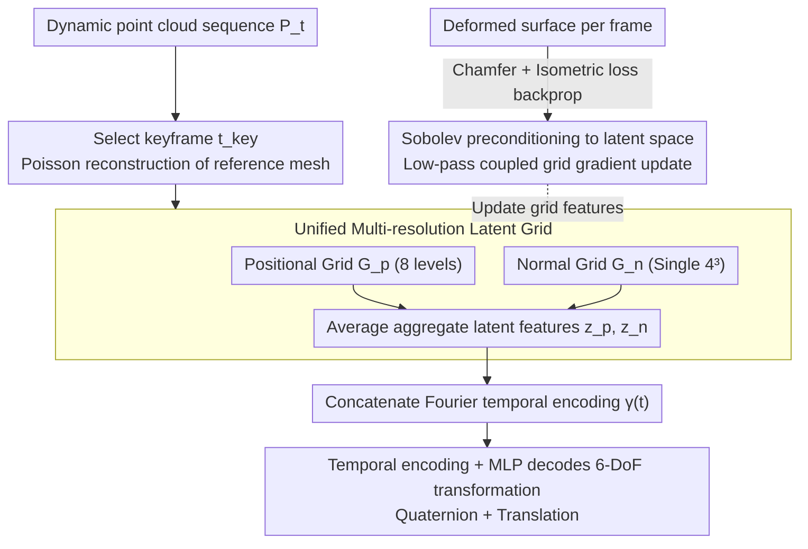

# Neu-PiG: Neural Preconditioned Grids for Fast Dynamic Surface Reconstruction on Long Sequences

**Conference**: CVPR 2026  
**arXiv**: [2602.22212](https://arxiv.org/abs/2602.22212)  
**Area**: 3D Vision  
**Keywords**: Dynamic Surface Reconstruction, Preconditioned Latent Grids, Sobolev Preconditioning, Multi-resolution Voxels, Deformation Estimation  

## TL;DR

Neu-PiG proposes a fast optimization method based on preconditioned multi-resolution latent grids. It encodes the positions and normals of the keyframe reference mesh into a unified latent space, which is then decoded by a lightweight MLP into per-frame 6-DoF deformations. achieving high-fidelity dynamic surface reconstruction more than 60 times faster than existing training-free methods without requiring category priors or explicit correspondences.

## Background & Motivation

Time-consistent surface reconstruction of dynamic 3D objects is a core yet extremely challenging problem in computer vision. Existing methods can be categorized into two main types:

**Optimization-based methods** (e.g., DynoSurf, PDG): Directly optimize deformations for each sequence. While they offer high accuracy, they suffer from long runtimes (typically over 30 minutes) and are prone to drift and degradation on long sequences.

**Learning-based methods** (e.g., CaDeX, M2V): Enable fast inference through category-specific priors, but their generalization is limited by the training domain and they require predefined correspondences.

These two approaches have complementary strengths and weaknesses. However, a **general, efficient, and category-agnostic** method for dynamic shape modeling remains an open challenge. The core difficulties include:

- Error accumulation in long sequences leading to correspondence drift.
- Hash encoding, while compact, possesses collision and non-smooth properties that are unsuitable for coherent non-rigid motion.
- Frame-by-frame optimization of deformation fields cannot maintain global temporal consistency over long sequences.

The key insight of Neu-PiG is that by encoding the **complete deformation of all time steps** into a **unified latent space parameterized by the reference surface**, and using Sobolev preconditioning to ensure optimization stability, both speed and quality can be balanced.

## Method

### Overall Architecture

This paper addresses the problem of time-consistent surface reconstruction for long dynamic 3D sequences. The goal is to achieve high accuracy similar to optimization-based methods and high speed similar to learning-based methods, while remaining category-agnostic and not requiring predefined correspondences. Existing optimization methods optimize deformation fields frame-by-frame, which often leads to drift and degradation on long sequences and typically takes over half an hour.

Neu-PiG's key insight is to encode the complete deformation of all time steps into a unified latent space parameterized by the reference surface, stabilized by Sobolev preconditioning. The workflow is as follows: A keyframe $t_{\text{key}}$ is selected from the sequence to perform Poisson reconstruction for a reference mesh $\mathcal{X}_{t_{\text{key}}}$. Learnable features are stored in a positional grid $\mathcal{G}_p$ and a normal direction grid $\mathcal{G}_n$. The latent features are concatenated with Fourier temporal encodings and fed into a lightweight MLP to decode 6-DoF transformations for each frame. Gradient updates for the latent grids are processed through a Sobolev filter to maintain spatial coherence.

### Key Designs

**1. Unified Multi-resolution Latent Grid: Sharing a single latent space across all time steps to fundamentally avoid long-sequence drift**

Optimizing deformation fields independently frame-by-frame is the root cause of drift—different frames learn independently, and errors accumulate. Neu-PiG compresses the deformation of the entire sequence into a single set of latent grids. The positional grid $\mathcal{G}_p$ uses 8 levels of multi-resolution (from $2^3$ to $32^3$, with each level increasing by 3 elements and each cell storing 30-dimensional features). Instead of being processed independently, outputs from all levels are averaged into a unified representation:

$$\boldsymbol{z}_p(\boldsymbol{x}_{i,t_{\text{key}}}) = \frac{1}{L} \sum_{l=1}^{L} \boldsymbol{z}_p^l(\boldsymbol{x}_{i,t_{\text{key}}})$$

Averaging (rather than concatenating) encourages the network to learn absolute deformations rather than decomposed ones, making optimization significantly more stable. The normal direction grid $\mathcal{G}_n$ uses a single $4^3$ resolution with 2-dimensional features per cell, allowing spatially adjacent regions with different normals to deform independently.

**2. Temporal Encoding + MLP for 6-DoF Transformation: Using a lightweight network to translate latent features into per-frame rigid transformations**

The motion of each surface point must change continuously over time. The normalized time step $\tilde{t} = (t-1)/(T-1)$ is first processed via Fourier encoding:

$$\boldsymbol{\gamma}(t) = [\sin(\pi \nu_j \tilde{t}), \cos(\pi \nu_j \tilde{t})]_{j=1}^{M}$$

where $\nu_j = 2^{j-1}$ and $M=4$ produce an 8-dimensional temporal embedding. The MLP input $\boldsymbol{y}_i = (\boldsymbol{z}_n, \boldsymbol{z}_p, \boldsymbol{\gamma}(t))^T \in \mathbb{R}^{40}$ passes through 3 fully connected layers (512 hidden units + LeakyReLU) to output a 7-dimensional transformation (4D quaternion + 3D translation). Rotation is ensured to have a zero-output identity rotation by offsetting the quaternion scalar component $\hat{\boldsymbol{q}} = \frac{(1+q_w, q_x, q_y, q_z)^T}{\|(1+q_w, q_x, q_y, q_z)^T\|}$. Translation is constrained using $\hat{\boldsymbol{d}} = \tanh(0.1 \cdot \boldsymbol{d})$, resulting in the final position $\hat{\boldsymbol{x}}_{i,t} = \boldsymbol{R}(\hat{\boldsymbol{q}}_i) \boldsymbol{x}_{i,t_{\text{key}}} + \hat{\boldsymbol{d}}_i$.

**3. Sobolev Preconditioning in Latent Space: Low-pass coupling on high-dimensional latent vectors to balance local richness and global smoothness**

While compact, hash encoding is prone to collisions and non-smoothness, making it unsuitable for coherent non-rigid motion. This work extends Sobolev preconditioning—originally applied only to the deformation field in PDG—to high-dimensional latent vectors. Grid parameters are updated according to preconditioned gradients:

$$\boldsymbol{z}^l \leftarrow \boldsymbol{z}^l - \eta (\mathbf{I} + \lambda^l \boldsymbol{L}^l)^{-2} \frac{\partial \mathcal{L}}{\partial \boldsymbol{z}^l}$$

where $\boldsymbol{L}^l$ is the Laplacian matrix, and $(\mathbf{I}+\lambda^l\boldsymbol{L}^l)^{-2}$ acts as a low-pass filter coupling adjacent cells. This ensures spatial coherence in the latent update space, allowing for richer local variations while maintaining global smoothness.

### Loss & Training

The total loss is composed of deformation loss and isometric loss: $\mathcal{L} = \mathcal{L}_{\text{def}} + w_{\text{iso}} \mathcal{L}_{\text{iso}}$. The deformation loss uses a robust Chamfer distance with time-adaptive confidence weights:

$$\mathcal{L}_{\text{def}} = \frac{1}{T} \sum_{t=1}^{T} w_{\text{conf}}(t) \cdot L_{\text{CD}}(\hat{\mathcal{X}}_t, \mathcal{P}_t)$$

The isometric loss penalizes changes in edge lengths to preserve local structure:

$$\mathcal{L}_{\text{iso}} = \frac{1}{T|\mathcal{E}|} \sum_{t=1}^{T} \sum_{(i,j) \in \mathcal{E}} |\|\hat{\boldsymbol{e}}_{ij,t}\| - \text{sg}(\|\hat{\boldsymbol{e}}_{ij,t_{\text{key}}}\|)|$$

By combining joint sequence optimization (not frame-by-frame) with a lightweight MLP and preconditioned acceleration, reconstruction is achieved in seconds—over 60 times faster than existing training-free methods.

## Key Experimental Results

### Main Results (Tab. 1: DFAUST / DT4D / AMA)

| Dataset | Method | CD (×10⁻⁵) ↓ | NC ↑ | F-0.5% ↑ | Corr. ↓ | Time ↓ |
|--------|------|-------------|------|----------|---------|--------|
| DFAUST | DynoSurf | 2.13 | 0.953 | 0.980 | 0.010 | 30 min |
| DFAUST | PDG | 0.52 | 0.957 | 0.988 | 0.018 | 7 min |
| DFAUST | **Ours†** | **0.40** | **0.967** | **0.989** | **0.008** | **8 s** |
| DT4D | DynoSurf | 15.18 | 0.919 | 0.773 | 0.032 | 30 min |
| DT4D | PDG | 1.53 | 0.960 | 0.961 | 0.058 | 7 min |
| DT4D | **Ours†** | **0.96** | **0.969** | **0.962** | **0.034** | **8 s** |
| AMA | DynoSurf | 1.01 | 0.918 | 0.921 | 0.044 | 30 min |
| AMA | PDG | 0.47 | 0.939 | 0.985 | 0.030 | 7 min |
| AMA | **Ours** | **0.44** | **0.951** | **0.988** | **0.018** | **32 s** |

### Long-sequence Scalability (AMA, Tab. 2)

| Frames T | Method | CD (×10⁻⁵) ↓ | NC ↑ | Corr. ↓ | Time ↓ |
|--------|------|-------------|------|---------|--------|
| 40 | PDG | 0.66 | 0.923 | 0.042 | 28 min |
| 40 | **Ours** | **0.53** | **0.947** | **0.019** | **47 s** |
| 80 | PDG | 1.35 | 0.906 | 0.089 | 93 min |
| 80 | **Ours** | **1.04** | **0.940** | **0.023** | **84 s** |
| 120 | PDG | 30.20 | 0.788 | 0.118 | 158 min |
| 120 | **Ours** | **1.31** | **0.926** | **0.028** | **110 s** |

At 120 frames, the CD of PDG spikes to 30.20, while Neu-PiG remains at 1.31, demonstrating superior stability on long sequences.

### Ablation Study (Tab. 3: Component Ablations)

| Configuration | CD (×10⁻⁵) ↓ | NC ↑ | Corr. ↓ |
|------|-------------|------|---------|
| Replace with Hash Encoding | 1.23 | 0.903 | 0.045 |
| No preconditioning | 0.98 | 0.955 | 0.036 |
| No normal encoding $\boldsymbol{z}_n$ | 0.91 | 0.968 | 0.036 |
| Single resolution L=1 | 0.98 | 0.965 | 0.036 |
| **Full Model** | **0.87** | **0.969** | **0.034** |

Key Finding: Replacing the multi-resolution grid with Hash Encoding caused the greatest degradation (CD from 0.87 to 1.23), validating the superiority of the multi-resolution average aggregation design.

## Highlights & Insights

1. **Unified Latent Space Design**: All time steps share a single latent grid (unlike the independent frame-by-frame fields in PDG). This is key to long-sequence stability—different time steps share information via the unified space, naturally preventing drift.
2. **Average Aggregation vs. Concatenation**: Multi-resolution features use averaging instead of concatenation, allowing each level to learn absolute deformations rather than a decomposition, leading to more stable optimization.
3. **High-dimensional Application of Sobolev Preconditioning**: Extending Sobolev preconditioning from raw deformation fields to high-dimensional latent vectors permits richer local variations while maintaining global smoothness.
4. **Root of 60× Acceleration**: The combination of joint sequence optimization, a lightweight MLP, and preconditioned gradient acceleration enables reconstruction in seconds.
5. **No Priors or Correspondences Required**: The method is completely category-agnostic and suitable for various types of subjects, including humans and animals.

## Limitations

1. **Fixed Topology Assumption**: Relies on the keyframe mesh providing the correct topology; cannot handle topological changes (e.g., objects splitting or merging).
2. **Limited Latent Grid Capacity**: For extremely long sequences or highly complex motions, a fixed-size grid may not sufficiently encode all deformation information.
3. **Sensitivity to Large Motion and Occlusion**: Correspondences are implicitly inferred via Chamfer distance; extreme motion or severe occlusion may lead to decreased reconstruction accuracy.
4. **Point Cloud Only**: Does not currently address end-to-end reconstruction from RGB images or depth maps.

## Rating

⭐⭐⭐⭐ (4/5)

The method is elegantly designed, and the introduction of Sobolev preconditioning into latent spaces is both novel and effective. Experimental results showing 60× acceleration alongside accuracy improvements are highly impressive, as is the scalability for long sequences. However, the method still assumes a fixed topology and is limited to point cloud inputs, which moderately restricts its scope.

<!-- RELATED:START -->

## Related Papers

- [\[CVPR 2026\] Neural Gabor Splatting: Enhanced Gaussian Splatting with Neural Gabor for High-frequency Surface Reconstruction](neural_gabor_splatting.md)
- [\[CVPR 2026\] ManifoldNeuS: Manifold-aware View Optimizability for Pose-Free Neural Surface Reconstruction](manifoldneus_manifold-aware_view_optimizability_for_pose-free_neural_surface_rec.md)
- [\[CVPR 2026\] Long-Tail Internet Photo Reconstruction](long-tail_internet_photo_reconstruction.md)
- [\[CVPR 2026\] Neural Field-Based 3D Surface Reconstruction of Microstructures from Multi-Detector Signals in Scanning Electron Microscopy](neural_field-based_3d_surface_reconstruction_of_microstructures_from_multi-detec.md)
- [\[CVPR 2026\] Neural Dynamic GI: Random-Access Neural Compression for Temporal Lightmaps in Dynamic Lighting Environments](neural_dynamic_gi_random-access_neural_compression_for_temporal_lightmaps_in_dyn.md)

<!-- RELATED:END -->
