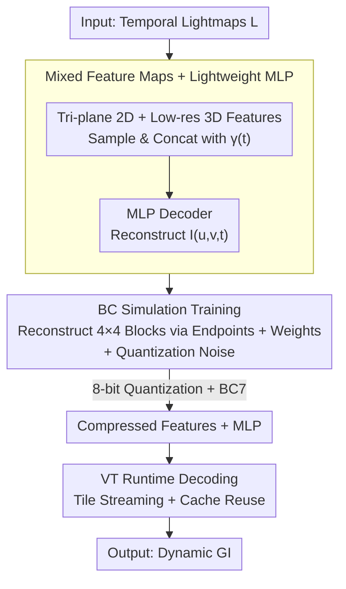

# Neural Dynamic GI: Random-Access Neural Compression for Temporal Lightmaps in Dynamic Lighting Environments

**Conference**: CVPR 2026  
**arXiv**: [2604.12625](https://arxiv.org/abs/2604.12625)  
**Code**: https://magicdawnlab.github.io/ (Project Homepage)  
**Area**: 3D Vision / Neural Rendering / Texture Compression  
**Keywords**: Global Illumination, Lightmap Compression, Neural Texture Compression, Tri-plane Features, Block Compression

## TL;DR
Addressing the pain point that "dynamic lighting requires multiple sets of lightmaps, resulting in massive data volumes," NDGI compresses the entire temporal sequence of lightmaps into a compact model using mixed-dimension feature maps and a lightweight MLP. Combined with Block Compression (BC) simulation during training and Virtual Texturing (VT) for on-demand runtime decoding, it achieves a high reconstruction quality of 46.7 dB PSNR at an extremely low bitrate of 0.68 BPP. This significantly outperforms traditional GPU compression (BC7/ASTC) and existing neural compression (NTC), while reducing decoding latency to approximately one-quarter of NTC's.

## Background & Motivation
**Background**: To achieve high-quality Global Illumination (GI) in real-time rendering, "precomputed lighting" is a mainstream approach. Among these, **lightmaps** are the standard: indirect lighting and static shadows are baked into textures offline and sampled directly at runtime. This provides near-zero computational overhead and stable scalability across various hardware. Compared to Spherical Harmonic (SH) probes, lightmaps offer higher spatial resolution and richer detail.

**Limitations of Prior Work**: Once lighting becomes **dynamic** (e.g., time-of-day effects like sun/skylight transitions or streetlights switching), a single static lightmap is insufficient. A separate **lightmap set must be baked for each lighting condition**, and the engine interpolates between adjacent sets at runtime. This leads to an explosion in storage and VRAM usage; the reference data for a single scene in the paper reaches up to 156 MB, which is unacceptable for large-scale games.

**Key Challenge**: Existing compression methods involve significant trade-offs. Traditional GPU texture compression (BC6H/BC7/ASTC) is hardware-efficient and supports random access but **processes each texture independently with limited compression ratios** (BC7 still requires 8 BPP). These methods fail to exploit **temporal redundancy** across lightmap sets and are prone to blocky artifacts. Recent neural texture compression (e.g., NTC) offers better ratios and quality but **depends on large decoders**, making runtime decoding slow. Furthermore, NTC supports a maximum of 16 channels per group, failing to accommodate an entire temporal sequence of lightmaps. Prior to this, **no work** specialized in compressing "multiple lightmap sets" for dynamic GI.

**Goal**: To concurrently compress disk storage, runtime VRAM, and real-time decoding overhead within a single framework, making dynamic GI truly viable for large-scale scenes.

**Key Insight**: Instead of explicitly storing $n$ sets of lightmaps, the entire spatio-temporal light field $I(u,v,t)$ is treated as a continuous function. Compact feature maps and a small network are used to **implicitly fit** this field. High-frequency temporal changes are captured by specialized feature structures rather than being forced into a heavily-taxed MLP.

**Core Idea**: Replace "sequences of lightmaps" with "mixed-dimension feature maps ($\mathbf{F}^{2D}$ tri-planes + $\mathbf{F}^{3D}$) + a lightweight MLP decoder." The feature maps are designed to be naturally compatible with GPU block compression and work with Virtual Texturing for on-demand decoding, maintaining high quality and real-time performance at extremely low bitrates.

## Method

### Overall Architecture
NDGI formalizes "dynamic lighting compression" as: a target sequence of time-varying lightmaps $L=\{L_i \mid i=0,\dots,n-1\}$, where each $L_i$ is a multi-channel map at time $t_i$. The goal is to represent the lighting at any spatio-temporal point $I(u,v,t)$ via a compact model $\mathbf{H}_\Theta(u,v,t)$ with parameters $\Theta$, bypassing explicit storage.

The pipeline consists of three steps: **(1) Representation**—The lightmap sequence is encoded into four feature maps with different structures ($\mathbf{F}^{2D}_{uv}$, $\mathbf{F}^{2D}_{ut}$, $\mathbf{F}^{2D}_{vt}$ tri-planes + one low-resolution 3D volume $\mathbf{F}^{3D}_{uvt}$) along with a lightweight MLP decoder $G_\Phi$. For given coordinates and time $(u,v,t)$, vectors sampled from the feature maps are concatenated with a temporal positional encoding $\gamma(t)$ and fed into the MLP to reconstruct the lighting. **(2) Compression**—BC simulation and quantization noise are introduced during training, allowing the learned feature maps to be further compressed using 8-bit quantization and BC7 without quality degradation. **(3) Runtime**—Each lightmap is divided into fixed-size tiles, and **a separate model is trained for each tile**. This integrates with Unreal Engine's Virtual Texture (VT) system; during rendering, required tiles are streamed in, decoded via compute shaders into physical textures, and cached tiles are reused over short intervals to avoid redundant inference.

### Key Designs

**1. Mixed-Dimension Feature Maps: Capturing Spatio-Temporal High Frequencies via Tri-planes and 3D Volumes**

The challenge lies in the fact that a lightmap sequence contains both "spatial structures shared across all timestamps" and "high-frequency brightness changes over time" (e.g., a lamp flickering on). If only a 2D feature map $\mathbf{F}^{2D}_{uv}$ matching the target resolution is used, it can only store the shared spatial signals, **forcing the MLP to memorize all temporal variations**. Since temporal changes are often higher frequency and more complex than standard material textures, small MLPs fail to represent them. The authors design a hybrid structure: 2D features are expanded into **tri-planes** $\mathbf{F}^{2D}_{uv}$, $\mathbf{F}^{2D}_{ut}$, and $\mathbf{F}^{2D}_{vt}$ to capture details, while a **low-resolution 3D volume** $\mathbf{F}^{3D}_{uvt}$ specifically captures luminance changes over time.

During inference, $V_{uvt}$ is sampled from the 3D volume using $(u,v,t)$, and coordinates are projected onto the three planes to sample $V_{uv}, V_{ut}$, and $V_{vt}$. These four vectors are concatenated with the temporal encoding $\gamma(t)$ for the decoder:

$$\gamma(t)=[\sin(2^0\pi t),\cos(2^0\pi t),\sin(2^1\pi t),\cos(2^1\pi t)]$$
$$I(u,v,t)=G_\Phi(V_{uvt},V_{uv},V_{ut},V_{vt},\gamma(t))$$

The original sequence is compressed into the parameter set $\Theta=\{\mathbf{F}^{3D}_{uvt},\mathbf{F}^{2D}_{uv},\mathbf{F}^{2D}_{ut},\mathbf{F}^{2D}_{vt},\Phi\}$. Feature map resolutions are adjustable, and the representation naturally **supports random access**—any position at any time can be decoded independently without processing other regions.

**2. BC Simulation Training: Making Learned Features Compatible with Hardware Block Compression**

Feature maps alone are still too large. Standard 8-bit quantization reduces BPP from 4.62 to 2.32, but further applying GPU BC7 compression **after training causes significant information loss**. The authors incorporate "block compression" directly into the training phase: for the high-volume $\mathbf{F}^{3D}_{uvt}$ and $\mathbf{F}^{2D}_{uv}$, they do not update pixel values directly. Instead, every map is divided into $4\times4$ blocks. Features within a block are parameterized by a pair of endpoints $\mathbf{E}=\{e_1,e_2\}$ and $16$ weights $\mathbf{W}=\{w_1,\dots,w_{16}\}$. Each pixel is reconstructed via linear interpolation:

$$f_p=(1-w_p)\,e_1+w_p\,e_2,\quad p=1,\dots,16$$

Training updates these endpoints and weights. This forces the network to learn within the subspace representable by BC. After convergence, a single round of reconstruction, quantization, and BC7 is performed with minimal quality loss. For the smaller $\mathbf{F}^{2D}_{ut}$ and $\mathbf{F}^{2D}_{vt}$, only 8-bit quantization is used, with uniform noise $V'=V+\mathcal{U}(-0.5,0.5)\cdot\alpha$ (where $\alpha=\tfrac{1}{256}$) injected during training to simulate quantization error. This combined strategy reduces the bitrate to **0.68 BPP** (0.7% compression ratio).

**3. Virtual Texture On-demand Decoding: Amortizing Costs via Tile Decoding and Cache Reuse**

Even with a compact model, **per-frame per-pixel decoding** is a heavy burden, especially since lighting changes slowly between adjacent frames. NDGI leverages the caching mechanism of Virtual Texturing (VT): lightmaps are divided into fixed-size tiles, and **each tile is trained as an independent model** to align training with runtime. Each frame, only the parameters for required tiles are fetched and decoded via compute shaders into a physical texture. During shading, a page table is queried to locate the tile in the physical texture. For resident tiles, inference is skipped by reusing the cache, as lighting changes are negligible over short intervals. This reduces online decoding costs and naturally supports large-scale scene expansion through tiling.

### Loss & Training
Each lightmap set is trained independently. **Gamma correction** is performed before training to enhance dark details, and per-channel mean normalization is applied to each time step. The loss function is the **L2 loss** between reconstructed and original lightmaps. The Adam optimizer is used with an initial learning rate of $10^{-3}$ and a batch size of $2^{12}$. The MLP features two hidden layers with adjustable width (typically 16, tested up to 64), using GELU activation in hidden layers and no activation in the output. **In the final stage, feature maps are frozen, and the MLP is fine-tuned under simulated quantization and BC compression.** For large scenes requiring thousands of models, the authors utilize bulk matrix operations in PyTorch for parallel training.

## Key Experimental Results

The dataset includes sequences from real game scenes: FarmLand (from *Arena Breakout: Infinite*), Room (sky/sun changes), City (timed streetlights), and Yard (multiple local lamps). Comparisons include traditional GPU compression (BC6H, BC7, ASTC), neural compression (NTC), and Precomputed Radiance Transfer (PRT). L./M./H. denote Low/Medium/High configurations.

### Main Results

Average reconstruction quality across the dataset at similar bitrates:

| Config | Method | BPP | PSNR↑ | 1−SSIM↓ | LPIPS↓ |
|--------|------|-----|-------|---------|--------|
| Low (<1.0 BPP) | **NDGI L.** | 0.50 | 45.96 | 0.014 | 0.007 |
| Low | **NDGI M.** | 0.68 | 46.69 | 0.012 | 0.006 |
| Low | NTC L. | 0.78 | 43.61 | 0.026 | 0.010 |
| Low | **NDGI M.64** | 0.86 | 47.42 | 0.012 | 0.007 |
| Low | ASTC 12×12 | 0.89 | 32.50 | 0.069 | 0.057 |
| High (>1.0 BPP) | NTC M. | 1.10 | 44.26 | 0.022 | 0.008 |
| High | ASTC 10×10 | 1.28 | 34.52 | 0.051 | 0.043 |
| High | **NDGI H.** | 1.39 | **48.68** | 0.009 | 0.004 |
| High | NTC H. | 1.78 | 45.77 | 0.016 | 0.007 |
| High | BC6H | 8 | 44.31 | 0.026 | 0.010 |
| High | BC7 | 8 | 42.27 | 0.039 | 0.016 |

Key takeaway: NDGI leads across all bitrate segments. Notably, NDGI M. achieves 46.69 dB at **0.68 BPP**, whereas traditional BC7/BC6H require **8 BPP** (~12x bitrate) to reach only 42-44 dB. Storage for the FarmLand scene: NDGI M. requires only **1.10 MB**, compared to **156 MB** for reference data and 13 MB for BC7.

Decoding Latency (1024×1024 lightmap, RTX 4060, CUDA + Tensor Core):

| Method | NDGI L. | NDGI M. | NDGI M.64 | NTC L. | NTC M. |
|------|---------|---------|-----------|--------|--------|
| Decoding Time | 0.201 ms | 0.203 ms | 0.314 ms | 0.886 ms | 0.918 ms |

NDGI's latency is approximately **1/4** of NTC's, thanks to the minimal decoder and lower feature dimensionality.

### Ablation Study

Impact of compression strategies on bitrate (using the same model):

| Strategy | BPP | Compression Ratio |
|----------|-----|--------|
| Original (Unquantized) | 4.62 | 4.8% |
| 8-bit Quantization | 2.32 | 2.4% |
| 8-bit Quantization + BC | 0.68 | 0.7% |

Trade-offs between configuration and quality:

| Config | $\mathbf{F}^{3D}_{uvt}$ Resolution | Hidden Width | BPP |
|------|------|------|-----|
| NDGI L. | 16×16×12×4 | 16 | 0.50 |
| NDGI M. | 32×32×12×4 | 16 | 0.68 |
| NDGI H. | 64×64×12×4 | 16 | 1.39 |
| NDGI M.64 | 32×32×12×4 | 64 | 0.86 |

### Key Findings
- **BC Simulation is critical for reducing bitrate from 2.32 to 0.68 BPP**: While 8-bit quantization halves the bitrate, the additional 3.4x compression comes from the "endpoint + weight" block structure. Simulation ensures this occurs without quality loss.
- **3D Volume resolution dominates the quality-bitrate curve**: Increasing $\mathbf{F}^{3D}_{uvt}$ from 16×16 to 64×64 improves PSNR significantly (45.96 to 48.68) but increases BPP (0.50 to 1.39). Increasing decoder width (NDGI M.64) yields diminishing returns (46.69 to 47.42).
- **Traditional block compression fails on dynamic lighting**: Even at 0.89-1.28 BPP, ASTC results in only 32-34 dB PSNR. NDGI's advantage is most prominent in scenes with high-frequency temporal changes, such as local light switching.

## Highlights & Insights
- **Treating the temporal dimension as a signal requiring specific feature structures is a core insight**: Many implicit compression works feed time directly into an MLP. NDGI uses tri-planes and 3D volumes to capture spatio-temporal high frequencies, allowing for a much smaller decoder—the fundamental reason it is 4x faster than NTC.
- **BC Simulation transforms hardware formats into differentiable constraints**: Instead of passively losing information after training, NDGI forces the network to learn within the representation subspace of BC7 from the start.
- **Alignment of Training and Runtime via Tiling**: While training thousands of models (one per tile) seems heavy, it provides random access, VT cache reuse, and distributed training scalability.
- **New Dataset**: The authors will release a dataset of multi-scene temporal lightmaps, filling a gap in "benchmarking dynamic lighting compression."

## Limitations & Future Work
- **Latency in Abrupt Lighting**: The method supports smooth transitions, but sudden changes (e.g., instant light switching) may not reflect in a single frame, leading to a brief delay at conventional update rates.
- **Training Speed**: Current PyTorch-based training of thousands of models is slow. The authors plan to develop a specialized framework with asynchronous scheduling for tighter real-time engine integration.
- **Scalability of many-model approach**: While tile-based training is parallelizable, the total cost and potential stitching artifacts at tile borders require further investigation.
- **Evaluation Metric**: Comparisons focus on lightmap reconstruction error rather than final image appearance. While this is a "cleaner" metric for compression, a user study on visual perception (especially temporal consistency) is needed.

## Related Work & Insights
- **vs Neural Texture Compression (NTC)**: NTC uses feature pyramids to encode multi-channel textures and supports random access. However, it is limited to **16 channels per group**, which cannot hold a full temporal sequence (forcing NTC to partition temporal segments). NDGI's mixed features and smaller decoder provide higher quality at lower bitrates (0.68 BPP/46.7 dB vs NTC 0.78 BPP/43.6 dB) and 4x faster decoding.
- **vs Traditional Block Compression**: These are hardware-efficient but **process frames independently, losing temporal redundancy**. Bitrates are high (8 BPP for BC7) with noticeable artifacts. NDGI adopts the endpoint-weight concept from these formats but applies it across entire sequences.
- **vs Precomputed Radiance Transfer (PRT)**: PRT supports dynamic lighting but probe-based representations lack spatial detail and exhibit color shifts. NDGI offers superior temporal consistency and reconstruction fidelity.

## Rating
- Novelty: ⭐⭐⭐⭐ The first neural compression framework specifically for "multi-set temporal lightmaps" in dynamic GI. The combination of mixed features and BC simulation is innovative, though individual components (tri-planes, BC, VT) derived from existing concepts.
- Experimental Thoroughness: ⭐⭐⭐⭐ Covers various real game scenes with comparisons against BC/ASTC/NTC/PRT. Lacks large-scale training cost quantification.
- Writing Quality: ⭐⭐⭐⭐ Clear problem definition and logical flow.
- Value: ⭐⭐⭐⭐ Directly addresses a major pain point in industry real-time rendering. Implementation in Unreal Engine and the release of a dataset provide high practical value.

<!-- RELATED:START -->

## Related Papers

- [\[CVPR 2026\] Dynamic Black-hole Emission Tomography with Physics-informed Neural Fields](dynamic_black-hole_emission_tomography_with_physics-informed_neural_fields.md)
- [\[CVPR 2026\] Dynamic-Static Decomposition for Novel View Synthesis of Dynamic Scenes with Spiking Neurons](dynamic-static_decomposition_for_novel_view_synthesis_of_dynamic_scenes_with_spi.md)
- [\[CVPR 2026\] Consistent Instance Field for Dynamic Scene Understanding](consistent_instance_field_for_dynamic_scene_understanding.md)
- [\[CVPR 2026\] Dynamic Visual SLAM using a General 3D Prior](dynamic_visual_slam_using_a_general_3d_prior.md)
- [\[CVPR 2026\] $L^{2}DGS$: Low-Light Dynamic Gaussian Splatting](l2dgs_low-light_dynamic_gaussian_splatting.md)

<!-- RELATED:END -->
