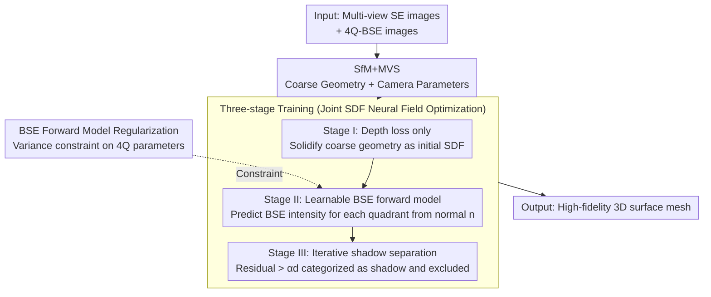

# Neural Field-Based 3D Surface Reconstruction of Microstructures from Multi-Detector Signals in Scanning Electron Microscopy

**Conference**: CVPR 2026  
**arXiv**: [2508.04728](https://arxiv.org/abs/2508.04728)  
**Code**: [https://github.com/zju3dv/NFH-SEM](https://github.com/zju3dv/NFH-SEM)  
**Area**: 3D Vision  
**Keywords**: Scanning Electron Microscope, 3D Reconstruction, Neural Field, Microstructures, Photometric Stereo

## TL;DR
Ours proposes NFH-SEM, a hybrid neural field-based framework that embeds the physical model of SEM electron scattering into the neural field optimization process. By reconstructing high-fidelity 3D surfaces of microstructures from multi-view multi-detector SEM images, it achieves self-calibrated and shadow-resistant reconstruction with nanometer-scale precision (e.g., 478nm layering features, 782nm pollen textures, and 1.559μm fracture steps).

## Background & Motivation

1. **Background**: Scanning Electron Microscopy (SEM) is a widely used imaging tool in material science, biology, and industrial manufacturing, capable of producing high-resolution micro/nanoscale images. However, SEM images are essentially 2D intensity distributions of secondary electrons (SE) or backscattered electrons (BSE) and do not directly contain 3D information. Existing 3D reconstruction methods for SEM are mainly divided into multi-view methods (SfM+MVS) and single-view methods (Photometric Stereo, PS).

2. **Limitations of Prior Work**:
    - Multi-view methods often fail in areas with weak textures or repetitive patterns common in microscopic samples.
    - Single-view PS methods require reference samples for detector calibration and are highly sensitive to shadow artifacts—shadow regions cause distorted gradient estimation.
    - Hybrid methods, while combining the advantages of both, remain constrained by calibration requirements, shadow issues, and the use of 2D height maps which fail to capture complex microscopic structures.
    - Learning-based methods (NeuS, 3DGS, feed-forward reconstruction) either lack large-scale SEM training data for generalization or rely on RGB optical rendering models that cannot capture geometric cues in SEM signals.

3. **Key Challenge**: The physics of signal generation in SEM (electron scattering) is entirely different from conventional RGB imaging. However, existing 3D reconstruction methods either ignore SEM physics (multi-view methods) or rely on simplified physical models requiring complex calibration (single-view methods).

4. **Goal**: Design a neural field reconstruction framework capable of automatically learning SEM imaging physics, self-calibrating detector parameters, and automatically separating shadow regions.

5. **Key Insight**: Model the scattering of BSE signals and detector response as a learnable forward model, embedded within the volume rendering pipeline of an SDF neural field to be optimized jointly with geometry.

6. **Core Idea**: By embedding a learnable BSE forward model into neural field optimization, achieve self-calibration of SEM imaging physics and automatic shadow separation, thereby obtaining high-fidelity microscopic 3D reconstruction.

## Method

### Overall Architecture
The input consists of multi-view, multi-detector SEM images (one SE image + four 4Q-BSE images per view). The process comprises two stages: (1) SfM+MVS using multi-view SE images to obtain coarse initial geometry and camera parameters; (2) Using coarse geometry as initialization, fuse multi-view depth priors and 4Q-BSE photometric information through an SDF neural field to jointly optimize geometry and BSE forward model parameters. This second stage optimization is further divided into three progressive training phases: "establishing geometry, learning photometry, and enabling shadow masks," during which the BSE forward model regularizes the four-quadrant parameters. The output is a high-fidelity 3D surface mesh.

### Key Designs

**1. Learnable BSE Forward Model: Replacing calibrated analytical formulas with a differentiable physical layer**

A pain point of traditional Photometric Stereo (PS) is the necessity of calibrating detector parameters: it uses $I_i(n) = d_i \cos(\varphi_i - \varphi_n)\tan(\theta_n) + c_i$ to calculate surface gradients directly from BSE images, where $c_i/d_i$ must be measured using reference samples—a tedious process specific to each device. NFH-SEM reverses this process: instead of calculating gradients from images, it predicts the BSE intensity each quadrant should see from the normal $n$ predicted by the neural field, then uses real 4Q-BSE images as supervision to backpropagate gradients. The forward model is formulated as:

$$\mathcal{F}_i(n) = \mathbf{R}(\theta_n)\big[d_i \cos(\varphi_i-\varphi_n)\sin(\theta_n) + c_i \cos(\theta_n)\big] + e_i$$

Each of the four quadrants has independent $c, d, e$, sharing a set of polynomial coefficients $p$, totaling 16 learnable parameters. The key modification is the emission amplification term $\mathbf{R}(\theta)$—traditional models use $\sec(\theta)$ to approximate intensity rise at grazing angles, but real BSE responses do not strictly follow this curve. Thus, a fourth-order polynomial is used to fit the measured response. This approach provides two direct benefits: first, the 16 parameters are optimized alongside geometry, effectively allowing the network to perform self-calibration and bypassing reference samples; second, by making the physical model a layer in the neural field volume rendering, the photometric information from BSE images can be stably backpropagated through this layer to correct the SDF geometry. Ablations show that using direct gradient supervision (removing this forward model) worsens the Chamfer distance by nearly 8 times, proving that "forward prediction + image supervision" is much more reliable than "backward gradient calculation."

**2. Iterative Shadow Separation: Identifying shadows via forward model residuals**

4Q-BSE images are riddled with shadows—when a quadrant detector is blocked by the sample itself, the intensity in that region becomes independent of the normal. Using it as hard supervision would distort the geometry. The authors noticed a useful phenomenon: shadow regions correspond exactly to parts where the deviation between the forward model prediction $\mathcal{F}(\hat{n};\hat{\Phi})$ and the measurement $b$ is largest, as shadows cannot be explained by functions of the normal. Thus, the shadow mask is defined by the residual:

$$S = \big(|\mathcal{F}(\hat{n};\hat{\Phi}) - b| < \alpha d\big)$$

Pixels with residuals below the threshold are considered credible, while those above are judged as shadows and excluded from supervision. Using $\alpha d$ instead of a fixed constant is a clever design: $d$ controls the sensitivity of BSE intensity to normal changes. Since the dynamic range of intensity scales with $d$, the threshold scales proportionally to avoid misclassifying "normal intensity changes caused by geometric undulation" as shadows. This mask is updated dynamically during training, creating a positive feedback loop—cleaner mask → purer supervision → more accurate geometry and forward model → residuals better distinguishing shadows → cleaner mask. Measurements show an average shadow detection accuracy of approximately 81.7%.

**3. Three-stage Training: Establishing geometry, adding photometry, then enabling shadow masks**

Feeding depth priors, 4Q-BSE photometry, and shadow masks into a single optimization objective simultaneously causes oscillations and divergence. Therefore, training is split into three progressive stages. Stage I uses only the weighted depth loss $\mathcal{L}_d$ and SDF regularization $\mathcal{R}_s$ to solidify the coarse geometry from SfM+MVS into a stable initial SDF. Stage II introduces the BSE loss $\mathcal{L}_{BSE}(1)$ without the shadow mask and the forward model regularization $\mathcal{R}_\Phi$, allowing the network to learn the mapping from normals to BSE intensity on the existing geometric skeleton. Stage III activates the dynamic shadow mask $\mathcal{L}_{BSE}(S)$ to refine geometry and forward model parameters while excluding shadow contamination. Each stage takes 1000 iterations, totaling approximately 3000 iterations and 2 minutes on a single RTX 4090. The progressive order ensures stability, as each new signal is built upon previous convergence.

**4. BSE Forward Model Regularization: Preventing divergence of four-quadrant parameters**

The four quadrants of a 4Q-BSE detector are designed to be symmetrical. Ideally, $c, d, e$ should be nearly identical, though manufacturing tolerances cause slight variations. The regularization term takes the variance of the three sets of parameters and sums them:

$$\mathcal{R}_\Phi = \text{Var}(c) + \text{Var}(d) + \text{Var}(e)$$

This pulls the four quadrants towards consistency, preventing learnable parameters from diverging into physically meaningless solutions during optimization, while retaining enough freedom to accommodate real manufacturing differences.

### Loss & Training
The total loss is $\mathcal{L} = \lambda_1 \mathcal{L}_d + \lambda_2 \mathcal{R}_s + \lambda_3 \mathcal{L}_{BSE} + \lambda_4 \mathcal{R}_\Phi$, where $\mathcal{L}_d$ is the weighted depth loss (weighted by MVS confidence), $\mathcal{R}_s$ is the standard SDF gradient unit norm constraint, and $\mathcal{L}_{BSE}$ is the MAE loss of 4Q-BSE images.

## Key Experimental Results

### Main Results (Qualitative comparison on real datasets)
On TPL microstructures (Wukong, Lucy, Lion), peach pollen, and silicon carbide particles:
- Multi-view baselines only obtain coarse shapes, failing to recover smooth base surfaces and details (e.g., hair strands, layering steps, pollen textures).
- Single-view PS baselines recover limited texture but suffer from severe global deformation.
- 6 learning-based methods (NeuS, 2DGS, PGSR, DN-Splatter, VGGT, MapAnything) fail significantly when applied directly.
- NFH-SEM accurately recovers 478nm printed layers (Lucy sample), 782nm pollen adhesion textures, and 1.559μm fracture steps.

### Ablation Study (Simulation dataset, units in nm)

| Configuration | Chamfer ↓ | Normal Angular Error ↓ | BSE Model Error ↓ |
|---------------|-----------|------------------------|-------------------|
| Coarse Input  | 25.11     | 7.85°                  | -                 |
| Single-view PS| 512.22    | 12.99°                 | -                 |
| w/o BSE-$\mathcal{F}$ (Direct Gradient) | 135.61 | 7.48° | - |
| w/o Poly-$\mathbf{R}$ (Simplified Emission) | 19.96 | 4.34° | 7.16 |
| w/o 4Q-Var (Shared Parameters) | 19.90 | 3.91° | 1.35 |
| w/o S-Mask (No Shadow Mask) | 29.38 | 4.36° | 0.61 |
| **Complete Model** | **17.48** | **3.70°** | **0.27** |

### Key Findings
- The learnable forward model is the most critical component—direct gradient supervision (w/o BSE-$\mathcal{F}$) worsens Chamfer distance by 7.75 times.
- The polynomial emission term (Poly-$\mathbf{R}$) reduces BSE modeling error from 7.16 to 0.27 compared to simplified $\sec(\theta)$.
- Removing the shadow mask increases Chamfer distance from 17.48 to 29.38, proving shadow separation is vital for geometric accuracy.
- Average shadow detection accuracy reaches 81.7%.
- The entire training takes about 2 minutes (Single RTX 4090) for 3000 iterations.

## Highlights & Insights
- **Paradigm of Physical Model Embedding in Neural Fields**: Instead of using physical formulas to calculate gradients directly for supervision, the physical model is embedded as a differentiable layer within the optimization. This approach can generalize to other fields requiring specialized imaging physics (e.g., X-ray, Ultrasound).
- **Elegant Self-Calibration**: By jointly optimizing detector parameters as learnable variables, Ours eliminates the tedious process of calibration using reference samples required by traditional methods, significantly lowering the barrier to entry.
- **Positive Feedback Mechanism for Shadow Separation**: Utilizing forward model residuals to define shadow masks and adaptively adjusting thresholds based on the physical parameter $d$ creates a self-enhancing cycle—a very clever engineering design.

## Limitations & Future Work
- The assumption of homogeneous electron emission coefficients may not hold for samples with mixed materials.
- Microporous structures with extreme occlusion might have all quadrants covered by shadows, preventing information recovery.
- Charging effects in low-conductivity samples cause pixel shifts, potentially affecting multi-view alignment.
- While groundbreaking, the dataset scale is limited (only 3 sample categories).
- Extensible: Support for segmented emission coefficient estimation for heterogeneous materials and validation on more sample types.

## Related Work & Insights
- **vs Agisoft Metashape (Multi-view Baseline)**: Multi-view methods use only SE images and fail in weak texture areas; NFH-SEM utilizes additional photometric information from 4Q-BSE to compensate for matching deficiencies.
- **vs Single-view PS**: PS methods require calibration and are severely impacted by shadows; NFH-SEM addresses these fundamental issues through a learnable forward model and shadow separation.
- **vs NeuS/3DGS**: These methods rely on RGB rendering models and cannot understand geometric encoding in SEM signals; NFH-SEM bridges this domain gap by embedding SEM physics.

## Rating
- Novelty: ⭐⭐⭐⭐⭐ First to fully adapt neural field methods to SEM imaging physics with sophisticated self-calibration and shadow separation strategies.
- Experimental Thoroughness: ⭐⭐⭐⭐ Evaluation on both real and simulated data with comprehensive ablations, though real data lacks quantitative GT comparisons.
- Writing Quality: ⭐⭐⭐⭐⭐ Clear introduction of SEM physics background, rigorous method derivation, and excellent visualizations.
- Value: ⭐⭐⭐⭐⭐ Highly valuable for micro-3D characterization in material science and biology, opening up the cross-disciplinary field of SEM + Neural Fields.

<!-- RELATED:START -->

## Related Papers

- [\[CVPR 2026\] EMGauss: Continuous Slice-to-3D Reconstruction via Dynamic Gaussian Modeling in Volume Electron Microscopy](emgauss_continuous_slice-to-3d_reconstruction_via_dynamic_gaussian_modeling_in_v.md)
- [\[CVPR 2026\] Neural Gabor Splatting: Enhanced Gaussian Splatting with Neural Gabor for High-frequency Surface Reconstruction](neural_gabor_splatting.md)
- [\[CVPR 2026\] ManifoldNeuS: Manifold-aware View Optimizability for Pose-Free Neural Surface Reconstruction](manifoldneus_manifold-aware_view_optimizability_for_pose-free_neural_surface_rec.md)
- [\[CVPR 2026\] Seeing through boxes: Non-Line-of-Sight 3D Reconstruction from Radar Signals](seeing_through_boxes_non-line-of-sight_3d_reconstruction_from_radar_signals.md)
- [\[CVPR 2025\] ProbeSDF: Light Field Probes for Neural Surface Reconstruction](../../CVPR2025/3d_vision/probesdf_light_field_probes_for_neural_surface_reconstruction.md)

<!-- RELATED:END -->
