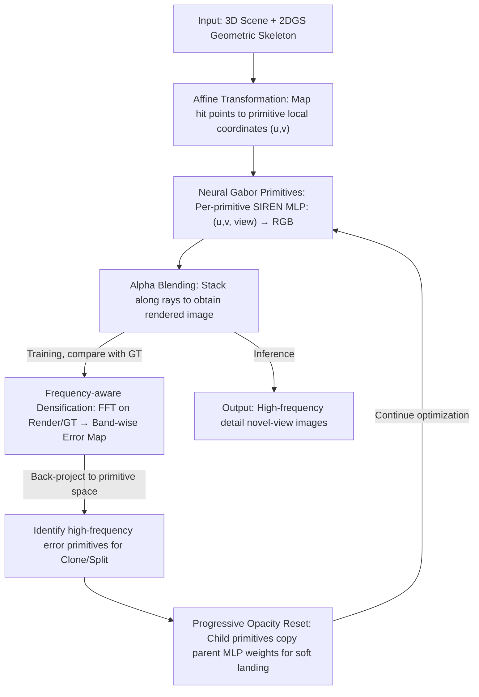

# Neural Gabor Splatting: Enhanced Gaussian Splatting with Neural Gabor for High-frequency Surface Reconstruction

**Conference**: CVPR 2026  
**arXiv**: [2604.15941](https://arxiv.org/abs/2604.15941)  
**Code**: [https://github.com/haato-w/neural-gabor-splatting](https://github.com/haato-w/neural-gabor-splatting)  
**Area**: 3D Vision  
**Keywords**: Gaussian Splatting, High-frequency Surface Reconstruction, Neural Texture, MLP Primitives, Frequency-aware Densification

## TL;DR

Neural Gabor Splatting embeds a lightweight MLP (SIREN architecture) into each Gaussian primitive, enabling a single primitive to represent complex spatially varying color patterns. Combined with a frequency-aware densification strategy, it significantly improves high-frequency surface reconstruction quality under the same data budget.

## Background & Motivation

**Background**: 3D Gaussian Splatting (3DGS) has become the mainstream method for novel view synthesis due to the advantages of its explicit point cloud representation (fast training, real-time rendering, easy editing). However, typical scenes require hundreds of thousands to millions of Gaussian primitives, leading to massive memory overhead.

**Limitations of Prior Work**: Each Gaussian primitive can only represent one color (for a given viewing direction). When a scene contains high-frequency details (such as checkerboard textures, hair, or areas with frequent color jumps), a large number of primitives are required to cover every color variation, leading to a sharp increase in the number of primitives.

**Key Challenge**: The limited expressive power of primitives is the root cause of high storage overhead. Existing improvement schemes have their own limitations: 3D Gabor Splatting is restricted by the properties of the Gabor noise function, and textured Gaussians are limited by preset texture resolutions.

**Goal**: To enhance the expressive power of individual primitives, enabling better high-frequency surface reconstruction with fewer primitives.

**Key Insight**: Inspired by neural textures/deferred rendering, a small MLP is used to parameterize the internal color variations of each primitive, allowing a single primitive to represent arbitrarily complex local patterns.

**Core Idea**: An independent lightweight SIREN MLP is embedded into each 2D Gaussian primitive. It takes local coordinates and viewing directions as input and outputs RGB colors. The sine activation of SIREN naturally encodes high-frequency signals without the need for additional positional encoding.

## Method

### Overall Architecture

This paper aims to solve the "primitive explosion" problem of Gaussian Splatting on high-frequency textures: in standard 3DGS, each primitive can only present one (view-dependent) color. In areas with frequent color jumps like checkerboards or hair, one must stack primitives to piece together patterns, leading to storage expansion. The authors' idea is to push "expressive power" back inside the primitive—letting each primitive learn to draw a complex local pattern, thus covering the same details with fewer primitives.

The overall pipeline follows the geometric framework of 2D Gaussian Splatting (2DGS): each primitive first maps the 3D points hitting it to its own local 2D coordinates $(u, v)$ via an affine transformation. The difference is that color is no longer provided by spherical harmonic coefficients; instead, $(u, v)$ along with the viewing direction $\vec{d}$ are fed into the primitive's exclusive small MLP to directly output the RGB color. The final pixel color is accumulated by alpha-blending the primitives along the ray as usual:

$$\mathbf{c} = \sum_k \hat{\boldsymbol{c}}_k(\Theta_k, u, v, \vec{d}) \, \alpha_k \hat{G}_k T_k$$

where $\hat{\boldsymbol{c}}_k$ is the color predicted by the $k$-th primitive's MLP at that intersection. Surrounding this core modification, the paper introduces a frequency-aware densification strategy to control where primitives should be added.

### Key Designs

**1. Neural Gabor Primitives: Enabling spatially varying colors in a single primitive**

The pain point is direct—one primitive per color means high-frequency patterns must be paved with a large number of primitives. The authors equip each primitive with an independent, single-hidden-layer 6-neuron SIREN MLP, upgrading the primitive from a "color block" to a "micro-texture generator." The input is a 5D vector $\mathbf{y} = (u, v, \vec{d})$ (local coordinates + view direction), and the output is squeezed into RGB via a sine activation and a sigmoid:

$$\hat{\boldsymbol{c}}_k = \text{Sigmoid}\big[\bar{\mathbf{W}}_k \sin\{\omega_0(\mathbf{W}_k \mathbf{y} + \boldsymbol{b}_k)\} + \bar{\boldsymbol{b}}_k\big]$$

The key lies in the sine activation and the frequency parameter $\omega_0 = 30$: SIREN's $\sin(\omega_0 \cdot)$ itself acts as implicit positional encoding, allowing this tiny network to fit high-frequency signals and eliminating the need for extra Fourier features. Compared to discrete texels, the MLP is a continuous, resolution-independent representation that avoids aliasing when zoomed in; compared to fixed basis functions like spherical harmonics or Gabor, it can learn arbitrarily complex local patterns. Each primitive holding its own set of weights means fine-grained modeling occurs at the primitive level rather than relying on a global shared network to accommodate all locations.

**2. Frequency-aware Densification: Precisely placing primitives where high-frequency details are missing**

With the introduction of per-primitive MLPs, traditional gradient-based densification fails—the color variations learned by the MLP naturally lead to large gradients, causing everywhere to be judged as "needing more primitives" and resulting in over-densification. The authors instead calculate "where details are lacking" in the frequency domain: they perform FFT on both the current rendered image and the GT, extract components according to preset frequency bands ($0.01$–$0.10$, $0.10$–$0.20$, $0.20$–$0.40$) via IFFT, and average locally to obtain a frequency-domain error map. By back-projecting this error map pixel-by-pixel to the primitive space, only primitives with high errors are selected for cloning/splitting. Thus, new primitives are targeted at regions lacking high-frequency information rather than being misled by large gradients. Controllability is a byproduct: since errors are split by frequency bands, one can prioritize which band to supplement when storage is limited, allowing for a fine-grained quality-capacity tradeoff.

**3. Progressive Opacity Reset: Preventing overnight invalidation of newborn primitive MLP weights**

Original 3DGS periodically performs a hard reset of opacity to clear redundant primitives. Here, since each primitive carries a set of trained MLP parameters, a hard reset easily causes these parameters to become invalid instantly, leading to training oscillations. The authors change this to a progressive reset: cloned/split child primitives directly copy the parent's MLP weights and undergo an opacity correction, allowing the new primitives to enter subsequent optimization with already-learned textures for a "soft landing," maintaining the stability of the densification process.

### Loss & Training

The training objective is the standard $\lambda L_1 + (1-\lambda) L_{SSIM}$. MLP weights are initialized according to the SIREN initialization scheme. During densification, 20 training views are randomly sampled every 100 iterations, and their frequency-domain errors are accumulated on the GPU as the basis for cloning/splitting. The densification threshold is set to 0.01, with a total of 20k training iterations.

## Key Experimental Results

### Main Results

| Method | High-Frequency PSNR/SSIM/LPIPS | Mip-NeRF360 PSNR/SSIM/LPIPS |
|------|-------------------------------|------------------------------|
| 3DGS* | 23.97/0.8335/0.2769 | 27.23/0.8005/0.2931 |
| 2DGS* | 23.91/0.8279/0.2855 | 26.47/0.7804/0.3197 |
| NEST | 22.22/0.8588/0.2220 | - |
| NTS | 23.48/0.8139/0.3026 | 29.49/0.9028/0.2544 |
| **Ours** | **26.49/0.8808/0.2115** | 26.98/0.810/0.2521 |

### Ablation Study

| Densification Strategy | High-Frequency PSNR/SSIM/LPIPS |
|-----------|-------------------------------|
| Frequency-aware (Ours) | 25.72/0.8619/0.2352 |
| Error-driven | 25.95/0.8619/0.2376 |
| Gradient-driven | 25.56/0.8534/0.2464 |

### Key Findings

- PSNR gain of 2.5+ dB on High-Frequency datasets (vs. 2DGS) proves the massive advantage of neural Gabor primitives in high-frequency scenes.
- Under the same data budget, the visual quality of neural Gabor primitives is significantly sharper, with details like hair and checkerboards far superior to standard methods.
- Frequency-aware densification provides comparable accuracy to error-driven densification but offers frequency-band-level controllability.
- Advantages are more pronounced in low-budget scenarios (1%-5% data), where NEST and NTS degrade rapidly under strict budgets.
- Training time is approximately 2x that of 2DGS, comparable to other neural splatting methods like NEST/NTS.

## Highlights & Insights

- **Extremely Minimalist MLP Design**: A single-hidden-layer 6-neuron SIREN has very few parameters but achieves powerful high-frequency expression through sine activation. This demonstrates the powerful combination of "tiny network + correct activation function."
- **Controllability of Frequency-aware Densification**: It allows for precise selection of which frequency bands to allocate more primitives to, providing a fine quality-capacity balancing tool for storage-constrained scenarios.
- **Continuous vs. Discrete Representation Advantage**: Compared to texture map schemes, the MLP is naturally resolution-independent and does not suffer from texture aliasing.

## Limitations & Future Work

- AtomicAdd operations for per-primitive independent MLPs increase training time (approx. 2x).
- Not directly applicable to volumetric phenomena (e.g., fog, smoke); extension to dynamic scenes is non-trivial.
- For low-frequency scenes, the expressive power of the MLP may not be fully utilized, representing parameter waste.
- Future directions: Parameter sharing or codebook compression could further reduce storage.

## Related Work & Insights

- **vs. 3D Gabor Splatting**: 3D Gabor is limited by the fixed form of the Gabor noise function, whereas neural Gabor uses an MLP for more flexible expression.
- **vs. NTS/NEST**: These methods use hash grids or tri-plane encoding, which have limited expressive power under low budgets; neural Gabor is more robust under low budgets.
- **vs. Textured Gaussians**: Texture schemes are limited by preset resolution and have directional dependencies, whereas the MLP is continuous and resolution-independent.

## Rating

- Novelty: ⭐⭐⭐⭐ The per-primitive MLP approach is intuitive and effective; the frequency-aware densification design is elegant.
- Experimental Thoroughness: ⭐⭐⭐⭐ Comprehensive comparisons across multiple datasets, with detailed budget analysis and ablations.
- Writing Quality: ⭐⭐⭐⭐ Clear method description with complete mathematical formulas.
- Value: ⭐⭐⭐⭐ Provides a practical solution for high-frequency scene reconstruction under storage constraints.

<!-- RELATED:START -->

## Related Papers

- [\[CVPR 2026\] 3D Gaussian Splatting with Self-Constrained Priors for High Fidelity Surface Reconstruction](3d_gaussian_splatting_with_self-constrained_priors_for_high_fidelity_surface_rec.md)
- [\[CVPR 2026\] NVGS: Neural Visibility for Occlusion Culling in 3D Gaussian Splatting](nvgs_neural_visibility_for_occlusion_culling_in_3d_gaussian_splatting.md)
- [\[CVPR 2026\] HyperGaussians: High-Dimensional Gaussian Splatting for High-Fidelity Animatable Face Avatars](hypergaussians_high-dimensional_gaussian_splatting_for_high-fidelity_animatable_.md)
- [\[CVPR 2026\] ManifoldNeuS: Manifold-aware View Optimizability for Pose-Free Neural Surface Reconstruction](manifoldneus_manifold-aware_view_optimizability_for_pose-free_neural_surface_rec.md)
- [\[CVPR 2026\] Distilling Unsigned Distance Function for Surface Reconstruction from 3D Gaussian Splatting](distilling_unsigned_distance_function_for_surface_reconstruction_from_3d_gaussia.md)

<!-- RELATED:END -->
