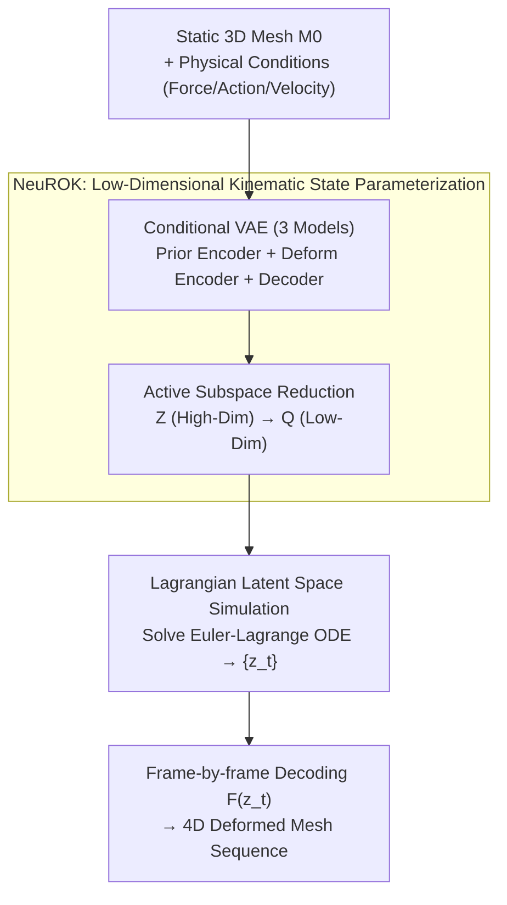

# NeuROK: Generative 4D Neural Object Kinematics

**Conference**: CVPR 2026  
**arXiv**: [2605.30347](https://arxiv.org/abs/2605.30347)  
**Code**: https://chen-geng.com/neurok (Project Homepage)  
**Area**: 3D Vision / 4D Generation  
**Keywords**: 4D Kinematic Generation, Kinematic State Parameterization, Lagrangian Mechanics, Conditional VAE, Mesh Deformation

## TL;DR
NeuROK reformulates the task of generating physically plausible 4D deformations for static 3D objects—traditionally dependent on category-specific physical models—into "learning a low-dimensional latent kinematic state space + solving an ODE using Lagrangian mechanics within this space." This allows for unified 4D dynamic generation across various objects (e.g., elastomers, cloth, continua, articulated objects) without physical annotations or category priors, achieving an 81% preference rate in user studies.

## Background & Motivation

**Background**: Data-driven methods have matured the reconstruction and generation of static 3D objects (using Transformers). However, generating "4D simulated dynamics"—realistic deformations evolving over time under physical conditions like external forces, actions, or initial velocities—still predominantly follows a "two-step" paradigm: first selecting a predefined physical model for the target category (MPM for elastomers, joint prediction for articulated objects, specialized clothing models for fabric), and then estimating the parameters via system identification.

**Limitations of Prior Work**: This paradigm only succeeds within its assumed categories. It collapses when encountering objects with entirely different dynamical structures and, more critically, fails to scale to large-scale 4D datasets containing heterogeneous dynamic structures, as adding a new object class requires redesigning physical equations and constraints.

**Key Challenge**: The root of the problem lies in a long-ignored component—**kinematic state parameterization**. Existing methods directly inherit the parameterization naturally provided by the object's shape representation (e.g., dense particle sets from mesh discretization). This is an **over-parameterized and under-constrained** system: a random deformation vector sampled in $\mathbb{R}^{3n}$ is almost certainly an implausible pose. To make this redundant system "solvable," category-specific physical constraints must be forcefully injected, creating a deadlock between constraints and universality.

**Goal**: To build a universal 4D dynamics generator without introducing any category-specific inductive biases.

**Key Insight**: The authors observe an empirical fact—all "plausible deformations" of a dynamic object correspond to vertex vectors that form a **low-dimensional manifold** $\mathcal{V}^{k_{\text{int}}}$ embedded in $\mathbb{R}^{3n}$, where the intrinsic degrees of freedom $k_{\text{int}} \ll 3n$. Since plausible poses occupy only a low-dimensional subspace, one should avoid redundant parameterizations like dense particles and instead **learn a low-dimensional, compact, and decodable parameterization from data**.

**Core Idea**: Learn a latent manifold $\mathcal{Z}$ and a decoder $\mathcal{F}$ such that any latent vector sampled from $\mathcal{Z}$ can be decoded into a plausibly deformed mesh. This pair $(\mathcal{Z}, \mathcal{F})$ is termed Neural Object Kinematics (NeuROK). With it, the physical system is greatly simplified: there is no longer a need to write inter-particle physical equations to maintain shape plausibility (as any latent vector decoded is plausible by construction). One only needs to model state transitions from the perspective of classical Lagrangian mechanics within the low-dimensional latent space.

## Method

### Overall Architecture
The NeuROK pipeline consists of two relatively independent stages. **Phase 1 (Learning Parameterization)**: Given a static 3D snapshot mesh $\mathcal{M}_0$ of a dynamic object, a Transformer encoder encodes it into an instance-specific latent kinematic state space $\mathcal{Z}(\mathcal{M}_0)$, where each latent vector can be mapped by the decoder to a plausible deformation pose. This is achieved by training a **conditional VAE** (three models collaborating), requiring only 4D geometric trajectory supervision without physical parameters or action labels. **Phase 2 (Dynamics Simulation)**: The original problem of "generating a sequence of deformed meshes $\{\mathcal{M}_1,\dots,\mathcal{M}_T\}$" is equivalently rewritten as "generating a sequence of latent vectors $\{\mathbf{z}_1,\dots,\mathbf{z}_T\}$ in $\mathcal{Z}(\mathcal{M}_0)$." Since the learned NeuROK serves as the **generalized coordinates** for the object's physical system, a Lagrangian $L$ is defined, and solving the Euler-Lagrange ODE yields the latent trajectory, which is decoded frame-by-frame back to meshes.

The following diagram links the two stages: the left half is the generative learning of NeuROK (training/inference), and the right half is the physical simulation in latent space once NeuROK is obtained.

### Key Designs

**1. NeuROK: Learning "Kinematic State Parameterization" from Data**

This is the foundational argument of the paper, directly addressing the pain point that "dense particle parameterization is over-parameterized, under-constrained, and relies on category-specific physical constraints." The authors formalize the parameterization as a pair $(\mathcal{Z}, \mathcal{F})$, where $\mathcal{Z}$ is the latent manifold and $\mathcal{F}$ is the decoder mapping sampled latent vectors to vertex configurations. Crucially, **as long as $\mathcal{F}$ is well-learned, any point in the latent space corresponds to a plausible pose**. This completely liberates "shape maintenance" from explicit physical constraints (inter-particle equations), allowing the system to be studied as a low-dimensional whole. Unlike geometry-derived parameterizations, NeuROK does not rely on dynamic structure priors, making it equally applicable to elastomers, cloth, multi-body, or heterogeneous objects.

**2. Three-Model Conditional VAE: Learning Latent Space via "Deformation Field Distribution"**

Directly modeling "kinematic states" lacks supervision signals. The authors transform this into a proxy task—learning the generative distribution $p_{\mathcal{M}_0}(\phi)$ of all plausible **deformation fields** $\phi(\mathbf{x}):\mathbb{R}^3\to\mathbb{R}^3$ for object $\mathcal{M}_0$. Three Transformers (using Perceiver architecture + learnable tokens for variable point sampling) are trained: ① **Kinematic Prior Encoder** $\mathcal{E}_{\text{cond}}(\mathcal{M}_0)$ takes only the static mesh (surface point cloud + 3DShape2Vecset position embeddings) and outputs an instance-specific prior $p_{\mathcal{M}_0}(\mathbf{z})=\mathcal{N}(\mu_{\text{cond}}, \mathbf{I})$—this is the only model used during inference; ② **Variational Deformation Encoder** $\mathcal{E}_{\text{VAE}}(\phi, \mathcal{M}_0)$ additionally takes a deformation field (vertex displacements $\delta_{\mathbf{z}}=V_{\mathbf{z}}-V_0$ parameterized via dual quaternions and interpolated to sample points) to output the posterior $q_{\mathcal{M}_0}(\mathbf{z}\mid\phi)=\mathcal{N}(\mu_{\text{VAE}}, \sigma_{\text{VAE}})$; ③ **Deformation Decoder** $\mathcal{D}(\mathbf{z}, \mathcal{M}_0)$ uses self/cross-attention over latent tokens and query point clouds to predict point-wise deformation vectors, driving mesh vertices via $K_{\text{drive}}$ nearest neighbor averaging. After training, high-density regions of the prior distribution are treated as $\mathcal{Z}(\mathcal{M}_0)$, and the probabilistic decoder as mapping $\mathcal{F}$.

**3. Active Subspace Model Reduction: Compressing Latent Space for Smooth Solvability**

The dimension $k$ of the raw latent space from the VAE is still relatively high. The authors employ the **Active Subspace Method** to further compress $\mathcal{Z}\subseteq\mathbb{R}^k$ into $\mathcal{Q}\subseteq\mathbb{R}^{k_q}$ ($k_q\ll k$). This involves constructing a proxy function $\mathcal{G}(\mathbf{z})=g(A\mathbf{z}+\epsilon(\mathbf{z}))$ where the rows of $A\in\mathbb{R}^{k_q\times k}$ span the "directions truly important to $\mathcal{G}$." Defining $G$ as the 2-norm of the predicted deformation $\delta_{\text{pred}}$ ensures reduction preserves directions with the maximum influence on deformation. This is not just an incremental improvement; it is the most critical module in ablation studies (see below) because calculating Jacobians and solving ODEs in high dimensions is slow and unstable.

**4. Lagrangian Latent Space Simulation: Neutralizing NeuROK as Generalized Coordinates**

With NeuROK, generating dynamics is equivalent to generating a trajectory $\{\mathbf{z}_i\}$ in $\mathcal{Z}(\mathcal{M}_0)$. The authors treat $\mathbf{z}$ directly as the **generalized coordinates** of the system, defining the Lagrangian $L(\mathbf{z},\dot{\mathbf{z}})=T(\mathbf{z},\dot{\mathbf{z}})-V(\mathbf{z})$ (kinetic minus potential energy) and solving the Euler-Lagrange equation $\frac{\mathrm{d}}{\mathrm{d}t}\frac{\partial L}{\partial\dot{\mathbf{z}}}=\frac{\partial L}{\partial\mathbf{z}}$. Expanded into numerical form:

$$mG(\mathbf{z})\ddot{\mathbf{z}} + C(\mathbf{z},\dot{\mathbf{z}}) + \nabla_{\mathbf{z}}V = 0,$$

where $G(\mathbf{z})=J_{\mathbf{z}}^TJ_{\mathbf{z}}$, $J_{\mathbf{z}}$ is the Jacobian of decoder $\mathcal{F}$, and $C_i=m\sum_{j,k}\Gamma_{ijk}(\mathbf{z})\dot{\mathbf{z}}_j\dot{\mathbf{z}}_k$ with $\Gamma_{ijk}$ being the Christoffel symbols (geodesic correction terms induced by the metric of $\mathcal{F}$ in latent space). External conditions like actions or initial velocities are injected via **boundary conditions**: optimizing initial $(\mathbf{z}_0,\dot{\mathbf{z}_0})$ to minimize $\|\mathbf{x}_0-\mathcal{F}(\mathbf{z}_0)\|_2^2+\|\dot{\mathbf{x}}_0-J_{\mathbf{z}}\dot{\mathbf{z}}_0\|_2^2$, then solving the ODE numerically. The elegance of this approach lies in splitting "physical plausibility" into two levels: shape plausibility is guaranteed by the NeuROK decoder, while motion plausibility (e.g., energy conservation) is naturally guaranteed by the Lagrangian framework.

### Loss & Training
The three models are **jointly trained** on large-scale 4D deformed mesh datasets (curated from PartNet-Mobility and physical simulations). Each iteration randomly samples an instance and two frames from its sequence (sharing topology). The first frame acts as $\mathcal{M}_0$, and the deformation from frame 1 to 2 acts as $\delta_{\text{sample}}$. The training uses the standard conditional VAE objective:

$$\mathcal{L}=\|\delta_{\text{sample}}-\delta_{\text{pred}}\|_2^2 + \lambda D_{KL}\big(q_{\mathcal{M}_0}(\mathbf{z}\mid\phi)\,\|\,p_{\mathcal{M}_0}(\mathbf{z})\big),$$

representing the "reconstruction term + KL alignment of posterior and instance prior," with $\lambda=0.01$. Inference only uses $\mathcal{E}_{\text{cond}}$ to obtain the prior, sample, and decode.

## Key Experimental Results

### Main Results

**Inverse Kinematics Optimization (Compactness and Smoothness of Learned Motion Space)**—Given an object and a target pose, the optimal latent state vector is estimated. Evaluation on PartNet-Mobility uses Chamfer distance and IoU:

| Method | Chamfer (L1)↓ | Chamfer (L2)↓ | IoU↑ |
|------|---------------|---------------|------|
| NeuralDeformationGraphs | 0.670 | 0.724 | 0.289 |
| SINGAPO | 0.313 | 0.200 | 0.091 |
| FreeArt3D | 0.169 | 0.139 | 0.354 |
| CANOR | 0.082 | 0.067 | 0.568 |
| KeyPointDeformer | 0.067 | 0.067 | 0.570 |
| **NeuROK (Ours)** | **0.028** | **0.028** | **0.764** |

NeuROK leads significantly across all metrics, with Chamfer distance halved compared to the runner-up KeyPointDeformer and IoU improving from 0.570 to 0.764.

**Physics-inspired 4D Generation (Quality of Generated Dynamics)**—Generating 4D motion for a single shape given conditional actions. Evaluation via 105-person user study + VBench + WorldScore across 8 categories:

| Method | Align Pref.↑ | Realism Pref.↑ | AQ↑ | DD↑ | IQ↑ | CLIP↑ | MM↑ |
|------|----------|------------|-----|-----|-----|-------|-----|
| PhysDreamer | 5.95% | 5.36% | 0.362 | 0.500 | 48.43 | 0.716 | 0.783 |
| OmniPhysGS | 1.67% | 0.48% | 0.380 | 0.625 | 48.94 | 0.690 | 0.544 |
| Pixie | 5.12% | 4.17% | 0.392 | 0.625 | 46.18 | 0.659 | 0.857 |
| AnimateAnyMesh | 5.83% | 6.67% | 0.450 | 0.625 | 48.37 | 0.730 | 0.889 |
| **NeuROK (Ours)** | **81.43%** | **83.33%** | **0.483** | **0.750** | **51.10** | **0.761** | **2.343** |

> Note: AQ: Aesthetic Quality, DD: Dynamic Degree, IQ: Imaging Quality, CLIP: CLIP score, MM: Motion Magnitude. Preference rates in user studies indicate the percentage of times a method was chosen as best.

NeuROK wins with an overwhelming preference of 81%+. All automated metrics also lead; the MM of 2.343 (far exceeding baselines) indicates it generates larger motion amplitudes closer to real physical responses rather than subtle jittering.

### Ablation Study
Ablations share data with Tab. 1 (Inverse Kinematics setting):

| Configuration | Chamfer (L1)↓ | Chamfer (L2)↓ | IoU↑ | Note |
|------|---------------|---------------|------|------|
| **Full NeuROK** | **0.028** | **0.028** | **0.764** | Full model |
| w/o Model Reduction | 0.045 | 0.059 | 0.711 | Most significant drop |
| w/o Data Augmentation | 0.036 | 0.041 | 0.724 | Removal of training augmentations |
| w/o Dual-Quaternion | 0.033 | 0.037 | 0.728 | Standard instead of DQ parameterization |

### Key Findings
- **Model Reduction is the most critical**: Its removal causes Chamfer L1 to increase by 60% and IoU to drop significantly. This confirms that solving ODEs/calculating Jacobians in high-dimensional latent spaces is unstable; a compact configuration space is a prerequisite for latent dynamics.
- **Verifiable Energy Conservation**: Analysis (Fig. 8) shows that total energy remains approximately constant under the Lagrangian framework, proving physical plausibility is inherent to the framework rather than forced by supervision.
- **Generalization to Unseen Categories**: NeuROK trained only on PartNet-Mobility generalizes to entirely new object categories (Fig. 9) and can simulate real-world scans (e.g., closing a laptop, Fig. 7).
- **Baselines Lack Generality**: Physics-based methods (PhysDreamer/Pixie) only work within specific material categories, while end-to-end methods (AnimateAnyMesh) lack fine-grained control and struggle with rare objects.

## Highlights & Insights
- **Elevating Parameterization Choice**: The paper follows Landau's principle that choosing the right coordinates makes the problem easier. The core insight is that 4D generation is hard because of redundant shape-inherited coordinates; switching to learned generalized coordinates resolves the difficulty.
- **Elegant Division of Realism**: Shape plausibility is handled by the NeuROK decoder (data prior), while motion plausibility is handled by the Lagrangian ODE (classical mechanics). This separation allows for "physically plausible generation without physical labels."
- **Hybrid Paradigm of Neural Parameterization + Classical Physics**: Instead of fitting PDE solutions with a network, the network only learns a "good coordinate system," leaving dynamical deduction to analytical Euler-Lagrange equations—combining data-driven generalization with physical interpretability and conservation laws.
- **Active Subspace Method for Latent Reduction**: This trick is reusable for any task requiring Jacobian-based optimization or physics within a latent space, as it identifies directions with maximal impact on output.

## Limitations & Future Work
- **Inherent Under-determination**: A single 3D snapshot cannot uniquely determine physical parameters. The method provides one plausible 4D sequence following human intuition rather than the single ground truth.
- **Dependency on Shared Topology**: Training requires mesh sequences with shared topology across frames to calculate deformations, limiting the inclusion of topological changes (e.g., tearing, fluid merging).
- **Manual Lagrangian Design**: While the framework is universal, defining kinetic/potential energy forms and encoding boundary conditions still involves manual design, with details often deferred to supplementary materials.
- **Object-Centric Assumption**: The method assumes motion stems from a single dominant deformable object, which may struggle with multi-body coupling or contact-dominant scenarios (e.g., collisions, grasping).

## Related Work & Insights
- **vs. PhysDreamer / OmniPhysGS / Pixie (Physics-inspired 4D)**: These follow the "predefined model + parameter estimation" two-step paradigm. NeuROK is category-agnostic and scales to large datasets, whereas they excel in physical precision within their specific material domains.
- **vs. AnimateAnyMesh (End-to-end 4D)**: Both use large-scale 4D data, but end-to-end generation lacks fine-grained physical control. NeuROK decouples parameterization from dynamics, allowing precise injection of forces/velocities via boundary conditions.
- **vs. Reduced-Order Simulation**: Graphic model reduction also learns low-dimensional spaces but usually targets **acceleration** for known systems and is often per-instance. NeuROK targets **universality** and learns amortized, generalizable priors.
- **vs. Lagrangian Neural Networks**: Those works learn the Lagrangian from data. Ours uses the classical Lagrangian definition while the network only learns the "data-driven kinematic state parameterization," minimizing the neural network's role to the most controllable component.

## Rating
- Novelty: ⭐⭐⭐⭐⭐ Reformulating kinematic state parameterization as a methodology core and combining it with Lagrangian ODEs is a rare, paradigm-shifting idea in 4D generation.
- Experimental Thoroughness: ⭐⭐⭐⭐ Extensive quantitative IK tests + multi-metric 4D generation evaluation (User Study/VBench/WorldScore). Validates unseen categories, though some physical setup details are in supplementary materials.
- Writing Quality: ⭐⭐⭐⭐⭐ Clear arguments, effective use of classical mechanics references, and a rigorous formulation that logically derives the solution from identified pain points.
- Value: ⭐⭐⭐⭐⭐ Provides a universal, non-annotated path for 4D simulation generation essential for embodied AI and robotics world models.

<!-- RELATED:START -->

## Related Papers

- [\[CVPR 2026\] CUPID: Generative 3D Reconstruction via Joint Object and Pose Modeling](cupid_generative_3d_reconstruction_via_joint_object_and_pose_modeling.md)
- [\[CVPR 2026\] CARI4D: Category Agnostic 4D Reconstruction of Human-Object Interaction](cari4d_category_agnostic_4d_reconstruction_of_human_object_interaction.md)
- [\[ICLR 2026\] Scaling Sequence-to-Sequence Generative Neural Rendering](../../ICLR2026/3d_vision/scaling_sequence-to-sequence_generative_neural_rendering.md)
- [\[ICLR 2026\] SpatialHand: Generative Object Manipulation from 3D Perspective](../../ICLR2026/3d_vision/spatialhand_generative_object_manipulation_from_3d_prespective.md)
- [\[CVPR 2026\] ArtHOI: Taming Foundation Models for Monocular 4D Reconstruction of Hand-Articulated-Object Interactions](arthoi_taming_foundation_models_for_monocular_4d_reconstruction_of_hand-articula.md)

<!-- RELATED:END -->
