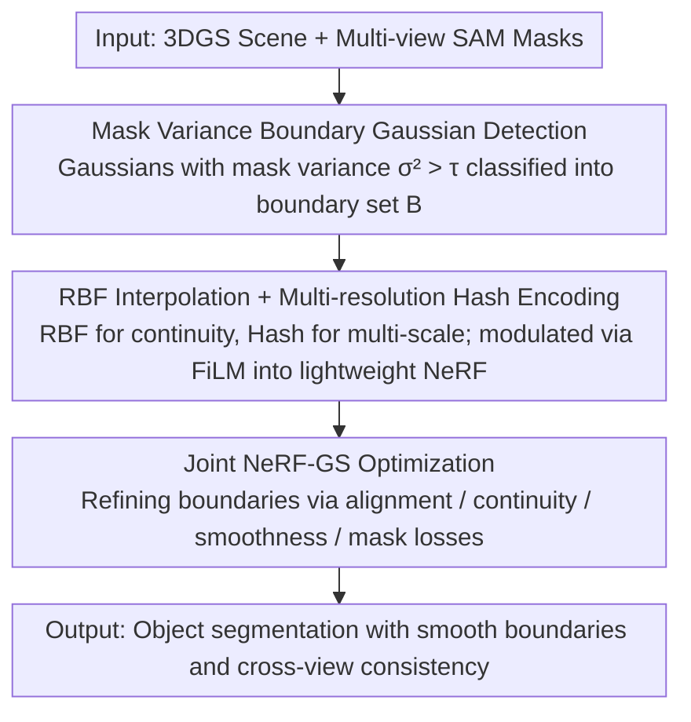

# NG-GS: NeRF-Guided 3D Gaussian Splatting Segmentation

**Conference**: CVPR 2026 Highlight  
**arXiv**: [2604.14706](https://arxiv.org/abs/2604.14706)  
**Code**: [github.com/BJTU-KD3D/NG-GS](https://github.com/BJTU-KD3D/NG-GS)  
**Area**: 3D Vision  
**Keywords**: 3D Gaussian Splatting, segmentation, NeRF, boundary refinement, hash encoding

## TL;DR

The NG-GS framework is proposed to utilize the continuous modeling capability of NeRF to resolve discretization issues in 3DGS segmentation boundaries. High-quality object segmentation is achieved through continuous feature fields constructed via RBF interpolation combined with multi-resolution hash encoding and joint NeRF-GS optimization.

## Background & Motivation

3DGS has achieved efficient and photorealistic novel view synthesis, but its discrete Gaussian representation leads to aliasing and artifacts in segmentation at object boundaries. Existing 3DGS segmentation methods (feature distillation, feed-forward inference, mask lifting) mostly overlook the discretization problem of Gaussian elements at boundaries. While directly removing Gaussians with boundary mutations can improve segmentation, it interferes with visual quality. The Core Idea is to utilize NeRF's continuous representation capability to adjust the coordinates and attributes of 3DGS at the boundaries.

## Method

### Overall Architecture

This paper aims to solve the following problem: the discrete Gaussian representation of 3DGS produces aliasing and artifacts at object boundaries; while directly deleting boundary-mutated Gaussians improves segmentation, it destroys visual quality. The Core Idea is to leverage NeRF's continuous modeling capability to adjust 3DGS coordinates and attributes at boundaries, making boundaries both accurate and visually appealing.

The overall workflow is a two-stage process: first, boundary Gaussian regularization—detecting fuzzy boundary Gaussians through mask variance analysis, then generating a continuous feature field using RBF interpolation and multi-resolution hash encoding; second, joint NeRF-GS optimization—coordinating outputs of both models using alignment and spatial continuity losses to ensure smooth boundary transitions and cross-view consistency.

### Key Designs

**1. Mask Variance Boundary Gaussian Detection: Automatically locating fuzzy boundary Gaussians for refinement**

To refine boundaries, they must first be located. This paper collects multi-view SAM-generated mask signal sets for each Gaussian point and calculates the variance of mask values $\sigma_i^2$. If the same Gaussian is classified as foreground in some views and background in others, the variance is high, indicating it is positioned on a boundary. Points with variance greater than a threshold $\tau$ are assigned to the boundary set $\mathcal{B}$, and query points are sampled along the bounding box extensions on the image plane without any manual annotation.

**2. RBF Interpolation + Multi-resolution Hash Encoding: Creating a continuous and multi-scale feature field for boundary query points**

The space between discrete Gaussians is "empty," whereas boundary refinement requires continuous expression. For query points, K-NN is first used to find neighboring Gaussians, and an RBF kernel weights them to interpolate a continuous feature $\mathbf{f}^{inter}$ for continuity. Simultaneously, multi-resolution hash encoding extracts spatial features $\mathbf{f}^{hash}$ from coarse to fine for multi-scale expression. These are combined and fed into a lightweight NeRF module, where interpolated features act as condition vectors to modulate NeRF hidden layers via FiLM. The two are complementary: RBF provides continuity, and Hash provides multi-scale representation.

**3. Joint NeRF-GS Optimization: Positioning NeRF as a continuous refinement network rather than a replacement to align boundaries consistently**

Training NeRF and 3DGS independently is ineffective as boundaries will not align. This paper binds the two together using four losses: an alignment loss constrains the RGB color and opacity of 3DGS and NeRF in boundary regions; a continuity loss constrains the color consistency of adjacent boundary Gaussian points; a gradient smoothness loss penalizes abrupt changes; and a mask loss provides supervision weighted by NeRF density. NeRF acts here as a refiner to "smooth out" discrete boundaries rather than a completely new model to replace 3DGS.

### Loss & Training

The total loss is $\mathcal{L}_{total} = \mathcal{L}_{align} + \lambda_m \mathcal{L}_{mask} + \lambda_c \mathcal{L}_{cont} + \lambda_s \mathcal{L}_{smth}$. Both NeRF and 3DGS are trained jointly using the Adam optimizer, and local $7 \times 7$ variance terms in boundary regions are used to promote spatial smoothness in the alignment loss.

## Key Experimental Results

### Main Results

| Dataset | Metric | COB-GS | Ours | Gain |
|--------|------|--------|-------|------|
| NVOS | B-mIoU | 79.1% | **84.7%** | +5.6pp |
| NVOS | mIoU | 92.1% | **92.6%** | +0.5pp |
| LERF-OVS | B-mIoU | Prev. SOTA | **+4.4pp** | Significant |
| ScanNet | B-mIoU | Prev. SOTA | **+6.8pp** | Significant |

Consistently outperforms all baselines across all metrics on all three benchmarks, with the most significant improvements in boundary mIoU.

### Ablation Study

- RBF interpolation and hash encoding provide complementary contributions: the former provides continuity, the latter provides multi-scale expression.
- Joint NeRF-GS optimization yields better results than optimizing either component alone.
- A mask variance threshold $\tau=0.6$ achieves the best balance between precision and recall.

### Key Findings

- Significant improvements in boundary mIoU (5-7pp) validate the effectiveness of the continuous processing.
- Defining NeRF as a continuous refinement network rather than a replacement is the correct positioning.
- The method can be directly extended to multi-object segmentation scenarios.

## Highlights & Insights

- The idea of complementing NeRF's continuity with 3DGS's efficiency is novel.
- Mask variance automatically detects boundary Gaussians without manual annotation.
- The design of integrating RBF interpolated features into NeRF via FiLM modulation is simple and effective.

## Limitations & Future Work

- The NeRF module introduces additional training and inference overhead.
- Boundary Gaussian detection depends on the quality of the 2D segmentation model (SAM).
- Computational efficiency for K-NN queries and RBF interpolation in large-scale scenes needs optimization.

## Related Work & Insights

- The NeRF-GS complementary idea can be extended to other 3DGS tasks such as editing and generation.
- The application of multi-resolution hash encoding in boundary refinement can be applied to other fine-grained tasks.
- Mask variance analysis provides a simple and effective baseline for automatic boundary detection.

## Rating

7/10 — The method is cleverly designed and shows significant improvement in boundary mIoU, though additional computational overhead requires trade-offs.

<!-- RELATED:START -->

## Related Papers

- [\[CVPR 2026\] LangRef3DGS: Natural Language-Guided 3D Referential Segmentation from Partial Observations via 3D Gaussian Splatting](langref3dgs_natural_language-guided_3d_referential_segmentation_from_partial_obs.md)
- [\[CVPR 2026\] Energy-GS: Image Energy-guided Pose Alignment Gaussian Splatting with redesigned pose gradient flow](energy-gs_image_energy-guided_pose_alignment_gaussian_splatting_with_redesigned_.md)
- [\[ICLR 2026\] D²GS: Depth-and-Density Guided Gaussian Splatting for Stable and Accurate Sparse-View Reconstruction](../../ICLR2026/3d_vision/d2gs_depth-and-density_guided_gaussian_splatting_for_stable_and_accurate_sparse-.md)
- [\[CVPR 2026\] GS²: Graph-based Spatial Distribution Optimization for Compact 3D Gaussian Splatting](gs2_graph-based_spatial_distribution_optimization_for_compact_3d_gaussian_splatt.md)
- [\[CVPR 2026\] Faster-GS: Analyzing and Improving Gaussian Splatting Optimization](faster-gs_analyzing_and_improving_gaussian_splatting_optimization.md)

<!-- RELATED:END -->
