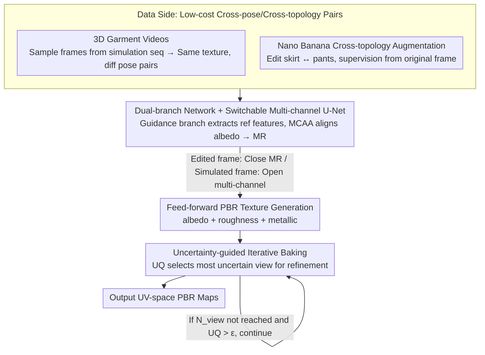

# NI-Tex: Non-isometric Image-based Garment Texture Generation

**Conference**: CVPR 2026  
**arXiv**: [2511.18765](https://arxiv.org/abs/2511.18765)  
**Code**: [Available](https://github.com/SII-Hui/NI-Tex)  
**Area**: 3D Vision  
**Keywords**: Garment texture generation, PBR materials, Non-isometric deformation, Uncertainty-guided baking, Cross-topology augmentation  

## TL;DR

Ours proposes the NI-Tex framework, which achieves high-quality PBR texture generation from a single image to a 3D garment under non-isometric conditions using a feed-forward architecture. This is accomplished by constructing a 3D Garment Videos dataset, image-editing-based cross-topology augmentation, and an uncertainty-guided iterative baking algorithm.

## Background & Motivation

**Background**: Existing industrial-grade 3D garment meshes cover most real-world geometries, but texture diversity remains limited. To obtain more realistic textures, generative methods often extract PBR (Physically Based Rendering) textures from large quantities of real images and project them onto garment meshes.  

**Limitations of Prior Work**: Existing image-conditioned texture generation methods face two core constraints:  
1. **Topology Consistency Requirements**: Most methods require strict topological consistency between the input image and the target 3D mesh. For example, Hunyuan3D and Meshy suffer from significant quality degradation when image-mesh topology does not match.  
2. **Mesh Deformation Dependency**: Methods like Pix2Surf and Cloth2Tex rely on precise mesh deformation to match the image pose, but the deformation process introduces cumulative errors and limits flexibility.  

**Key Challenge**: In practical applications, significant topological differences (e.g., generating textures for a pants mesh from a skirt image) and geometric differences (different poses, body shapes) often exist between user-provided images and target meshes.  

**Key Insight**: Ours transforms the non-isometric problem into a data augmentation problem, utilizing image editing models to create cross-topology training pairs and using physical simulation data to cover cross-pose scenarios.

## Method

### Overall Architecture

The Goal of NI-Tex is to take an arbitrary garment image and a target 3D garment mesh and output render-ready PBR textures. The Key Challenge is that the image and mesh often represent different garments (e.g., skirt image vs. pants mesh) or different poses. The Core Idea is to bypass this "non-isometric" difficulty in two steps: first, on the **Data Side**, create numerous "cross-pose, cross-topology" training pairs via physical simulation and image editing, allowing the feed-forward network to see these differences during training; second, on the **Network Side**, use a dual-branch structure to align the texture identity of the reference image with the target geometry; finally, on the **Inference Side**, use an uncertainty model to iteratively fill in missing or poorly baked viewpoints.

Formally, the input is an RGB image $I \in \mathbb{R}^{H \times W \times 3}$ and a target garment mesh, and the output consists of UV space maps for albedo ($C=3$), roughness ($C=1$), and metallic ($C=1$).

### Key Designs

**1. 3D Garment Videos: Creating Cross-pose Pairs via Physical Simulation**  
**Mechanism**: Pose mismatch between input and target mesh is a major barrier to realism. Unlike Pix2Surf, NI-Tex uses motion sequences from BEDLAM $V = \{M_1, M_2, \ldots, M_n\}$, where all frames share the same albedo but have varied geometry. Each frame is assigned PBR properties ($\text{roughness} \sim \mathcal{U}(0,1)$, $\text{metallic}=0$). During training, two frames are sampled from a sequence: one as the **Condition Frame** (rendered image from a specific lighting/viewpoint) and one as the **Supervision Frame**. This creates "pose-variant, texture-invariant" training samples without manual annotation, expanding the data to billions of possible pairs.

**2. Nano Banana-based Cross-Topology Augmentation**  
**Design Motivation**: To address topological differences, NI-Tex uses the Nano Banana image editing model to "change the topology" of existing data (e.g., turning pants into shorts). The edited image becomes the input, while the original frame remains the supervision. This distills the texture identity retention capability of Nano Banana into the texture generation network. Three semantic constraints are applied during editing: consistency of upper/lower garment categories, separation of inner/outer layers, and occasional human body generation to focus the model on garment materials.

**3. Dual-Branch Network & Switchable Multi-Channel U-Net**  
**Function**: The generation branch receives multi-view normal and position maps and is coupled with the guidance branch via **Multi-Channel Alignment Attention (MCAA)**. The albedo branch attention is calculated as:  
$$\text{Attn}_{albedo} = \text{Softmax}\left(\frac{Q_{albedo} K_{ref}^T}{\sqrt{d}}\right) \cdot V_{ref}$$  
This is injected into the Metallic-Roughness (MR) latent representation to ensure alignment. To handle the unreliable MR attributes in Nano Banana edited images, a **Switchable U-Net** is used: MR channels are disabled for edited frames (albedo supervision only) and enabled for simulated frames.

**4. Uncertainty-Guided Iterative Baking**  
**Novelty**: Fixed orthogonal views often leave gaps or blur at seams due to self-occlusion. Ours trains a UQ (Uncertainty Quantification) model (ResNet-50 backbone) to predict pixel-wise uncertainty. Training labels are generated by simulating errors where a model reconstructs a texture from an edited view compared to the GT:  
$$\min_{\boldsymbol{z}} \| \Gamma^{\text{front}}(\boldsymbol{z}) - T_{\text{gt}}^{\text{front}} \|^2 + \| \Gamma^{\text{back}}(\boldsymbol{z}) - T_{\text{gt}}^{\text{back}} \|^2$$  
Baking becomes a closed-loop: in each round, the viewpoint with the highest average uncertainty is selected for re-inference until $N_{view}$ is reached or uncertainty falls below $\epsilon$. Final texels are blended based on uncertainty and view weights:  
$$t_i^{\star} = \frac{\sum_j (1 - \text{UQ}(p_{ij})) c_j p_{ij}}{\sum_j (1 - \text{UQ}(p_{ij})) c_j + \epsilon_1}$$  

### Loss & Training

Multi-channel optimization stage (Albedo + MR supervision):  
$$\mathcal{L}_1 = \mathbb{E}_{\epsilon \sim \mathcal{N}(0,1), t} \left[ \| \epsilon - \epsilon_t^{MR} \|_2^2 + \| \epsilon - \epsilon_t^{Albedo} \|_2^2 \right]$$  

Single-channel optimization stage (Albedo supervision only for edited samples):  
$$\mathcal{L}_2 = \mathbb{E}_{\epsilon \sim \mathcal{N}(0,1), t} \left[ \alpha \cdot \| \epsilon - \epsilon_t^{Albedo} \|_2^2 \right]$$  

**MR Rectification**: To resolve MR inconsistency across frames, representative foreground pixels are sampled from the condition frame's MR map and used to replace values in the supervision frame's map. Training is based on Stable Diffusion 2.1 using 8×H200 GPUs.

## Key Experimental Results

### Main Results

| Method | KID ↓ | FID ↓ |
| :--- | :--- | :--- |
| Paint3D | 0.0695 | 293.45 |
| Hyper3D OmniCraft | 0.0471 | 285.45 |
| Hunyuan3D | 0.0528 | 272.34 |
| Meshy 6 Preview | 0.0383 | 246.39 |
| **NI-Tex (Ours)** | **0.0364** | **237.52** |

NI-Tex achieves the best KID and FID scores, with KID 5.0% lower and FID 3.6% lower than the second-best method (Meshy).

### Ablation Study (Baking Strategies)

| Baking Strategy | Mesh Coverage | Artifact Handling | PSNR |
| :--- | :--- | :--- | :--- |
| 6 Orthogonal Views | Significant gaps | None | Baseline |
| Coverage-based | Improved, minor gaps | None | Medium |
| **UQ Iterative Baking (Ours)** | **Full Coverage** | **Active fix of blur/holes** | **Highest** |

### Key Findings

1. **Cross-Topology Robustness**: NI-Tex generates high-quality textures even with significant topology differences (e.g., skirt to pants), whereas Hunyuan3D and Meshy suffer from distortions.
2. **In-the-wild Adaptability**: Successfully captures logos and fine patterns from real-world DeepFashion2 images.
3. **Cross-pose Consistency**: Validated on 4D-Dress, showing consistent texture generation across different human poses.
4. **UQ over Coverage**: Uncertainty-guided baking identifies artifacts like blur and seams that traditional coverage methods miss.
5. **Versatility**: Stable performance on both industrial meshes and folds-heavy generated meshes from Hunyuan3D.

## Highlights & Insights

- **Image Editing as Augmentation**: Transformed the non-isometric problem into an image editing problem, distilling editing capabilities into a generation model.
- **Combinatorial Data Expansion**: Using 3D Garment Videos to amplify data scale from 10^5 to 10^{10} pairs.
- **Switchable Architecture**: Pragmatic design of the switchable U-Net to handle potentially unreliable MR signals from edited images.
- **Uncertainty Closed-loop**: The UQ model drives the entire quality detection and repair cycle.

## Limitations & Future Work

- Generalization to **complex rigid deformation** is limited due to the focus on flexible garment simulation data.
- Reliance on external image editing model quality; editing failures introduce noise.
- High training cost (8×H200 GPUs for ~10 days) and iterative inference overhead.
- MR Rectification assumes global uniformity of MR properties, which may fail for multi-material garments.

## Rating

| Dimension | Rating | Reason |
| :--- | :--- | :--- |
| Novelty | ⭐⭐⭐⭐ | First feed-forward solution for non-isometric textures; novel editing-driven augmentation. |
| Experimental Thoroughness | ⭐⭐⭐⭐ | Strong comparisons with commercial models; includes industrial and generated mesh scenarios. |
| Writing Quality | ⭐⭐⭐⭐ | Clear framework diagrams and logical differentiation of pose vs. topology. |
| Value | ⭐⭐⭐⭐⭐ | Directly addresses industrial garment design needs; PBR output is highly practical. |

<!-- RELATED:START -->

## Related Papers

- [\[CVPR 2026\] SwiftTailor: Efficient 3D Garment Generation with Geometry Image Representation](swifttailor_efficient_3d_garment_generation_with_geometry_image_representation.md)
- [\[CVPR 2026\] MatLat: Material Latent Space for PBR Texture Generation](matlat_material_latent_space_for_pbr_texture_generation.md)
- [\[CVPR 2026\] NaTex: Seamless Texture Generation as Latent Color Diffusion](natex_seamless_texture_generation_as_latent_color_diffusion.md)
- [\[CVPR 2026\] TEXTRIX: Latent Attribute Grid for Native Texture Generation and Beyond](textrix_latent_attribute_grid_for_native_texture_generation_and_beyond.md)
- [\[CVPR 2026\] CaliTex: Geometry-Calibrated Attention for View-Coherent 3D Texture Generation](calitex_geometry-calibrated_attention_for_view-coherent_3d_texture_generation.md)

<!-- RELATED:END -->
## Related Papers

- [\[CVPR 2026\] Refaçade: Editing Object with Given Reference Texture](refacade_editing_object_with_given_reference_texture.md)
- [\[CVPR 2026\] The Devil is in Attention Sharing: Improving Complex Non-rigid Image Editing Faithfulness via Attention Synergy](the_devil_is_in_attention_sharing_improving_complex_non-rigid_image_editing_fait.md)
- [\[CVPR 2026\] Semantics Lead the Way: Harmonizing Semantic and Texture Modeling with Asynchronous Latent Diffusion](semantics_lead_the_way_harmonizing_semantic_and_texture_modeling_with_asynchrono.md)
- [\[ECCV 2024\] GarmentAligner: Text-to-Garment Generation via Retrieval-augmented Multi-level Corrections](../../ECCV2024/image_generation/garmentaligner_text-to-garment_generation_via_retrieval-augmented_multi-level_co.md)
- [\[CVPR 2026\] Agentic Retoucher for Text-To-Image Generation](agentic_retoucher_for_texttoimage_generation.md)

<!-- RELATED:END -->
