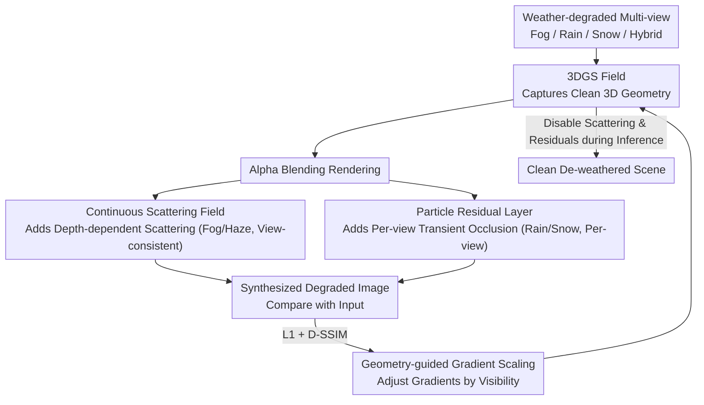

# NimbusGS: Unified 3D Scene Reconstruction under Hybrid Weather

**Conference**: CVPR 2026  
**arXiv**: [2603.27228](https://arxiv.org/abs/2603.27228)  
**Code**: [https://github.com/lyy-ovo/NimbusGS](https://github.com/lyy-ovo/NimbusGS)  
**Area**: 3D Vision  
**Keywords**: 3D Gaussian Splatting, Adverse Weather, Scene Reconstruction, Physical Modeling, Weather Decomposition

## TL;DR

NimbusGS proposes a unified 3D scene reconstruction framework that achieves SOTA reconstruction across cross-weather and hybrid-weather conditions by decomposing weather degradation into a continuous scattering field (fog/haze) and per-view particle residual layers (rain/snow), combined with a geometry-guided gradient scaling mechanism.

## Background & Motivation

3D scene reconstruction assumes clean, high-quality inputs, but practical environments like fog, rain, and snow significantly degrade imaging. Weather degradation follows two mechanisms: (1) continuous media (fog/haze) causing depth-dependent light attenuation that is view-consistent; and (2) discrete particles (rain/snow) causing dynamic high-frequency occlusions that are view-independent.

**Limitations of Prior Work**: Two-stage schemes (restoration followed by reconstruction) break multi-view consistency. Approaches that embed weather modeling into reconstruction are typically designed for a single weather type. Existing methods generally fail in hybrid weather scenarios (e.g., simultaneous fog and rain).

**Goal**: Based on the physical nature of weather, design a unified framework to simultaneously model both continuous scattering and discrete particle degradation mechanisms.

## Method

### Overall Architecture

NimbusGS addresses how to extract clean 3D geometry from weather interference when training images are simultaneously contaminated by fog, rain, and snow. Instead of de-weathering before reconstruction, it optimizes "reconstruction" and "weather modeling" within a single objective. The core insight is that weather degradation can be physically categorized into two types, corresponding to distinct modeling approaches. Thus, beyond the standard 3DGS Gaussian field, it introduces two degradation branches: a **continuous scattering field** for view-consistent global attenuation (fog/haze) and a **particle residual layer** for per-view local occlusion (rain/snow). Additionally, a **geometry-guided gradient scaling** mechanism prevents optimization bias under heavy occlusion. After training, clean structures remain in the Gaussian field, while weather interference is absorbed by the degradation branches; turning them off during rendering yields a clean, de-weathered scene.

### Key Designs

**1. Continuous Scattering Field: Modeling Fog and Haze as Global Physical Effects**

Fog and haze result from atmospheric scattering, where attenuation depends only on depth and remains consistent across perspectives—a distant object is obscured by the same fog density regardless of the camera view. Fitting this per-view as noise would destroy multi-view consistency. NimbusGS employs a scene-level volumetric extinction field to estimate transmittance and atmospheric light. Transmittance decays monotonically with depth, and atmospheric light is a global variable shared by all views. By layering this atmospheric scattering model over the 3DGS alpha-blending results, the "haziness" is explained by physical parameters rather than forcing Gaussians to fit hazy colors. Consequently, the Gaussian field captures the clear scene while fog intensity is handled by shared parameters.

**2. Particle Residual Layer: Rain and Snow as Per-view Transient Occlusions**

Unlike fog, raindrops and snowflakes are discrete high-frequency particles appearing at different positions in every frame, making them impossible to model view-consistently. Forcing them into 3D Gaussians would generate erroneous "phantom" floating geometry. NimbusGS maintains an independent residual map for each view to capture transient interference unique to that view. This residual map is added after rendering and does not contaminate the underlying 3D geometry. During training, no manual labeling of rain versus structure is required; the optimization naturally partitions the content: stable structures appearing across multiple views are assigned to the shared Gaussian field, while transient contents flashing in single frames are absorbed by the per-view residual layers.

**3. Geometry-guided Gradient Scaling: Adjusting Gradients by Visibility**

Weather causes highly non-uniform visibility, where foregrounds are clear and backgrounds are swallowed by thick fog. Reconstructing heavily degraded distant regions offers weak signals, yet their gradient magnitudes can be abnormally large due to weather noise, leading the optimization astray. NimbusGS adaptively scales gradients using visibility cues: regions with high visibility retain normal gradients, while gradients in low-visibility regions are proportionally suppressed. This mechanism provides a "trust level" to the optimizer—learning more from clear areas and less from obscured ones—thereby stabilizing the geometry of distant and heavily degraded regions.

### Loss & Training

A progressive optimization strategy is adopted to decouple continuous scattering and particle effects, preventing the two degradation branches from competing early in training. Supervision consists of $L_1$ reconstruction loss + D-SSIM, with regularization constraints on both the scattering field and residual layer to prevent them from absorbing structures that belong to the Gaussian field. The entire pipeline requires no paired clean/degraded data and does not rely on large-scale pre-training.

## Key Experimental Results

### Main Results

| Weather Condition | NimbusGS | Prev. SOTA | Gain |
|---------|----------|---------|------|
| Fog/Haze | SOTA | DehazeGS | Significant |
| Rain | SOTA | DeRainGS | Significant |
| Snow | SOTA | WeatherGS | Significant |
| Hybrid Weather | **New Baseline** | N/A | — |

The method comprehensively outperforms specialized approaches under both single and hybrid weather conditions.

### Ablation Study

| Configuration | PSNR | Description |
|------|------|------|
| 3DGS Baseline | Low | Weather severely affects reconstruction |
| + Scattering Field | Improvements | Global degradation removed |
| + Residual Layer | Further Improvements | Local interference removed |
| + Gradient Scaling | Optimal | Improved distant geometry |

### Key Findings

- Physics-driven decomposition is more robust than data-driven end-to-end methods, particularly in hybrid weather.
- Gradient scaling is a critical contributor to the reconstruction quality of distant/heavily degraded areas.
- Generalization of the unified framework: No adjustments are needed for new weather types.

## Highlights & Insights

- **Elegant Physics-driven Decomposition**: Categorizing weather into continuous and discrete types and processing each with appropriate modeling is both physically sound and computationally simple.
- **Versatility of Gradient Scaling**: This visibility-based adaptive optimization strategy can be transferred to other degradation scenarios such as low-light or underwater imaging.
- **Value of a Unified Framework**: Handling all weather types with a single model avoids the engineering burden of maintaining multiple specialized models.

## Limitations & Future Work

- The capacity of the particle residual layer may be insufficient for extreme precipitation (e.g., heavy rainstorms).
- The continuous scattering field assumes a uniform atmosphere and may lack flexibility for non-homogeneous fog (e.g., patchy fog).
- Performance under extreme weather combinations (e.g., snow + fog + rain) has not been fully verified.
- Future work could extend the framework to dynamic scenes (e.g., moving vehicles in adverse weather).

## Related Work & Insights

- **vs WeatherGS**: WeatherGS separates particles and lens artifacts but requires 2D priors; NimbusGS provides unified modeling in 3D space.
- **vs DehazeNeRF/ScatterNeRF**: These methods handle only fog/haze, whereas NimbusGS simultaneously addresses fog, rain, and snow.
- **vs RainyScape/DeRainGS**: Specialized rain methods lack generalization to other weather types.

## Rating

- Novelty: ⭐⭐⭐⭐ Clear physical decomposition and practical gradient scaling.
- Experimental Thoroughness: ⭐⭐⭐⭐ Comprehensive coverage of multiple weather conditions.
- Writing Quality: ⭐⭐⭐⭐ Clear explanation of physical motivations.
- Value: ⭐⭐⭐⭐ Direct application value for outdoor 3D reconstruction in autonomous driving.

<!-- RELATED:START -->

## Related Papers

- [\[CVPR 2026\] WeatherCity: Urban Scene Reconstruction with Controllable Multi-Weather Transformation](weathercity_urban_scene_reconstruction_with_controllable_multi-weather_transform.md)
- [\[CVPR 2026\] Scene Reconstruction as Mapping Priors for 3D Detection](scene_reconstruction_as_mapping_priors_for_3d_detection.md)
- [\[ICCV 2025\] RobuSTereo: Robust Zero-Shot Stereo Matching under Adverse Weather](../../ICCV2025/3d_vision/robustereo_robust_zero-shot_stereo_matching_under_adverse_weather.md)
- [\[CVPR 2026\] Revisiting Pose Sensitivity in Splat-based Computed Tomography under Sparse-view Reconstruction](revisiting_pose_sensitivity_in_splat-based_computed_tomography_under_sparse-view.md)
- [\[CVPR 2026\] Urban-GS: A Unified 3D Gaussian Splatting Framework for Compact and High-Fidelity Aerial-to-Street Reconstruction](urban-gs_a_unified_3d_gaussian_splatting_framework_for_compact_and_high-fidelity.md)

<!-- RELATED:END -->
