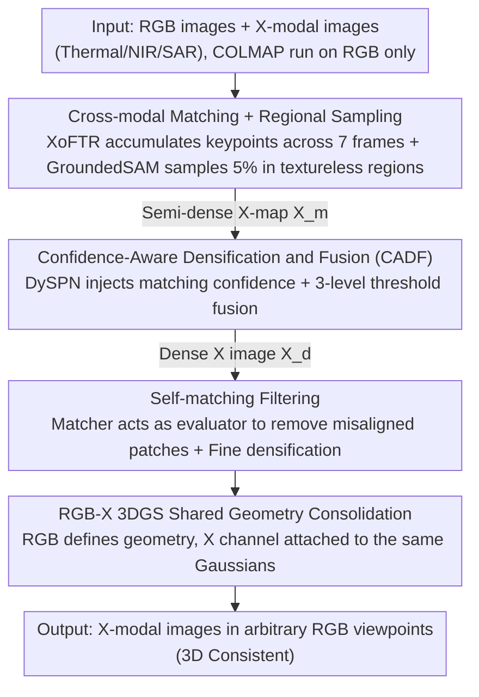

# No Calibration, No Depth, No Problem: Cross-Sensor View Synthesis with 3D Consistency

## Basic Information

- **Conference**: CVPR 2026
- **arXiv**: [2602.23559](https://arxiv.org/abs/2602.23559)
- **Authors**: Cho-Ying Wu, Zixun Huang, Xinyu Huang, Liu Ren (Bosch Research North America & BCAI)
- **Code**: To be confirmed (Project page exists)
- **Area**: 3D Vision / Cross-Sensor View Synthesis
- **Keywords**: Cross-Sensor View Synthesis, RGB-X Alignment, 3D Gaussian Splatting, Image Matching, Confidence-Aware Densification

## TL;DR

The first calibration-free and depth-free cross-sensor view synthesis framework is proposed. Through a match-densify-consolidate pipeline, sparse cross-modal keypoints are expanded into dense, RGB-aligned X-modal images (thermal/NIR/SAR). The synthesis quality is enhanced via confidence-aware fusion and self-matching filtering.

## Background & Motivation

Sensors beyond RGB (thermal, NIR, SAR) are crucial for scenarios like night vision in autonomous driving and leak detection, yet research lags far behind RGB. The core bottleneck is the extreme difficulty in obtaining pixel-aligned RGB-X pairs:

1. **Limitations of Prior Work**: Traditional industrial solutions require intrinsic calibration, sensor synchronization, relative pose estimation, and precise metric depth. Errors propagate through each stage, and occlusion issues remain unresolved.
2. **Limitations of Prior Work**: SfM methods like COLMAP are only applicable to RGB and typically fail on low-texture sensors such as thermal imaging cameras.
3. **Key Challenge**: Cross-modal matchers (XoFTR, MINIMA) can only estimate a homography matrix $H \in \mathbb{R}^{3\times3}$ for warping. However, homography assumes planar scenes; it causes severe misalignment when scenes contain distinct foreground/background layers.
4. **Key Challenge**: Image translation methods (RGB to Thermal) have inherent ambiguities—the temperature of a cup of water cannot be determined from its appearance.

**Goal**: This paper proposes the first scalable cross-sensor view synthesis framework that does not rely on any 3D priors for the X sensor (no depth, no calibration) and only depends on near-zero-cost COLMAP on RGB data.

## Method

### Overall Architecture

The objective is to synthesize X-modal images (thermal/NIR/SAR) into arbitrary RGB viewpoints without calibration, depth, or 3D priors for the X sensor. The pipeline follows a match-densify-consolidate strategy, relying solely on RGB-based COLMAP. The matching stage performs cross-modal feature matching and regional sampling to generate semi-dense X-maps $\mathcal{X}_m$; the densification stage employs RGB-guided densification and confidence-aware fusion to obtain dense X images $\mathcal{X}_d$; the consolidation stage utilizes self-matching filtering, refined densification, and RGB-X 3DGS to integrate multi-view data into 3D-consistent results.

### Key Designs

**1. Cross-modal matching + Regional sampling: Accumulating sparse keypoints into semi-dense X-maps without degrading densification in textureless areas**

Given RGB image $\mathcal{I}$ and X-modal image $\mathcal{X}$, XoFTR finds the matching set $\{(p^{\mathcal{I}}, p^{\mathcal{X}}, c)\}$. X keypoints from $N=7$ frames are accumulated into the current RGB coordinate system:

$$\mathcal{X}_m[p] = \frac{\sum_n \mathbf{1}[p=p_n^{\mathcal{I}}] \, \mathcal{X}[p_n^{\mathcal{X}}]}{\sum_n \mathbf{1}[p=p_n^{\mathcal{I}}]}$$

Textureless regions like sky or ground fail to generate keypoints. This method uses GroundedSAM for segmentation and uniformly samples 5% of points from the homography-warped X image as supplements:

$$\mathcal{X}_m[p] = \mathcal{X}_W[p], \quad p \sim \mathrm{U}(\{p \mid \mathcal{M}(p)=1 \wedge \mathcal{X}_m[p]=-1\})$$

Sampling only small amounts provides seeds for densification while preventing homography warping errors from contaminating the entire image.

**2. Confidence-Aware Densification and Fusion (CADF): Propagating matching uncertainty to densification followed by multi-threshold fusion**

The densification network $D$ uses recurrent units and Dynamic Spatial Propagation (DySPN) to complete the dense X image. Standard DySPN iterations use only a certainty map $C_s$ predicted by the backbone:

$$L^{t+1} = (1 - C_s) \sum_r \sum_{(a,b)} w_{r,a,b} * L_{a,b}^t + C_s \mathcal{X}_m$$

The authors inject the matching confidence map $C_m$ (aggregated from matching scores $c$) into the iteration to suppress the contribution of low-confidence keypoints:

$$L^{t+1} = (1 - C_s C_m) \sum_r \sum_{(a,b)} w_{r,a,b} * L_{a,b}^t + C_s C_m \mathcal{X}_m$$

Furthermore, $K=3$ threshold levels ($\delta=0.15, 0.3, 0.5$) are used to generate multiple results $\hat{\mathcal{X}}_{d,k}$, which are fused using a pre-trained image enhancement network $F$.

**3. Self-matching filtering: Using the matcher as an evaluator to remove misaligned patches**

An aligned RGB-X pair should ideally have each patch match its corresponding location. Path-level similarity matrices $A = \frac{F_{\mathcal{I}} F_{\mathcal{X}}^\top}{\tau}$ are computed using transformer features. A concentration metric $q = Q_{50}(\mathbf{A}) / Q_{99}(\mathbf{A})$ is used to filter out patches with low diagonal scores. A refined single-stage densification is then performed on the filtered images.

**4. RGB-X 3DGS Shared Geometry Consolidation: Leveraging high-quality RGB for geometry to ensure 3D consistency**

3DGS is trained on RGB COLMAP poses, with an additional X channel added to each Gaussian. Geometry parameters are shared; because the RGB images are of higher quality, they locate 3D Gaussians more precisely. The X channel inherits this accurate geometry to achieve cross-view consistency.

### Loss & Training

The densification network $D$ is pre-trained on synthetic RGB-X pairs (MINIMA for Thermal, Deep-NIR for NIR). Fusion module $F$ is pre-trained on DIV2K and fine-tuned with two self-supervised losses: a cosine similarity loss based on SigLIP2:

$$\mathcal{L}_{\text{cos}}(\mathcal{I}, \mathcal{X}_d) = 1 - \frac{f_{\text{SigLIP}}(\mathcal{I})^\top f_{\text{SigLIP}}(\mathcal{X}_d)}{\|f_{\text{SigLIP}}(\mathcal{I})\|_2 \|f_{\text{SigLIP}}(\mathcal{X}_d)\|_2}$$

And a self-matching loss to diagonalize the similarity matrix:

$$\mathcal{L}_{\text{sim}}(A) = -\frac{\operatorname{Tr}(A)}{\|A\|_F} + \lambda \frac{\|A \odot (\hat{\mathbf{1}} - I)\|_1}{\|A\|_F}$$

## Key Experimental Results

### Main Results: METU-VisTIR-Cloudy RGB-Thermal (No GT, Mean over 6 sequences)

| Method | Icos↑ | p30↑ | p50↑ | p70↑ | p90↑ | ITM↑ | ITcos↑ |
|:--|:--|:--|:--|:--|:--|:--|:--|
| XoFTR | 0.62 | 25.13 | 27.49 | 29.31 | 31.48 | 0.69 | 0.39 |
| LightGlue | 0.61 | 25.89 | 28.28 | 30.14 | 32.35 | 0.91 | 0.40 |
| LoFTR | 0.66 | 29.38 | 32.07 | 33.95 | 36.04 | 0.89 | 0.45 |
| MINIMA | 0.67 | 29.93 | 32.78 | 34.72 | 36.99 | 0.88 | 0.44 |
| **Ours** | **0.69** | **31.18** | **34.39** | **36.43** | **38.72** | **0.92** | **0.45** |

### Ablation Study (RGB-NIR-Stereo Mean)

| Configuration | PSNR↑ | SSIM↑ | LPIPS↓ |
|:--|:--|:--|:--|
| Full Method | **21.152** | **0.581** | **0.344** |
| - 3DGS | 21.042 | 0.597 | 0.378 |
| - Self-matching & Filter | 20.235 | 0.522 | 0.386 |
| - DySPN Confidence | 19.621 | 0.508 | 0.396 |
| - Multi-threshold | 19.215 | 0.495 | 0.420 |
| - Regional Sampling | 16.454 | 0.408 | 0.467 |

### Key Findings

1. **CADF Contribution**: Injecting matching confidence into DySPN provides a ~1 dB PSNR gain, validating the propagation of matching uncertainty.
2. **Superiority even without 3DGS**: Ours (without 3DGS) achieves PSNR=21.042, outperforming all baseline + 3DGS combinations (Best MINIMA=20.392).
3. **Foundation of Regional Sampling**: Removing regional sampling drops PSNR to 16.454 (~4.7 dB loss), indicating its criticality for global densification.
4. **Cross-modal Generality**: The same framework achieves SOTA results across Thermal, NIR, and SAR modalities.

## Highlights & Insights

- **Accurate Problem Positioning**: First systematic study of cross-sensor view synthesis that identifies the unrealistic assumption of pre-existing paired data.
- **Key Insight**: The zero-cost assumption (COLMAP on RGB only) significantly increases practical utility.
- **Mechanism**: Matching confidence flows through the entire pipeline: from point selection to DySPN iterations, multi-level fusion, and finally self-matching filtering.
- **Novelty**: Utilizing the matcher as an evaluator by exploiting the "aligned patches should self-match" prior is a clever way to handle quality filtering without extra models.

## Limitations & Future Work

- Restricted to static scenes; dynamic objects interfere with 3D consolidation (a limitation of standard 3DGS).
- Performance is limited when sensor data has extremely high noise or low resolution.
- Still relies on the quality of the underlying cross-modal matcher; struggle in completely homogeneous regions.
- The 5% sampling ratio is manually set and lacks an adaptive mechanism.

## Rating

⭐⭐⭐⭐ — The problem definition is clear with high practical value. The match-densify-consolidate framework is logically designed with clearly defined contributions from each module (supported by extensive ablation). Achieving consistent SOTA across three modalities is compelling. Main drawbacks are the static scene limitation and reliance on matcher quality.

<!-- RELATED:START -->

## Related Papers

- [\[CVPR 2026\] Cross-View Splatter: Feed-Forward View Synthesis with Georeferenced Images](cross-view_splatter_feed-forward_view_synthesis_with_georeferenced_images.md)
- [\[CVPR 2026\] ForgeDreamer: Industrial Text-to-3D Generation with Multi-Expert LoRA and Cross-View Hypergraph](forgedreamer_industrial_text-to-3d_generation_with_multi-expert_lora_and_cross-v.md)
- [\[ICCV 2025\] No Pose at All: Self-Supervised Pose-Free 3D Gaussian Splatting from Sparse Views](../../ICCV2025/3d_vision/no_pose_at_all_self-supervised_pose-free_3d_gaussian_splatting_from_sparse_views.md)
- [\[CVPR 2026\] Cross-Instance Gaussian Splatting Registration via Geometry-Aware Feature-Guided Alignment](cross-instance_gaussian_splatting_registration_via_geometry-aware_feature-guided.md)
- [\[CVPR 2026\] AffordGrasp: Cross-Modal Diffusion for Affordance-Aware Grasp Synthesis](affordgrasp_cross-modal_diffusion_for_affordance-aware_grasp_synthesis.md)

<!-- RELATED:END -->
