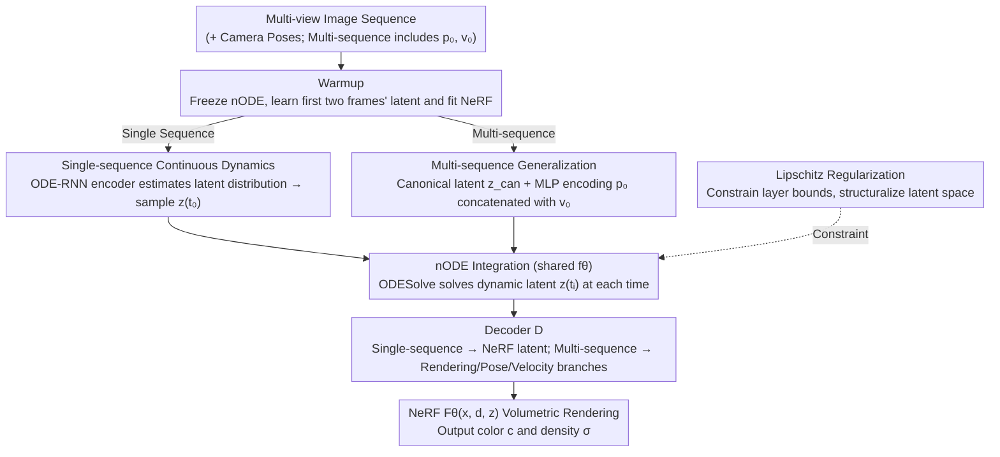

# Node-RF: Learning Generalized Continuous Space-Time Scene Dynamics with Neural ODE-based NeRFs

**Conference**: CVPR 2026  
**arXiv**: [2603.12078](https://arxiv.org/abs/2603.12078)  
**Code**: None (Paper states it will be made publicly available)  
**Area**: 3D Vision / Dynamic Scene Reconstruction  
**Keywords**: Neural ODE, NeRF, Dynamic Scene, Spatio-temporal Extrapolation, Trajectory Generalization

## TL;DR

Node-RF tightly couples Neural ODEs with NeRF, using continuous-time differential equations to drive the temporal evolution of implicit scene representations. It achieves long-range extrapolation and cross-trajectory generalization far beyond the training interval, significantly outperforming baselines like D-NeRF and 4D-GS on datasets such as Bouncing Balls, Pendulum, and Oscillating Ball.

## Background & Motivation

### Background

Modeling dynamic 3D scenes from image sequences is a core problem in computer vision. Following NeRF's success in novel view synthesis for static scenes, researchers extended it to 4D spatio-temporal scenarios: D-NeRF and Nerfies use deformation fields to map each frame to a canonical space; HexPlane/K-Planes use low-rank feature decomposition to accelerate spatio-temporal modeling; and 4D Gaussian Splatting achieves real-time rendering using explicit point clouds.

### Limitations of Prior Work

Existing dynamic NeRF methods suffer from two fundamental flaws:

**Poor Extrapolation**: The temporal dimension is discretized into per-frame parameters (e.g., per-frame latent codes or deformation fields). Models are only valid within the training time domain and cannot perform long-range extrapolation into the future—shaking, object disappearance, or scene collapse occur beyond a few frames.

**Lack of Generalization**: Deformation fields are bound to individual sequences. Changing initial conditions (e.g., initial position or velocity) requires retraining, as the models fail to learn "universal laws of motion."

### Key Challenge

The root of the problem is that these methods **memorize discrete states rather than learning continuous dynamics**. They use discrete indices to look up temporal information without modeling the differential structure of motion, making extrapolation reasoning impossible in the time dimension.

### Key Insight

Neural ODEs provide a framework for describing the continuous evolution of latent states using differential equations—where the rate of change of the latent state is parameterized by a neural network, and an ODE solver can solve for the state at any time. The core idea of Node-RF is to **use Neural ODEs to drive the evolution of NeRF latent codes over time, transforming the scene representation from "per-frame memory" to "continuous dynamics modeling"**, thereby achieving long-range extrapolation and cross-trajectory generalization.

## Method

### Overall Architecture

Node-RF aims to ensure dynamic NeRFs no longer rely on "per-frame memory" but instead learn a set of continuous dynamics over time. It integrates a Neural ODE into the latent space of NeRF—instead of storing separate temporal parameters for each frame, it maintains a latent state $z_t$, whose rate of change $\dot z = f_\theta(z_t, t)$ is provided by a neural network. The latent at any time is integrated from the initial state by an ODE solver.

The pipeline operates as follows: after receiving multi-view image sequences (with camera poses, and initial positions/velocities for multi-sequence tasks), an initial latent state $z_{t_0}$ is determined. The ODE solver solves for the latents at all time points along the time axis. Each $z_{t_i}$ is then fed into the NeRF $F_\Theta$, along with spatial coordinates $x$ and viewing direction $d$, to render color and density. The process is summarized by the following equations:

$$z_{t_0}, \ldots, z_{t_N} = \text{ODESolve}(f_\theta, z_{t_0}, (t_0, \ldots, t_N))$$
$$F_\Theta(x, d, z_{t_i}) = (c, \sigma)$$

Time serves as the independent variable of the differential equation rather than a lookup index, which is the fundamental reason for its extrapolation capability. The entire system is trained end-to-end and divided into two sub-tasks: single-sequence tasks learn interpolation and extrapolation for a specific video, while multi-sequence tasks extract shared motion laws from a batch of trajectories with different initial conditions.

### Key Designs

**1. Single-sequence Continuous Dynamics: Using Latent ODE to transform video evolution into integrable differential equations**

This addresses the issue where frame-based methods only interpolate between training frames and collapse during extrapolation. Node-RF uses a Latent ODE (an ODE-RNN Variational Autoencoder) to model temporal sequences in two steps. First, a warmup phase freezes the nODE, focusing on learning the latents $z_{t_0}$ and $z_{t_1}$ for the first two frames while fitting the NeRF to provide a clean starting point for dynamics. Next, joint training unfreezes the nODE, feeds the latents into the ODE-RNN encoder to estimate a normal distribution in latent space, samples the initial state $z_{t_0}$, and integrates dynamic latents $z_{t_i}^{\text{dyn}}$ via the ODE solver, which are then mapped to NeRF latents by decoder $\mathcal{D}$.

This is effective because nODE integrates the differential function over time, naturally forcing smooth transitions between adjacent states without the jumps seen in per-frame deformation fields. Since the ODE solver can evaluate at any time, extrapolation simply involves extending the upper integration limit. Unlike D-NeRF, which uses time as a lookup key for independent deformation fields, Node-RF's latents evolve continuously from the same differential equation.

**2. Multi-sequence Generalization: Conditional initial states + shared nODE to force "law learning" over "trajectory memorization"**

This design enables generalization to new initial conditions without retraining. Static and dynamic components are separated: the warmup phase learns a static latent $z_{\text{static}}$ for the invariant background. During joint training, a canonical latent $z_{\text{can}}$ serves as a scene reference. The initial position $p_0^c$ is encoded by an MLP encoder $\mathcal{E}$ and concatenated with initial velocity $v_0^c$ and $z_{\text{can}}$ as input to the nODE, solving for dynamic latents $z_{t_i,c}^{\text{dyn}}$ at all timestamps. This dynamic latent is decoded into three branches: one added to $z_{\text{static}}$ for NeRF rendering, one for predicting object pose $\hat{p}_{t_i}^c$, and one for predicting object velocity $\hat{v}_{t_i}^c$.

Crucially, nODE parameters are shared across all trajectories while only the initial state varies. The model cannot memorize specific trajectories and must compress common motion laws into $f_\theta$. The split between static and dynamic latents prevents the background from contaminating dynamics modeling, while pose and velocity supervision provide gradients beyond pure vision, ensuring the learned dynamics align with real physics. At inference, new trajectories can be integrated given just $(p_0, v_0)$.

**3. Lipschitz Regularization: Constraining layer Lipschitz bounds to organize latent space into a structured dynamical system**

Without constraints, latents from different trajectories lack topological structure in latent space, making dynamics unanalyzable. Node-RF assigns a trainable Lipschitz bound $c_i$ to each linear layer $y = \sigma(W_i x + b_i)$, normalizes weights as $W_i \leftarrow \text{normalization}(W_i, \text{softplus}(c_i))$, and optimizes the product of all layer bounds as a regularization term $\mathcal{L}_{\text{lipschitz}} = \prod_i \text{softplus}(c_i)$.

With these constraints, the latent space naturally reflects the physical system's shape—on the Bifurcating Hill dataset, unstable bifurcation points at the hilltop and stable basins of attraction in valleys become visible. This allows Node-RF to learn not just visually appealing rendering but an interpretable dynamical representation suitable for critical point analysis.

### Loss & Training

The total loss is a weighted sum:

$$\mathcal{L} = \lambda_1 \mathcal{L}_{\text{NeRF}} + \lambda_2 \mathcal{L}_p + \lambda_3 \mathcal{L}_v + \lambda_4 \mathcal{L}_{\text{lipschitz}}$$

- $\mathcal{L}_{\text{NeRF}}$: L2 reconstruction loss for rendered color vs. GT (coarse + fine stages).
- $\mathcal{L}_p$, $\mathcal{L}_v$: L1 auxiliary losses for object pose and velocity (multi-sequence tasks only).
- $\mathcal{L}_{\text{lipschitz}}$: Lipschitz regularization term.

Weights: $\lambda_1=1$, $\lambda_2=\lambda_3=10^{-2}$, $\lambda_4=10^{-22}$ (extremely small regularization weight, primarily for structural constraint).

Training details: 512-dimensional latent; Adam optimizer (lr=5e-4); dopri5 solver for Bouncing Balls (stable for long-range extrapolation), Euler solver (step-size=0.05) for others; 300k-500k iterations; warmup starts at 5k iterations.

## Key Experimental Results

### Main Results: Long-range Extrapolation (Bouncing Balls, 4× Extrapolation)

| Method | X-CLIP Sim↑ | LLaVA-Video Sim↑ | Motion Smoothness↑ | Subject Consistency↑ |
|------|------------|------------------|-------------------|---------------------|
| D-NeRF | 0.1691 | 0.7807 | 0.99473 | 0.97352 |
| 4D-GS | 0.1484 | 0.7230 | 0.99538 | 0.92589 |
| HexPlane | 0.1732 | 0.6673 | 0.99617 | 0.77407 |
| TiNeuVox | 0.1773 | 0.7883 | 0.99468 | 0.96428 |
| MotionGS | 0.1760 | 0.7693 | 0.99465 | 0.97562 |
| **Ours** | **0.1775** | **0.7937** | **0.99648** | **0.97775** |

Ours achieves the best results across all four metrics, particularly in Motion Smoothness and Subject Consistency, demonstrating that nODE-driven continuous evolution maintains physically plausible motion and object consistency during long-range extrapolation.

### Pendulum Dataset (Interpolation + Extrapolation)

| Method | Interp. SSIM↑ | Interp. LPIPS↓ | Interp. PSNR↑ | Extrap. SSIM↑ | Extrap. LPIPS↓ | Extrap. PSNR↑ |
|------|-----------|-----------|-----------|-----------|-----------|-----------|
| SimVP | - | - | - | 0.617 | 0.0194 | 15.804 |
| D-NeRF | 0.437 | 0.0333 | 13.906 | 0.426 | 0.0374 | 13.295 |
| 4D-GS | 0.455 | 0.0300 | 13.391 | 0.463 | 0.0310 | 12.940 |
| **Ours** | **0.531** | **0.0234** | **17.057** | 0.469 | **0.0257** | **15.920** |

Ours leads D-NeRF by over 3dB in interpolation PSNR. While D-NeRF and 4D-GS fail to capture pendulum motion (learning only the background), Node-RF successfully models the dynamic foreground.

### Generalization (IoU)

| Method | 3D Support | Oscillating Ball IoU↑ | Bifurcating Hill IoU↑ |
|------|--------|----------------------|----------------------|
| Vid-ODE | ✗ | - | 0.000 |
| SimVP | ✗ | - | 0.295 |
| D-NeRF(c) | ✓ | 0.0008 | 0.003 |
| **Ours** | ✓ | **0.3327** | **0.485** |

Ours shows a dominant lead in generalization tasks. D-NeRF(c) (conditional version) fails almost completely (IoU < 0.01), suggesting that simply injecting initial conditions into D-NeRF does not enable generalization, whereas Node-RF's architecture naturally supports trajectory deduction from initial conditions.

### Ablation Study

| Loss Combination | SSIM↑ | LPIPS↓ | PSNR↑ | IoU↑ |
|---------|------|-------|------|-----|
| $\mathcal{L}_{\text{NeRF}}$ only | 0.630 | 0.4920 | 28.661 | 0.2730 |
| $+ \mathcal{L}_p + \mathcal{L}_v$ | 0.661 | 0.4396 | 29.080 | 0.3253 |
| $+ \mathcal{L}_{\text{lipschitz}}$ (Full) | **0.662** | **0.4364** | **29.091** | **0.3327** |

| Latent Dim | SSIM↑ | LPIPS↓ | PSNR↑ |
|------------|------|-------|------|
| 256 | 0.976 | 0.0318 | 32.29 |
| **512** | **0.978** | **0.0310** | **33.70** |
| 1024 | 0.975 | 0.0397 | 32.74 |

**Key Findings**:
- Using only NeRF reconstruction loss enables basic generalization (IoU=0.273), while auxiliary pose/velocity losses increase IoU to 0.325.
- Lipschitz regularization has minor impact on quantitative metrics but is vital for latent space structuralization; without it, the latent space is chaotic.
- A 512-dimensional latent is optimal; smaller (256) causes underfitting, while larger (1024) leads to overfitting.

## Highlights & Insights

1. **Elegance of Continuous-Time Modeling**: Replacing discrete time indices with differential equations marks a shift from "state memory" to "rule learning." nODE integration naturally avoids the jitter and discontinuity of frame-based methods.
2. **Cross-Trajectory Generalization**: By sharing nODE parameters and conditioning on initial states, this framework achieves the ability to predict new trajectories from new initial conditions—a first for NeRF-based frameworks.
3. **Latent Space Explainability**: Lipschitz-regularized latent spaces exhibit topological structures consistent with physical systems (bifurcation points, attractors), allowing for dynamical system analysis beyond simple visual reconstruction.
4. **Minimal Supervision**: Single-sequence tasks require only pure visual supervision (no optical flow, depth, or 3D GT), while multi-sequence tasks only require minimal initial condition annotations.

## Limitations & Future Work

1. **Validation limited to synthetic/simple datasets**: Current experiments use small-scale, simple scenes (bouncing balls, pendulums). Verification on large-scale real-world complex scenes is needed.
2. **Deterministic Scene Assumption**: The framework assumes deterministic dynamics given initial conditions. For stochastic motion (e.g., real-world DyNeRF videos), performance degrades.
3. **High Training Cost**: 300k-500k iterations combined with ODE solver backpropagation (adjoint method) are computationally expensive, lagging behind explicit methods like 4D-GS.
4. **Lack of deep integration with 3D Gaussian Splatting**: NeRF's volumetric rendering is inefficient. Combining nODE with 3DGS might achieve a better efficiency-quality balance.
5. **Undefined Generalization Boundaries**: Current tests involve changes in position/velocity; generalization to complex scenarios like shape, material, or topological changes remains unverified.

## Related Work & Insights

- **D-NeRF / Nerfies / HyperNeRF**: Deformation field series, good at short-range interpolation but lack extrapolation. Node-RF replaces discrete deformation fields with nODE.
- **DONE**: Highly related, using Neural ODE + dynamic reconstruction, but follows a two-stage mesh-based pipeline. Node-RF trains end-to-end within NeRF without a mesh scaffold.
- **MonoNeRF**: Supports multi-scene generalization but requires heavy supervision (flow, depth, masks). Node-RF uses lighter supervision.
- **Vid-ODE**: Uses Neural ODE for 2D video modeling; Node-RF extends this to 3D scenes.
- **Latent ODE**: Node-RF's single-sequence module directly inherits the ODE-RNN VAE architecture.

## Rating

| Dimension | Score (1-10) | Explanation |
|------|-----------|------|
| Novelty | 7 | Elegant coupling of nODE and NeRF, though explored by works like DONE. |
| Technical Depth | 7 | Two-stage training, multi-decoders, and Lipschitz regularization are well-designed with moderate mathematical complexity. |
| Experimental Thoroughness | 6 | Diverse datasets and complete ablations, but data scale is small and lacks real-world quantitative evaluation. |
| Writing Quality | 7 | Clear structure, well-articulated motivation, and rich illustrations. |
| Value | 5 | Proof-of-concept stage; distant from practical application. |
| **Total Score** | **6.4** | An elegant, directionally correct proof-of-concept verifying the feasibility of nODE-driven dynamic NeRFs. |

<!-- RELATED:START -->

## Related Papers

- [\[CVPR 2026\] ParticleGS: Learning Neural Gaussian Particle Dynamics from Videos for Prior-free Physical Motion Extrapolation](particlegs_learning_neural_gaussian_particle_dynamics_from_videos_for_prior-free.md)
- [\[CVPR 2026\] LumiMotion: Improving Gaussian Relighting with Scene Dynamics](lumimotion_gaussian_relighting_dynamics.md)
- [\[CVPR 2026\] Evidential Neural Radiance Fields](evidential_neural_radiance_fields.md)
- [\[CVPR 2026\] RF4D: Neural Radar Fields for Novel View Synthesis in Outdoor Dynamic Scenes](rf4dneural_radar_fields_for_novel_view_synthesis_in_outdoor_dynamic_scenes.md)
- [\[CVPR 2026\] Point4Cast: Streaming Dynamic Scene Reconstruction and Forecasting](point4cast_streaming_dynamic_scene_reconstruction_and_forecasting.md)

<!-- RELATED:END -->
