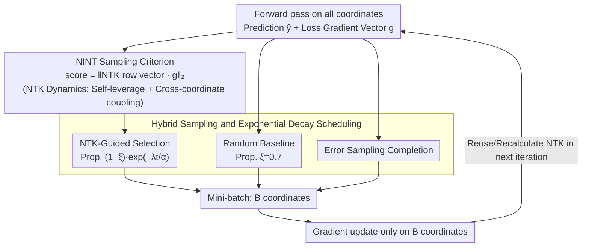

# NTK-Guided Implicit Neural Teaching

**Conference**: CVPR 2026  
**arXiv**: [2511.15487](https://arxiv.org/abs/2511.15487)  
**Code**: Available (Project page)  
**Area**: 3D Vision  
**Keywords**: Implicit Neural Representations, Neural Tangent Kernel, Training Acceleration, Coordinate Sampling, INR  

## TL;DR
Ours proposes NINT, which utilizes row vectors of the Neural Tangent Kernel (NTK) to measure the influence of each coordinate on global function updates. This allows for the dynamic selection of coordinates that exhibit both high fitting error and high global influence for training, reducing INR training time by nearly half without sacrificing reconstruction quality.

## Background & Motivation
Implicit Neural Representations (INR) use MLPs to map coordinates to signal values (e.g., pixel colors), achieving resolution-independent continuous signal modeling. However, high-resolution signals (such as a $1024 \times 1024$ image with 1 million pixel coordinates) result in extremely high training costs.

Existing acceleration schemes have limitations:
- **Partitioning methods** (multiple small MLPs managing different regions): Increase architectural complexity and inference overhead.
- **Hybrid explicit-implicit methods** (hash grids, tensors, etc.): Increase memory consumption.
- **Meta-learning methods** (pre-training initialization): Require large homogeneous datasets and lack flexibility.
- **Sampling methods** (selecting only a portion of coordinates for training at each step): Lightweight, but most rely solely on static error heuristics, ignoring the dynamic characteristics of parameter updates during MLP training.

**Key Insight**: Existing error-based sampling methods (e.g., INT, EGRA, EVOS) implicitly assume the NTK matrix is diagonal and isotropic (i.e., $K_{\theta^t} \approx cI$), which implies (1) no cross-coordinate influence and (2) identical self-leverage for all coordinates. In practice, however, MLPs exhibit strong off-diagonal coupling due to weight sharing, and diagonal values can vary by several orders of magnitude depending on the coordinate region (edge vs. smooth areas). Therefore, simply selecting high-error points may waste gradient steps on points that are "high error but low influence."

## Method

### Overall Architecture
The root cause of slow INR training is the need to perform gradient descent on millions of coordinates across the entire image at every step, even though many coordinates are already well-fitted and provide little information gain. NINT aims to select the $B$ "most worthy" coordinates to form a mini-batch in each iteration, concentrating computational power where it matters most. The key difference from existing sampling methods lies in the criterion for being "worthy": while others pick points based on fitting error, NINT uses the Neural Tangent Kernel (NTK) to measure how much the loss backpropagation of a coordinate drives the evolution of the entire function, then sorts points by the product of error and this "global influence."

During an iteration, the process is as follows: first, calculate predictions $\hat{\mathbf{y}}_i = f_{\theta_t}(\mathbf{x}_i)$ and the loss gradient vector $\mathbf{g}^t = [\nabla_f \mathcal{L}(f_{\theta^t}(\mathbf{x}_i), \mathbf{y}_i)]_{i=1}^N$ for all coordinates; then, for each coordinate $\mathbf{x}_i$, extract its corresponding row in the NTK matrix $K_{\theta^t}(\mathbf{x}_i, :)$; use this row to weight the global gradient to obtain a score for each coordinate, and select the $B$ coordinates with the highest scores $\mathcal{B}_t = \arg\max_{|\mathcal{B}|=B} \|[K_{\theta^t}(\mathbf{x}_i,:) \cdot \mathbf{g}^t]_{i \in \mathcal{B}}\|_2$ to update parameters.

### Key Designs

**1. NTK-Driven Training Dynamics: Translating "Which Sample to Choose" into a Calculable Physical Quantity**

To answer "which coordinate is most cost-effective to train," one must first know what training a coordinate actually changes. NINT views the function evolution of INR from a continuous-time perspective: by applying a first-order Taylor expansion to the parameter update and substituting it into the parameter evolution equation of gradient descent, the instantaneous rate of change for the entire function is expressed as the product of the NTK and the loss gradient:

$$\frac{\partial f_{\theta^t}(\mathbf{x})}{\partial t} \simeq -\frac{\eta}{N} [K_{\theta^t}(\mathbf{x}_i, \mathbf{x})]_{i=1}^{N \top} \cdot [\nabla_f \mathcal{L}(f_{\theta^t}(\mathbf{x}_i), \mathbf{y}_i)]_{i=1}^N$$

where the NTK is the inner product of the parameter gradients of two coordinates: $K_{\theta^t}(\mathbf{x}_i, \mathbf{x}) = \langle \frac{\partial f_{\theta^t}(\mathbf{x}_i)}{\partial \theta^t}, \frac{\partial f_{\theta^t}(\mathbf{x})}{\partial \theta^t} \rangle$. This formula transforms abstract "influence" into a computable quantity across two levels: diagonal elements $K_{\theta^t}(\mathbf{x}_i, \mathbf{x}_i) = \|\frac{\partial f_{\theta^t}(\mathbf{x}_i)}{\partial \theta^t}\|_2^2$ represent self-leverage (how much training a coordinate affects its own output), while off-diagonal elements $K_{\theta^t}(\mathbf{x}_i, \mathbf{x}_j)$ represent cross-coordinate coupling (how much training $\mathbf{x}_i$ changes the output at $\mathbf{x}_j$). These terms expose the blind spot of error-only methods—viewing error alone is equivalent to treating the NTK as $cI$, assuming identical self-leverage and no mutual influence. In real MLPs, diagonal values in edge/high-frequency regions are orders of magnitude larger than in smooth regions, and weight sharing creates strong off-diagonal coupling, meaning high-error points are not necessarily high-influence points.

**2. NINT Sampling Criterion: Re-weighting Error using NTK Row Vectors to Capture Self-leverage and Coupling**

Given these dynamics, the goal of coordinate selection is naturally to "maximize the overall function change brought by this step." NINT defines the score of each coordinate as the norm of the product between its NTK row vector and the global loss gradient vector:

$$\text{score}(\mathbf{x}_i) = \|K_{\theta^t}(\mathbf{x}_i, :) \cdot \mathbf{g}^t\|_2$$

This norm simultaneously encapsulates two factors: the fitting error information from the components of $\mathbf{g}^t$, and the global influence (self-leverage plus cross-coupling) from the NTK row vector. Comparing this to error-only methods reveals that the latter selects $\arg\max \|\nabla_f \mathcal{L}\|_2$, effectively setting $K = cI$ and flattening the influence dimension. NINT selects $\arg\max \|K_{\theta^t}(\mathbf{x}_i,:) \cdot \mathbf{g}^t\|_2$, explicitly using full NTK information to prioritize coordinates that are "poorly fitted yet highly influential."

**3. Hybrid Sampling and Exponential Decay Scheduling: Applying Computable NTK when Most Needed**

Computing the full $N \times N$ NTK at each step is impractical. Thus, NINT splits a batch into three streams: a proportion $\xi$ (default 0.7) for purely random sampling to ensure baseline coverage; a proportion $(1-\xi)\exp(-\lambda t/\alpha)$ for NTK-guided selection ($\lambda=1.0, \alpha=10$); and the remainder filled by traditional error sampling. The proportion of the NTK stream decays exponentially with training steps $t$ for two reasons: first, error distribution becomes more uniform in later stages, diminishing the marginal benefit of NTK guidance; second, NTK computation incurs non-trivial costs, making it less worthwhile later on. The parameter $\alpha$ also controls the NTK recalculation frequency; iterations without recalculation reuse the previous result to further amortize costs.

### Loss & Training
- **Loss Function**: Standard $\ell_2$ regression loss $\mathcal{L}(f_\theta(\mathbf{x}_i), \mathbf{y}_i) = \|f_\theta(\mathbf{x}_i) - \mathbf{y}_i\|_2^2$
- **Optimizer/Learning Rate**: Learning rate $\eta = 1 \times 10^{-4}$
- **Batch Size**: 20% of the total sample set (Stand. is 100%)
- **Network Structure**: Default 5-layer x 256 SIREN MLP

## Key Experimental Results

### Main Results: Reconstruction Quality under Fixed Iterations

| Method | 250 iter PSNR | 1000 iter PSNR | 5000 iter PSNR | 5000 iter SSIM | 5000 iter LPIPS |
|------|---------------|----------------|----------------|----------------|-----------------|
| Stand. (Full) | 27.90 | 31.67 | 39.76 | 0.962 | 0.022 |
| Uniform | 27.66 | 31.14 | 37.14 | 0.943 | 0.069 |
| EGRA | 27.67 | 31.24 | 37.39 | 0.945 | 0.068 |
| INT | 27.57 | 31.19 | 39.02 | 0.943 | 0.035 |
| EVOS | 28.02 | 31.72 | 37.56 | 0.940 | 0.054 |
| Expan. | 27.99 | 32.15 | 38.22 | 0.947 | 0.056 |
| **Ours (NINT)** | **28.96** | **32.64** | **39.09** | **0.958** | **0.029** |

### Main Results: Time Required to Reach Target PSNR

| Method | Time for PSNR=30 (s) | Time for PSNR=35 (s) | Gain vs. Stand. |
|------|-----------------|-----------------|-----------------|
| Stand. (Full) | 49.11 | 184.78 | - |
| INT | 33.01 | 111.80 | 32.8% / 39.5% |
| EVOS | 31.20 | 143.20 | 36.5% / 22.5% |
| Expan. | 29.16 | 123.60 | 40.6% / 33.1% |
| **Ours (NINT)** | **25.05** | **102.88** | **49.0% / 44.3%** |

### Ablation Study: Different Network Sizes

| Network Size | 500 iter PSNR | 1000 iter PSNR | 2500 iter PSNR | 3000 iter Time (s) |
|---------|-------------|--------------|--------------|---------------------|
| 3x128 Stand. | 23.17 | 24.17 | 26.14 | 92.16 |
| 3x128 + Ours | 23.20 | 24.51 | 26.52 | 72.14 (21.7%) |
| 5x256 Stand. | 25.61 | 28.69 | 33.69 | 35.42 |
| 5x256 + Ours | 26.85 | 31.27 | 35.10 | 22.16 (37.4%) |

### Ablation Study: Different Network Architectures

| Architecture | 60s PSNR | 120s PSNR | Time for PSNR=25 (s) | Gain |
|------|---------|---------|-------------------|--------|
| SIREN | 30.51 | 32.44 | 8.25 | - |
| SIREN + Ours | 32.40 | 35.47 | 5.81 | 29.6% |
| FFN | 26.90 | 31.44 | 54.19 | - |
| FFN + Ours | 27.39 | 31.48 | 48.75 | 10.0% |
| WIRE | 23.86 | 27.17 | 83.30 | - |
| WIRE + Ours | 26.62 | 29.13 | 47.23 | 43.3% |

### Key Findings
1. **Training Time Halved**: Compared to full training, NINT reduces the time to reach target PSNR by up to 49% and iterations by 27%.
2. **Greater Gains for Larger Networks**: Time savings increased from approximately 11% to 37.4% as the network scaled from 3x64 to 5x256.
3. **Architecture Neutrality**: Effective across seven architectures (MLP, FFN, FINER, GAUSS, PEMLP, SIREN, WIRE), with a maximum speedup of 43.3% (WIRE).
4. **Hyperparameter Robustness**: Default settings $(\xi=0.7, \alpha=10, \lambda=1.0)$ are near-optimal; performance drops minimally when deviating from defaults.
5. **Significant Early-stage Advantage**: NINT’s PSNR lead is most pronounced in the early training phases (250 iter / 20s).

## Highlights & Insights
1. **In-depth NTK Perspective Analysis**: The question of "why error-only sampling is insufficient" is precisely characterized using NTK theory—demonstrating its equivalence to a $cI$ approximation that ignores self-leverage heterogeneity and cross-coordinate coupling. This provides an elegant and compelling theoretical insight.
2. **Plug-and-Play**: NINT is a model-agnostic sampling strategy that does not modify the network architecture and can be directly applied to any INR training pipeline.
3. **Engineering Wisdom in Hybrid Sampling**: NTK computation is expensive; the design cleverly manages computational costs via a three-part mixture, exponential decay, and interval reuse, making the method practical.
4. **Visualization Enhancing Understanding**: The visualization of 9x9 NTK matrix blocks in Figure 2 intuitively demonstrates off-diagonal coupling and diagonal heterogeneity, significantly strengthening the motivation for the method.

## Limitations & Future Work
1. **NTK Computational Overhead**: The full NTK matrix is $N \times N$, which is unfeasible for millions of coordinates; although mitigated by decay and reuse, it remains an additional overhead.
2. **Focused Primarily on 2D Images**: Main experiments are concentrated on Kodak and DIV2K datasets; 1D/3D experiments are in the supplementary material, and validation on large-scale 3D scenes (e.g., NeRF) is insufficient.
3. **Lack of Comparison with Non-sampling Acceleration**: No end-to-end comparisons with hybrid explicit-implicit methods like hash grids (Instant-NGP) or TensoRF.
4. **Gap Between Theory and Practice**: NTK analysis assumes the infinite-width limit or slow-change regimes; in finite-width MLPs, the NTK changes, and the paper lacks a quantitative analysis of this approximation error.
5. **Memory Overhead Not Discussed**: Specific GPU memory requirements for NTK row vector storage and computation are not explicitly defined.

## Rating
- **Novelty**: 4/5 - Introducing NTK into INR sampling strategies is a fresh perspective, with theoretical analysis concisely revealing the fundamental flaws of error-only methods.
- **Experimental Thoroughness**: 4/5 - Experiments extensively cover multiple baselines, network sizes, architectures, and hyperparameter sensitivities, though primarily restricted to 2D images.
- **Writing Quality**: 5/5 - The logical progression from NTK theory to existing method flaws and then to the new method design is clear and fluid, complemented by well-designed charts.
- **Value**: 4/5 - A plug-and-play training acceleration method has high practical value, though its suitability for ultra-large-scale scenes remains to be verified due to NTK computation costs.

<!-- RELATED:START -->

## Related Papers

- [\[CVPR 2026\] Content-Aware Frequency Encoding for Implicit Neural Representations with Fourier-Chebyshev Features](content-aware_frequency_encoding_for_implicit_neural_representations_with_fourie.md)
- [\[CVPR 2026\] InfiniDepth: Arbitrary-Resolution and Fine-Grained Depth Estimation with Neural Implicit Fields](infinidepth_arbitrary-resolution_and_fine-grained_depth_estimation_with_neural_i.md)
- [\[ECCV 2024\] A Probability-guided Sampler for Neural Implicit Surface Rendering](../../ECCV2024/3d_vision/a_probabilityguided_sampler_for_neural_implicit_surface_rend.md)
- [\[CVPR 2025\] End-to-End Implicit Neural Representations for Classification](../../CVPR2025/3d_vision/end-to-end_implicit_neural_representations_for_classification.md)
- [\[CVPR 2026\] 3DrawAgent: Teaching LLM to Draw in 3D with Early Contrastive Experience](3drawagent_teaching_llm_to_draw_in_3d_with_early_contrastive_experience.md)

<!-- RELATED:END -->
