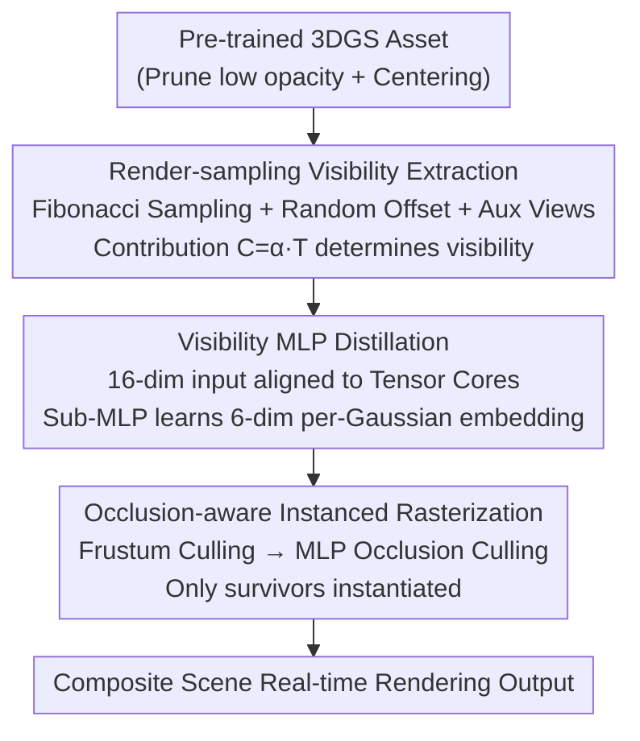

# NVGS: Neural Visibility for Occlusion Culling in 3D Gaussian Splatting

**Conference**: CVPR 2026  
**Paper**: [CVF Open Access](https://openaccess.thecvf.com/content/CVPR2026/html/Zoomers_NVGS_Neural_Visibility_for_Occlusion_Culling_in_3D_Gaussian_Splatting_CVPR_2026_paper.html)  
**Code**: https://brent-zoomers.github.io/nvgs/ (Project Page)  
**Area**: 3D Vision  
**Keywords**: 3D Gaussian Splatting, Occlusion Culling, Neural Visibility, Instanced Rasterization, Large-scale Rendering

## TL;DR
NVGS distills the viewpoint-dependent visibility of all Gaussians within a 3DGS asset into a shared small MLP. This MLP is queried prior to rasterization to discard occluded Gaussians. Coupled with an instantiation-based rasterizer that only processes surviving Gaussians, the system enables real-time rendering of complex scenes composed of hundreds of millions of Gaussians while reducing VRAM usage to approximately one-fourth of V3DG with higher image quality.

## Background & Motivation
**Background**: 3DGS has become a primary tool for high-quality, fast-to-train/render 3D reconstruction. As scenes grow larger and more complex (e.g., composite scenes in games or films made of independent assets), the community has adopted two acceleration techniques from graphics: frustum culling and Level of Detail (LoD). LoD methods (H3DG, LODGE, Octree-GS, FLoD, V3DG, etc.) save computation by using fewer Gaussians at a distance through partitioning or layering.

**Limitations of Prior Work**: Another highly effective acceleration method in graphics—occlusion culling—is difficult to apply directly to 3DGS. This is because Gaussians are **semi-transparent**. Traditional occlusion culling relies on opaque triangles where visibility is binary; however, the volume rendering of Gaussians makes the visibility of a specific Gaussian a continuous, viewpoint-dependent value that is hard to threshold simply.

**Key Challenge**: Composite scenes contain significant "rendering redundancy"—many Gaussians are blocked by those in front and contribute zero to the final pixel. Nevertheless, existing pipelines must instantiate, preprocess, and sort them all, wasting VRAM and bandwidth. Most pruning/compression works focus on **global redundancy** (permanently deleting unimportant Gaussians after training) without exploiting **per-frame, per-viewpoint** occlusion redundancy.

**Goal**: Store the viewpoint-dependent visibility of Gaussians at a low cost and utilize it during rendering to discard occluded Gaussians before rasterization, without retraining assets or compromising original quality.

**Key Insight**: The authors observe that standard volume rendering **implicitly encodes soft occlusion**: once the transmittance $T$ of a pixel saturates (approaches 0), subsequent Gaussians projected to that pixel can be discarded with minimal impact on color. This naturally marks back-facing Gaussians (similar to backface culling in meshes) and background Gaussians crowded behind foreground ones as "invisible," with the culling rate automatically increasing with distance.

**Core Idea**: Use a lightweight shared MLP to "bake" the viewpoint-dependent visibility function for all Gaussians in an asset. During rendering, query this MLP before rasterization for Gaussian-level occlusion culling, embedded deeply within an instantiation rasterizer designed for composite scenes.

## Method

### Overall Architecture
Given a pre-trained 3DGS asset, NVGS follows three steps: first, "render-sampling" the visibility of each Gaussian from numerous viewpoints; second, distilling this into a lightweight MLP (with a secondary MLP for learning per-Gaussian embeddings); and finally, using an instantiation rasterizer that performs frustum culling, queries the MLP for occlusion culling, and **instantiates only the surviving Gaussians**. The essence is moving "expensive preprocessing" only to Gaussians that will actually be seen.

### Key Designs

**1. Render-sampling Visibility Extraction: Volume Rendering Soft Occlusion as Supervision**

The challenge is that Gaussians are semi-transparent with no ground-truth "visible/invisible" labels, and 3DGS artifacts like popping or aliasing can corrupt labels. NVGS avoids analytical derivation and uses **direct render-sampling**. Assets are centered, Gaussians with opacity below $\frac{1}{255}$ are pruned, and camera sampling distances are calculated based on screen coverage (90% for near, 5% for far). Distance is calculated via $d = \frac{r}{\tan(\theta/2)\cdot p}$ (where $r$ is the half-diagonal of the bounding box, $p$ is target coverage, and $\theta$ is FoV). Cameras are generated using 2000 Fibonacci sphere samples across distances. To resist artifacts, a distance-scaled **random offset** is added (to avoid the object always being centered, resisting projection inconsistency), and **auxiliary views** are sampled along the intersection of the cone and sphere (to prevent misidentifying "popping" as invisibility). A Gaussian is visible if it contributes to the main or any auxiliary view, defined as $C_{G,p}=\alpha_p\cdot T$.

**2. Lightweight Visibility MLP: Baking Visibility into Tensor Core-friendly 16-D Queries**

Extracted visibility data is too large for direct use. It is distilled into a lightweight MLP implemented with tiny-cuda-nn, **trained once per asset** for reuse across all instances (independent of instance transform, resolution, or FoV). Inputs include normalized Gaussian mean, normalized direction, distance to camera, and camera forward vector, plus an **embedding vector**. The latter is a 6D representation learned by a sub-MLP based on Gaussian opacity, scale, and rotation. The authors intentionally **avoid frequency encoding**: while it captures detail, it expands inputs from 6D to 60D and introduces slow trigonometric functions. Using learned embeddings, the total input is exactly **16 dimensions**, aligning with the multiples of 16 required for optimal Tensor Core inference. Both MLPs feature 2 layers with 32 ReLU neurons. Training uses frequency-weighted BCE loss to counter class imbalance. The final checkpoint is only 18 kB (<0.1% of model storage).

**3. Occlusion-aware Instanced Rasterizer: Culling before Instantiation to Save VRAM**

Standard 3DGS instantiates all Gaussians before processing. NVGS stores only one copy per unique asset plus instance transforms; **an instance is only created if it passes both frustum and occlusion culling**. Each frame first performs frustum culling on Gaussian means, then queries the MLP based on the asset's minimum distance. Since the MLP is trained in local space, global inputs are converted: rotation for direction/forward vectors, translation/scaling for the mean, and a distance compensation for focal length and scale differences—$d_t = d_r\cdot\frac{f_t}{f_r}\cdot\frac{1}{s}$ (where $t/r$ are training/render, $f$ is focal length, $s$ is scale), normalized to $[-1, 1]$. These calculations occur on **uninstantiated** Gaussians. Only survivors undergo per-tile instantiation and standard 3DGS rasterization. This eliminates preprocessing/sorting for zero-contribution Gaussians and significantly reduces VRAM. FoV correction is crucial; otherwise, a smaller render FoV than the 60° training FoV would systematically underestimate distance and over-cull.

### Loss & Training
The visibility MLP uses **sample-wise frequency-weighted BCE loss** to counter visibility imbalance. The Adam optimizer starts at 2e-3, decaying to 2e-4, with a cosine warmup for the first 20% of iterations followed by exponential decay. Batch size is $2^{19}$ (sampled across views and Gaussians). Rendering matches the original 3DGS blending: skipping fragments with $\alpha<\frac{1}{255}$ and using 1e-4 as the transmittance early-stop threshold. Approximately 25% of construction time is spent on visibility extraction and 75% on MLP training.

## Key Experimental Results

> Metrics: PSNR / SSIM (quality), **FLIP** (perceptual error, lower is better), FPS, VRAM, Gaussian count. Experiments on a single RTX 3090 Ti (24GB). Assets: RTMV (8 LEGO trees), MVHumanNet (16 avatars), and a donut asset. Layouts provided by V3DG authors (SH coefficients set to zero).

### Main Results
Comparison on three large composite scenes (~60M Gaussians, 1080p) against V3DG and gsplat (metrics averaged over distances, VRAM at peak):

| Scene | Method | PSNR↑ | SSIM↑ | FLIP↓ | VRAM↓ |
|------|------|-------|-------|-------|-------|
| FOREST | gsplat† | 29.5 | 0.948 | 0.056 | 9.7GB |
| FOREST | V3DG | 42.3 | 0.993 | 0.012 | 17.7GB |
| FOREST | **Ours** | **52.7** | **0.999** | **0.002** | **4.0GB** |
| CROWD | V3DG | 43.2 | 0.991 | 0.013 | 20.4GB |
| CROWD | **Ours** | **48.6** | **0.999** | **0.002** | **4.5GB** |
| DONUTSEA | V3DG | 58.2 | 0.983 | 0.012 | 13.9GB |
| DONUTSEA | **Ours** | 58.3 | **0.999** | 0.006 | **3.1GB** |

(gsplat† includes radius clipping. Baseline gsplat and Ours w/o MLP reproduce GT rendering and thus exclude image quality metrics.) Compared to V3DG, NVGS reduces VRAM by ~**4×** with superior quality. The MLP introduces an average gain of **~10 FPS** over the pure instantiation rasterizer; speedup scales with SH degree as culled per-Gaussian calculations become more expensive.

Construction time comparison (average per asset):

| Method | Trees(8) | MVHumanNet(16) | Donut(1) |
|------|----------|----------------|----------|
| V3DG | 7m28s | 9m00s | 0m59s |
| **Ours** | **3m57s** | **4m11s** | 2m00s |

NVGS constructs faster for multi-asset scenes.

### Ablation Study
FPS measured at max distance to highlight viewpoint impact; FLIP averaged over distances; VRAM at peak:

| Configuration | FPS↑ | FLIP↓ | VRAM↓ | Description |
|------|------|-------|-------|------|
| LongLat Sampling | 61.04 | 0.0170 | 2.64GB | Longitude-Latitude sampling baseline |
| Fibonacci Sampling | 61.61 | 0.0168 | 2.63GB | Uniform sampling, minor gain |
| + Random Offset | 59.75 | 0.0142 | 2.72GB | Resists artifacts, FLIP↓ |
| + Aux Views | 53.23 | 0.0113 | 2.98GB | Resists popping, FLIP↓ |
| Full (+ FoV Correction) | 42.02 | 0.0031 | 3.88GB | **Major FLIP↓**, quality driver |
| + Radius Clipping | 50.59 | 0.0067 | 3.79GB | Distance speedup, minor quality loss |

### Key Findings
- **FoV Correction is the primary quality driver**: Including it drops FLIP from 0.0113 to 0.0031. Without it, the model systematically underestimates distances for narrow FoVs, leading to over-culling.
- **Random Offset and Aux Views are "Robustness Taxes"**: They decrease FPS and increase VRAM but ensure more visible Gaussians are correctly predicted—the authors prioritize quality over aggressive culling.
- **Occlusion Culling complements LoD**: NVGS leads at near/mid distances by culling blocked Gaussians, while V3DG catches up at far distances by reducing Gaussian counts. They can be combined (MLP for near, LoD bundles for far).
- **Asset topology affects culling rates**: Culling is less effective in scenes like DONUTSEA (75% on the surface) or FOREST (66% in the canopy) compared to more balanced distributions like CROWD.

## Highlights & Insights
- **Turning "Soft Occlusion" into Supervision**: Instead of inventing new visibility definitions, the method uses $C=\alpha\cdot T$ to sample the transmittance saturation of volume rendering itself. This makes it naturally compatible with any 3DGS asset without retraining.
- **Engineering Ingenuity of 16-D Inputs**: Replacing frequency encoding with learned embeddings to precisely hit 16 dimensions for Tensor Core utilization is a prime example of co-optimizing network design with hardware throughput. An 18 kB MLP adds virtually zero storage overhead.
- **The "Cull then Instantiate" Sequence**: Since Gaussian parameters dominate VRAM, delaying instantiation until after all culling steps directly addresses the 3DGS memory bottleneck rather than compressing data post-hoc.
- **Orthogonality with LoD**: By identifying that occlusion culling and LoD are not mutually exclusive, the work leaves room for further combined optimizations in large-scale rendering.

## Limitations & Future Work
- MLP performance varies with Gaussian count and visibility function complexity; complex objects might require higher overhead for robustness.
- Engineering optimizations like CUDA Streams are not yet implemented.
- Prediction reliability on extreme viewpoints or extreme scaling depends on the effectiveness of normalization and FoV correction. Peak FLIP increases when the near plane enters an object (DONUTSEA) due to numerical differences between the instantiation rasterizer and gsplat.

## Related Work & Insights
- **vs V3DG**: Both target composite scenes of independent assets. V3DG uses LoD (hierarchical clustering and downsampling), leading to high VRAM and storage. NVGS uses occlusion culling, reducing VRAM by 4× with higher quality; they are viewed as complementary.
- **vs OccluGaussian (Liu et al.)**: That work performs **scene-level** occlusion-aware partitioning for LoD; NVGS is finer-grained, performing **Gaussian-level** culling.
- **vs Global Pruning/Compression**: These methods permanently delete globally unimportant Gaussians. NVGS preserves original assets and discards zero-contribution Gaussians **at render-time** per-viewpoint, supporting more expensive per-Gaussian shading.

## Rating
- Novelty: ⭐⭐⭐⭐⭐ First to bring graphics-style occlusion culling to 3DGS as "Gaussian-level neural visibility" with a clever supervision signal.
- Experimental Thoroughness: ⭐⭐⭐⭐ Strong comparison across three scenes and detailed ablation, though scene variety is limited.
- Writing Quality: ⭐⭐⭐⭐ Motivation and pipeline are clear; engineering details are well-documented.
- Value: ⭐⭐⭐⭐⭐ Reducing VRAM for massive composite scenes to 1/4 while improving quality is highly valuable for real-time large-scale rendering.

<!-- RELATED:START -->

## Related Papers

- [\[CVPR 2026\] Proxy-GS: Unified Occlusion Priors for Training and Inference in Structured 3D Gaussian Splatting](proxy-gs_unified_occlusion_priors_for_training_and_inference_in_structured_3d_ga.md)
- [\[CVPR 2026\] Uncertainty-driven 3D Gaussian Splatting Active Mapping via Anisotropic Visibility Field](uncertainty-driven_3d_gaussian_splatting_active_mapping_via_anisotropic_visibili.md)
- [\[CVPR 2026\] VAD-GS: Visibility-Aware Densification for 3D Gaussian Splatting in Dynamic Urban Scenes](vad-gs_visibility-aware_densification_for_3d_gaussian_splatting_in_dynamic_urban.md)
- [\[CVPR 2026\] Neural Gabor Splatting: Enhanced Gaussian Splatting with Neural Gabor for High-frequency Surface Reconstruction](neural_gabor_splatting.md)
- [\[AAAI 2026\] Surface-Based Visibility-Guided Uncertainty for Continuous Active 3D Neural Reconstruction](../../AAAI2026/3d_vision/surface-based_visibility-guided_uncertainty_for_continuous_active_3d_neural_reco.md)

<!-- RELATED:END -->
