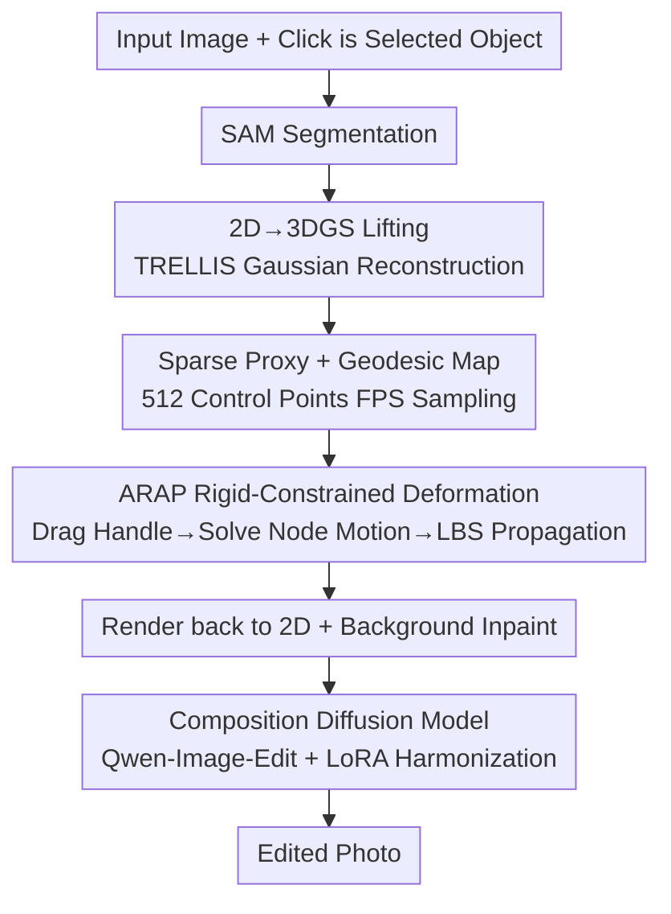

# ObjectMorpher: 3D-Aware Image Editing via Deformable 3DGS

**Conference**: CVPR 2026  
**Paper**: [CVF Open Access](https://openaccess.thecvf.com/content/CVPR2026/html/Xie_ObjectMorpher_3D-Aware_Image_Editing_via_Deformable_3DGS_CVPR_2026_paper.html)  
**Code**: None  
**Area**: 3D Vision  
**Keywords**: 3D-aware image editing, 3D Gaussian Splatting, ARAP non-rigid deformation, drag-and-drop editing, generative composition

## TL;DR
ObjectMorpher lifts target objects from an image into editable 3D Gaussian Splatting (3DGS) representations using an image-to-3D generator. This allows users to perform physically plausible, non-rigid deformations with tight as-rigid-as-possible (ARAP) constraints by dragging sparse control points. A LoRA-finetuned composition diffusion model then seamlessly blends the modified object back into the original image, achieving high controllability, realism, and near-real-time performance ($<10$s interaction) across KID, LPIPS, SIFID, and user preference metrics.

## Background & Motivation
**Background**: Image editing is currently dominated by large foundation editing models such as Qwen-Image, Nano-Banana, and PixArt-$\alpha$. Leveraging strong 2D priors, they generate high-fidelity, stylistically consistent results based on prompts or instructions. Another area is drag-based editing (e.g., DragGAN, DragDiffusion), which permits interactive deformation of image content by specifying point correspondences.

**Limitations of Prior Work**: The vast majority of these methods operate purely in the 2D pixel space. When users intend to perform inherently 3D operations—such as "rotating a chair," "adjusting a human pose," or "bending a flower stem"—2D methods fail due to ambiguity. They must guess the missing 3D structure, often resulting in stretched textures, perspective errors, and inconsistent lighting/shadows. Existing 3D-aware extensions also present severe drawbacks: OBJECT-3DIT and Neural Assets only support rigid 6-DoF control under pose conditioning; Image Sculpting relies on intensive per-image SDS/textual inversion, making it slow (up to 30 minutes per image); BlenderFusion relies on monocularly reconstructed meshes, which are typically incomplete and fail under large pose changes or substantial deformations.

**Key Challenge**: Editing must simultaneously satisfy five interconnected goals: accurate 3D control, high-fidelity rendering, physical plausibility, real-time interaction, and natural composition. 2D methods lack 3D representations, thus failing on the first two. Existing 3D methods are either computationally expensive, highly fragile to non-rigid deformations, or produce visible seams/lighting artifacts when composited back. No single method excels across geometric control, physical plausibility, and visual harmony.

**Goal**: Translate editing operations that are ill-posed in pure 2D into well-defined geometric operations in 3D, keeping the entire pipeline fast enough for real-time interaction.

**Key Insight**: Rather than guessing 3D information in 2D space, the target object can be directly lifted to an **explicit, editable, differentiable, and fast-rendering** 3D proxy. 3DGS perfectly meets these requirements (offering higher fidelity than meshes, faster speeds than NeRF, and locally editable parameters). Performing physically constrained deformation on this proxy naturally resolves ambiguities involving pose, rotation, and depth.

**Core Idea**: A three-stage process—lift (lifting to 3DGS) $\rightarrow$ deform (non-rigid dragging under ARAP constraints) $\rightarrow$ composite (seamlessly blending back with a diffusion model). This uses an explicit 3D intermediary to convert ambiguous 2D drag operations into geometrically deterministic operations.

## Method

### Overall Architecture
Taking an image and the user's editing intention for a specific object as input, ObjectMorpher outputs a realistic, edited image. The pipeline executes sequentially in three stages: **lifting the 2D object to 3DGS** (segmenting the object with SAM and reconstructing it as a Gaussian representation using TRELLIS), **performing physically plausible, interactive deformation on the 3DGS** (sampling sparse control points to construct a deformable graph, allowing users to drag handle points, computing rigid node motions via an ARAP solver, and propagating the motion to millions of dense Gaussians using Linear Blend Skinning), and **rendering the modified object back to 2D and blending it seamlessly** (using inpainting for background hole-filling and a LoRA-finetuned composition diffusion model to harmonize lighting, color, and boundaries). These three stages correspond to Sec 3.1, 3.2, and 3.3 in the paper, which also align with the three key designs.

### Key Designs

**1. Lifting 2D objects to editable 3DGS instead of meshes: Eliminating editing ambiguity using an explicit 3D proxy**

This step directly addresses the issue where "pure 2D methods cannot resolve geometric transformation ambiguities." First, the user clicks to select the target, and SAM extracts the mask. The object is then passed to TRELLIS, an off-the-shelf image-to-3D generation model, for reconstruction. The key choice here is that while TRELLIS provides both mesh and 3DGS decoders, the authors **purposely select 3DGS instead of a mesh**. Mesh decoders are post-trained on frozen encoders, prioritizing geometric normal consistency and offering limited color resolution. In contrast, the 3DGS decoder **jointly optimizes appearance and geometry** via volume rendering loss, leading to more realistic rendering, smoother gradients, and better compatibility with subsequent steps (ablation in Fig 7, columns b and c confirms 3DGS yields superior rendering quality). 3DGS represents each Gaussian as $G_i:(\mu_i, o_i, s_i, q_i, c_i)$—position $\mu_i\in\mathbb{R}^3$, opacity $o_i$, three-axis scaling $s_i$, SO(3) rotation quaternion $q_i$, and color $c_i$. Rendering is performed by projecting the 3D Gaussians onto the image plane via EWA splatting and conducting $\alpha$-blending sorted by depth. With this explicit differentiable representation, complex 2D editing operations like rotation, pose changes, and depth shifting are converted into deterministic parameter adjustments of the Gaussians.

**2. Sparse Proxy + Geodesic Adjacency Graph + ARAP Rigid Constraints: Real-time and physically plausible non-rigid dragging**

This is the core technical contribution of the paper, tackling "physical consistency" and "real-time interaction." High-fidelity 3DGS models easily contain millions of Gaussians, rendering direct ARAP optimization on all Gaussians infeasible for real-time interaction. To tackle this, the authors introduce a **sparse editing proxy**. Farthest Point Sampling (FPS) is applied to the Gaussian point cloud to obtain 512 control points. This forms a lightweight deformable graph capable of capturing global geometry. The user only interacts with this proxy, and the resulting motion is propagated back to the dense Gaussians.

A key detail in constructing the deformable graph is **connecting edges via geodesic distance rather than Euclidean distance**. To ensure smooth local deformation, each node must have a sufficient number of neighbors. The connection radius is proportional to the object scale (connecting points within $0.3 D_{scene}$, where $D_{scene}$ is the maximum pairwise distance between control points, representing the scene diameter). However, directly establishing connections within this Euclidean radius ignores surface manifolds, creating erroneous short-circuited connections between disjoint body parts (as shown in Fig 3). The authors solve this with a two-stage approach: first, they build an auxiliary local graph using a tighter radius $2\bar{d}_{NN}$ (where $\bar{d}_{NN}$ is the average nearest neighbor distance), compute shortest geodesic paths using Floyd's algorithm on this local graph, and then only connect node pairs with geodesic distances less than $0.3 D_{scene}$. This maintains local continuity while avoiding cross-part short-circuiting.

The deformation itself is governed by an As-Rigid-As-Possible (ARAP) energy function. The user drags $H$ handles to target positions $\tilde{p}_{h_i}$, which acts as a hard constraint $p'_{h_i}=\tilde{p}_{h_i}$. The remaining points are updated by minimizing the energy function, which penalizes non-rigid distortions and is invariant under global translation and rotation:

$$E(p'_i, R_i)=\sum_i\sum_{j\in N_i} w_{ij}\,|(p'_i-p'_j)-R_i(p_i-p_j)|^2$$

Here, $R_i$ is the local rotation at $p_i$, and $w_{ij}$ is the distance attenuation weight. This optimization is solved by alternating between two steps: first, with $R_i$ fixed, the derivative with respect to $p'_i$ yields a linear system $Lp'=b$, where $L$ is the Laplacian matrix of the geodesic graph. Factoring out handle constraints via matrix inversion or pseudo-inversion gives unconstrained node positions. Second, with positions fixed, the equation $S_i=\sum_{j\in N_i} w_{ij}(p_j-p_i)^T(p'_j-p'_i)$ is decomposed using SVD ($S_i=U_i\Sigma_i V_i^T$) to update the rotations as $R_i=V_i U_i^T$. Experimentally, three iterations are sufficient to reach visual stability. Finally, Linear Blend Skinning (LBS) propagates the deformation from the sparse graph to each dense Gaussian. Each Gaussian selects $\tilde{K}=4$ nearest control points and updates its position as $\mu'_i=\sum_{j}\tilde{w}_{i,j}(R_j(\mu_i-p_j)+p'_j)$, while the rotation quaternions and scaling factors are updated synchronously. These 4 neighbors are selected using a hybrid strategy ("first Euclidean to find the closest, then geodesic to find the rest") to preserve topological continuity. This workflow reduces the interaction latency of the dragging phase to approximately 10ms, enabling true real-time performance.

**3. Harmonizing the modified object back into the original image: Eliminating boundaries and illumination inconsistencies**

Once deformed, the object must be rendered back to 2D and merged into the original image. Direct pasting produces severe boundary seams and lighting inconsistencies (addressing the "composition coherence" pain point). The pipeline proceeds as follows: First, PixelHacker is used to inpaint occluded background areas, producing a clean background canvas. The rendered object is composited onto this background, generating a coarse edited image that is then refined using a generative composition diffusion model. This model is based on a pre-trained Qwen-Image-Edit (MMDiT backbone) and **is conditioned on two images simultaneously**—the original image (providing robust identity and lighting priors) and the coarse edited image (defining the edited 3D spatial layout). To achieve efficient harmonization without breaking the foundation model’s strong generation prior, the authors fine-tune a task-specific LoRA only within the attention layers. The training data comprises paired images showcasing the same object in different poses/deformations (sourced from Subjects200K and KlingAI-generated videos). These are processed by reconstructing 3DGS models via TRELLIS, rendering multi-view images, and predicting poses with $\pi^3$ to construct coarse-fine training pairs. The model is trained to translate coarse composites into photorealistic ground truths, ensuring seamless integration of the object and consistent illumination with the scene.

### Loss & Training
Most modules in ObjectMorpher are training-free (e.g., SAM, TRELLIS, ARAP solver, and PixelHacker are used off-the-shelf). Only the generative composition diffusion module is trained. Specifically, a rank=16 LoRA is fine-tuned on the Qwen-Image-Edit base model using AdamW at $1024\times1024$ resolution in bf16 precision. Using the LoRA+ framework, the base learning rate is set to 0.0001 with a multiplier of 3. Code training is guided by prompt instructions ensuring "contour preservation + illumination harmonization based on the reference image."

## Key Experimental Results

### Main Results
The benchmark consists of 50 challenging objects collected by the authors, covering animals (butterflies, dogs, eagles), humanoids (knights, astronauts), inanimate objects (chairs), and cartoon characters (cartoon dogs, WALL-E). The baseline comparison includes 2D dragging (DragDiffusion, DragAnything), 2D mask editing (Anydoor), and 3D-aware editing (ImageSculpting) models. Quantitative performance is evaluated using perception-based metrics with reference to the original image: KID, LPIPS, SIFID, alongside Real-time Interaction capability (RI) and Model Inference Time (MT).

| Method | LPIPS ↓ | SIFID ↓ | KID ↓ | RI | MT ↓ |
|------|---------|---------|-------|-------------|----------------|
| DragGAN | 0.550 | 16.091 | -0.056 | ✓ | < 10s |
| ImageSculpting | 0.178 | 14.372 | -0.055 | ✓ | ~30m |
| DragDiffusion* | 0.117 | 6.573 | -0.075 | ✗ | ~2m |
| DragAnything | 0.655 | 22.476 | -0.047 | ✗ | ~70s |
| Anydoor | 0.173 | 9.512 | -0.049 | ✗ | ~10s |
| InstantDrag | 0.218 | 13.744 | -0.042 | ✗ | ~10s |
| DiffEditor | 0.142 | 12.589 | -0.051 | ✗ | ~10s |
| **ObjectMorpher** | 0.127 | 10.896 | -0.059 | ✓ | ~20s |

The authors highlight that **automatic metrics (LPIPS/SIFID) can be highly misleading in controllable editing**—they tend to "abnormally" reward methods that fail to execute user-requested edits. DragDiffusion achieves the lowest LPIPS (0.117) primarily because it barely modifies the original image (indicated by * in the table). Consequently, the paper relies heavily on **human evaluation as the primary metric**: 20 participants rated 8 editing tasks across three dimensions on a 1-to-5 scale.

| Method | Guidance Following ↑ | Style Consistency ↑ | Identity Preservation ↑ |
|------|----------------------|---------------------|--------------------------|
| **Ours** | **4.71** | **4.55** | **4.60** |
| Image Sculpting | 3.77 | 3.45 | 3.60 |
| Anydoor | 1.83 | 2.54 | 2.32 |
| DragDiffusion | 1.68 | 3.24 | 3.16 |
| DragAnything | 1.34 | 2.54 | 2.67 |
| DiffEditor | 1.55 | 2.63 | 2.56 |
| InstantDrag | 1.63 | 2.51 | 2.24 |

ObjectMorpher comprehensively outperforms baselines in all subjective categories: Guidance Following scores 4.71 (vs 3.77 for the runner-up), whereas baselines with strong automatic metrics (e.g., DragDiffusion at 1.68, Anydoor at 1.83) score poorly under "actual edit execution." In terms of runtime, ObjectMorpher's total time of ~20s is mostly occupied by object lifting (~10s) and generative composition (~10s), while the core drag interaction takes just 10ms—drastically faster than ImageSculpting (~30 mins).

### Ablation Study

| Configuration | Comparison | Conclusion |
|------|------|------|
| 3DGS vs Mesh Representation | Fig 7, col b/c | Rendering quality of 3DGS is noticeably higher than mesh due to joint appearance-geometry optimization. |
| w/o Generative Composition (GC) | Fig 7, col b/c | Pasting directly results in visible seam lines and foreground-background illumination disparity. |
| w/ Generative Composition (GC) | Fig 7, col e | Objects are seamlessly integrated with the environment while retaining structural integrity. |
| Laplacian-only Deformation | Fig 8 | Optimizing position with fixed unit rotations causes severe local geometric distortion under large rotations. |
| ARAP Deformation | Fig 8 | Rotation-invariant constraints preserve local stiffness and geometric details, yielding natural-looking deformations. |

### Key Findings
- **3DGS outperforming meshes is the foundation of the approach**: Meshes lose high-frequency detail and suppress colors during conversion, while the differentiability and high-fidelity rendering of 3DGS enable real-time dragging and large non-rigid deformations.
- **Generative composition is the differentiator for usability**: Without it, even perfect 3D edits look obviously fake once pasted back due to seams and disjointed lighting; it elevates "geometric correctness" to "visual authenticity."
- **ARAP's advantage over the standard Laplacian formulation is most pronounced during large rotations**: Due to a lack of rotation invariance, pure Laplacian smoothing tears apart local geometries under steep angles. ARAP preserves local rigidity by dynamically estimating region-level rotations.
- **Automatic evaluation metrics systematically misrepresent controllable editing**: A key meta-finding emphasizing that LPIPS/SIFID over-favor "minimal edits," necessitating human preference metrics as the true benchmark in this domain.

## Highlights & Insights
- **Using 3DGS as an "editable intermediary" rather than the final output**: Instead of treating the 3D model as the ultimate goal, this work leverages it as a temporary, differentiable workbench. Objects are lifted to 3D solely to resolve geometric ambiguities and are eventually output back to 2D. This "solving 2D problems via 3D representations" paradigm is highly elegant.
- **Constructing geodesic graphs to avoid cross-part short-circuiting is a practical solution**: The two-stage farthest point sampling and geodesic-distance graph construction elegantly prevents physical parts (such as an arm and a torso) from being incorrectly bound, presenting a valuable technique for any point-graph-based deformation model.
- **Sparse proxy + LBS propagation is key to real-time speed**: Solving ARAP on 512 points and propagating via skinning to millions of Gaussians reduces the core interaction loop to 10ms—a framework highly transferable to general real-time deformation of dense 3D points.
- **Constructive proof of automatic metrics being misleading**: The authors face the fact that their LPIPS score is not the absolute lowest head-on, turning it into an insightful critique of modern evaluation pipelines. This provides significant methodological value for controllable image generation research.

## Limitations & Future Work
- **Dependency on the reconstruction quality of off-the-shelf image-to-3D generators**: The entire pipeline relies on TRELLIS to produce high-quality 3DGS. If the reconstructed 3D representation fails on objects with challenging properties (e.g., transparency, mirror-like reflection, ultra-thin profiles), editing and final composition degrade accordingly.
- **Lifting and diffusion-composition dominate runtime (~10s each)**: Although the dragging phase itself runs at 10ms, the total setup and refinement time stands around ~20s, which is not yet end-to-end fully real-time. This remains a bottleneck for multi-object editing or video applications.
- **Benchmark scale is relatively small (50 objects, 8 human-evaluated tasks, 20 evaluators)**: There is ample room to expand testing matrices to better evaluate cross-category robustness and gain tighter statistical significance.
- **Absence of scene-level editing, object interactions, and shadow projection**: The model focuses isolatedly on a single object's non-rigid deformation; it does not model secondary consequences on the surroundings, such as casting new shadows or occluding background entities.
- **Future directions**: Accelerating lifting and composition via feed-forward architectures for true real-time execution; incorporating explicit physics and lighting models to move past pure diffusion-based "guesses"; scaling up to multi-object interactive editing.

## Related Work & Insights
- **vs DragDiffusion / DragAnything (2D Dragging)**: These methods define drag-and-drop points in pixel space to warp 2D content. ObjectMorpher preserves this user-friendly drag workflow but elevates the target into explicit 3D space. While 3D-level adjustments (such as rotations and depth shifting) are ill-posed and ruin structure in 2D, this approach turns them into well-defined geometric maneuvers at the cost of a temporary 3D reconstruction step.
- **vs ImageSculpting (3D-Aware Editing)**: ImageSculpting also uses 3D proxies for interactive tasks but relies heavily on slow, per-image SDS and DreamBooth tuning (~30 min per image). ObjectMorpher uses off-the-shelf 3DGS combined with a fast ARAP solver to downscale editing interactions to 10ms (totalling ~20s), easily leading human evaluation scores.
- **vs BlenderFusion / NeRF-Editing / NeuMesh (Mesh/Proxy Deformation)**: These models construct explicit meshes or NeRF-to-mesh proxies, losing high-frequency details and largely restricting users to rigid or small deformations. ObjectMorpher uses 3DGS to capture complex appearance details and leverages ARAP to support heavy non-rigid manipulations, whilst explicitly solving the background fusion and composition problem.
- **vs DragGaussian / SC-GS (Gaussian Deformation)**: While they similarly implement dragging or sparse deformation directly on top of Gaussian representations, they typically optimize isolated objects. ObjectMorpher stands out by integrating a generative composition model specifically to orchestrate seamless object-to-scene interactions, offering a complete image editing pipeline rather than local object adjustments.

## Rating
- Novelty: ⭐⭐⭐⭐ The "lift-deform-composite" pipeline combines existing paradigms, but the integration (3DGS proxy, geodesic ARAP graph, and generative composition) is highly solid and engineered with practical complete-loop utility.
- Experimental Thoroughness: ⭐⭐⭐ While the baseline comparisons are thorough and ablation studies are clean, the benchmark (50 test objects) and human evaluations (8 tasks with 20 evaluators) are relatively small-scale.
- Writing Quality: ⭐⭐⭐⭐ Highly logical structure, with particularly sharp and insightful arguments regarding "automatic metrics penalizing active editing."
- Value: ⭐⭐⭐⭐ Pushing 3D-aware non-rigid image editing close to real-time with supreme human preference scores provides substantial reference value for next-generation interactive editing suites.

<!-- RELATED:START -->

## Related Papers

- [\[CVPR 2026\] VDFE: Difference-Aware 3D Scene Editing with Non-Intrusive Video Diffusion Priors for Multi-View Consistency and Efficiency](vdfe_difference-aware_3d_scene_editing_with_non-intrusive_video_diffusion_priors.md)
- [\[CVPR 2026\] 3D-LATTE: Latent Space 3D Editing from Textual Instructions](3d-latte_latent_space_3d_editing_from_textual_instructions.md)
- [\[CVPR 2026\] EDGS: Eliminating Densification for Efficient Convergence of 3DGS](edgs_eliminating_densification_for_efficient_convergence_of_3dgs.md)
- [\[CVPR 2026\] PercHead: Perceptual Head Model for Single-Image 3D Head Reconstruction & Editing](perchead_perceptual_head_model_for_single-image_3d_head_reconstruction_editing.md)
- [\[CVPR 2026\] Edit2Perceive: Image Editing Diffusion Models Are Strong Dense Perceivers](edit2perceive_image_editing_diffusion_models_are_strong_dense_perceivers.md)

<!-- RELATED:END -->
