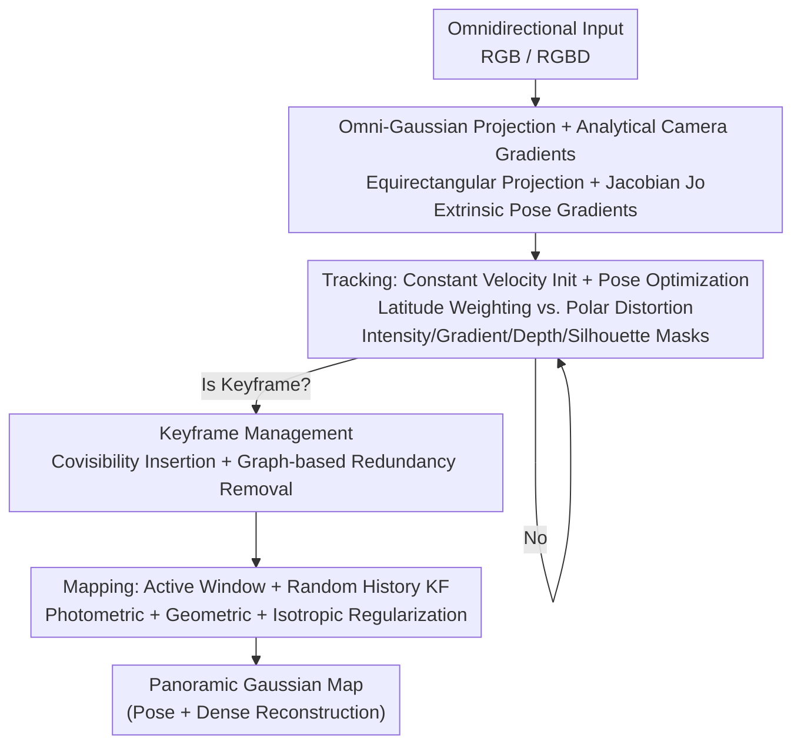

# ODGS-SLAM: Omnidirectional Gaussian Splatting SLAM

**Conference**: CVPR 2026  
**Paper**: [CVF Open Access](https://openaccess.thecvf.com/content/CVPR2026/html/Spiss_ODGS-SLAM_Omnidirectional_Gaussian_Splatting_SLAM_CVPR_2026_paper.html)  
**Code**: TBD (Authors state source code and datasets will be released; contact authors for links)  
**Area**: 3D Vision  
**Keywords**: SLAM, Omnidirectional Camera, 3D Gaussian Splatting, Equirectangular Projection, Keyframe Management

## TL;DR
ODGS-SLAM is the first system to utilize 3D Gaussian Splatting (3DGS) as a unified representation for omnidirectional (360° panoramic) camera SLAM. It complements the 3DGS-SLAM backpropagation pipeline with analytical gradients for camera poses under equirectangular projection, counteracts equator-pole distortion using latitude weighting, and suppresses memory usage through a graph-analysis-based keyframe removal strategy. Consequently, it achieves simultaneous camera tracking and dense mapping on panoramic inputs, with tracking accuracy (ATE RMSE) statistically significantly superior to existing omnidirectional and perspective 3DGS-SLAM methods.

## Background & Motivation
**Background**: SLAM requires estimating sensor poses while reconstructing the 3D environment. Visual SLAM (V-SLAM) is favored for its portability, low cost, and passive sensing. Recently, neural implicit representations (NeRF) and 3DGS have enabled dense mapping. 3DGS-SLAM (e.g., MonoGS, Gaussian-SLAM) has improved mapping quality, tracking accuracy, and runtime, and the differentiable rendering of 3DGS naturally supports using the same map representation for both mapping and tracking.

**Limitations of Prior Work**: Existing 3DGS-SLAM methods target **perspective cameras** with a limited Field of View (FoV), resulting in blind spots and reduced tracking robustness. While omnidirectional sensing provides full peripheral coverage for improved obstacle avoidance and scene understanding, existing omnidirectional SLAM systems (e.g., OmniSLAM) mostly rely on traditional voxel fusion for dense mapping. No system truly integrates omnidirectional vision with 3DGS.

**Key Challenge**: Transitioning 3DGS to omnidirectional input requires more than just rendering a panorama. The 3DGS projection $\pi$, Jacobian $J$, and **backpropagated gradients for camera poses** are derived for perspective pinhole cameras. Panoramic imaging uses spherical coordinates and equirectangular projection (ERP), which involve entirely different geometric relationships. Directly applying perspective models leads to incorrect gradients and tracking failure. Furthermore, ERP images suffer from severe stretching at the poles, and panoramic sequences involve high frame counts and large map sizes, leading to memory constraints.

**Goal**: (1) Enable correct differentiability for 3DGS mapping and pose estimation under the ERP model; (2) Neutralize polar distortion in ERP; (3) Control memory usage to handle larger inputs.

**Key Insight**: Building upon the MonoGS/GS-SLAM framework, the authors integrate the "two-step projection" omnidirectional Gaussian rendering from ODGS (projecting to a tangent plane then wrapping to a sphere for precision and efficiency) and supply the missing component: optimization gradients for camera extrinsics. They also leverage a unique property of omnidirectional imaging: **panoramas captured at the same position with different orientations contain nearly identical content (rotation invariance)**, which is used to identify and remove redundant keyframes.

**Core Idea**: Derive analytical gradients for camera poses under ERP, integrating omnidirectional geometry into the differentiable 3DGS-SLAM pipeline. Latitude weighting and rotation-invariant graph-based keyframe pruning are utilized to address distortion and memory overhead simultaneously.

## Method

### Overall Architecture
The system uses 3DGS as a unified map representation with a differentiable panoramic renderer. For each panoramic frame (RGB or RGBD), a three-step cycle is executed: **Tracking** (initialization via constant velocity assumption, followed by extrinsic optimization using analytical pose gradients) → **Keyframe Management** (insertion based on covisibility and removal of rotationally redundant frames via graph analysis) → **Mapping** (Gaussian map optimization over an active window and random historical keyframes). All rendering follows a modified ERP model with latitude weighting and various masks applied to the loss.

### Key Designs

**1. Omni-Gaussian Projection & Analytical Extrinsic Gradients: Integrating ERP into Differentiable 3DGS**

Prior projection and gradients in 3DGS were restricted to pinhole models. ODGS-SLAM represents each ray in spherical coordinates $S^2$ with azimuth $\phi\in[-\pi,\pi]$ and elevation $\theta\in[-\pi/2,\pi/2]$. Normalized means $\hat\mu=\mu/\|\mu\|$ are projected to the sphere to obtain angular coordinates $\phi_\mu=\sin^{-1}(\hat\mu_y),\ \theta_\mu=\tan^{-1}(\hat\mu_x/\hat\mu_z)$, then mapped to pixel space $\mu_o=\big(\frac{W}{2\pi}\phi_\mu+\frac{W}{2},\ -\frac{H}{\pi}\theta_\mu+\frac{H}{2}\big)^T$. Covariance follows the two-step projection: first projecting to a tangent plane at $\mu$ using a unit-focal perspective camera (rotation $T_\mu$ determined by $\phi_\mu,\theta_\mu$, Jacobian $J_p=\mathrm{diag}(1/\|\mu\|,1/\|\mu\|)$); then compensating for horizontal ERP stretching via $1/\cos\theta$ within a correction matrix $Q_o$ and scaling $S_o$. The combined Jacobian is $J_o=S_o Q_o J_p T_\mu$. The key extension is the **derivation of analytical gradients for camera pose $T_c$**. Using the chain rule, gradients of photometric/geometric errors w.r.t $T_c$ are decomposed into Gaussian means $\mu'_o$ and covariances $\Sigma'_{o,2D}$. For efficiency, viewpoint-dependent color and covariance terms are neglected, retaining only the dominant component $\partial\mu'_o/\partial T_c$ split into rotation $R_c$ and translation $t_c$ gradients.

**2. Latitude Weighting to Counteract ERP Distortion**

ERP images are heavily stretched in high-latitude (polar) regions. Equal pixel errors at the poles correspond to much smaller solid angles, potentially biasing optimization with polar noise. ODGS-SLAM applies a latitude weight $w_{lat}(y)=\cos\big((y/H-1/2)\pi\big)$ to both photometric $E_{pho}$ and geometric $E_{geo}$ errors—reducing weight near the poles and increasing it near the equator. Combined with other masks, the pixel-wise weight $f(x,y)$ includes $s_p(x,y)$ (silhouette coverage), an intensity mask $M_{int}$ (filtering dark pixels), a gradient mask $M_{grad}$ (retaining textured areas via Scharr operator), and a depth mask $M_{depth}$. Ablations show that removing latitude weighting significantly degrades tracking accuracy.

**3. Graph-based Keyframe Removal via Panoramic Rotation Invariance**

To prevent memory exhaustion from large panoramic sequences, ODGS-SLAM exploits the property that **panoramas at the same location with different orientations capture nearly identical content**. Keyframes spatially close ($\le\tau_{dist}$) are evaluated for **rotation-aligned similarity**. For a pair $\tilde I_i, \tilde I_j$, pixels in $\tilde I_i$ are reprojected using the relative rotation $R_i R_j^{-1}$ to align with $\tilde I_j$. Pairs with L1 scores $<\tau_{sim}$ are marked as redundant. These form an undirected graph where nodes are keyframes and edges denote redundancy. A greedy algorithm sorts nodes by score $R_k=0.5A_k+C_k$ ($A_k$: temporal age, $C_k$: connectivity), removing redundant neighbors of unvisited nodes. This minimizes redundancy while maintaining connectivity.

### Loss & Training
Tracking loss: For RGB, $\mathcal L_{track}=E_{pho}$; for RGBD, $\mathcal L_{track}=\lambda_{pho}E_{pho}+(1-\lambda_{pho})E_{geo}$ with $\lambda_{pho}=0.95$. Convergence occurs within 50 iterations or when relative pose change $<10^{-5}$, with per-frame exposure parameters $a_k, b_k$ optimized simultaneously ($I_{exp}=e^{a_k}I+b_k$). Mapping loss is optimized over window $W=W_k\cup W_r$: $\mathcal L_{map}=\frac{1}{N_f}\sum_k E_{pho}^k+\lambda_{iso}E_{iso}$, where $E_{iso}=\frac{1}{3N}\sum_i\sum_j\|s_{i,j}-\bar s_i\|_1$ prevents excessive Gaussian elongation ($\lambda_{iso}=10$). Initialization uses $\lfloor WH/k_{init}\rfloor$ pixels ($k_{init}=32$); densification removes Gaussians with $\alpha<0.7$ every 150 iterations.

## Key Experimental Results

> Metrics: Tracking is evaluated via **Absolute Trajectory Error Root Mean Square (ATE RMSE, in meters)**; Mapping via PSNR/SSIM/LPIPS. Configuration: RTX 4090, 1920×960 panorama. Baselines: MonoGS, Gaussian-SLAM (GASL), and PatchMatch-Stereo-Panorama (PMSP).

### Main Results
ATE RMSE on Synthetic Sequences (meters, O-SLM is Ours):

| Mode | Method | Ex1 | Ex2 | Rt | C | ID-XYZ | Avg |
|------|------|-----|-----|----|----|--------|-----|
| RGB | MonoGS | 1.335 | 0.986 | 0.384 | 0.490 | 0.121 | 0.663 |
| RGB | PMSP | 0.081 | 0.138 | 0.099 | 0.074 | 0.095 | 0.093 |
| RGB | **O-SLM** | **0.008** | 0.355 | **0.004** | **0.006** | **0.012** | **0.068** |
| RGBD | GASL | 0.640 | 0.987 | 0.846 | 8.844 | 0.157 | 2.295 |
| RGBD | MonoGS | 0.845 | 1.159 | 0.339 | 0.447 | 0.105 | 0.579 |
| RGBD | **O-SLM** | **0.013** | **0.025** | **0.002** | **0.001** | **0.002** | **0.029** |

Real-world ATE on Insta360 Pro (RGB): MonoGS 0.310, PMSP 0.122, **O-SLM 0.031**. Statistical tests (Kruskal-Wallis $p<.001$) confirm that ODGS-SLAM tracking error is significantly lower than other methods.

### Ablation Study
- **Latitude Weighting**: Removal significantly worsens tracking accuracy, highlighting its vital role in suppressing polar distortion noise.
- **Graph-based KF Removal**: Significantly reduces GPU memory usage with negligible runtime overhead.

## Highlights & Insights
- **Closing the Differentiable 3DGS Loop for Omni-Geometry**: By deriving analytical gradients for extrinsics under ERP, the authors enable a unified Gaussian map for both tracking and mapping in omnidirectional space.
- **Exploiting Rotational Invariance for Pruning**: The transformation of "different orientation, same content" into a rotation-aligned similarity check for keyframe pruning is an elegant sensor-specific optimization.
- **Statistical Rigor**: The use of non-parametric significance testing (Kruskal-Wallis/Dunn) rather than just mean comparisons adds credibility to the claims of superior tracking.

## Limitations & Future Work
- **Computational Overhead**: Panoramic processing results in higher tracking/mapping latency and GPU memory usage compared to perspective methods.
- **Scale and Robustness**: Performance on outdoor sequences relies on resolution downsampling. The system depends on a constant velocity motion model, which may fail under erratic motion.
- **Reconstruction Quality**: The mapping quality is comparable to baselines rather than significantly superior; the primary advantage lies in tracking robustness offered by the full FoV.

## Related Work & Insights
- **vs. OmniSLAM**: OmniSLAM uses multi-camera rigs and traditional voxel fusion; ODGS-SLAM uses a single panorama and 3DGS, allowing for differentiable end-to-end optimization.
- **vs. MonoGS/GS-SLAM**: ODGS-SLAM extends these perspective frameworks to the ERP domain, significantly improving tracking accuracy by eliminating FoV-related blind spots.
- **vs. ODGS**: While ODGS focused on forward rendering, ODGS-SLAM completes the backward pass for camera pose optimization.

## Rating
- Novelty: ⭐⭐⭐⭐⭐ 
- Experimental Thoroughness: ⭐⭐⭐⭐ 
- Writing Quality: ⭐⭐⭐⭐ 
- Value: ⭐⭐⭐⭐ 

<!-- RELATED:START -->

## Related Papers

- [\[CVPR 2026\] AERGS-SLAM: Auto-Exposure-Robust Stereo 3D Gaussian Splatting SLAM](aergs-slam_auto-exposure-robust_stereo_3d_gaussian_splatting_slam.md)
- [\[CVPR 2026\] Flow4DGS-SLAM: Optical Flow-Guided 4D Gaussian Splatting SLAM](flow4dgs-slam_optical_flow-guided_4d_gaussian_splatting_slam.md)
- [\[CVPR 2026\] VarSplat: Uncertainty-aware 3D Gaussian Splatting for Robust RGB-D SLAM](varsplat_uncertainty-aware_3d_gaussian_splatting_for_robust_rgb-d_slam.md)
- [\[CVPR 2025\] WildGS-SLAM: Monocular Gaussian Splatting SLAM in Dynamic Environments](../../CVPR2025/3d_vision/wildgs-slam_monocular_gaussian_splatting_slam_in_dynamic_environments.md)
- [\[ECCV 2024\] SGS-SLAM: Semantic Gaussian Splatting for Neural Dense SLAM](../../ECCV2024/3d_vision/sgs-slam_semantic_gaussian_splatting_for_neural_dense_slam.md)

<!-- RELATED:END -->
