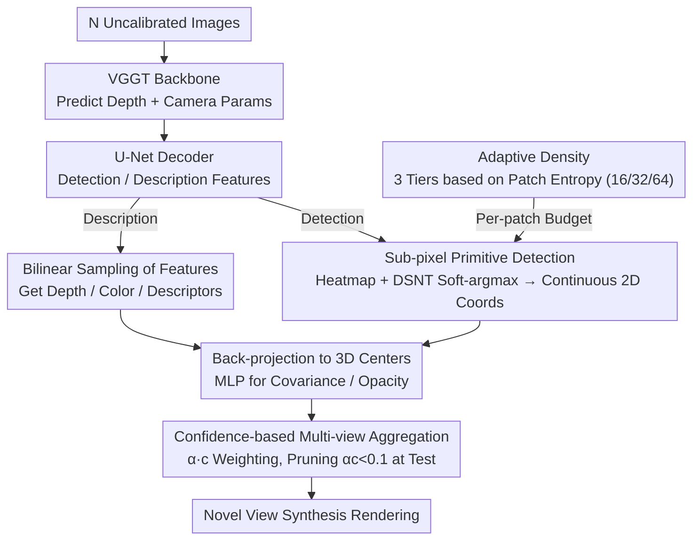

# Off The Grid: Detection of Primitives for Feed-Forward 3D Gaussian Splatting

**Conference**: CVPR 2026  
**arXiv**: [2512.15508](https://arxiv.org/abs/2512.15508)  
**Code**: [Project Page](https://arthurmoreau.github.io/OffTheGrid/)  
**Area**: 3D Vision / 3D Gaussian Splatting  
**Keywords**: 3D Gaussian Splatting, Feed-forward Reconstruction, Keypoint Detection, Adaptive Density, Pose-free Reconstruction

## TL;DR

This paper proposes a feed-forward 3DGS decoder based on keypoint detection concepts, liberating Gaussian primitives from the pixel grid. By adaptively placing primitives at sub-pixel levels and combining an adaptive density mechanism with confidence pruning, it outperforms SOTA feed-forward methods in novel view synthesis using only 1/7th of the primitives compared to the number of input pixels.

## Background & Motivation

**Background**: 3D Gaussian Splatting (3DGS) has become a mainstream method for efficient 3D scene representation. Traditional 3DGS requires SfM initialization and per-scene optimization (taking minutes to hours). Recently, feed-forward methods (e.g., PixelSplat, AnySplat) directly predict Gaussian primitives through a single neural network forward pass, reducing reconstruction time to seconds.

**Limitations of Prior Work**: Existing feed-forward methods almost exclusively adopt "pixel-aligned" or "voxel-aligned" primitive placement strategies—where each input pixel corresponds to one Gaussian primitive, rigidly locking positions to a regular grid. This introduces two issues: (1) The number of primitives equals the number of input pixels, restricting the method to low resolutions (typically 256×256); (2) The regular grid cannot adaptively allocate more primitives to high-frequency detail areas or reduce redundancy in flat areas, resulting in a loss of both quality and efficiency.

**Key Challenge**: While optimization-based 3DGS dynamically adjusts primitive distribution via densification/pruning, feed-forward methods lack this capability. The pixel-aligned design essentially limits the model's expressive power, as it cannot learn "optimal placement."

**Goal**: How to achieve adaptive, grid-independent primitive placement in feed-forward 3DGS while maintaining end-to-end trainability.

**Key Insight**: Inspired by keypoint detection, the authors treat the placement of Gaussian primitives as a 2D detection problem—extracting continuous coordinates via convolutional heatmaps on image patches, allowing primitives to be localized with sub-pixel precision.

**Core Idea**: Replace pixel-grid alignment with DSNT soft-argmax (similar to keypoint detection), enabling the feed-forward 3DGS model to learn adaptive placement of Gaussian primitives with sub-pixel accuracy.

## Method

### Overall Architecture

This paper addresses a chronic issue in feed-forward 3DGS: existing methods pin each Gaussian primitive to an input pixel, making the number of primitives equal to the pixel count, which prevents high-resolution processing and efficient allocation. The authors' breakthrough is re-interpreting "primitive placement" as a 2D keypoint detection problem—since Gaussian primitives do not have fixed coordinates on the image, the network should "detect" them with sub-pixel precision.

The pipeline is as follows: $N$ uncalibrated images are fed into the VGGT 3D reconstruction backbone to predict depth maps and camera parameters. Subsequently, a U-Net decoder branches into detection and description features. The former locates continuous 2D coordinates of primitives on image patches via heatmaps, while the latter samples depth, color, and descriptors for each primitive using bilinear interpolation. With 2D coordinates and depth, 3D Gaussian centers are back-projected, and an MLP completes the remaining parameters like covariance and opacity. Finally, primitives predicted from multiple views are aggregated for rendering. The entire process is trained end-to-end using photometric loss on input images, without requiring 3D supervision.

### Key Designs

**1. Sub-pixel Primitive Detection: Liberating Primitives from the Integer Pixel Grid**

Pixel-alignment strategies anchor primitives to integer coordinates, which fails to accurately represent structures like edges or thin lines that cross pixels. This paper borrows from keypoint detection to break this limit: the U-Net decoder's detection features are reshaped into $14 \times 14$ patches, each containing $P$ channels (where $P$ is the primitive budget for that patch). A spatial softmax is applied to each channel to generate a heatmap, followed by a DSNT soft-argmax to calculate expected coordinates $x = \sum_{i,j} c_x(i,j) h(i,j)$, transforming discrete heatmaps into continuous floating-point coordinates. This allows primitive centers to fall between pixels, capturing finer geometric details. Crucially, DSNT is fully differentiable and supports end-to-end training.

**2. Adaptive Density: Allocating More Primitives to Complex Areas**

Another flaw of regular grids is their inability to adapt to local complexity. This paper uses a non-learnable signal to determine density: Shannon entropy of the luminance histogram $H = -\sum_k p_k \log_2(p_k + \epsilon)$ is calculated for each $14 \times 14$ patch. Higher entropy indicates richer texture. Patches are sorted by entropy and divided into three tiers: the lowest 55% get 16 primitives per patch, the middle 35% get 32, and the top 15% get 64. Each tier uses independent detection/description convolutional heads. Even at the highest density (64 primitives), the count is far lower than the 196 pixels in a patch, maintaining a high compression ratio while concentrating the budget where it is needed most.

**3. Confidence-based Multi-view Aggregation: Automatic Removal of Redundant Primitives**

Naively stacking primitives from every view leads to redundant representations of the same content, causing blurriness. This paper predicts an additional confidence score $c \in [0,1]$ for each Gaussian, using $\alpha \cdot c$ as the final opacity. When a region is seen more clearly from another view, the model implicitly learns to lower the confidence of primitives from the current view, effectively performing "deduplication." At test time, primitives with $\alpha c < 0.1$ are pruned to save computation.

### Loss & Training

Training involves four types of losses: (1) **Photometric Loss**: L1 + SSIM + LPIPS, rendering only the input images (no held-out target views required); (2) **Geometric Consistency Loss**: L1 loss between predicted and rendered depth + normal consistency loss to align Gaussian orientations with local surface geometry; (3) **Teacher Geometry Loss**: Constraints to ensure fine-tuned depth and camera parameters do not deviate too far from original VGGT predictions, preventing training collapse; (4) **Regularization Loss**: Opacity regularization $L_{op} = \sum \sin(\alpha \cdot c)$ to encourage opacity towards 0 or 1, avoiding semi-transparency issues.

Training is performed on a single GPU (140GB VRAM), processing up to 24 images per iteration without 3D labels.

## Key Experimental Results

### Main Results

| Dataset | Metric | Off The Grid | AnySplat | DA3-Giant |
|--------|------|-------------|----------|-----------|
| Average (6 datasets) | PSNR↑ | **21.21** | 17.71 | 18.83 |
| Average | SSIM↑ | **0.647** | 0.508 | 0.543 |
| Average | LPIPS↓ | **0.353** | 0.394 | 0.383 |
| DL3DV | PSNR↑ | **20.48** | 17.31 | 18.46 |
| Tanks&Temples | PSNR↑ | **19.37** | 16.28 | 16.94 |

Compression Ratio: **Ours** uses only **0.143 primitives/pixel** (1/7th of input pixels), whereas pixel-aligned methods use 1.0, and AnySplat uses 0.814.

### Ablation Study

| Configuration | PSNR↑ | SSIM↑ | LPIPS↓ |
|------|-------|-------|--------|
| Ours (Off-The-Grid Detection) | **19.22** | **0.604** | **0.333** |
| Pixel-aligned Baseline | 18.90 | 0.590 | 0.382 |
| SplatterImage-style 3D Offset | 18.87 | 0.586 | 0.389 |

Geometric Evaluation (Mean):

| Model | AbsRel↓ | AUC@30↑ | FOV Error↓ |
|------|---------|---------|-----------|
| Off The Grid | 0.143 | 0.928 | **0.96** |
| DA3-Giant | **0.134** | **0.934** | 3.66 |
| AnySplat | 0.159 | 0.833 | 3.225 |

### Key Findings
- Compared to pixel-alignment, Off-The-Grid improves PSNR by +0.3dB and reduces LPIPS by 13%, resulting in sharper renderings with fewer artifacts.
- SplatterImage-style 3D offset prediction does not improve results and introduces floaters, indicating that accurate primitive placement requires more sophisticated techniques.
- The adaptive density mechanism achieves an 86% compression ratio, outperforming models while using 7x fewer primitives.
- Fine-tuned VGGT performs best in intrinsic estimation, which is critical for accurate back-projection.

## Highlights & Insights
- **Transferring Keypoint Detection Concepts to 3DGS**: Treating physically non-existent Gaussian primitives as "detectable keypoints" and using heatmaps + softmax for sub-pixel localization is an elegant conceptual transfer.
- **Adaptive Density via Shannon Entropy**: Determining patch complexity without learning is a simple but effective engineering design.
- **Multi-view Inference via Confidence Learning**: The model automatically learns "this region is clearer in another view, so I will lower the confidence in this view"—an elegant solution without explicit multi-view aggregation.
- Photometric supervision on input images only, prevented from geometric collapse by teacher geometry losses, simplifies the training pipeline.

## Limitations & Future Work
- Geometry of extremely thin structures may vanish (due to limited representational capacity with fewer primitives).
- Combination with more sophisticated multi-view aggregation methods remains unexplored; current confidence pruning is relatively simple.
- Hyperparameters for adaptive density (55%/35%/15% splits) are manually set; a learned optimal allocation strategy could be explored.
- Training requires 140GB VRAM on a single GPU, posing high hardware requirements.

## Related Work & Insights
- **vs AnySplat**: Both are based on fine-tuning VGGT, but AnySplat uses voxel-aligned Gaussians while **Ours** uses detection-based sub-pixel Gaussians. **Ours** significantly outperforms AnySplat across all datasets with fewer primitives.
- **vs PixelSplat**: A pioneering work in pixel-alignment restricted to 256×256 low resolution. **Ours** fundamentally solves the limitations of pixel-alignment.
- **vs DA3-Giant**: DA3 is stronger in depth and pose estimation, but inaccurate intrinsic estimation leads to blurry renderings. **Ours** improves intrinsic estimation through photometric supervised fine-tuning.

## Rating
- Novelty: ⭐⭐⭐⭐ Using keypoint detection for 3DGS primitive placement is a novel and natural idea.
- Experimental Thoroughness: ⭐⭐⭐⭐⭐ Comprehensive across 6 datasets, multiple view settings, geometric evaluations, and ablations.
- Writing Quality: ⭐⭐⭐⭐ Clear motivation, detailed method description, and well-designed visuals.
- Value: ⭐⭐⭐⭐ Provides a significant paradigm shift for feed-forward 3DGS, moving from grid-alignment to adaptive detection.

<!-- RELATED:START -->

## Related Papers

- [\[CVPR 2026\] Z-Order Transformer for Feed-Forward Gaussian Splatting](z-order_transformer_for_feed-forward_gaussian_splatting.md)
- [\[CVPR 2026\] AnchorSplat: Feed-Forward 3D Gaussian Splatting with 3D Geometric Priors](anchorsplat_feed-forward_3d_gaussian_splatting_with_3d_geometric_priors.md)
- [\[CVPR 2026\] EcoSplat: Efficiency-controllable Feed-forward 3D Gaussian Splatting from Multi-view Images](ecosplat_efficiency-controllable_feed-forward_3d_gaussian_splatting_from_multi-v.md)
- [\[CVPR 2026\] Learning Compact 3D Representations from Feed-Forward Novel View Synthesis](learning_compact_3d_representations_from_feed-forward_novel_view_synthesis.md)
- [\[CVPR 2026\] Particulate: Feed-Forward 3D Object Articulation](particulate_feed-forward_3d_object_articulation.md)

<!-- RELATED:END -->
