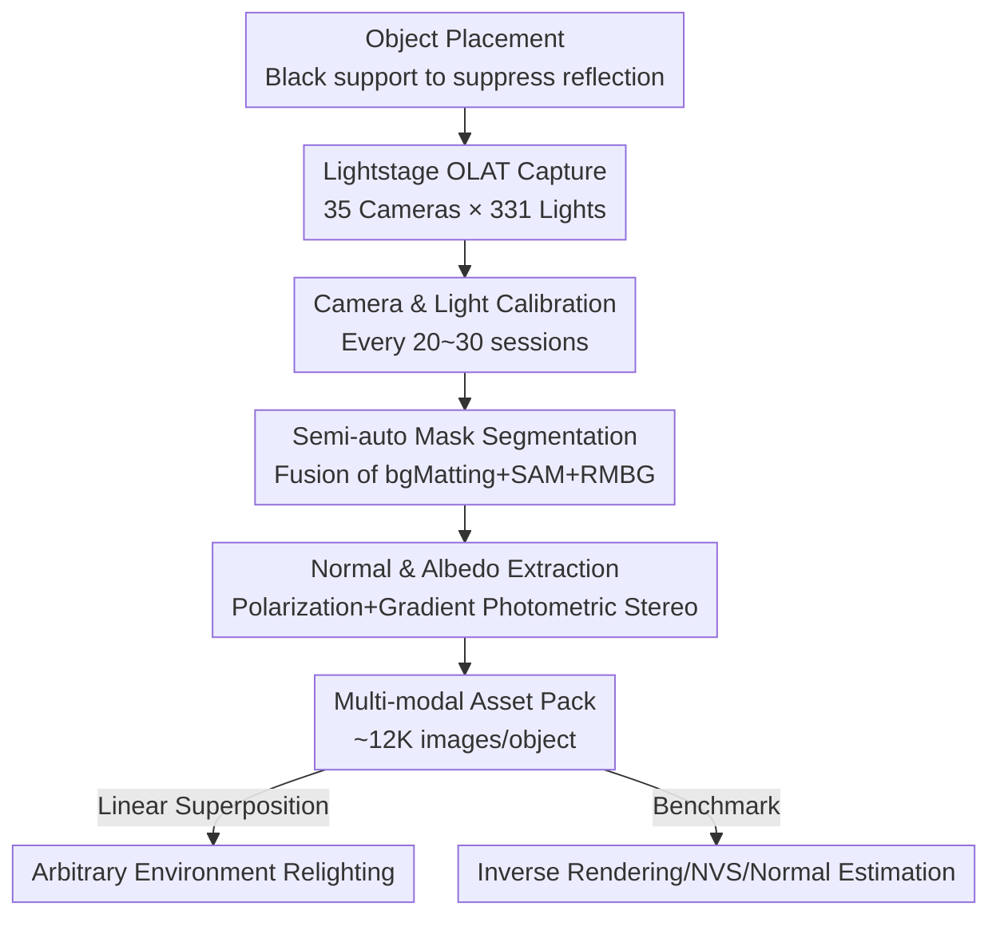

# OLATverse: A Large-scale Real-world Object Dataset with Precise Lighting Control

**Conference**: CVPR 2026  
**Paper**: [CVF Open Access](https://openaccess.thecvf.com/content/CVPR2026/html/Zhou_OLATverse_A_Large-scale_Real-world_Object_Dataset_with_Precise_Lighting_Control_CVPR_2026_paper.html)  
**Area**: 3D Vision / Inverse Rendering / Relighting / Dataset  

## TL;DR
OLATverse utilizes a lightstage with 35 cameras and 331 controllable light sources to capture 765 real-world objects in a one-light-at-a-time (OLAT) manner. The resulting large-scale dataset contains approximately 9 million images with precise single-light control, accompanied by camera parameters, object masks, photometric normals, and diffuse albedo. It provides the first real-world benchmark for inverse rendering, novel view synthesis, and normal estimation that combines both large scale and precise lighting control.

## Background & Motivation

**Background**: Significant progress has been made in inverse rendering, novel view synthesis, and relighting, with 3DGS and diffusion priors leading recent developments. Training and evaluating these methods requires the appearance of real objects under known, controllable lighting as ground truth and supervision.

**Limitations of Prior Work**: Due to the complexity of hardware acquisition and data processing, existing object-level datasets typically fall short in at least one of three dimensions: **quality**, **scale**, or **precise lighting control**. Synthetic datasets (ABO, Objaverse, ShapeNet) offer massive scale but lack realism and exhibit inconsistent object quality. Real-world datasets are either very small (NeROIC with 3 objects, Stanford-ORB with 14) or, despite reaching thousands of objects (OmniObject3D, OpenIllumination, DTC), rely on manual material annotations or restricted lighting setups that cannot precisely simulate complex illumination. Consequently, many methods are trained on synthetic data and evaluated on small real-world samples, preventing a reliable measure of performance in real scenes.

**Key Challenge**: Achieving "realism + large-scale + precise lighting control" simultaneously is difficult. Precise control requires expensive and complex per-light capture hardware (lightstages). Scaling such hardware for hundreds of real objects with varying sizes, materials, and textures while maintaining calibration consistency is a significant engineering challenge.

**Goal**: To create a real-world object dataset that satisfies all three criteria and establish it as a comprehensive benchmark for evaluating existing baselines.

**Key Insight**: The authors adopt the OLAT (One-Light-At-a-Time) capture paradigm, where each light source is activated individually. Leveraging the linear superposition property of light transport, any appearance under arbitrary environment lighting can be synthesized as a linear combination of OLAT images. Thus, capturing the object once per light is equivalent to capturing its full appearance under any possible illumination.

**Core Idea**: Using an industrial-grade lightstage to perform full OLAT capture for 765 real objects, complemented by a semi-automatic post-processing pipeline (calibration, segmentation, and normal extraction). This expands "precise lighting control" from small-scale experiments to a dataset of nearly 9 million images covering 18.5% of LVIS categories.

## Method

As a dataset paper, the "Method" focuses on the capture process and the generation of multi-modal annotations rather than network architecture. The pipeline consists of two stages: physical capture (lightstage OLAT capture) and data post-processing (calibration $\rightarrow$ masking $\rightarrow$ normal/albedo extraction).

### Overall Architecture

The input is a real object placed at the center of the lightstage, and the output is a multi-modal asset pack: approximately 12K multi-view, multi-light images (including 331 OLAT), calibrated camera parameters, clean object masks, photometric normals, and diffuse albedos. The workflow involves synchronous capture using 35 RED Komodo 6K cameras and 331 RGBAW LEDs at 30 FPS, camera calibration every 20-30 sessions, semi-automatic segmentation, and normal/albedo estimation via gradient-based photometric stereo.

### Key Designs

**1. OLAT Lightstage Capture: Capturing Every Light for Arbitrary Appearance**

To support precise lighting control without the combinatorial explosion of infinite environments, authors use the OLAT paradigm. A spherical dome houses 35 RED Komodo 6K cameras and 331 RGBAW LEDs. Each object is captured under uniform white light, 12 polarized gradient lights, 10 environment lights, and 331 OLAT settings. Due to the linearity of light transport, the relit image $I_{relit}$ under target environment light $E$ is computed as:

$$I_{relit} = \sum_{i=1}^{N_{olat}} \big( F(E \odot M_i) \cdot I_i \big)$$

where $I_i$ is the $i$-th OLAT image, $M_i$ is the corresponding environment mask, $F$ is channel-wise averaging, and $\odot$ is pixel-wise multiplication. To accommodate varying object sizes (5cm to 100cm), objects are supported by black-wrapped stands to minimize color bleeding and specular inter-reflections.

**2. Intermittent Camera Calibration: Amortizing Costs Across 765 Objects**

Standard per-object feature-based calibration is unstable for diverse real-world textures. The authors leverage the fact that **camera positions are fixed**. Calibration sessions are performed every 20-30 capture sessions using reference objects with rich texture and Lambertian surfaces to recover parameters via Metashape. Regular capture sessions then reuse these parameters. Light source coordinates are fixed in a standard coordinate system. Calibration accuracy reaches an average re-projection error of 0.86 pixels.

**3. Three-Segmenter Fusion for Semi-automatic Masking**

To achieve robust masking at scale, the authors fuse three segmenters to offset individual weaknesses. They capture a foreground image $I_{fg}$ (with stand) and a background $I_{bg}$ (stand only). Stand masks $M_{stup}$ are generated based on the view angle:

$$M_{stup} = \begin{cases} \text{RMBG}(I_{bg}) & \text{(a) Bottom views}\\ \text{RMBG}(I_{bg})\,[1-\text{SAM}(\text{bgMat}(I_{bg},I_{fg}))] & \text{(b) Other views}\end{cases}$$

The final object mask is $M_{obj}^* = \text{RMBG}(I_{fg})\,(1-M_{stup})$. This pipeline achieves a 95% success rate across all views, with the remainder addressed via a lightweight manual UI.

**4. Polarized Gradient Photometric Stereo for Normals and Albedo**

To provide multi-modal labels for non-Lambertian objects, the authors use photometric stereo with color gradient illumination. Diffuse albedo is derived from the average of gradient pairs: $D = 0.5(I_{cg}^+ + I_{cg}^-)$. Normals are initially computed as $N^* = \frac{I^+ - I^-}{I^+ + I^-}$ and normalized to $N = N^*/|N^*|$. To mitigate view-dependent specularities, five cameras are equipped with linear polarization filters to capture $I_\perp^+, I_\perp^-$, providing polarized normals that are generally more accurate for shiny objects. These are acknowledged as **pseudo GT** rather than absolute ground truth.

### Loss & Training
This work presents a dataset; no model training or loss functions are the focus of the paper. Key parameters include calibration every 20-30 sessions, 0.86-pixel re-projection error, and 95% automated masking success.

## Key Experimental Results

The validation is performed by running existing baselines on an OLATverse test subset comprising 42 objects across 14 material categories.

### Dataset Comparison

| Dataset | Objects | Real | Precise Light | Light Count | View Count | Hardware |
|--------|--------|----------|----------|--------|--------|------|
| Objaverse | 858K | Partial | – | – | – | – |
| OmniObject3D | 6K | ✓ | – | – | – | Scanner |
| DTC | 2K | ✓ | (ENV) | 2 | 120 | Scanner+Cam |
| Stanford-ORB | 14 | ✓ | ENV | 7 | 70 | Scanner+Cam |
| OpenIllumination | ~1K | ✓ | OLAT | Many | Many | Lightstage |
| **OLATverse** | **765** | ✓ | **OLAT** | **331** | **35** | **Lightstage** |

OLATverse covers 13+ material categories and 18.5% of LVIS categories, with object sizes ranging from 5cm to 100cm.

### Inverse Rendering / NVS Baselines (Val set, 42 objects)

| Method | PSNR ↑ | LPIPS ↓ | SSIM ↑ |
|------|--------|---------|--------|
| Mitsuba+Mshape | 35.91 | 0.026 | 0.976 |
| **GS3** | **38.54** | **0.026** | **0.982** |
| RNG | 32.07 | 0.051 | 0.962 |
| BiGS | 32.98 | 0.045 | 0.940 |

### Normal Estimation Baselines (Angular Error)

| Method | Mean↓ | Med↓ | 11.25°↑ | 22.5°↑ | 30°↑ |
|------|-------|------|---------|--------|------|
| SN (StableNormal) | 31.85 | 30.25 | 8.93 | 34.00 | 55.40 |
| RGBX | 51.95 | 49.70 | 6.40 | 22.80 | 35.85 |
| DR (DiffusionRender) | 34.88 | 33.28 | 8.13 | 31.00 | 50.15 |
| GW (GeoWizard) | 34.42 | 32.03 | 10.98 | 34.10 | 50.05 |

### Key Findings
- **GS3 Leads in Inverse Rendering**: The 3DGS-based GS3 achieves the best scores, effectively capturing high-frequency specular reflections on surfaces like metal and plastic.
- **Normal Estimators Struggle with Reality**: Specialized models like SN and GW perform better in angular metrics than relighting-focused models (RGBX, DR), yet no method recovers accurate normals for complex real-world geometries, highlighting the value of OLATverse as a challenging benchmark.
- **Polarized Normals are Superiour**: For most objects, polarization significantly reduces specularity-induced errors, confirming its necessity for real non-Lambertian reconstruction.

## Highlights & Insights
- **Leveraging Light Superposition**: Capture only 331 OLAT images to "freely" unlock an infinite environment relighting library.
- **Amortized Calibration**: Treating fixed camera positions as a constant to reduce calibration overhead is a clever engineering trade-off for scaling.
- **Fusion Logic over Single Model**: Explicitly combining the strengths of multiple segmenters (contour vs. cleanliness) proves more robust for diverse objects than fine-tuning a single model.
- **Honesty in Annotation**: Explicitly labeling results as "pseudo GT" prevents misinterpretation of the multi-modal data.

## Limitations & Future Work
- **Residual Specular Artifacts**: Polarization cannot eliminate all artifacts, particularly for highly glossy or very low-reflectivity textures where the signal-to-noise ratio is low.
- **Pseudo-GT Geometry**: Data remains unsuitable for absolute precision geometry evaluation.
- **Validation Scale**: The use of only 42 objects for the benchmark limits the statistical robustness compared to the 765-object total.
- **Future Directions**: The authors suggest using this dataset to train data-driven generative priors for real-world relighting and appearance modeling.

## Related Work & Insights
- **vs OpenIllumination**: Both use lightstages, but OLATverse handles larger objects (up to 100cm vs 20cm), covers more LVIS categories (18.5% vs <5%), and provides multi-modal assets.
- **vs OmniObject3D / DTC**: While these focus on geometry scale via scanners, they lack precise lighting. OLATverse fills the "lighting control" dimension.
- **vs Synthetic Datasets**: OLATverse addresses the sim-to-real gap, providing a tool to quantify performance in the real world where synthetic-trained models often fail.

## Rating
- Novelty: ⭐⭐⭐⭐ Engineering novelty in scaling OLAT capture to hundreds of objects.
- Experimental Thoroughness: ⭐⭐⭐⭐ Comprehensive dataset statistics and baseline comparisons, though validation set size could be larger.
- Writing Quality: ⭐⭐⭐⭐ Clear documentation of the capture and post-processing pipelines.
- Value: ⭐⭐⭐⭐⭐ A permanent piece of infrastructure for the inverse rendering and relighting community.

<!-- RELATED:START -->

## Related Papers

- [\[CVPR 2026\] SpatialVID: A Large-Scale Video Dataset with Spatial Annotations](spatialvid_a_large-scale_video_dataset_with_spatial_annotations.md)
- [\[CVPR 2026\] ICTPolarReal: A Polarized Reflection and Material Dataset of Real World Objects](ictpolarreal_a_polarized_reflection_and_material_dataset_of_real_world_objects.md)
- [\[CVPR 2026\] Ego-1K: A Large-Scale Multiview Video Dataset for Egocentric Vision](ego-1k_--_a_large-scale_multiview_video_dataset_for_egocentric_vision.md)
- [\[CVPR 2026\] SceneScribe-1M: A Large-Scale Video Dataset with Comprehensive Geometric and Semantic Annotations](scenescribe-1m_a_large-scale_video_dataset_with_comprehensive_geometric_and_sema.md)
- [\[CVPR 2026\] 3DReflecNet: A Large-Scale Dataset for 3D Reconstruction of Reflective, Transparent, and Low-Texture Objects](3dreflecnet_a_large-scale_dataset_for_3d_reconstruction_of_reflective_transparen.md)

<!-- RELATED:END -->
