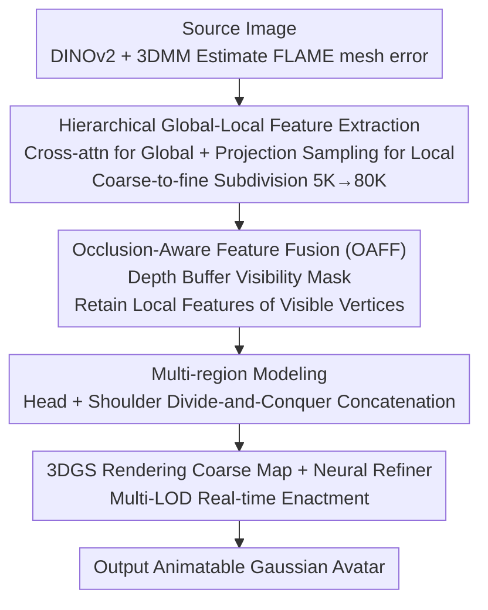

# OMG-Avatar: One-shot Multi-LOD Gaussian Head Avatar

**Conference**: CVPR 2026  
**Paper**: [CVF Open Access](https://openaccess.thecvf.com/content/CVPR2026/html/Ren_OMG-Avatar_One-shot_Multi-LOD_Gaussian_Head_Avatar_CVPR_2026_paper.html)  
**Code**: To be confirmed  
**Area**: 3D Vision / Digital Humans  
**Keywords**: Gaussian Head Avatar, Single-image Reconstruction, Multi-LOD, Occlusion-aware Fusion, Coarse-to-fine

## TL;DR
OMG-Avatar reconstructs an animatable 3D Gaussian head avatar from a single image in 0.2 seconds. Through "hierarchical coarse-to-fine feature extraction + depth-buffer-guided occlusion-aware fusion + head-shoulder divide-and-conquer modeling," the unified model dynamically switches levels of detail (LOD) at runtime, achieving SOTA reconstruction quality and 85 FPS real-time speed with fewer Gaussian points.

## Background & Motivation

**Background**: Reconstructing animatable 3D avatars from a single image is a core technology for digital humans, virtual meetings, and the metaverse. 2D approaches (GAN warping, diffusion models) offer good image quality but lack 3D constraints, leading to multi-view inconsistency under large poses and high computational costs. In the 3D route, 3D Gaussian Splatting (3DGS) has become mainstream due to its rendering speed, with existing feed-forward methods like GAGAvatar, LAM, and Avat3r.

**Limitations of Prior Work**: Existing single-image Gaussian avatar methods have structural flaws. GAGAvatar samples Gaussian points from background tri-planes, which is redundant and inefficient. LAM performs cross-attention on all subdivided vertices (approx. 80K), where computational complexity grows exponentially with subdivision levels. Avat3r relies on an additional 3D GAN for 3D lifting, introducing cumulative errors. More importantly, none can dynamically adjust computation at inference time to adapt to different hardware and speed requirements.

**Key Challenge**: The fundamental contradiction between quality and efficiency lies in "high-resolution geometry = high vertex count = expensive 2D-to-3D feature mapping costs." Mapping features directly on a high-resolution mesh causes computational explosion, while mapping at low resolution loses high-frequency details. Furthermore, 3DMMs like FLAME do not cover the shoulders, leading to blurry reconstruction in non-head regions.

**Goal**: To achieve (1) single-image feed-forward reconstruction, (2) runtime-adjustable multi-LOD rendering, (3) SOTA quality + real-time speed, and (4) complete head-shoulder modeling within a unified model.

**Key Insight**: It is observed that high-resolution geometry can be progressively obtained from low-resolution geometry via subdivision. Thus, expensive global feature extraction can be performed once at low resolution (5K vertices), and features can be propagated to high resolution through inexpensive subdivision and projection sampling, naturally supporting multi-LOD.

**Core Idea**: Replace "direct cross-attention on high resolution" with "low-resolution global feature extraction + projection sampling for local details + coarse-to-fine subdivision," while using depth buffers for occlusion-aware fusion to ensure correct visibility.

## Method

### Overall Architecture
Given a source image, OMG-Avatar first uses DINOv2 to extract local features $F_{local}$ and identity features $F_{id}$, then estimates a FLAME head mesh (initial $N_0=5023$ vertices) using a 3DMM modeler. Subsequently, features are extracted via two parallel paths: the Hierarchical Projective Feature Sampling (HPFS) module projects the mesh onto the image plane to perform bilinear sampling for local features, while global features are obtained via cross-attention using FLAME positional encodings as queries. These features are fused in the Occlusion-Aware Feature Fusion (OAFF) module guided by the depth buffer to ensure visibility correctness. Head and shoulder Gaussian attributes are predicted **separately** using shared features and then concatenated. Finally, 3DGS renders a coarse feature map, which is processed by a UNet Neural Refiner to output a high-quality image. Training follows a coarse-to-fine strategy: the mesh and features are subdivided progressively ($K=2$, final 79,936 vertices), enabling the network to perceive hierarchical details from coarse to fine.

### Key Designs

**1. Hierarchical Global-Local Feature Extraction and Coarse-to-fine Subdivision: Locking Expensive Global Computation at Low Resolution**

This design directly addresses the "computational explosion of direct high-resolution mapping." The authors perform cross-attention only once on the initial $N_0=5K$ vertices to extract global features $F^{GS_0}_{global}$ (each FLAME vertex is paired with a learnable positional encoding as a query). An MLP $\Psi_{offset}$ predicts vertex offsets to refine the head mesh: $T_p = T + B_S + B_P + B_E + \Psi_{offset}(F^{GS_0}_{global})$. Subsequently, a subdivision operator $\Phi$ upsamples global features and vertices progressively: $F^{GS_{k+1}}_{global}, V_{k+1} = \Phi(\Psi_k(F^{GS_k}_{global}), V_k)$. Local features are re-sampled at each level via camera projection $P$ on $F_{local}$: $F^{GS_k}_{local} = Sampling(P(V_k), F_{local})$. Compared to LAM's cross-attention on all 80K vertices, OMG-Avatar dramatically reduces memory and compute; the same weights at different subdivision levels naturally support runtime speed adjustment.

**2. Occlusion-Aware Feature Fusion (OAFF): Masking Erroneous Local Features via Depth Buffers**

Projective sampling has a drawback: while visible vertices capture accurate local features, occluded vertices project to image areas belonging to "objects in front," resulting in incorrect features. The authors construct a visibility mask using the depth buffer from rasterization: for each vertex $v_i$, its camera-space depth $z_i$ is compared with the depth buffer value $\hat z_i$. If $z_i = \hat z_i$, it is marked visible ($M^{GS_k}_i = 1$); if $z_i > \hat z_i$, it is marked occluded ($M^{GS_k}_i = 0$). During fusion, local features are added only for visible vertices: $F^{GS_k}_h = F^{GS_k}_{global} + F^{GS_k}_{local} \odot M^{GS_k}$. Thus, occluded regions rely on semantically strong global features for plausible appearance (lacking high-frequency detail but avoiding artifacts), while visible regions benefit from local feature details. Ablations show CSIM drops from 0.869 to 0.429 if either component is removed.

**3. Multi-region Modeling (Head-Shoulder Partition): Compensating for FLAME Coverage**

FLAME lacks shoulder vertices, leading to blurry shoulders in previous methods. The authors segment the source image to obtain a shoulder mask $M_s$ (implemented by subtracting the depth buffer mask from the portrait mask, requiring no external segmentation model). $F_{local}$ is processed by a CNN to generate a feature plane where channels encode Gaussian attributes. Shoulder parameters are extracted via the mask: $c_s, o_s, s_s, r_s, O_s = \text{Flatten}(\text{Conv}(F^{GS}_{local}) \odot M_s)$. Shoulder 3D points are generated on the image-aligned plane: $p_s = \hat p_s + O_s \cdot n_s$. Finally, the head Gaussian set $H$ and shoulder set $S$ are concatenated to form the complete set $G = H \cup S$. The shoulder typically comprises ~9K points.

**4. Neural Refinement and Real-time Enactment: Position-only Updates for Animation**

During enactment, a 3DMM estimator extracts expression/pose parameters from a driving frame, which are combined with source identity parameters to generate new FLAME vertices, subdivided to reach the final head positions $p_h$. Crucially, **enactment only requires updating the position component $p_h$** in the Gaussian set $G$ (color, opacity, scale, and rotation are reused), enabling real-time animation. The renderer outputs a multi-channel feature map (the first three channels are coarse RGB $I_c$) instead of raw RGB, which is refined by a UNet Neural Refiner into the final image $I_r$. Ablations show the refiner contributes significantly to expression-related details like teeth and forehead wrinkles.

### Loss & Training
Self-supervised training is conducted on the large-scale VFHQ portrait video dataset. Two frames are sampled per video: one as source and one as driver, with the goal of matching the output to the driving frame. The total loss is calculated for both the coarse image $I_c$ and refined image $I_r$ using L2 + SSIM + Perceptual loss, plus a regularization term for FLAME vertex offsets: $L = \lambda_1 L_2 + \lambda_2 L_{SSIM} + \lambda_3 L_{percep} + \lambda_4 L_{reg}$, where $L_{reg} = \|offset\|_2$. Hyperparameters: $\lambda_1=10, \lambda_2=1, \lambda_3=\lambda_4=0.1$. Training lasts 6 epochs on a single A100, with subdivision levels increasing progressively. DINOv2 and the 3DMM estimator are frozen.

## Key Experimental Results

Datasets: VFHQ for training (766,263 frames); internal split for testing. Zero-shot generalization is tested on HDTF. Metrics include PSNR/SSIM/LPIPS (reconstruction), CSIM (identity consistency), and motion accuracy metrics like AED (expression), APD (pose), and AKD (landmarks).

### Main Results (VFHQ, Re-enactment)

| Method | Gaussian Count | PSNR↑ | SSIM↑ | LPIPS↓ | CSIM↑ | AED↓ |
| :--- | :--- | :--- | :--- | :--- | :--- | :--- |
| GAGAvatar | 180K | 21.83 | 0.818 | 0.122 | 0.816 | 0.111 |
| LAM | 80K | 22.65 | 0.829 | 0.109 | 0.822 | 0.102 |
| **Ours (Sub #2)** | ~80K | **22.72** | **0.831** | **0.091** | **0.869** | **0.088** |
| **Ours (Sub #1)** | ~29K | 22.68 | 0.830 | 0.094 | 0.858 | 0.089 |
| Ours (Sub #0) | ~5K | 22.18 | 0.817 | 0.102 | 0.855 | 0.134 |

Key Insight: Even the lower-resolution LOD (Sub #1, 29K points) outperforms LAM (80K) and GAGAvatar (180K) in PSNR/SSIM/LPIPS/CSIM. Achieving better results with 1/3 to 1/6 of the points validates the efficiency of hierarchical feature extraction.

### Performance Comparison (FPS, Average over 100 frames)

| Method | A100 FPS | RTX 4090 FPS |
| :--- | :--- | :--- |
| GAGAvatar | 67.12 | — |
| LAM (w/o Neural) | 280 | — |
| **Ours Sub #2** | **85.94** | **126.44** |
| Ours Sub #1 | 148.04 | — |
| Ours Sub #0 | 152.57 | — |

OMG-Avatar achieves the highest speed among methods using neural rendering (85 FPS@A100). While LAM is faster without neural rendering, it lacks geometric detail and dynamic texture quality.

### Ablation Study (VFHQ)

| Configuration | PSNR↑ | SSIM↑ | LPIPS↓ | CSIM↑ |
| :--- | :--- | :--- | :--- | :--- |
| w/o Global Feature | 20.85 | 0.796 | 0.121 | 0.429 |
| w/o Local Feature | 21.21 | 0.802 | 0.128 | 0.429 |
| w/o Refiner | 21.42 | 0.809 | 0.115 | 0.842 |
| w/o Shoulder | 22.42 | 0.828 | 0.099 | 0.867 |
| **Ours (Full)** | **22.72** | **0.831** | **0.091** | **0.869** |

### Key Findings
- Global and local features are **both essential**: removing either causes CSIM to crash from 0.869 to 0.429. Removing local features loses identity, while removing global features causes artifacts in dynamic areas like the eyes and mouth.
- Performance **saturates after Subdivision Level 2**: This is attributed to the resolution limit of DINOv2 feature maps (296×296 grid provides ~88K unique features, so projecting over 80K vertices cannot recover more geometric detail).
- The Neural Refiner primarily recovers high-frequency expression details (teeth, wrinkles), reducing LPIPS from 0.115 to 0.091.

## Highlights & Insights
- **Efficient Compute Allocation**: Locking cross-attention to 5K vertices and using inexpensive subdivision/sampling for the rest provides multi-LOD for free. The same weights serve different speeds without retraining.
- **Depth-Buffer Visibility Gating**: Using the rendering byproduct (depth buffer) as an occlusion mask solves the projection error problem with near-zero cost. This is transferable to any mesh-to-image projection task.
- **Position-only Enactment**: Fixing color, opacity, scale, and rotation while updating only Gaussian positions $p_h$ is a key engineering trade-off for real-time performance.
- **Shoulder Masking without Segmentation**: Subtracting the depth buffer mask from the portrait mask avoids an external segmentation model—a practical trick.

## Limitations & Future Work
- Dependency on FLAME priors and accurate 3DMM tracking limits expressiveness for features not covered by FLAME, such as tongue movement and complex hair deformation.
- Trained only on monocular videos, leading to lower robustness under large view changes (>60°), where significant artifacts may appear.
- The saturation at subdivision Level 2 suggests that higher-resolution backbones are needed to push quality further, though this may increase the computational overhead.
- Consistency at the head-shoulder boundary and stability of shoulder points under extreme motion require further analysis.

## Related Work & Insights
- **vs. LAM**: LAM performs cross-attention on all 80K vertices (exponential complexity); OMG-Avatar performs it only on 5K vertices, surpassing LAM with just 29K points.
- **vs. GAGAvatar**: GAGAvatar uses redundant tri-plane sampling (180K points). This work uses mesh anchoring + projection sampling for higher efficiency and quality.
- **vs. LODAvatar**: LODAvatar supports LOD but lacks facial animation; this work achieves both.
- **vs. Avat3r**: Avat3r uses a 3D GAN for lifting; this work is direct feed-forward, completing reconstruction in 0.2s.

## Rating
- Novelty: ⭐⭐⭐⭐ Solid combination of coarse-to-fine multi-LOD and depth-buffer fusion.
- Experimental Thoroughness: ⭐⭐⭐⭐⭐ Comprehensive coverage of two datasets, 11 baselines, and ablation of efficiency/LOD.
- Writing Quality: ⭐⭐⭐⭐ Clear methodology and complete formulas.
- Value: ⭐⭐⭐⭐ Highly practical for deployment due to real-time performance and adjustable LOD.

<!-- RELATED:START -->

## Related Papers

- [\[CVPR 2026\] Feed-Forward One-Shot Animatable Textured Mesh Avatar Reconstruction](feed-forward_one-shot_animatable_textured_mesh_avatar_reconstruction.md)
- [\[CVPR 2026\] Feed-forward Gaussian Registration for Head Avatar Creation and Editing](feed-forward_gaussian_registration_for_head_avatar_creation_and_editing.md)
- [\[CVPR 2026\] ELITE: Efficient Gaussian Head Avatar from a Monocular Video via Learned Initialization and Test-time Generative Adaptation](elite_efficient_gaussian_head_avatar_from_a_monocular_video_via_learned_initiali.md)
- [\[CVPR 2026\] GeoDiff4D: Geometry-Aware Diffusion for 4D Head Avatar Reconstruction](geodiff4d_geometry-aware_diffusion_for_4d_head_avatar_reconstruction.md)
- [\[CVPR 2026\] UIKA: Fast Universal Head Avatar from Pose-Free Images](uika_fast_universal_head_avatar_from_pose-free_images.md)

<!-- RELATED:END -->
