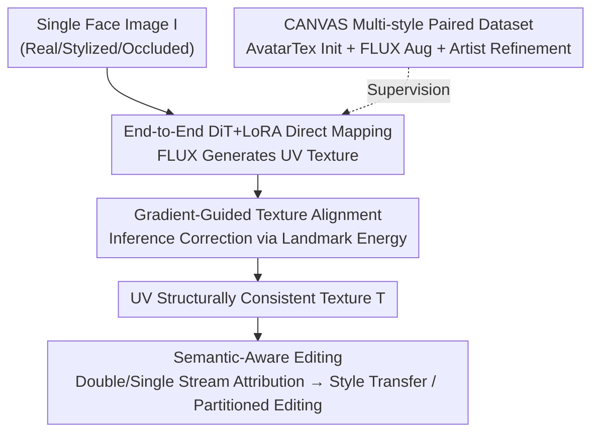

# OMGTex: One-stage Multi-style Facial Texture Reconstruction without Geometry Guidance

**Conference**: CVPR 2026  
**arXiv**: [2605.25778](https://arxiv.org/abs/2605.25778)  
**Code**: https://github.com/xxx (To be released)  
**Area**: 3D Vision / Diffusion Models  
**Keywords**: Facial Texture Reconstruction, UV Texture, Geometry-free, Diffusion Transformer, Semantic Editing

## TL;DR
OMGTex utilizes a DiT-based diffusion model to **directly** map facial images of any style to editable UV textures. It employs "gradient-guided alignment" during inference to correct UV structural misalignments and achieves partitioned editing through semantic attribution of attention blocks. The process remains **independent of 3D geometric priors** throughout, demonstrating robustness to occlusions and stylized inputs. It achieves SOTA performance on LPFF/CANVAS with a reconstruction time of 7 seconds per image.

## Background & Motivation

**Background**: The mainstream approach for reconstructing UV textures from single facial images (e.g., UV-IDM, Ultr-Avatar, FreeUV, SOAP) typically follows a two-stage pipeline: "fit 3DMM geometry $\rightarrow$ project partial UV textures $\rightarrow$ complete using diffusion models." In this paradigm, geometry serves as a scaffold to provide UV structural constraints.

**Limitations of Prior Work**: This paradigm suffers from three critical issues. First, it **heavily relies on precise geometry**. Stylized faces (exaggerated shapes, abstract shadows, brushstrokes) are inherently difficult to fit with topology-consistent geometry. For real faces, geometry estimation often fails when obstructed by hands, glasses, or masks. Second, **projection brings occluder artifacts into the texture**. Partial projection methods are sensitive to occlusions, while pure multi-view projection methods (e.g., SOAP) suffer from multi-view inconsistencies. Third, **the entire texture is synthesized as a whole**, preventing partitioned editing such as "adjusting skin tone only," "changing eyebrow shape," or "modifying the mouth," which are common requirements for games and VR avatars.

**Key Challenge**: Diffusion models are capable of generating diverse and stylized textures but **lack explicit UV structural constraints**. Free generation leads to UV misalignments (e.g., eyes open when they should be closed, vertical misalignment of features). This is precisely why previous works insisted on using geometric projection to provide partial UV maps—trading robustness and editability for structural constraints.

**Goal**: To build a **geometry-free** pipeline that directly generates multi-style, editable, and UV-structurally consistent textures from 2D face images, while also filling the gap in multi-style paired data.

**Key Insight**: The main observation is that since diffusion models possess strong generative capabilities and only lack UV constraints, one should avoid reverting to geometric projection and instead **explicitly correct structure using gradients during inference**. Furthermore, different blocks in the diffusion network naturally distribute different semantics (style, identity, local features) across different layers, which can be reinforced for semantic editing.

**Core Idea**: Replace "geometry fitting + projection completion" with "end-to-end DiT direct generation + inference-time gradient-guided alignment + attention block semantic attribution," completely discarding geometry as a prerequisite.

## Method

### Overall Architecture
OMGTex aims to solve the following: given a single facial image $I$ of any style, reconstruct a high-quality, UV-consistent, and partition-editable texture $T$ without any geometric guidance. The pipeline consists of three parts: first, constructing the **paired multi-style dataset CANVAS** using FLUX.Kontext + AvatarTex + artist refinement; then, training a **LoRA conditional module** on a DiT backbone (FLUX.1.DEV) to learn the direct mapping from facial images to UV textures; finally, applying gradient-guided alignment during **inference** to correct UV misalignments and utilizing the semantic distribution of attention blocks for style transfer and partitioned editing.

The system is a sequential pipeline of "Data Construction $\rightarrow$ Conditional Generation Training $\rightarrow$ Inference Alignment / Semantic Editing," with the contributing components shown below:

### Key Designs

**1. Geometry-free One-stage DiT Conditional Generation: Removing the "Geometry Fitting + Projection" Pipeline**

To address the dependency on precise geometry, OMGTex discards 3DMM fitting and partial UV projection. Instead, it treats the **facial image itself** as the condition, allowing the DiT to generate the complete UV texture in one step. Specifically, a conditional generation framework is built upon FLUX.1.DEV (DiT backbone) with a LoRA conditional module optimized via flow-matching loss:

$$L_{RF}=\mathbb{E}_{t,\epsilon\sim\mathcal{N}(0,I)}\Big[\big\|v_{\theta}(z,t,c_i)-(\epsilon-x_0)\big\|^2\Big]$$

Where $c_i$ is the encoding of the conditional face image. Thus, the input requires no geometry or partial textures, making it robust to occlusions or extreme styles. The resulting layout's lack of explicit UV constraints is addressed by Design 2.

**2. Gradient-guided Texture Alignment: Inference-time Correction via Landmark Energy**

Since Design 1 lacks explicit UV constraints, two types of misalignments often occur: eyelid state errors and facial feature displacements. While ControlNet is a common choice for structural injection, experiments show it **fails to produce clean corrections and conflicts with existing conditions**, reducing overall quality. The authors use frequency analysis to explain this: writing the diffusion process as an ODE $\frac{dx_t}{dt}=f(x_t,t),\ x_t=(1-t)x_0+tx_1$, the signal-to-noise ratio (SNR) for a frequency component $\omega$ at time $t$ is:

$$\text{SNR}(\omega,t)=\frac{(1-t)^2|\hat{x_0}(\omega)|^2}{t^2|x_1(\omega)|^2}$$

Natural images exhibit low-pass characteristics $|\hat{x_0}(\omega)|^2\propto|\omega|^{-\alpha}$, meaning high frequencies (wrinkles, eyebrows) have lower energy and SNR decays faster during diffusion, making them **more sensitive to guidance** during denoising. Conversely, low-frequency structures (skin tone, overall layout) are **insensitive and difficult to manipulate precisely** via control signals. Conclusion: Injecting conditions to control structure is inherently imprecise; **gradients should be used directly to guide denoising.**

A specialized texture landmark detector $l(\cdot)$ is trained to detect keypoints on the predicted clean texture $\hat{x}_0$. Comparing these with standard topological keypoints $l^*$, an energy function is defined:

$$E(\hat{x}_t)=\|l(\hat{x}_t)-l^*\|_2^2$$

During inference, iterative correction is performed following the classifier guidance paradigm: $\tilde{x}_t=\hat{x}_t-\eta\nabla_{\hat{x}_t}E(\hat{x}_t)$, where $\eta$ controls the strength. This explicitly pulls the texture back to standard UV topology during inference without introducing conflicting conditional branches.

**3. Attention Block Semantic Attribution $\rightarrow$ Style Transfer and Partitioned Editing**

To address the lack of partitioned editability, the authors conducted a diagnostic experiment: "ablating" a layer by multiplying its attention weight matrix by a small constant $\tilde{\mathbf{A}}^{(l)}=\varepsilon\cdot\mathbf{A}^{(l)},\ \varepsilon\ll1$. It was discovered that **double stream blocks determine the visual style, while single stream blocks determine identity features**. Furthermore, degradation in the single stream follows a pattern: the nose region degrades first, followed by the eyes, and finally the mouth.

Two types of editing are implemented based on this. **Style Transfer**: By generating attention outputs for an identity image $I_{id}$ and a style image $I_{st}$, and replacing the single stream features $F_{st}^{single}$ with $F_{id}^{single}$ while reconstructing the style image, the style is preserved while changing the identity. **Partitioned Editing**: Attention blocks are further divided into three groups (skin/coarse structure, mouth area, eyebrow area). During training, at the boundaries of these groups, subsequent layers are ablated with a probability $p$ to output intermediate features, supervised by "layer-augmented local textures" (derived from CANVAS). This **forces the attribution of different semantics to specific Transformer blocks**, allowing for precise local editing by injecting reference features only into designated semantic regions.

**4. CANVAS: The First Multi-style Paired Texture Dataset**

Addressing the lack of "stylized face $\leftrightarrow$ ground-truth UV" paired data, the authors first used AvatarTex to obtain an initial set. It improves FFHQ-UV by using a general 3D generative model for geometry, NICP registration to standard topology $M_v$ for projection $T_{proj}$, and a fine-tuned inpainter for $T_{init}$. To overcome AvatarTex's geometric limitations in extreme styles, FLUX.Kontext was used to augment **style diversity, spatial variation, and occlusions**, followed by professional artist refinement. CANVAS contains 5,000 high-quality pairs covering anime, comic, pixel art, sketch, oil painting, and Disney styles.

### Loss & Training
- **Main Training**: Flow-matching loss $L_{RF}$ (Eq. 1), training only the LoRA module while freezing the FLUX backbone.
- **Inference Alignment**: Gradient-guided iteration (Eq. 6) based on landmark energy $E$ (Eq. 5), acting only during inference without retraining.
- **Editing Strategy**: Probability-based ablation at block boundaries during training to reinforce semantic decoupling.

## Key Experimental Results

### Main Results
Compared against optimization-based AvatarTex and inference-based SOAP/FreeUV across FFHQ (Real), LPFF (Large Pose), and CANVAS (Stylized) (all results normalized to FLAME topology):

| Dataset | Metric | **Ours (OMGTex)** | AvatarTex (Opt.) | SOAP | FreeUV |
|--------|------|--------|------|------|--------|
| FFHQ | PSNR↑ | 29.75 | **30.03** | 24.45 | 29.18 |
| FFHQ | LPIPS↓ | **0.18** | 0.16 | 0.31 | 0.22 |
| LPFF | PSNR↑ | **28.92** | 27.91 | 22.76 | 26.12 |
| LPFF | FID↓ | **36.78** | 38.93 | 60.71 | 45.91 |
| CANVAS | PSNR↑ | **27.22** | 23.93 | 21.28 | 24.46 |
| CANVAS | FID↓ | **43.55** | 60.02 | 68.63 | 50.89 |

OMGTex leads across all datasets among inference-based methods. While slightly trail AvatarTex on FFHQ (where geometry is reliable for optimization), it significantly outperforms all baselines in difficult scenarios (large poses, stylization, occlusions).

| Method | AvatarTex | SOAP | FreeUV | **Ours** |
|------|-----------|------|--------|------------|
| Inf. Time (s) | 90 | 360 | 20 | **7** |

### Ablation Study
Verification of Gradient-Guided Alignment on the CANVAS test set:

| Configuration | PSNR↑ | SSIM↑ | LPIPS↓ | FID↓ | L2↓ |
|------|-------|-------|--------|------|-----|
| Full (Ours) | **27.22** | **0.77** | **0.26** | **43.55** | **1.35** |
| w/o Grad Guide | 25.16 | 0.73 | 0.30 | 50.19 | 2.98 |
| ControlNet Alt | 25.93 | 0.75 | 0.29 | 48.64 | 2.64 |

L2 denotes structural deviation (landmark alignment error).

### Key Findings
- **Gradient guidance is the key to UV consistency**: Without it, structural error (L2) jumps from 1.35 to 2.98, and FID rises to 50.19, with visible eye artifacts and feature misplacements.
- **Gradient guidance significantly outperforms ControlNet**: ControlNet's L2 of 2.64 is much worse than 1.35, and conflicting signals degrade overall quality, validating the frequency analysis.
- **Superiority in difficult scenarios**: While slightly behind optimization methods on simple real faces (FFHQ), it dominates on LPFF/CANVAS, proving the geometry-free design thrives where geometry fitting fails.

## Highlights & Insights
- **The decision to "discard the geometric crutch"**: Unlike previous works that treated geometry as a necessary scaffold for UV constraints, this work proves that inference-time gradient correction can replace it, enabling natural robustness to occlusions and stylization.
- **Theoretical justification via frequency/SNR analysis**: Rather than trial-and-error, the choice of gradient guidance over ControlNet is supported by the derivation that "low-frequency structures are insensitive to injected conditions."
- **Leveraging inherent semantic distribution**: The discovery that Transformer blocks naturally handle style vs. identity and specific facial regions allows for "free" semantic editing capabilities derived from the backbone itself.

## Limitations & Future Work
- **Performance in simple domains**: On FFHQ, optimization-based methods remain more detailed when geometry is reliable.
- **New dependency on landmark detector**: The accuracy of the gradient guidance depends on the texture landmark detector, which may be unstable under extreme stylization.
- **Predefined editing partitions**: The current partitions (skin/mouth/eyebrows) are fixed; finer or custom editing requires redesigned grouping and supervision data.

## Related Work & Insights
- **vs UV-IDM / Ultr-Avatar / FreeUV**: These rely on 3DMM fitting and projection. OMGTex uses direct mapping and gradient correction, eliminating projection artifacts and achieving significantly higher speeds (7s vs 20s+).
- **vs SOAP**: SOAP relies on multi-view projection, leading to artifacts from occlusions and view inconsistency. OMGTex's single-view, one-stage approach avoids these issues.
- **vs AvatarTex (Optimization-based)**: AvatarTex offers higher precision in simple domains but takes 90s and fails without geometry; OMGTex is 13x faster and far more robust.
- **vs ControlNet Route**: This work provides a convincing case that for low-frequency structural control in diffusion, gradient guidance is fundamentally more effective than conditional injection.

## Rating
- Novelty: ⭐⭐⭐⭐⭐ First geometry-free one-stage editable texture reconstruction framework with original frequency-based design.
- Experimental Thoroughness: ⭐⭐⭐⭐ Comprehensive across three datasets and ablations, though editing/transfer is primarily qualitative.
- Writing Quality: ⭐⭐⭐⭐⭐ Clear logic from motivation to insight to design.
- Value: ⭐⭐⭐⭐⭐ Robust, fast, and editable; directly addresses needs in gaming/VR.

<!-- RELATED:START -->

## Related Papers

- [\[CVPR 2026\] Inferring Compositional 4D Scenes without Ever Seeing One](inferring_compositional_4d_scenes_without_ever_seeing_one.md)
- [\[CVPR 2026\] Any Resolution Any Geometry: From Multi-View To Multi-Patch](any_resolution_any_geometry_from_multi-view_to_multi-patch.md)
- [\[CVPR 2026\] Feed-Forward One-Shot Animatable Textured Mesh Avatar Reconstruction](feed-forward_one-shot_animatable_textured_mesh_avatar_reconstruction.md)
- [\[CVPR 2025\] HandOS: 3D Hand Reconstruction in One Stage](../../CVPR2025/3d_vision/handos_3d_hand_reconstruction_in_one_stage.md)
- [\[CVPR 2026\] CaliTex: Geometry-Calibrated Attention for View-Coherent 3D Texture Generation](calitex_geometry-calibrated_attention_for_view-coherent_3d_texture_generation.md)

<!-- RELATED:END -->
