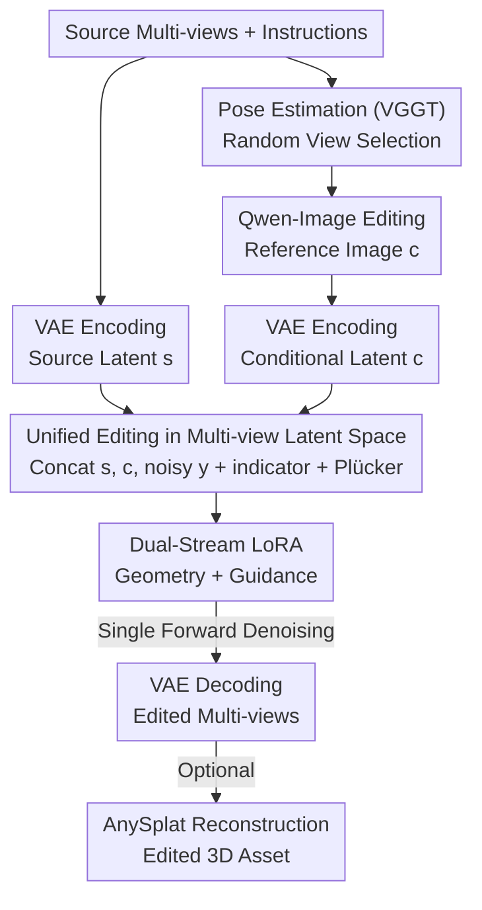

# Omni-3DEdit: Generalized Versatile 3D Editing in One-Pass

**Conference**: CVPR 2026  
**Paper**: [CVF Open Access](https://openaccess.thecvf.com/content/CVPR2026/html/Chen_Omni-3DEdit_Generalized_Versatile_3D_Editing_in_One-Pass_CVPR_2026_paper.html)  
**Code**: https://github.com/mt-cly/Omni3DEdit  
**Area**: 3D Vision  
**Keywords**: 3D Editing, Multi-view Generation, LoRA, Data Synthesis, Diffusion Models

## TL;DR
Omni-3DEdit shifts instructional 3D editing from "iterative optimization on explicit 3D representations" to a **single forward pass in multi-view latent space**. Using OmniNet, a network based on the pre-trained multi-view generation model SEVA, it simultaneously supports object removal, addition, and appearance editing. Equipped with a data synthesis pipeline to address paired data scarcity, it reduces the time for a single edit from dozens of minutes to approximately 2 minutes.

## Background & Motivation

**Background**: Current instructional 3D editing (e.g., InstructN2N, GaussianEditor) follows the "2D model guided iterative optimization of explicit 3D representations" path—repeatedly sampling camera views, calculating gradients with 2D editing/inpainting models, and backpropagating into NeRF or 3D Gaussian, relying on thousands of iterations to compensate for the lack of multi-view consistency in 2D models.

**Limitations of Prior Work**: This approach has two fatal flaws. First is the **lack of versatility**: different editing tasks require different explicit geometric operation rules—appearance editing must preserve source geometry, while object removal significantly alters geometry and depends on masks, making it difficult to design a set of iterative rules compatible with all tasks. Second is **speed**: thousands of iterations cause a single appearance edit to take dozens of minutes, often smoothing out texture details.

**Key Challenge**: Maintaining and updating an explicit 3D representation while ensuring consistency is inherently slow and difficult to generalize. Later works (Tailor3D, CMD) tried single unified editing in **object-level 3D latent space**, but they were trained only on object-centric datasets (like ObjaVerse), bound to specific camera pose distributions and background-less single objects, and **cannot handle scene-level inputs with backgrounds or arbitrary views**.

**Goal**: To create a unified, fast 3D editing model capable of processing scene-level arbitrary views, covering three tasks: removal, addition, and appearance editing.

**Key Insight**: The authors shift the editing battlefield from "explicit 3D / object-level latent space" to **multi-view latent space**—directly taking multi-view images of arbitrary views + editing instructions, outputting a consistent set of edited multi-views, and subsequently using a reconstruction model (AnySplat) to retrieve 3D assets in seconds. This leverages recent progress in multi-view generation, 2D editing, and 3D reconstruction while naturally supporting scene-level and arbitrary views.

**Core Idea**: First, use an off-the-shelf 2D editor (Qwen-Image) to edit a "reference view" selected randomly. Then, train OmniNet to **implicitly propagate** this editing signal to all other views via a single forward pass without online optimization.

## Method

### Overall Architecture
Given $N$ arbitrary view images $I_{src}=\{I^1_{src},...,I^N_{src}\}$ of a source 3D scene and an editing instruction $P$, the workflow of Omni-3DEdit is: estimate relative camera poses $p$ for each view using VGGT; randomly select one view to edit according to instructions via Qwen-Image to obtain a **conditional reference image** $I_{cond}$, which carries the "how to edit" signal; encode source views and the conditional view into source latent $s$ and conditional latent $c$ via VAE. OmniNet ($f(\cdot)$) takes source latents, conditional latents, and noisy target latents to denoise all target view latents in one forward pass. These are decoded via VAE into consistent edited multi-views; this set of views can optionally be fed into AnySplat to reconstruct the edited 3D asset in seconds.

The essence of the pipeline: the model **does not preset any task priors**, learning to propagate editing content implicitly based on the "reference view ↔ source view" relationship. Thus, removal, addition, and appearance tasks are handled by the same network in one forward pass.

> The training data generation is an offline pipeline (see Key Design 3) that produces paired "pre-/post-edit multi-views" to drive OmniNet training, separate from the inference process shown above.

### Key Designs

**1. Unified Editing Paradigm in Multi-view Latent Space: Three Tasks in One Pass**

To address the "lack of versatility + slow speed" of explicit 3D methods, the authors stop maintaining explicit geometry. Instead, OmniNet processes three sets of latents in sequence space: source latent $s$, conditional latent $c$, and noisy target latent $y_\sigma$. During training, target latents are added with EDM noise $y^n_\sigma = y^n + \sigma\epsilon$. The three sets are **concatenated along the sequence dimension** (rather than adding new modules), identifying their roles in the feature space using **indicators** (-1, 1, 0) for $s$, $c$, and $y_\sigma$ respectively. Source view poses are converted to **Plücker embeddings** and injected into conditional and target views to provide perspective geometry. The loss is calculated only on target view latents: $L = \mathbb{E}\big[\|f(y_\sigma, s, c, \sigma)-y\|^2_2\big]$. This design makes zero assumptions about the task, relying solely on the relationship between reference and source views, making it compatible with removal, addition, and appearance editing. Inference is a single denoising step without online optimization, reducing time from dozens of minutes to approximately 2 minutes. Ablations show indicators and poses are essential: without indicators, PSNR drops from 17.72 to 15.20; without poses, it drops to 14.54.

**2. Dual-Stream LoRA: Decoupled Parameterization for the "Source View Bypass" Problem**

When adapting SEVA to ingest source view latents, the authors found significant performance degradation in both feature-space and sequence-space concatenation—the model lost target generation capabilities and failed to preserve context from source views. The root cause is **using shared projection layers to process inputs with completely different functions**: conditional views provide precise "editing signals," while source views provide "original context and texture" across poses. Forcing shared layers to encode these distinct latents introduces learning conflicts. Consequently, OmniNet maintains two independent parameters in each SEVA block: **Geometry LoRA** for source latents $s$ to capture geometric priors, and **Guidance LoRA** to propagate editing signals from $c$ to $y_\sigma$. The two streams exchange geometric cues and guidance in shared multi-view attention layers. This differs from MM-DiT as it uses parameter-efficient LoRA to leverage SEVA priors without full duplication and demonstrates that dual-stream paradigms are effective for **same-modality but distinct-role** inputs (both are visual latents, but one is source and one is condition).

**3. Paired Data Synthesis Pipeline: Large-scale Training Pairs via Multi-view Priors**

The primary challenge is the lack of "pre-/post-edit" paired scene-level multi-view data. The key observation is that view-wise removal or appearance editing usually introduces only minor inconsistencies, which can be refined; however, addition causes severe geometric inconsistencies that are better handled via **reverse generation**. A four-stage pipeline was built using CO3Dv2, DL3DV, and WildRGB-D: ① Instruction generation (Gemini-2.5pro selects ideal objects and generates instructions); ② View-wise editing (Qwen-Image performs frame-wise foreground removal); ③ Consistency refinement (inspired by SDEdit, adding 20% noise to all edited views and denoising with SEVA to smooth frame-wise discrepancies); ④ Quality filtering (mLLM checks for instruction compliance, consistency, and artifacts). Addition tasks use the **reverse approach**: treating the original multi-view as the target and the output of the removal pipeline as the source, ensuring target views are inherently consistent without extra masks. This constructed ~90k paired samples (Removal 27K, Addition 28K, Appearance 23K).

### Loss & Training
Training follows the SEVA paradigm: EDM noise addition, loss calculated only on target view latents (Eq. 2), using Eps-weighting MSE with SNR shift. Implementation details: LoRA rank=8, OmniNet trained for 4000 steps, batch size 32, 16 H20 GPUs, 50 denoising steps, 576×576 resolution, constant AdamW learning rate $1\times10^{-4}$, cameras normalized to $[-2,2]$, $N=10$.

## Key Experimental Results

### Main Results
360° Object Removal (360-USID, 7 scenes, metrics calculated inside object mask, mean PSNR↑/LPIPS↓):

| Method | PSNR ↑ | LPIPS ↓ | Remarks |
|------|--------|---------|------|
| SPIn-NeRF | 16.734 | 0.464 | Requires mask |
| Gaussian Grouping | 16.074 | 0.480 | Easily damages adjacent objects |
| Aurafusion360 | 17.661 | 0.388 | Strong baseline, but ~30min |
| **Omni-3DEdit (Ours)** | **17.722** | 0.395 | Mask-free, approx. 2min |

Object Addition (CO3Dv2 val set, evaluated via NVS per MVInpainter protocol):

| Method | PSNR ↑ | LPIPS ↓ | CLIP-T ↑ |
|------|--------|---------|----------|
| ZeroNVS | 14.56 | 0.716 | 0.196 |
| MVInpainter | 19.20 | 0.344 | 0.271 |
| **Omni-3DEdit (Ours)** | **20.67** | **0.278** | **0.277** |

Complex 3D Editing (Combination of removal/addition + multi-round edits, self-built benchmark):

| Method | CLIP-T/I | CLIP-Dir. | Gemini score | Time |
|------|----------|-----------|--------------|------|
| DGE | 0.246 | 0.132 | 1.7 | 5min |
| GaussianEditor | 0.253 | 0.146 | 2.0 | 17min |
| ViCANeRF | 0.257 | 0.141 | 2.2 | 28min |
| Nano-banana | 0.281 | 0.165 | 3.8 | - |
| **Omni-3DEdit (Ours)** | **0.286** | **0.170** | **4.0** | **2min** |

### Ablation Study
Analyzing OmniNet input signals and architecture on 360-USID (SSIM↑/PSNR↑/LPIPS↓):

| Configuration | SSIM ↑ | PSNR ↑ | LPIPS ↓ | Description |
|------|--------|--------|---------|------|
| Omni-3DEdit | 0.925 | 17.72 | 0.395 | Full model |
| SEVA zeroshot | 0.911 | 13.99 | 0.575 | Missing source views, pose misalignment |
| w/o indicator | 0.917 | 15.20 | 0.545 | Lacks explicit signals to differentiate three view types |
| w/o pose | 0.903 | 14.54 | 0.565 | Inferring perspective geometry solely from appearance is too implicit |

Architecture Ablation (Qualitative comparison, Fig.7): Feature-space concatenation causes artifacts/blurring; sequence-space shared layers **bypass source view information**; only Dual-steam LoRA captures both geometric cues and editing guidance, significantly improving quality.

### Key Findings
- **Architecture is critical to success**: Source and conditional views play different roles; shared projection layers cause source information to "disappear." Decoupled parameterization in Dual-stream LoRA is the core performance driver.
- **Input signals are indispensable**: Missing indicators or camera poses drops PSNR by 2–3 points, confirming the model relies on "explicit view role differentiation + perspective geometry."
- **Overwhelming efficiency advantage**: Compared to Aurafusion360 (30min) and ViCANeRF (28min), Ours completes in 2min without masks and with higher quality.

## Highlights & Insights
- **Redefining "Unified 3D Editing" as a multi-view propagation problem**: Instead of worrying about explicit geometry updates, the network learns to "propagate editing from reference to other views," covering three tasks in a single pass.
- **Same-modality Dual-stream LoRA**: Proves that MM-DiT-style dual streams are not just for cross-modal tasks but also for "same-modality, distinct-role" (source vs. condition) visual latents—an inductive bias transferable to other multi-input generation tasks.
- **Reverse generation for addition tasks**: Simply reversing the data flow converts removal data into addition data, ensuring multi-view consistency and eliminating the need for masks.

## Limitations & Future Work
- Scarcity of open-source scene-level data; the pipeline depends on the performance ceiling of 2D editors and quality filters.
- Appearance editing lacks public numerical benchmarks and relies on qualitative/Gemini evaluations.
- Heavy reliance on a chain of off-the-shelf models (VGGT, Qwen-Image, SEVA, AnySplat); failure in any link propagates to the final result; poor reference view selection impacts quality.
- Future work: Change reference view selection from random to intelligent strategies or introduce multi-reference views to mitigate insufficient guidance.

## Related Work & Insights
- **vs. Explicit 3D (InstructN2N / GaussianEditor)**: They iterate thousands of times to ensure consistency and are task-specific; Ours is a single forward pass, task-agnostic, and approx. 2min, due to abandoning explicit geometry updates.
- **vs. Object-level latent (Tailor3D / CMD)**: They allow single-pass unified editing but are bound to object-centric data/poses; Ours supports arbitrary views and scene-level inputs in multi-view space.
- **vs. Video/Multi-view latents (DGE / V2Edit / Pro3D-Editor)**: Video models have weak 3D priors and lack pose awareness; Ours explicitly injects Plücker poses and indicators with Dual-stream LoRA for superior efficiency/quality.

## Rating
- Novelty: ⭐⭐⭐⭐⭐ Reframing 3D editing as multi-view latent propagation + Dual-stream LoRA is innovative and coherent.
- Experimental Thoroughness: ⭐⭐⭐⭐ Solid quantitative results for removal/addition; appearance editing lacks numerical benchmarks.
- Writing Quality: ⭐⭐⭐⭐ Clear logic from motivation to architecture and ablation.
- Value: ⭐⭐⭐⭐⭐ High practical value by reducing edit time to 2min and unifying tasks.

<!-- RELATED:START -->

## Related Papers

- [\[CVPR 2026\] Towards Generalized Multimodal Homography Estimation](towards_generalized_multimodal_homography_estimation.md)
- [\[CVPR 2026\] Revisiting 3D Reconstruction Kernels as Low-Pass Filters](revisiting_3d_reconstruction_kernels_as_low-pass_filters.md)
- [\[CVPR 2026\] Easy3E: Feed-Forward 3D Asset Editing via Rectified Voxel Flow](easy3e_feed-forward_3d_asset_editing_via_rectified_voxel_flow.md)
- [\[CVPR 2025\] Fast3R: Towards 3D Reconstruction of 1000+ Images in One Forward Pass](../../CVPR2025/3d_vision/fast3r_towards_3d_reconstruction_of_1000_images_in_one_forward_pass.md)
- [\[CVPR 2026\] UniSH: Unifying Scene and Human Reconstruction in a Feed-Forward Pass](unish_unifying_scene_and_human_reconstruction_in_a_feed-forward_pass.md)

<!-- RELATED:END -->
