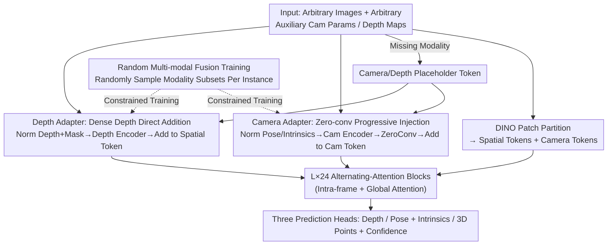

# OmniVGGT: Omni-Modality Driven Visual Geometry Grounded Transformer

**Conference**: CVPR 2026  
**Paper**: [CVF Open Access](https://openaccess.thecvf.com/content/CVPR2026/html/Peng_OmniVGGT_Omni-Modality_Driven_Visual_Geometry_Grounded_Transformer_CVPR_2026_paper.html)  
**Code**: https://livioni.github.io/OmniVGGT-official/ (Project Page)  
**Area**: 3D Vision  
**Keywords**: 3D Foundation Model, Multi-modal Geometric Priors, Zero-Convolution Injection, Random Modality Fusion, VLA  

## TL;DR
OmniVGGT introduces a lightweight GeoAdapter to feed-forward 3D foundation models like VGGT, enabling the model to flexibly incorporate an **arbitrary number** of auxiliary geometric modalities (depth, camera intrinsics/poses) during both training and inference. Even with RGB-only input, Ours outperforms VGGT; with auxiliary information, performance gains are substantial, and its integration into VLA models enhances robotic manipulation.

## Background & Motivation

**Background**: "Spatial Foundation Models" exemplified by DUSt3R / MASt3R / VGGT are unifying tasks such as monocular depth, multi-view stereo, camera pose estimation, and 3D reconstruction into a single feed-forward network. These models can regress point clouds, depth, and camera parameters directly from a set of images in seconds, gradually replacing per-scene optimization pipelines like NeRF / 3DGS and traditional SfM.

**Limitations of Prior Work**: Most of these models assume **RGB-only** inputs, discarding readily available geometric cues in reality—VR/AR devices provide RGB-D, autonomous driving employs LiDAR, and robots often have known camera parameters. These priors are wasted. A few multi-modal attempts (e.g., Pow3R) are constrained to a "maximum of two-stream inputs" (e.g., a pair of RGB + a pair of depth), failing to handle scenarios with **arbitrary counts and combinations of inputs** in real-world scenes.

**Key Challenge**: The properties of different geometric modalities vary significantly—depth maps provide **pixel-wise dense** local cues, while camera poses are **global attributes**. Directly forcing encoded camera information into the feature space of a large-scale foundation model can disrupt its carefully learned representations during early training, leading to instability or collapse.

**Goal**: (1) Design a geometric injection mechanism that achieves near-zero overhead without disrupting the foundation model's representation. (2) Allow the model to accept an arbitrary number and combination of auxiliary modalities at test time, rather than requiring a rigid, fixed input structure.

**Key Insight**: Leveraging the "zero-initialization" concept from ControlNet—allowing the injection branch to start from zero and progressively "add" priors, making it equivalent to the original model initially to ensure training stability. This is paired with a training mechanism that randomly samples modality subsets, forcing the model to learn **robust spatial representations** instead of memorizing "input-to-output" shortcuts.

**Core Idea**: A zero-conv driven GeoAdapter is used to progressively inject arbitrary geometric modalities into VGGT, combined with random multi-modal fusion training to support arbitrary input combinations during inference.

## Method

### Overall Architecture
OmniVGGT strictly follows the VGGT backbone: a set of images $I=\{I_i\}_{i=1}^N$ is first partitioned into spatial tokens by DINO, concatenated with learnable camera and register tokens, and fed into $L=24$ layers of Alternating-Attention (AA) blocks (intra-frame self-attention for single-image structure and global self-attention for cross-view aggregation). Finally, three DPT/attention heads output depth maps, camera poses/intrinsics, 3D point maps, and confidence scores.

The modifications in OmniVGGT focus on "how to feed auxiliary geometric priors into this backbone." It accepts an arbitrary number of camera parameters $C=\{C_j\}_{j=1}^Q$ ($Q\le N$) and depth maps $D=\{D_k,M_k\}_{k=1}^O$ ($O\le N$, with validity masks). Images missing auxiliary information are represented by **camera placeholder tokens / depth placeholder tokens**, naturally supporting arbitrary input counts. Priors are injected before each AA block via the GeoAdapter: the camera branch uses zero-conv to add to camera tokens, while the depth branch adds directly to spatial tokens. Random multi-modality fusion is used during training to ensure exposure to various "partial information" combinations.

### Key Designs

**1. Camera Adapter: Progressive Injection of Global Camera Priors via Zero-conv**

Camera pose is a global attribute; direct injection can overwhelm the foundation model feature space, a root cause of early training collapse. OmniVGGT first normalizes camera extrinsics—aligning with the first camera as the origin $G_j' = G_j G_1^{-1}$ and using the average distance to the origin $s=\frac{1}{Q-1}\sum_{j=2}^{Q}\|t_j-t_1\|_2$ as a scale factor to normalize translations, eliminating scale ambiguity. Normalized parameters are parameterized as $g=\{q,t,f\}$ (rotation quaternion, translation, FOV) and fed into **layer-independent** camera encoders $\mathcal{E}^{cam}_l$ to generate auxiliary camera tokens. The critical step is passing these tokens through a zero-conv layer $\mathcal{ZC}_l$ before adding them back to the original camera tokens:

$$\mathbf{e}^\prime_{c,i,l} = \mathbf{e}_{c,i,l} + \mathcal{ZC}_l\!\left(m_i\,\mathbf{e}^{\mathrm{aux}}_{c,i,l} + (1-m_i)\,\mathbf{e}^{\mathrm{plh}}_{c}\right)$$

where $m_i\in\{0,1\}$ indicates if the $i$-th image has camera parameters, otherwise using placeholder token $\mathbf{e}^{\mathrm{plh}}_c$. With zero-conv weights initialized to zero, the injection term is 0 at the start of training, making the model equivalent to VGGT. Priors take effect **progressively**, ensuring stability while adding only 26.8M parameters with inference speed nearly identical to VGGT.

**2. Depth Adapter: Direct Addition for Dense Depth, Avoiding Zero-conv**

Depth maps are pixel-wise dense cues, possessing properties opposite to camera poses. Each auxiliary depth map is normalized by the mean of valid pixels within the batch, concatenated with the mask as $X=[D;M]\in\mathbb{R}^{2\times H\times W}$, and fed into a single-convolutional depth encoder $\mathcal{E}^{dpt}$ to produce auxiliary depth tokens of the same dimension as spatial tokens. These are **directly added** to the corresponding spatial tokens: $\mathbf{e}^\prime_{f,i} = \mathbf{e}_{f,i} + n_i\,\mathbf{e}^{\mathrm{aux}}_{d,i} + (1-n_i)\,\mathbf{e}^{\mathrm{plh}}_{d}$. Ablations revealed that adding zero-conv to the depth branch is actually **detrimental**—the model treats auxiliary depth as noise rather than a useful prior, weakening the injection (Ablation Table (c) Depth ZeroConv shows Abs Rel degrades from 0.106 to 0.505 under full auxiliary info). Use of zero-conv depends on whether the modality is global or dense.

**3. Random Multi-modality Fusion Training: Forcing Robust Representations**

To support arbitrary input combinations at inference, the model must see "partial information" during training. For an image sequence of length $S$, the model uniformly samples $Q\in[0,S]$ to decide how many images receive GT camera parameters (assigned to the first $Q$), and **independently** samples $O\in[0,S]$ for GT depth (assigned to random positions). Additionally, a $p\%$ probability is set for pure RGB batches to ensure stability in no-auxiliary scenarios. This random assignment forces the model to use auxiliary cues to "enhance spatial representation quality" rather than overfitting to a direct mapping. Experiments confirm that injecting auxiliary depth also **improves camera pose estimation** (AUC@30° +6.33 at 100% depth), indicating enhancement of underlying spatial representations.

### Loss & Training
The multi-task loss is adopted from VGGT: $L = L_{camera} + L_{depth} + L_{pmap}$. Camera loss uses $\ell_1$ regression to supervise predicted parameters; depth and point map losses use confidence-aware regression with a gradient-based term to enhance local geometric consistency. The model is trained end-to-end on 19 public datasets (ARKitScenes, BlendedMVS, ScanNet++, TartanAir, Waymo, etc.) using 32 A100 GPUs for 10 days, utilizing gradient checkpointing to save memory.

## Key Experimental Results

> Metrics: **Abs Rel** (Absolute Relative Error, lower is better); **δ<1.25** (Depth Inlier Ratio, higher is better); **RRA/RTA@5°** (Relative Rotation/Translation accuracy within 5°); **AUC@30°** (Area Under the Accuracy Curve for RRA/RTA at different thresholds); 3D reconstruction uses **Acc** (Accuracy) / **Comp** (Completeness, both lower is better) / **NC** (Normal Consistency, higher is better). "w/ D" = 100% depth injection, "K/RT" = intrinsics/relative pose.

### Main Results
In zero-shot monocular depth and camera pose estimation, OmniVGGT outperforms VGGT even with pure RGB and significantly leads Pow3R with auxiliary information:

| Task / Dataset | Metric | VGGT | Pow3R (w/D or w/K) | OmniVGGT (RGB) | OmniVGGT (w/Aux) |
|--------|------|------|----------|------|------|
| Monocular Depth NYU-v2 | δ<1.25↑ | 94.8 | 99.8 (w/D) | 95.8 | **99.9** (w/D) |
| Monocular Depth Sintel | δ<1.25↑ | 67.7 | 54.8 | 68.2 | **90.2** (w/D) |
| Pose Re10K-unseen | AUC@30°↑ | 85.3 | 62.5 (w/K) | 85.9 | **88.5** (w/K+RT) |
| Pose CO3Dv2 | AUC@30°↑ | 88.2 | 82.2 (w/K) | 88.4 | **93.4** (w/K+RT) |
| Multi-view Depth (4 Avg) | rel↓ | 2.0 | 2.7 (w/K+RT) | 2.1 | **1.0** (w/K+RT+D) |

For 3D reconstruction (7-Scenes, 3–5 sparse frames per scene), injecting camera parameters yields a massive 65.4% **Gain** (0.104→0.036), attributed to the extreme difficulty of zero-shot pose estimation in sparse scenes:

| Method | Acc-Mean↓ | Comp-Mean↓ | NC-Mean↑ |
|------|------|------|------|
| VGGT | 0.087 | 0.091 | 0.787 |
| CUT3R | 0.126 | 0.154 | 0.727 |
| OmniVGGT (RGB) | 0.104 | 0.112 | 0.763 |
| OmniVGGT w/ D | 0.085 | 0.085 | 0.789 |
| OmniVGGT w/ (K+RT) | 0.037 | 0.049 | 0.778 |
| OmniVGGT w/ (K+RT+D) | **0.036** | **0.036** | **0.810** |

Efficiency-wise, OmniVGGT is the first to support arbitrary numbers of auxiliary inputs while maintaining ~0.2s inference time (approx. 30× faster than Pow3R).

### Ablation Study
GeoAdapter architecture ablation (Sintel, full K+RT+D setting):

| Architecture Variant | Abs Rel↓ | RTA@5°↑ | AUC@30°↑ | Explanation |
|------|---------|---------|---------|------|
| (a) Replace | 0.655 | 57.61 | 77.83 | Directly replacing camera tokens; worst |
| (b) One-Layer Adapter | 0.133 | 60.89 | 81.66 | Single injection before AA; insufficient prior |
| (c) Depth ZeroConv | 0.505 | 71.66 | 84.12 | Zero-conv for depth; depth treated as noise |
| (d) OmniVGGT (Full) | **0.106** | **76.33** | **85.99** | Zero-conv for camera, direct addition for depth |

Scaling of auxiliary information (Sintel, progressive GT injection) shows strong scalability: injecting only 30% depth reduces Abs Rel by 69.71%; 100% camera injection significantly boosts pose RTA@5° (54.01→76.33).

### Key Findings
- **Zero-conv usage is modality-dependent**: Global camera priors must be injected via zero-conv for stability, whereas dense depth priors perform best with direct addition. Applying zero-conv to depth makes the model misidentify it as noise.
- **Cross-task enhancement**: Injecting depth improves pose estimation (AUC@30° +6.33), proving GeoAdapter enhances the shared spatial representation.
- **Highest gains in sparse/non-overlapping scenes**: The 65.4% improvement on 7-Scenes occurs because auxiliary priors bridge the gap where pose estimation from scratch is most difficult.

## Highlights & Insights
- **"Per-modality injection strategy" is the core insight**: Global attributes (camera) need zero-conv for stabilization, while dense cues (depth) favor direct addition. This distinction clarifies how to inject heterogeneous priors into foundation models.
- **Placeholder tokens + random modality sampling = elegant solution for arbitrary combinations**: This approach avoids training separate models for different input combinations, greatly simplifying engineering.
- **Zero-cost practicality**: With only 26.8M extra parameters and inference speed comparable to VGGT (30× faster than Pow3R), plus the ability to improve VLA for robotics (zero-shot improvement of +0.43 Avg. Len on CALVIN), the design is highly deployable.

## Limitations & Future Work
- Auxiliary modalities currently only cover depth and camera parameters; LiDAR point clouds, IMU, and semantics are not yet integrated.
- Random modality fusion training uses uniform sampling and a fixed $p\%$ RGB probability; the impact of different sampling distributions on robustness needs further study.
- High training cost (32×A100 for 10 days) and reliance on 19 large-scale datasets create a high barrier to reproduction.
- Evaluation focuses on public benchmarks; generalization to highly dynamic "in-the-wild" scenes (e.g., challenges in ORBIT) requires further verification.

## Related Work & Insights
- **vs. VGGT**: VGGT only accepts RGB; OmniVGGT adds GeoAdapter and slightly outperforms it on RGB-only due to more robust representations, while significantly leading with auxiliary priors at equal inference speed.
- **vs. Pow3R**: Pow3R also handles multi-modal injection but supports limited inputs and uses slow alignment (>7s). OmniVGGT supports arbitrary inputs, is 30× faster, and is more effective (16% lead on Re10K) due to zero-conv and random fusion training.
- **vs. DUSt3R/MASt3R/CUT3R**: These models provide different efficiency/accuracy trade-offs for 3D representation but remain RGB-centric. OmniVGGT addresses the neglected dimension of incorporating existing geometric priors.

## Rating
- Novelty: ⭐⭐⭐⭐ "Per-modality injection + random fusion for arbitrary inputs" is a clean and insightful design, though it remains an incremental adapter on VGGT.
- Experimental Thoroughness: ⭐⭐⭐⭐⭐ Covers monocular/multi-view depth, MVS, pose, 3D reconstruction, and VLA across five tasks; includes detailed scaling and architecture ablations.
- Writing Quality: ⭐⭐⭐⭐ Methodology and motivation are clear; analysis of modality differences for zero-conv is particularly strong.
- Value: ⭐⭐⭐⭐⭐ Zero-cost, flexible combinations, and VLA integration significantly push 3D foundation models toward practical utility.

<!-- RELATED:START -->

## Related Papers

- [\[CVPR 2026\] GGPT: Geometry-Grounded Point Transformer](ggpt_geometry_grounded_point_transformer.md)
- [\[CVPR 2026\] MVGGT: Multimodal Visual Geometry Grounded Transformer for Multiview 3D Referring Expression Segmentation](mvggt_multimodal_visual_geometry_grounded_transformer_for_multiview_3d_referring.md)
- [\[ICLR 2026\] Quantized Visual Geometry Grounded Transformer](../../ICLR2026/3d_vision/quantized_visual_geometry_grounded_transformer.md)
- [\[CVPR 2026\] DVGT: Driving Visual Geometry Transformer](dvgt_driving_visual_geometry_transformer.md)
- [\[CVPR 2026\] Fast Spatial Tracking with Visual Geometry Transformer](fast_spatial_tracking_with_visual_geometry_transformer.md)

<!-- RELATED:END -->
