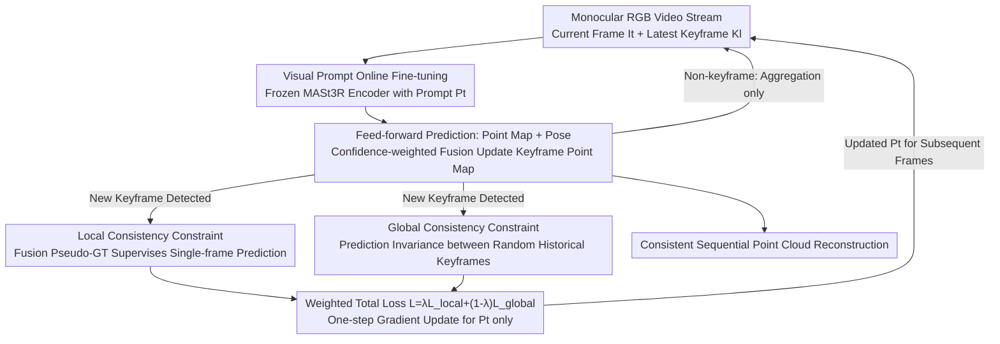

# Online3R: Online Learning for Consistent Sequential Reconstruction Based on Geometry Foundation Model

**Conference**: CVPR 2026  
**Paper**: [CVF Open Access](https://openaccess.thecvf.com/content/CVPR2026/html/Zhou_Online3R_Online_Learning_for_Consistent_Sequential_Reconstruction_Based_on_Geometry_CVPR_2026_paper.html)  
**Code**: [Project Page](https://shunkaizhou.github.io/online3r-1.0/)  
**Area**: 3D Vision  
**Keywords**: Sequential reconstruction, geometry foundation model, visual prompt tuning, test-time self-supervision, consistency constraint

## TL;DR
Online3R integrates a set of lightweight learnable visual prompts into a frozen geometry foundation model (MASt3R-SLAM), updating them online during test time via "local fusion pseudo-ground truth + global reference frame invariance" self-supervised constraints. This allows the feed-forward reconstruction network to adapt to new scenes during the reconstruction process, thereby eliminating inconsistency and long-range drift in sequential reconstruction and outperforming previous SOTA on multiple pose and geometry benchmarks.

## Background & Motivation
**Background**: Restoring consistent geometry from multi-view images is a core technology for robotics and VR/AR. Recent geometry foundation models (DUSt3R, MASt3R, VGGT, etc.) use large-scale pre-trained feed-forward networks to directly predict dense point maps and camera poses from image pairs or multiple views, bypassing the high complexity and computational cost of traditional Bundle Adjustment. To process video streams, two types of sequential reconstruction solutions have emerged: one trains models that support temporal input (Spann3R with memory mechanisms, CUT3R with recurrent networks, Point3R, etc.); the other directly uses pre-trained foundation models (MASt3R-SLAM, VGGT-SLAM) for initial values and applies geometric constraints for back-end optimization.

**Limitations of Prior Work**: The geometric priors of these methods are entirely frozen in pre-trained weights—while they perform well in scenes similar to the training distribution, their single-frame prediction accuracy is limited in unfamiliar environments. Errors accumulate along the trajectory, leading to pose drift and misalignment of the same region. Although MASt3R-SLAM mitigates part of the inconsistency through map fusion, its pose estimation still relies on the inherent consistency of the network outputs, addressing symptoms rather than the root cause.

**Key Challenge**: The authors argue that training a model that works perfectly in all scenes is unrealistic; what is missing is the **capability to adapt to new environments**. However, test-time adaptation faces two hard constraints: the lack of ground truth (GT) for supervision and the requirement for high efficiency in sequential reconstruction.

**Goal**: To enable the model to **learn scene-specific priors online** from streaming data during test time without destroying the general geometric priors of the foundation model, while simultaneously addressing the challenges of "no ground truth" and "efficiency."

**Key Insight**: Drawing inspiration from prompt tuning in NLP/CV (VPT, Test3R), the authors propose inserting a minimal amount of learnable parameters (prompts) into the frozen backbone without modifying the original weights. Prompts are sufficiently lightweight for frequent online updates, while the frozen backbone preserves generalization capabilities.

**Core Idea**: Replace "model retraining" with "online fine-tuning of visual prompts" and drive this online learning with local and global consistency supervision signals distilled from historical reconstruction results to ensure consistency in sequential reconstruction without GT.

## Method

### Overall Architecture
Online3R is built upon MASt3R-SLAM, a real-time dense SLAM system. It processes monocular RGB video streams frame by frame. Each frame $I_t$ is paired with the latest keyframe $K_l$ and fed into the frozen MASt3R network $f_\theta$, outputting per-pixel point maps $X\in\mathbb{R}^{H\times W\times 3}$, confidence maps $C$, and camera poses $T\in\mathrm{Sim}(3)$. A frame is promoted to a new keyframe when its effective matches with the current keyframe fall below a threshold.

Above this frontend, Online3R introduces a crucial component: a set of learnable visual prompts $P_t$ inserted into the MASt3R encoder. This ensures that the feed-forward output is no longer just a function of the input image pair but is also **modulated by the current prompt state**. These prompts are updated whenever a new keyframe is generated via a gradient descent step using a loss combined from "local consistency" and "global consistency" constraints. This online adaptation allows the model to gradually learn a coherent, scene-specific representation along the trajectory.

### Key Designs

**1. Visual Prompt Online Fine-tuning: Adapting Frozen Foundation Models with <1% Parameters**

The backbone weights are fixed, preventing the adjustment of geometric priors for specific scenes, while full fine-tuning is too costly and may damage generalization. Online3R inserts learnable prompts $\{P_{i-1}\}_{i=1}^{N_e}$ into the MASt3R encoder ($N_e$ standard ViT layers). Images are split into patches and embedded as $D$-dimensional tokens $E_0$. In each layer, prompts are concatenated before the tokens:

$$[\,\_\,,\ E_i] = E_i([P_{i-1},\ E_{i-1}])$$

Through self-attention, prompt tokens interact with image tokens to **modulate the feature extraction process** to fit the geometric characteristics of the current scene. The output point map thus becomes a conditional function of the prompt state $P_t$: $(X_t^t, X_l^t)=f_\theta(I_t, K_l; P_t)$. With a prompt length $N_p=32$ and dimension $D=1024$, they are zero-initialized and optimized using AdamW ($lr=1\times10^{-4}$). The minimal parameter count allows frequent online updates without sacrificing speed.

**2. Local Consistency Constraint: Distilling Multi-view Fusion Geometry back to Single-frame Prediction**

Without GT, the system leverages the continuous "fusion" process in MASt3R-SLAM. It aggregates measurements into a keyframe point map using confidence-weighted moving averages. After estimating the relative pose $T_{lt}$ between $I_t$ and $K_l$, the canonical point map is updated pixel-wise:

$$\tilde{X}_l^l \leftarrow \frac{\tilde{C}_l^l\,\tilde{X}_l^l + C_l^t\,(T_{lt}X_l^t)}{\tilde{C}_l^l + C_l^t},\qquad \tilde{C}_l^l \leftarrow \tilde{C}_l^l + C_l^t$$

The fused map $\tilde{X}_l^l$ suppresses noise and single-view ambiguity, serving as a **pseudo-ground truth**. When a frame becomes a new keyframe, a feed-forward pass on $(K_{l-1}, K_l)$ is performed with the current prompts, and the single-frame direct prediction $X_{l-1}^{l-1}$ is supervised by the pseudo-GT via $\ell_1$ distance:

$$\mathcal{L}_{\text{local}}(\tilde{X}_{\text{canon}}, X_{\text{pre}}) = \sum_z \left\| \tilde{X}_{\text{canon}}(z) - X_{\text{pre}}(z) \right\|_1$$

**3. Global Consistency Constraint: Suppressing Long-range Drift via "Reference Frame Invariance"**

To prevent the model from overfitting to local geometry and "forgetting" the global structure, a global constraint is added: **the geometry of a keyframe should remain invariant regardless of which historical frame is used as a reference**. Upon the arrival of keyframe $K_l$, two different historical keyframes $K_{h1}, K_{h2}$ ($h1, h2 < l$) are sampled from the pose graph for independent feed-forward passes: $f_\theta(K_l, K_{h1}; P_t)\to X_l^{l1}$ and $f_\theta(K_l, K_{h2}; P_t)\to X_l^{l2}$. Any deviation indicates inconsistency in the map:

$$\mathcal{L}_{\text{global}}(X_l^{l1}, X_l^{l2}) = \sum_z \left\| X_l^{l1}(z) - X_l^{l2}(z) \right\|_1$$

The total objective is weighted:

$$\mathcal{L}_{\text{total}} = \lambda\,\mathcal{L}_{\text{local}} + (1-\lambda)\,\mathcal{L}_{\text{global}}$$

The update is triggered only at keyframes, ensuring efficiency while progressively learning a scene-specific representation.

### Loss & Training
Online prompt fine-tuning is driven by keyframes. Prompts are zero-initialized $P_0\leftarrow 0$. For each frame in the stream, the system performs feed-forward prediction and fusion. Once a new keyframe is identified, local and global losses are calculated, and a one-step AdamW update is applied to the prompts. The system runs at approximately 10 FPS on a single NVIDIA A100 GPU.

## Key Experimental Results

### Main Results
Pose estimation is evaluated using ATE (RMSE in meters); geometry is evaluated using Accuracy, Completion, and Chamfer Distance. Symbols `*` denote uncalibrated mode.

**Camera Pose (TUM RGB-D, avg ATE↓)**

| Setting | Method | avg ATE |
|------|------|---------|
| Calibrated | GO-SLAM | 0.035 |
| Calibrated | DROID-SLAM | 0.038 |
| Calibrated | MASt3R-SLAM | 0.030 |
| Calibrated | **Online3R (Ours)** | **0.027** |
| Uncalibrated | CUT3R | 0.058 |
| Uncalibrated | MASt3R-SLAM* | 0.060 |
| Uncalibrated | **Online3R\* (Ours)** | **0.056** |

On NRGBD, the performance gain is more significant: avg ATE decreases from 0.090 (MASt3R-SLAM*) to 0.076, significantly leading specialized online reconstruction models like Point3R (0.615) and Spann3R (1.444).

**Dense Reconstruction (7-Scenes / NRGBD, avg Chamfer↓)**

| Type | Method | 7-Scenes Chamf | NRGBD Chamf |
|------|------|----------------|-------------|
| Offline | DUSt3R-GA | 0.164 | 0.149 |
| Offline | Test3R | 0.121 | 0.081 |
| Online | MASt3R-SLAM* | 0.056 | 0.080 |
| Online | **Online3R\* (Ours)** | **0.053** | **0.073** |

In 7-Scenes, Accuracy improved from 0.068 to 0.039, surpassing even offline global alignment methods, demonstrating that online learning truly enhances geometric consistency.

### Ablation Study

| Configuration | 7-Scenes Acc↓ | Description |
|------|---------------|------|
| MASt3R-SLAM* (baseline) | 0.068 | Frozen model, no online learning |
| Local* | 0.042 | Local consistency constraint only |
| Global* | 0.044 | Global consistency constraint only |
| Full* (Ours) | 0.039 | Combination of Local + Global |

### Key Findings
- **Constraints are complementary**: Both Local and Global constraints significantly reduce the baseline error, but their combination achieves the best performance by balancing local accuracy and global stability.
- **Prompts encode scene priors**: Visualizations show that Online3R can recover geometry for non-overlapping pairs where the baseline fails, indicating that prompts successfully learn scene-specific implicit 3D representations.
- **Efficiency-consistency trade-off**: Online learning results in a manageable drop from 13.2 to 10.0 FPS while yielding substantial improvements in ATE and reconstruction accuracy.

## Highlights & Insights
- **Leveraging fusion as pseudo-GT**: Instead of external labels, the method reuses the SLAM backend's confidence-weighted fusion. Distilling this aggregated geometry back to the feed-forward network is a "cost-free" self-distillation.
- **Cheap global regularization**: Reference frame invariance handles long-range drift without the exponential computational overhead found in triple-consistency methods (like Test3R), making it suitable for online sequential tasks.
- **TTA for Geometry Models**: The paradigm of "frozen backbone + online prompt tuning + consistency-based self-supervision" is highly transferable to other geometry-related tasks like depth estimation or dynamic reconstruction.

## Limitations & Future Work
- The additional computational overhead reduces the frame rate (from 13.2 to 10.0 FPS).
- The current system is limited to **static 3D scenes**. Extending the framework to 4D dynamic reconstruction remains a future direction.
- Evaluations are primarily conducted on indoor datasets; performance in large-scale outdoor or high-speed motion scenarios requires further verification.

## Related Work & Insights
- **vs MASt3R-SLAM**: While both use map fusion, Online3R's ability to adapt the network parameters (via prompts) to new scenes results in superior pose and geometry.
- **vs Test3R**: Test3R is designed for offline tasks with high computational complexity. Online3R optimizes the efficiency for sequential streaming data.
- **vs Spann3R / CUT3R / Point3R**: These temporal models often suffer from drift in unfamiliar scenes. Online3R's test-time adaptation significantly reduces cumulative error.

## Rating
- Novelty: ⭐⭐⭐⭐
- Experimental Thoroughness: ⭐⭐⭐⭐
- Writing Quality: ⭐⭐⭐⭐
- Value: ⭐⭐⭐⭐

<!-- RELATED:START -->

- **MASt3R**: Groundwater for the dense SLAM backend.
- **Test3R**: Precursor in using prompt tuning for reconstruction consistency.
- **VPT**: Methodological foundation for visual prompt tuning.

<!-- RELATED:END -->

## Related Papers

- [\[CVPR 2026\] Depth Any Panoramas: A Foundation Model for Panoramic Depth Estimation](depth_any_panoramas_a_foundation_model_for_panoramic_depth_estimation.md)
- [\[CVPR 2026\] 2D-LFM: Lifting Foundation Model without 3D Supervision](2d-lfm_lifting_foundation_model_without_3d_supervision.md)
- [\[CVPR 2026\] Tracking-Guided 4D Generation: Foundation-Tracker Motion Priors for 3D Model Animation](tracking-guided_4d_generation_foundation-tracker_motion_priors_for_3d_model_anim.md)
- [\[CVPR 2026\] Velox: Learning Representations of 4D Geometry and Appearance](velox_learning_representations_of_4d_geometry_and_appearance.md)
- [\[CVPR 2026\] VGGT-360: Geometry-Consistent Zero-Shot Panoramic Depth Estimation](vggt-360_geometry-consistent_zero-shot_panoramic_depth_estimation.md)

<!-- RELATED:END -->
