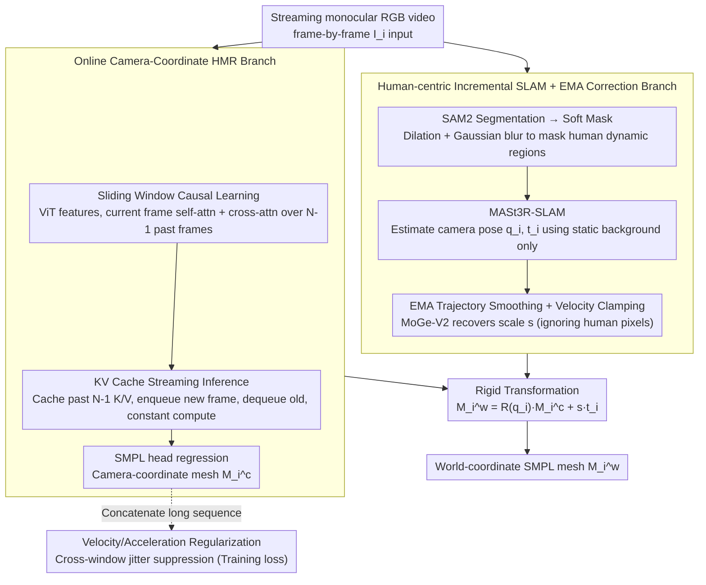

# OnlineHMR: Video-based Online World-Grounded Human Mesh Recovery

**Conference**: CVPR 2026  
**arXiv**: [2603.17355](https://arxiv.org/abs/2603.17355)  
**Code**: [GitHub](https://tsukasane.github.io/Video-OnlineHMR/)  
**Affiliation**: Carnegie Mellon University, University of Pennsylvania
**Area**: 3D Vision  
**Keywords**: Human Mesh Recovery, Online Inference, SLAM, World Coordinates, Causal Reasoning, KV Cache

## TL;DR

Proposes OnlineHMR, the first online world-grounded human mesh recovery framework that simultaneously satisfies four criteria: system causality, faithfulness, temporal consistency, and efficiency. It achieves streaming camera-coordinate HMR through sliding window causal learning + KV cache inference, combined with human-centric incremental SLAM and EMA trajectory correction for online global localization.

## Background & Motivation

**Background**: Human Mesh Recovery (HMR) reconstructs 3D human pose and shape from monocular videos, recently extending from camera coordinates to recovery of global human trajectories and motions in the world coordinate system. Methods such as WHAM, TRAM, and GVHMR have made significant progress.

**Limitations of Prior Work**: (a) Most methods are **offline**—TCMR/GLoT take 16-frame sequences to estimate the middle frame, and TRAM depends on global optimization SLAM; (b) WHAM claims to be online, but its global trajectory module actually relies on offline DPVO/DROID-SLAM (using future frames to correct previous camera poses); (c) Human3R supports online mode but has poor local motion quality and severe jitter (due to the scarcity of human data compared to scene data in 4D scene reconstruction, limiting precision); (d) Real-time interaction scenarios like AR/VR, telepresence, and perception-action loops are currently excluded.

**Key Challenge**: Under strict causal constraints (no looking at future frames, no global optimization), how can one simultaneously ensure global trajectory accuracy and local motion quality?

**Goal**: Decouple the problem into two expert branches—camera-coordinate HMR (precise local motion) and incremental SLAM (global localization)—and bridge them via physical constraints after causalization. This paper proposes four criteria for online processing: (1) System-level causality; (2) Faithful geometry/pose reconstruction; (3) Temporal consistency; (4) Constant time complexity inference efficiency.

## Method

### Overall Architecture

**Input**: Streaming monocular RGB video input frame-by-frame. **Output**: SMPL human mesh $\mathbf{M}_i^w \in \mathbb{R}^{6890 \times 3}$ in the world coordinate system for each frame.

The framework consists of **two parallel branches**:

- **Branch 1: Online Camera-Coordinate HMR**—Based on HMR2.0 (ViT backbone) initialization, it uses sliding window causal attention to fuse temporal information and KV caching for streaming inference. It outputs SMPL parameters (pose $\boldsymbol{\theta}_i \in \mathbb{R}^{23 \times 3}$, shape $\boldsymbol{\beta}_i \in \mathbb{R}^{10}$, root rotation $\mathbf{R}_i^{\text{root}}$, root translation $\mathbf{t}_i^{\text{root}}$) to generate the camera-coordinate mesh $\mathbf{M}_i^c$.
- **Branch 2: Human-centric Incremental SLAM**—SAM2 segments the human → Dilation + Gaussian blur generates a soft mask → Masks dynamic human regions → MASt3R-SLAM incrementally estimates camera poses $\{\mathbf{q}_i^c, \mathbf{t}_i^c\}$ → EMA smoothing and correction → MoGe-V2 recovers the metric depth scale factor $s$.

**Coordinate Transformation**: The world-coordinate mesh is obtained via rigid transformation:

$$\mathbf{M}_i^w = \mathbf{R}(\mathbf{q}_i^c) \cdot \mathbf{M}_i^c + s \cdot \mathbf{t}_i^c$$

Where $\mathbf{R}(\mathbf{q}_i^c)$ is the rotation matrix corresponding to the quaternion $\mathbf{q}_i^c \in \mathbb{R}^4$, and $s$ is the metric scale factor.

### Key Designs

**1. Sliding Window Causal Learning: Aggregating temporal information with current and past frames, not future frames**

Temporal methods like TCMR/MPS-Net/GLoT are offline because they take a 16-frame sequence and output the middle frame, meaning each estimation must wait for $N/2$ future frames—violating streaming system causality. OnlineHMR uses an overlapping sliding window of size $N$ with a stride of 1, where each window covers frames $i-N+1$ to current frame $i$. All frames in the window produce patch-level spatial features via a ViT backbone. The current frame performs self-attention to maintain single-frame detail and acts as a query for cross-attention over the previous $N-1$ frames to aggregate short-term temporal context. Fused features are fed into the SMPL head to regress human parameters, and single-frame outputs from each window are concatenated. Since information only looks backward, causality is structural; because windows are independent, all windows can be computed in parallel during training (non-online, maximizing GPU usage), and switched to frame-by-frame online mode via KV caching during inference.

**2. KV Cache Streaming Inference: Spreading parallel training windows into constant computation during inference**

Causal windows alone are insufficient—if every new frame required recalculating the entire $N$-frame window, compute would grow linearly with window size. Borrowing from autoregressive LLMs, OnlineHMR caches key/value features ($\mathbf{k}_{i-1}\dots\mathbf{k}_{i-N+1}$, $\mathbf{v}_{i-1}\dots\mathbf{v}_{i-N+1}$) of past frames. For a new frame, only the current frame's attention is computed:

$$\mathbf{A}_{\text{self}} = \text{Softmax}\left(\frac{\mathbf{q}_i \mathbf{k}_i^\top}{\sqrt{d}}\right)\mathbf{v}_i, \qquad \mathbf{A}_{\text{cross}} = \text{Softmax}\left(\frac{\mathbf{q}_i \mathbf{k}_{\text{prev}}^\top}{\sqrt{d}}\right)\mathbf{v}_{\text{prev}}$$

Where $d$ is the feature dimension, and $\mathbf{k}_{\text{prev}}$, $\mathbf{v}_{\text{prev}}$ are concatenated from the cache; after calculation, new keys/values are enqueued while the oldest are dequeued, maintaining a cache of $N-1$ frames. This keeps per-frame computation independent of history length, achieving constant time complexity. Training and inference share the same weights and window semantics—training benefits from GPU parallelism while inference uses KV caching to ensure causality and constant compute; training-inference consistency is naturally maintained.

**3. Velocity/Acceleration Regularization: Suppressing jitter across windows on concatenated long sequences**

Single-frame regression can lead to joint jitter at window boundaries. Since the sliding window stride is 1, continuous outputs form a seamless sequence, allowing losses to be applied across concatenated long sequences to penalize joint displacement (velocity) and second-order differences (acceleration):

$$\mathcal{L}_v = \lambda_5 \frac{\sum_{i,t} c_{i,t} \|\mathbf{p}_{i,t} - \mathbf{p}_{i,t-1}\|_2^2}{\sum_{i,t} c_{i,t} + \epsilon}, \qquad \mathcal{L}_a = \lambda_6 \frac{\sum_{j,i} c_{j,i} \|\mathbf{p}_{j,i+1} - 2\mathbf{p}_{j,i} + \mathbf{p}_{j,i-1}\|_2^2}{\sum_{j,i} c_{j,i} + \epsilon}$$

Where $\mathbf{p}$ is the joint position relative to the pelvis, $j$ is the joint index, and $c$ is the ground-truth confidence per joint—weighting prevents noise from invisible joints from degrading regularization. This term nearly halves the EMDB-1 Jitter in ablations, serving as a primary driver for local motion smoothness.

**4. Human-centric Incremental SLAM + EMA Correction: Causal global localization in human-centric videos**

Lifting camera-coordinate meshes to world coordinates requires per-frame camera pose and metric scale. However, in human-centric videos, large moving humans break SLAM's static scene assumption. OnlineHMR causalizes this global branch in three steps. First, soft masking: using SAM2 to segment the human region $C_i^h$ and applying dilation followed by Gaussian blur for a continuous confidence mask:

$$C_i^{\text{soft}} = \frac{G_\sigma * (C_i^h \oplus S_k^{(n)})}{\max_p (G_\sigma * (C_i^h \oplus S_k^{(n)}))}$$

Where $S_k^{(n)}$ is the dilation kernel. Compared to binary masks, soft masks avoid sharp edges on human boundaries that SLAM might mistake for features, allowing MASt3R-SLAM to match features only on the static background. Second, EMA trajectory smoothing: maintaining a history buffer of length $B$ and calculating a reference position using exponentially decaying weights $w_m = (1-\alpha)^{B-1-m}$ (normalized so $\sum w_m = 1$):

$$\bar{\mathbf{t}}_i = \sum_{m=0}^{B-1} w_m \mathbf{t}_{i-m}, \quad \Delta\mathbf{t}_i = \mathbf{t}_i - \bar{\mathbf{t}}_i, \qquad \mathbf{t}_i' = \bar{\mathbf{t}}_i + \alpha \Delta\mathbf{t}_i$$

To prevent sudden jumps, residuals undergo velocity-adaptive clamping (threshold $\tau = \lambda_{\text{clamp}} \bar{v}$). Rotations use LERP on quaternions as an approximation of SLERP (flipping hemispheres to ensure positive inner product): $\mathbf{q}_i' = \text{normalize}((1-\alpha)\mathbf{q}_{i-1}' + \alpha \mathbf{q}_i)$. The insight here is not to smooth human motion directly—which would erase extreme movements like rolls—but to smooth the camera trajectory, making the world-coordinate transformation naturally smooth and indirectly regularizing human motion. Third, metric scale recovery: MoGe-V2 estimates metric depth per frame, compared with the SLAM depth map to calculate $s$, intentionally ignoring human pixels. Since humans are blurry in SLAM depth maps and subject to the dolly zoom effect, including them would contaminate the scale.

**5. Frequency Domain Jitter Metric: Measuring motion naturalness with STFT spectra**

Traditional Accel/Jitter are scalar frame-by-frame differences that are insensitive to whether motion "looks human." The authors analyze motion sequences $\mathbf{y}(i) \in \mathbb{R}^{F \times 3J}$ in the frequency domain using Short-Time Fourier Transform:

$$\mathbf{S}(i,f) = \left|\sum_{k=0}^{L-1} \mathbf{y}(k) w(k-i) e^{-j2\pi fk/N_w}\right|$$

Where $w(\cdot)$ is the Hann window. Natural human motion energy is concentrated below 10Hz; high-frequency energy corresponds to unnatural jitter, making this spectrum a more intuitive perception metric than single scalars.

### Loss & Training

Frame-level HMR loss combines standard supervision terms:

$$\mathcal{L}_f = \lambda_1 \mathcal{L}_{2D} + \lambda_2 \mathcal{L}_{3D} + \lambda_3 \mathcal{L}_{\text{SMPL}} + \lambda_4 \mathcal{L}_V$$

Including 2D re-projection, 3D joints, SMPL parameters, and 3D vertices. The total loss includes cross-window velocity/acceleration regularization:

$$\mathcal{L} = \mathcal{L}_f + \mathcal{L}_v + \mathcal{L}_a$$

Training data includes BEDLAM + 3DPW + H3.6M, converging in approximately 52K iterations on a single H100.

## Key Experimental Results

### Main Results: Camera-Coordinate HMR (EMDB-1 Dataset, unit: mm)

| Method | Type | PA-MPJPE $\downarrow$ | MPJPE $\downarrow$ | PVE $\downarrow$ | Accel $\downarrow$ |
|------|------|:------:|:------:|:------:|:------:|
| HMR2.0 | Frame | 60.7 | 98.3 | 120.8 | 19.9 |
| ReFit | Frame | 58.6 | 88.0 | 104.5 | 20.7 |
| TRAM | Offline | 45.7 | 74.4 | 86.6 | 4.9 |
| GVHMR | Offline | 44.5 | 74.2 | 85.9 | — |
| PHMR | Offline | 40.1 | 68.1 | 79.2 | — |
| TRACE | Online | 71.5 | 110.0 | 129.6 | 25.5 |
| Human3R | Online | 48.5 | 73.9 | 86.0 | — |
| **OnlineHMR** | **Online** | **46.0** | **74.0** | **86.1** | **9.0** |

### Main Results: Global Trajectory in World Coordinates (EMDB-2 Dataset)

| Method | Type | PA-MPJPE $\downarrow$ | WA-MPJPE $\downarrow$ | W-MPJPE $\downarrow$ | RTE(%) $\downarrow$ | ERVE $\downarrow$ |
|------|------|:------:|:------:|:------:|:------:|:------:|
| WHAM+DPVO | Offline | 38.2 | 135.6 | 354.8 | 6.0 | 14.7 |
| TRAM | Offline | 38.1 | 76.4 | 222.4 | 1.4 | 10.3 |
| PHMR | Offline | — | 71.0 | 216.5 | 1.3 | — |
| TRACE | Online | 58.0 | 529.0 | 1702.3 | 17.7 | 370.7 |
| Human3R | Online | — | 112.2 | 267.9 | 2.2 | — |
| **OnlineHMR** | **Online** | **40.1** | **93.5** | **310.4** | **2.2** | **12.4** |

### Efficiency Comparison

| Method | Online | FPS $\uparrow$ | Avg Latency (s) $\downarrow$ | WA-MPJPE $\downarrow$ |
|------|:------:|:------:|:------:|:------:|
| SLAHMR | ✗ | 0.1 | 2435 | 326.9 |
| TRAM | ✗ | 2.1 | 115.95 | 76.4 |
| WHAM+DPVO | ✗ | 9.3 | 26.18 | 135.6 |
| Human3R | ✓ | 4.8 | 0.21 | 112.2 |
| **OnlineHMR** | **✓** | **3.3** | **0.30** | **93.5** |

### Ablation Study

**Velocity Regularization Ablation (Accel / Jitter metrics)**:

| Setting | 3DPW Accel $\downarrow$ | 3DPW Jitter $\downarrow$ | EMDB-1 Accel $\downarrow$ | EMDB-1 Jitter $\downarrow$ |
|------|:------:|:------:|:------:|:------:|
| Without Velocity Reg | 8.9 | 32.3 | 15.7 | 70.1 |
| **With Velocity Reg** | **6.4** | **19.5** | **9.0** | **33.7** |

**SLAM Masking Strategy Ablation (ATE metric, lower is better)**:

| SLAM Method | No Mask | Hard Mask | Soft Mask |
|------|:------:|:------:|:------:|
| DROID-SLAM | 2.52 | 1.55 | **1.07** |
| MASt3R-SLAM | 1.22 | 0.96 | **0.83** |

### Key Findings

- **Minimal Causal Inference Cost**: On EMDB-1, PA-MPJPE is only 0.3mm higher than offline TRAM (45.7), while Accel is kept within a reasonable range.
- **Leading Performance Among Online Methods**: Camera-coordinate accuracy significantly outperforms TRACE (PA-MPJPE 46.0 vs 71.5), and global WA-MPJPE is 18.7 lower than Human3R (93.5 vs 112.2).
- **Effective Velocity Regularization**: Jitter dropped from 32.3/70.1 to 19.5/33.7 (3DPW/EMDB-1), a ~50% reduction.
- **Soft Mask Superiority**: ATE for MASt3R-SLAM improved from 1.22 (No Mask) → 0.96 (Hard Mask) → 0.83 (Soft Mask).
- **Low Latency for Online Mode**: Average latency of 0.30s vs 115.95s for offline TRAM (~400× speedup).
- **Reasons for High W-MPJPE**: Metric scale recovery is not yet sufficiently precise—accurate WA-MPJPE with higher W-MPJPE suggests the trajectory shape is correct but scale drift exists across incremental frames.

## Highlights & Insights

- **KV Cache for Causalization**: Decouples non-online training (GPU efficient via parallel windows) from online inference (causal and constant-time computation). This pattern is transferable to any online video understanding task.
- **Indirect Smoothing**: Smooths the *camera* to smooth the *human*. This avoids applying motion priors that might restrict extreme actions, bypassing the poor generalization of motion priors.
- **Expert Branch Decoupling**: Separates local motion and global localization to avoid the accuracy issues of end-to-end models like Human3R caused by unbalanced training data (4D scene data >> human data).
- **Formalized Online Criteria**: Systematizes online HMR requirements into four dimensions (causality/faithfulness/consistency/efficiency), providing a clear evaluation framework.
- **Frequency Domain Jitter Metric**: STFT-based analysis aligns better with human perception of jitter than traditional scalars.

## Limitations & Future Work

1. **World Coordinate Accuracy Gap**: WA-MPJPE of 93.5 remains higher than offline TRAM (76.4) and PHMR (71.0); metric scale recovery is the bottleneck.
2. **Scale Drift**: W-MPJPE suggests that incremental scale estimation for subsequent frames is unstable, potentially accumulating errors over long sequences.
3. **Manual EMA Tuning**: Hyperparameters like $\alpha$, $B$, and $\lambda_{\text{clamp}}$ are sensitive to motion types; extreme motions may be over-smoothed.
4. **Assumption of Continuous Viewpoints**: Cannot handle sudden camera cuts or multi-camera inputs.
5. **Dependency on External Models**: Use of SAM2, MoGe-V2, and MASt3R-SLAM increases system complexity.
6. **Unsystematized Multi-person Scenarios**: While multi-person visualizations were shown, no quantitative evaluation was performed.
7. **Metric Acceptance**: Community acceptance of frequency domain metrics is yet to be verified.

## Related Work & Insights

- **vs TRAM**: Both use two-branch architectures, but TRAM uses global optimization SLAM (offline). OnlineHMR switches to incremental SLAM + EMA, sacrificing slight accuracy (WA-MPJPE +17.1) for ~400× lower latency.
- **vs Human3R**: End-to-end online reconstruction based on implicit constraints (CUT3R). Suffers from jittery/inaccurate local motion. OnlineHMR's decoupling provides higher local (PA-MPJPE 46.0 vs 48.5) and global accuracy (WA-MPJPE 93.5 vs 112.2).
- **vs WHAM**: Online in camera coordinates but offline globally (DPVO uses future frames). OnlineHMR is the first to achieve full-system online capability.

## Rating

- Novelty: ⭐⭐⭐⭐ First global HMR system strictly satisfying four online criteria; KV cache design and indirect smoothing are novel.
- Experimental Thoroughness: ⭐⭐⭐⭐ Standard benchmarks + in-the-wild videos + efficiency analysis + intensive ablations.
- Writing Quality: ⭐⭐⭐⭐ Clear problem definition (four criteria), well-organized system design, and explicit motivation-solution mapping.
- Value: ⭐⭐⭐⭐ Direct engineering value for real-time applications like AR/VR and robotics.

<!-- RELATED:START -->

## Related Papers

- [\[CVPR 2026\] Fall Risk and Gait Analysis using World-Spaced 3D Human Mesh Recovery](fall_risk_gait_analysis_hmr.md)
- [\[CVPR 2026\] Anny-Fit: All-Age Human Mesh Recovery](anny-fit_all-age_human_mesh_recovery.md)
- [\[CVPR 2025\] PromptHMR: Promptable Human Mesh Recovery](../../CVPR2025/3d_vision/prompthmr_promptable_human_mesh_recovery.md)
- [\[CVPR 2026\] ResiHMR: Residual-Limb Aware Single-Image 3D Human Mesh Recovery for Individuals with Limb Loss](resihmr_residual-limb_aware_single-image_3d_human_mesh_recovery_for_individuals_.md)
- [\[ECCV 2024\] Global-to-Pixel Regression for Human Mesh Recovery](../../ECCV2024/3d_vision/global-to-pixel_regression_for_human_mesh_recovery.md)

<!-- RELATED:END -->
