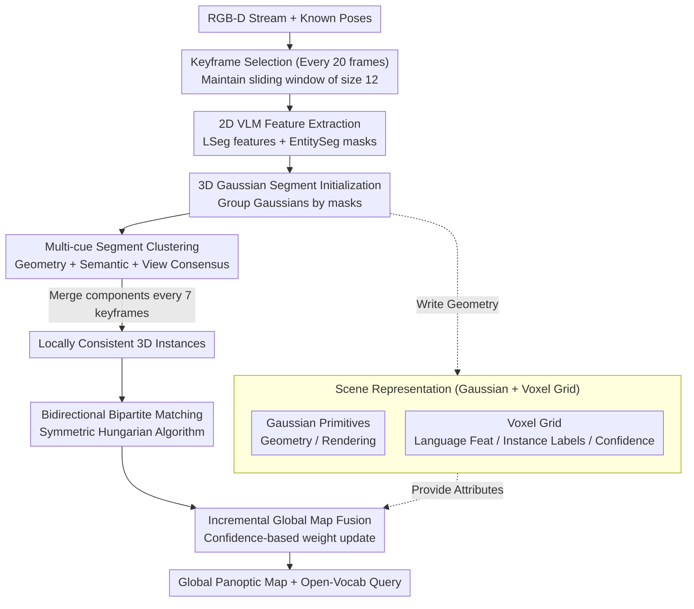

# OnlinePG: Online Open-Vocabulary Panoptic Mapping with 3D Gaussian Splatting

**Conference**: CVPR 2026  
**arXiv**: [2603.18510](https://arxiv.org/abs/2603.18510)  
**Institution**: State Key Lab of CAD&CG, Zhejiang University; VIVO BlueImage Lab; HKUST  
**Area**: 3D Vision  
**Keywords**: Panoptic Mapping, Open-Vocabulary, 3D Gaussian Splatting, Online Reconstruction, Instance Segmentation

## TL;DR

Ours proposes OnlinePG, the first online open-vocabulary panoptic mapping system based on 3DGS. By employing a local-to-global paradigm—constructing locally consistent 3D instances within a sliding window via a multi-cue clustering graph (geometric overlap, semantic similarity, and view consensus), and incrementally fusing them into a global map through bidirectional bipartite matching—it achieves state-of-the-art semantic and panoptic segmentation performance among online methods. On ScanNet, it achieves a mIoU of 48.48 (surpassing OnlineAnySeg by +17.2) with a real-time efficiency of 10-18 FPS.

## Background & Motivation

**Background**: Open-vocabulary 3D scene understanding is fundamental for embodied AI. Recent works have achieved excellent results in offline settings (e.g., LangSplat, OpenGaussian, PanoGS) by lifting 2D VLM (CLIP, LSeg, SAM) features into 3D space (NeRF/3DGS).

**Limitations of Prior Work**:
   - **(a) Offline Constraints**: Most methods (PanoGS, LangSplat, OpenGaussian) require pre-collected complete data and global optimization, making them unsuitable for real-time robotic tasks.
   - **(b) Lack of Instance-level Understanding**: Online methods like O2V-Mapping only provide semantic segmentation and cannot distinguish different instances of the same class.
   - **(c) 2D Segmentation Noise**: 2D segmentations produced by VLMs are inconsistent across multiple views (over-segmentation or under-segmentation), leading to noise accumulation when lifted to 3D.
   - **(d) Slow Convergence of Contrastive Learning**: Offline methods (InstanceGaussian, PanoGS) rely on slow-converging contrastive feature learning for instance clustering, which is inappropriate for online systems.

**Key Challenge**: 2D VLM segmentation results are inconsistent across views, leading to noisy 3D instances. The core problem is how to obtain 3D-consistent panoptic instances and semantics under online streaming input.

**Goal**: (1) Online panoptic (instance + semantic) mapping; (2) Consistently extracting 3D instances from noisy 2D segmentations; (3) Open-vocabulary querying.

**Key Insight**: Resolve 2D inconsistencies locally within a sliding window through multi-cue clustering before performing incremental fusion into the global map.

**Core Idea**: Local-to-global paradigm—multi-cue segment clustering within a sliding window $\rightarrow$ locally consistent instances $\rightarrow$ bidirectional bipartite matching $\rightarrow$ globally consistent panoptic map.

## Method

### Overall Architecture

OnlinePG aims to build a real-time map from RGB-D streams that provides geometry, distinguishes individual object instances, and supports arbitrary text queries. The critical bottleneck is the inherent cross-view inconsistency of 2D VLM (e.g., LSeg, EntitySeg) segmentation masks. Directly lifting these noisy masks to 3D leads to accumulated errors.

The localized solution of OnlinePG is the local-to-global approach: suppressing noise within a small sliding window first, then incrementally merging cleaned local results into the global map. Specifically, the system selects a keyframe every 20 frames and maintains a sliding window of size 12. Each keyframe is processed by a VLM to obtain language features and instance masks, which are used to group projected 3D Gaussians into "segments." Every 7 keyframes, a multi-cue clustering graph merges these segments into locally consistent 3D instances within the window, which are then fused into the global map via bidirectional bipartite matching. The system utilizes a dual representation: continuous Gaussians for geometry and a discrete voxel grid for semantic and instance labels. The final output is a 3D Gaussian panoptic map that supports open-vocabulary queries via the language features stored in the voxel grid.

### Key Designs

**1. Scene Representation: Continuous Gaussians for Geometry and Discrete Voxels for Semantics/Instances**

3D Gaussians are suitable for geometric optimization but unsuitable for stably storing discrete labels like instance IDs. OnlinePG decoupling these tasks: geometry is handled by Gaussians, while semantics and instances are managed by an independent voxel grid.

For geometry, each Gaussian primitive $\mathcal{G}_i := \{\boldsymbol{\mu}_i, \boldsymbol{\Sigma}_i, \sigma_i, \boldsymbol{c}_i\}$ consists of position $\boldsymbol{\mu}_i \in \mathbb{R}^3$, covariance $\boldsymbol{\Sigma}_i \in \mathbb{R}^{3 \times 3}$, opacity $\sigma_i$, and color $\boldsymbol{c}_i \in \mathbb{R}^3$. For semantics, the reconstruction area is voxelized (3cm), with each occupied voxel storing four attributes updated incrementally:

| Attribute | Symbol | Dim | Use |
|-----------|--------|-----|-----|
| Language Feature | $\mathcal{F}$ | $\mathbb{R}^{512}$ | Stores VLM features for open-vocabulary query |
| Feature Confidence | $\mathcal{C}$ | $\mathbb{R}$ | Weight for multi-view feature fusion |
| Instance Label | $\mathcal{T}$ | $\mathbb{R}$ | Panoptic instance ID |
| Instance Weight | $\mathcal{K}$ | $\mathbb{R}$ | Confidence of the instance label for fusion logic |

**2. Multi-cue Segment Clustering: Unifying Inconsistent 2D Segments into 3D Instances**

This step addresses the core pain point: merging projected 3D segments within a sliding window. All segments are treated as graph vertices, and edges are determined by three complementary cues. **Geometric Overlap** $\mathcal{O}$ calculates the symmetric average of the bidirectional visible voxel overlap ratio:

$$\mathcal{O}(\mathcal{S}_i, \mathcal{S}_j) = \frac{1}{2} \cdot \left(\frac{|\mathcal{S}_i \cap \mathcal{S}_j|}{\text{Cont.}(\mathcal{S}_i, \mathcal{S}_j)} + \frac{|\mathcal{S}_i \cap \mathcal{S}_j|}{\text{Cont.}(\mathcal{S}_j, \mathcal{S}_i)}\right)$$

**Semantic Similarity** $\mathcal{X}$ is the cosine similarity of the segment-level language features $z_i$, obtained by pooling LSeg features within labels. **View Consensus** $\mathcal{V}$ measures the proportion of frames where two segments are labeled as the same instance:

$$\mathcal{X}(\mathcal{S}_i, \mathcal{S}_j) = \frac{z_i \cdot z_j}{\|z_i\| \cdot \|z_j\|}, \qquad \mathcal{V}(\mathcal{S}_i, \mathcal{S}_j) = \frac{N_{\text{supp}}(\mathcal{S}_i, \mathcal{S}_j)}{N_{\text{vis}}(\mathcal{S}_i, \mathcal{S}_j)}$$

The final merging criterion uses an "OR" logic: an edge is formed if the sum of geometry and semantics is high **OR** if view consensus is high:

$$\Delta_{ij} = \left((\mathcal{O}_{ij} + \mathcal{X}_{ij}) > \lambda_1\right) \cup \left(\mathcal{V}_{ij} > \lambda_2\right)$$

**3. Bidirectional Bipartite Matching: Robust Global Map Integration**

To merge local instances into the global map without duplication or incorrect merging, a bidirectional matching matrix is used. The forward matrix $\mathcal{M}_{l \to g} \in \mathbb{R}^{n_l \times n_g}$ combines semantic similarity and geometric containment, while the backward matrix $\mathcal{M}_{g \to l} \in \mathbb{R}^{n_g \times n_l}$ reverses the geometric direction:

$$\mathcal{M}_{l \to g} = \frac{z_l \cdot z_g}{\|z_l\| \cdot \|z_g\|} + \frac{|\mathcal{I}_l \cap \mathcal{I}_g|}{\text{Cont.}(\mathcal{I}_l, \mathcal{I}_g)}$$

A match is confirmed only if it is selected by the Hungarian algorithm in both directions:

$$\mathcal{A} = \text{Hung.}(\mathcal{M}_{l \to g}) \cap \text{Hung.}(\mathcal{M}_{g \to l})^T$$

### Loss & Training

3DGS optimization uses a weighted combination of appearance and geometric L1 losses:

$$\mathcal{L} = \alpha \cdot \mathcal{L}_c + (1-\alpha) \cdot \mathcal{L}_d, \quad \alpha = 0.9$$

For each new keyframe, 5 historical frames are randomly selected for 20 optimization iterations. Semantic and instance information is maintained through discrete voxel updates.

## Key Experimental Results

### Main Results (3D Semantic and Panoptic Segmentation)

| Method | Online | Panoptic | ScanNet mIoU↑ | ScanNet mAcc↑ | ScanNet PRQ(T)↑ | ScanNet PRQ(S)↑ | Replica mIoU↑ | Replica PRQ(T)↑ | Replica PRQ(S)↑ |
|------|:----:|:----:|:---:|:---:|:---:|:---:|:---:|:---:|:---:|
| OnlineAnySeg | ✓ | ✓ | 31.28 | 52.20 | 35.98 | 26.27 | 37.48 | 34.19 | 9.13 |
| **OnlinePG (Ours)** | **✓** | **✓** | **48.48** | **66.01** | **37.97** | **41.81** | **47.93** | **41.02** | **12.83** |

### Ablation Study

**Matching Strategy (ScanNet)**: Bidirectional bipartite matching outperforms nearest neighbor and unidirectional matching by +13.3 and +2.14 PRQ(T) points respectively.

**System Components (ScanNet)**: Removing segment clustering drops PRQ(S) by 11.13, indicating its importance for consistent "stuff" segmentation. Removing the feature grid results in a mIoU drop of 18.08.

### Key Findings

- **Online Dominance**: mIoU surpasses OnlineAnySeg by **+17.2** (ScanNet) and **+10.5** (Replica).
- **Panoptic Superiority**: PRQ(S) is **+15.5** higher than OnlineAnySeg on ScanNet; the "stuff" segmentation is significantly improved.
- **Competitive with Offline SOTA**: mIoU is only 2.24 behind PanoGS (offline), and PRQ(S) actually exceeds it (41.81 vs 36.22).
- **Efficiency**: Achieves 10-18 FPS (reconstruction/mapping only), meeting real-time requirements.

## Highlights & Insights

1. **First Online Open-Vocab 3DGS Panoptic System**: Unifies geometric reconstruction, instance segmentation, and open-vocabulary understanding.
2. **Local-to-Global Paradigm**: Decomposes the difficult global consistency problem into manageable local clustering and robust incremental matching.
3. **Multi-cue Clustering**: Uses geometry, semantics, and view consensus as complementary cues to resolve 2D noise in ~350ms per window.
4. **Bidirectional Bipartite Matching**: Improves robustness by requiring consensus from both local-to-global and global-to-local perspectives.
5. **Discrete Voxel Attributes**: Complements continuous Gaussians, ensuring label stability and avoiding gradient-induced blurring of instance boundaries.

## Limitations & Future Work

1. **No Dynamic Object Support**: Currently limited to static environments.
2. **RGB-D Dependency**: Requires depth and known poses.
3. **Front-end Bottleneck**: The 10-18 FPS does not include VLM (LSeg/EntitySeg) inference time.
4. **Indoor Focus**: Primarily validated on indoor datasets like ScanNetV2 and Replica.

## Rating

| Dimension | Score |
|------|:----:|
| Novelty | ⭐⭐⭐⭐ |
| Technical Depth | ⭐⭐⭐⭐ |
| Experimental Thoroughness | ⭐⭐⭐⭐⭐ |
| Writing Quality | ⭐⭐⭐⭐ |
| Value | ⭐⭐⭐⭐⭐ |

<!-- RELATED:START -->

## Related Papers

- [\[CVPR 2026\] EmbodiedSplat: Online Feed-Forward Semantic 3DGS for Open-Vocabulary 3D Scene Understanding](embodiedsplat_online_feed-forward_semantic_3dgs_for_open-vocabulary_3d_scene_und.md)
- [\[CVPR 2026\] OVI-MAP: Open-Vocabulary Instance-Semantic Mapping](ovi-map_open-vocabulary_instance-semantic_mapping.md)
- [\[CVPR 2026\] ExtrinSplat: Decoupling Geometry and Semantics for Open-Vocabulary Understanding in 3D Gaussian Splatting](extrinsplat_decoupling_geometry_and_semantics_for_open-vocabulary_understanding_.md)
- [\[CVPR 2026\] Gaussian Mapping for Evolving Scenes](gaussian_mapping_for_evolving_scenes.md)
- [\[CVPR 2026\] Uncertainty-driven 3D Gaussian Splatting Active Mapping via Anisotropic Visibility Field](uncertainty-driven_3d_gaussian_splatting_active_mapping_via_anisotropic_visibili.md)

<!-- RELATED:END -->
## Related Papers

- [\[CVPR 2026\] EmbodiedSplat: Online Feed-Forward Semantic 3DGS for Open-Vocabulary 3D Scene Understanding](embodiedsplat_online_feed-forward_semantic_3dgs_for_open-vocabulary_3d_scene_und.md)
- [\[CVPR 2026\] ExtrinSplat: Decoupling Geometry and Semantics for Open-Vocabulary Understanding in 3D Gaussian Splatting](extrinsplat_decoupling_geometry_and_semantics_for_open-vocabulary_understanding_.md)
- [\[CVPR 2026\] LightSplat: Fast and Memory-Efficient Open-Vocabulary 3D Scene Understanding in Five Seconds](lightsplat_fast_and_memory-efficient_open-vocabulary_3d_scene_understanding_in_f.md)
- [\[CVPR 2026\] Ov3R: Open-Vocabulary Semantic 3D Reconstruction from RGB Videos](ov3r_open-vocabulary_semantic_3d_reconstruction_from_rgb_videos.md)
- [\[CVPR 2026\] Uncertainty-driven 3D Gaussian Splatting Active Mapping via Anisotropic Visibility Field](uncertainty-driven_3d_gaussian_splatting_active_mapping_via_anisotropic_visibili.md)

<!-- RELATED:END -->
