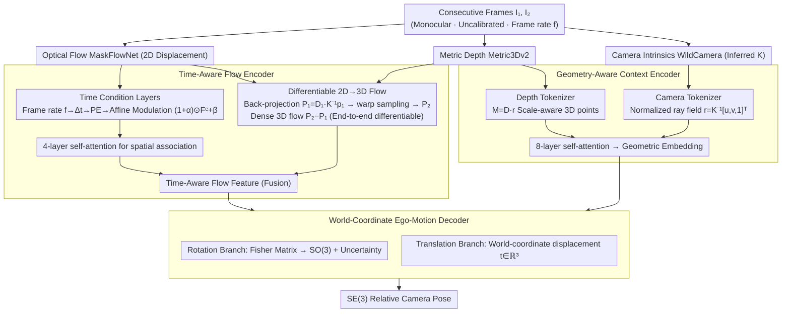

# OpenVO: Open-World Visual Odometry with Temporal Dynamics Awareness

**Conference**: CVPR2026  
**arXiv**: [2602.19035](https://arxiv.org/abs/2602.19035)  
**Code**: [openvo.github.io](https://openvo.github.io/)  
**Area**: 3D Vision  
**Keywords**: Visual Odometry, Temporal Dynamics Awareness, Uncalibrated Camera, 3D Flow Field, Autonomous Driving

## TL;DR

Ours proposes OpenVO, an open-world monocular visual odometry framework that achieves robust metric-scale ego-motion estimation under uncalibrated and variable frame rate conditions. Through a time-aware flow encoder and a geometry-aware context encoder, it achieves over a 20% improvement in cross-dataset ATE and reduces errors by 46%-92% in variable frame rate scenarios.

## Background & Motivation

1.  **Abundant but hard-to-utilize dashcam data**: Dashcam videos from platforms like YouTube contain numerous rare driving events (e.g., collisions), serving as valuable resources for trajectory datasets. However, these videos are typically monocular, uncalibrated, and vary significantly in camera parameters and frame rates.
2.  **Existing VO methods assume fixed frame rates**: Methods like TartanVO, XVO, and ZeroVO are trained and evaluated at fixed frame rates (e.g., 10Hz, 12Hz), ignoring temporal dynamic information, which leads to severe performance degradation when frame rates mismatch.
3.  **Classical methods depend on camera calibration**: Geometric methods such as ORB-SLAM and DSO require known intrinsic parameters and cannot handle uncalibrated open-world observations.
4.  **Learning methods have limited generalization**: Early learning methods trained and tested under similar conditions lack explicit modeling of varying camera geometries, resulting in poor cross-domain performance.
5.  **Neglected temporal overfitting**: While research in reinforcement learning and world models has shown that fixed sampling rate training leads to temporal overfitting, this issue remains largely unexplored in the VO field.
6.  **Scale consistency challenge**: Monocular VO inherently suffers from scale ambiguity. It is impossible to recover real-world scale from appearance alone, requiring the introduction of geometric priors.

## Method

### Overall Architecture

OpenVO aims to solve metric-scale ego-motion estimation for open-world driving videos (monocular, uncalibrated, varying frame rates). It utilizes a two-frame pose regression architecture: inputting two consecutive frames and outputting an SE(3) relative camera pose. The pipeline starts with a time-aware flow encoder that explicitly injects the "current frame rate" into the optical flow and uses a differentiable 2D→3D flow to lift the optical flow into a metric 3D motion field. Subsequently, a geometry-aware context encoder extracts scale priors from inferred camera intrinsics and metric depth. Finally, a world-coordinate ego-motion decoder regresses rotation and translation. These three modules allow the network to perceive both the "time interval between frames" and the "metric scale of the scene."

### Key Designs

**1. Time-Aware Flow Encoder: Encoding frame rates into flow features to combat temporal overfitting**

To address the failure of existing VO methods under varying frame rates, the core is a set of Time Condition Layers. The frame rate $f$ is converted to a time interval $\Delta t = 1/f$ and expanded into high-dimensional embeddings $\text{PE}(\Delta t)$ using sinusoidal position encoding. Two linear layers then generate a pair of affine parameters $\alpha, \beta$ to modulate the optical flow correlation features:

$$\tilde{F^c} = (1 + \alpha) \odot F^c + \beta$$

The modulated features are refined through 4 layers of self-attention. This ensures the network always "knows the current frame rate" when inferring motion structures, avoiding the memorization of motion magnitudes at fixed rates.

**2. Differentiable 2D→3D Flow: Unifying optical flow and depth into an end-to-end trainable motion field**

Optical flow (MaskFlowNet) provides only pixel-level 2D displacement without scale. OpenVO lifts this to 3D using metric depth (Metric3Dv2): pixels are back-projected into 3D points $P_1 = D_1 \cdot K^{-1} p_1$, and the optical flow is used to warp pixels to sub-pixel positions in the second frame. After bilinear sampling of depth and back-projection, $P_2$ is obtained, yielding a dense 3D flow $(P_2 - P_1)$. This entire process is fully differentiable. The 3D flow is processed by 4 self-attention layers and fused with time-modulated flow features.

**3. Geometry-Aware Context Encoder: Metric scale recovery without calibration**

Open-world videos lack camera intrinsics, and monocular vision is inherently scale-ambiguous. OpenVO uses WildCamera to infer intrinsics $K$ and constructs a normalized ray field $r(u,v) = K^{-1}[u,v,1]^\top$ to encode 3D observation directions (Camera Tokenizer). Metric depth $D$ from Metric3Dv2 is applied to these rays to obtain a metric-scale 3D point distribution $M(u,v) = D(u,v) \cdot r(u,v)$ (Depth Tokenizer). Concatenating $[r, M, D]$ into tokens for an 8-layer self-attention module extracts consistent geometric embeddings containing scale information from foundation model priors.

**4. World-Coordinate Ego-Motion Decoder: Decoupling rotation uncertainty and metric translation**

After concatenating the Time-Aware Flow Feature and Geometric Embedding, two MLP branches perform regression: the rotation branch predicts a Fisher matrix $\mathcal{F} \in \mathbb{R}^{3\times3}$ mapped to SO(3) via a Matrix Fisher distribution, modeling directional uncertainty. The translation branch directly regresses the world-coordinate displacement $t_i \in \mathbb{R}^3$. Decoupling these prevents rotation noise from contaminating the scale recovery of the metric translation.

### Loss & Training

**Multi-temporal scale training** is crucial for generalizing to unseen frame rates. Training samples are synthesized by skipping frames of videos at original rate $f_0$ by a factor $k$ (e.g., 12Hz → 6Hz/4Hz). This exposes the model to various temporal scales. In the ablation study, the $\{12/6/4\}$ Hz combination proved optimal. Removing Time Condition Layers caused the KITTI ATE to jump from 93.23 to 152.42 (+64%), confirming the necessity of explicit temporal awareness.

## Key Experimental Results

### Main Results: Cross-Dataset Generalization (Trained only on nuScenes Singapore-OneNorth)

| Method | KITTI ATE | nuScenes ATE | Argoverse2 ATE |
| :--- | :--- | :--- | :--- |
| TartanVO | 103.07 | 6.26 | 7.03 |
| ZeroVO‡ | 123.42 | 8.40 | 5.71 |
| XVO | 168.43 | 8.30 | 5.70 |
| **Ours (OpenVO)✓** | **93.23** | **5.91** | **2.39** |

OpenVO achieves a 24% improvement in KITTI ATE over ZeroVO‡ and a 58% improvement on Argoverse2.

### Variable Frame Rate Robustness

| Setting | OpenVO ATE | ZeroVO‡ ATE | Gain |
| :--- | :--- | :--- | :--- |
| KITTI 2.5Hz | 368.47 | 553.52 | -33% |
| nuScenes 6Hz | 6.07 | 21.55 | -72% |
| Argoverse2 20Hz | 6.47 | 36.14 | -82% |

Across all variable frame rate settings, OpenVO reduces error by 46%-92%.

### Ablation Study

-   **Temporal Encoding Dimension**: $K=8$ (PE dimension 17) is optimal; smaller values underfit temporal changes, while larger values introduce high-frequency oscillations.
-   **Training Frequency Combination**: $\{12/6/4\}$ Hz is optimal. Removing Time Condition Layers increased KITTI ATE from 93.23 to 152.42 (+64%).
-   **Differentiable vs. Non-differentiable 3D Flow**: The differentiable version reduced KITTI ATE from 109.01 to 93.23, providing more consistent trajectory predictions.

## Highlights & Insights

-   **First to model temporal dynamics in VO**: Sinusoidal position encoding combined with affine modulation injects frame rate information into flow features, elegantly solving temporal overfitting.
-   **Fully differentiable 2D→3D flow construction**: Unifies 2D optical flow, metric depth, and inferred intrinsics in an end-to-end pipeline, significantly outperforming non-differentiable versions.
-   **Uncalibrated Open-World VO**: Leverages foundation model priors from WildCamera and Metric3Dv2 to achieve metric scale recovery without ground truth intrinsics.
-   **Multi-temporal scale training strategy**: Frame-skipping augmentation exposes the model to various frame rates, enabling strong generalization to unseen frame rates via the time condition layer.
-   **Dominant advantage in variable frame rate scenarios**: Compared to ZeroVO, errors are reduced by up to 92% in variable frame rate tests, showing significant practical value.

## Limitations & Future Work

-   **Independent depth and intrinsic inference**: Metric3Dv2 and WildCamera operate independently; errors may cascade through the VO pipeline without joint optimization.
-   **Empirical multi-temporal scale settings**: The $\{12/6/4\}$ Hz training combination is manually set; an adaptive sampling strategy might be superior.
-   **Inconsistent gradients from mixed-frequency training**: Local trajectory segment errors ($t_{err}$, $r_{err}$) on KITTI are slightly higher than some baselines due to inconsistent parameter updates from multi-frequency training.
-   **High training cost**: Requires 96 GPU hours (A6000), which is challenging for resource-constrained scenarios.
-   **Untested extreme scenarios**: Very low frame rates (<2Hz), severe occlusions, or highly dynamic scenes have not been fully validated.

## Related Work & Insights

| Method | Calibration Required | Temporal Awareness | 3D Geometric Prior | Extra Data |
| :--- | :--- | :--- | :--- | :--- |
| ORB-SLAM3 | ✓ | ✗ | ✗ | ✗ |
| TartanVO | ✓ (GT Intrinsics) | ✗ | ✗ | ✗ |
| XVO | ✗ | ✗ | ✗ | YouTube Pseudo-labels |
| ZeroVO | ✗ | ✗ | ✓ (3D Flow + Language) | YouTube + Text |
| **OpenVO** | **✗** | **✓** | **✓ (Diff. 3D Flow)** | **✗** |

OpenVO is the only uncalibrated VO method that simultaneously incorporates temporal dynamics awareness and geometric priors without depending on extra data.

## Rating

-   Novelty: ⭐⭐⭐⭐ — First to introduce temporal dynamics awareness to VO; the affine modulation design of Time Condition Layers is elegant and simple. The differentiable 2D→3D flow is also a meaningful contribution.
-   Experimental Thoroughness: ⭐⭐⭐⭐ — Wide coverage across three autonomous driving benchmarks, standard and variable frame rate evaluations, and comprehensive ablations. Lacks tests on extreme frame rates and other sensor modalities.
-   Writing Quality: ⭐⭐⭐⭐ — Clear motivation, smooth methodological description, and rich illustrations with well-defined problems.
-   Value: ⭐⭐⭐⭐ — Effectively addresses practical pain points in open-world dashcam trajectory reconstruction, with direct applications in autonomous driving data collection and large-scale YouTube video analysis.

<!-- RELATED:START -->

## Related Papers

- [\[CVPR 2026\] RayNova: Scale-Temporal Autoregressive World Modeling in Ray Space](raynova_scale-temporal_autoregressive_world_modeling_in_ray_space.md)
- [\[CVPR 2026\] Towards Visual Query Localization in the 3D World](towards_visual_query_localization_in_the_3d_world.md)
- [\[CVPR 2026\] Wanderland: Geometrically Grounded Simulation for Open-World Embodied AI](wanderland_geometrically_grounded_simulation_for_open-world_embodied_ai.md)
- [\[CVPR 2026\] Natural Human Motion Recovery by Aligning High-Order Temporal Dynamics from Monocular Videos](natural_human_motion_recovery_by_aligning_high-order_temporal_dynamics_from_mono.md)
- [\[ICCV 2025\] Ross3D: Reconstructive Visual Instruction Tuning with 3D-Awareness](../../ICCV2025/3d_vision/ross3d_reconstructive_visual_instruction_tuning_with_3d-awareness.md)

<!-- RELATED:END -->
