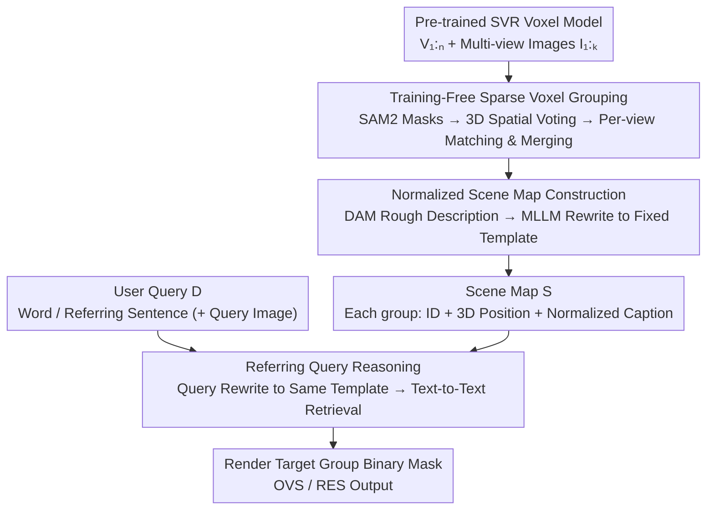

# OpenVoxel: Training-Free Grouping and Captioning Voxels for Open-Vocabulary 3D Scene Understanding

**Conference**: CVPR 2026  
**Paper**: [CVF Open Access](https://openaccess.thecvf.com/content/CVPR2026/html/Huang_OpenVoxel_Training-Free_Grouping_and_Captioning_Voxels_for_Open-Vocabulary_3D_Scene_CVPR_2026_paper.html)  
**Code**: None (The paper states that the code will be open-sourced, "The code will be open")  
**Area**: 3D Vision / Open-Vocabulary 3D Scene Understanding  
**Keywords**: Sparse Voxels, Training-Free, Open-Vocabulary Segmentation, Referring Expression Segmentation, MLLM

## TL;DR
OpenVoxel proposes a **fully training-free** open-vocabulary 3D scene understanding pipeline. For a pre-trained Sparse Voxel Reconstruction (SVR) model, 2D masks from SAM2 are used to cluster voxels into object-level groups via spatial voting. Then, an MLLM is employed to generate structured textual descriptions for each group, constructing a "scene map". Finally, user queries are rewritten into the same format to perform **text-to-text retrieval**, completely bypassing CLIP/BERT embedding alignment. It outperforms ReferSplat (which requires labeled training) by 13 points on Referring Expression Segmentation (RES), while completing processing for a single scene in about 3 minutes (over 10 times faster).

## Background & Motivation

**Background**: The mainstream approach for open-vocabulary 3D scene understanding is to "equip" 3D representations (NeRF / 3DGS / sparse voxels) with language capabilities. Works like LangSplat distill CLIP embeddings into 3D Gaussians, allowing each primitive to carry a language feature and thereby supporting open-vocabulary segmentation (OVS). ReferSplat further targets the more challenging **Referring Expression Segmentation (RES)**—where queries are no longer simple words like "chair" but complete sentences with attributes and spatial relations, e.g., "the white plush sheep on the chair next to the table."

**Limitations of Prior Work**: These methods all encode language information into **learned embedding vectors** that are bound to the fixed embedding manifold of CLIP/BERT, resulting in two major drawbacks. First, the embedding space is adept at short words/labels but struggles with arbitrarily phrased, complex sentences containing reasoning (e.g., "what object can be used to cut paper?"). To support long sentences, ReferSplat must rely on **manually annotated "sentence-object mask" pairs** to train sentence-level embeddings for each scene, which is extremely labor-intensive. Second, training a 3D language field itself is **exceedingly slow**—while ReferSplat's official claim is 58 minutes, the authors' replication found that it actually takes over 2 hours per scene under the official configuration.

**Key Challenge**: Compressing language into a fixed-dimension embedding manifold essentially uses a **lossy, training-aligned** intermediate representation to approximate natural language. This not only restricts expressive flexibility but also shifts the cost burden onto per-scene training.

**Goal**: To eliminate the "training language field" phase completely while retaining the ability to process arbitrarily complex sentence queries.

**Key Insight**: The critical observation is that since modern MLLMs can already directly output rich, human-readable descriptions of images, why compress language into embedding vectors in the first place? It is better to **directly populate the 3D scene with text**, transforming retrieval into "text-to-text comparison" and outsourcing all semantic matching to the reasoning capabilities of LLMs.

**Core Idea**: Replace "training 3D language embeddings + nearest neighbor in embedding space" with "generating readable text descriptions for each 3D object + text-to-text retrieval" to achieve a training-free and annotation-free pipeline.

## Method

### Overall Architecture

Given an SVR model reconstructed from $K$ multi-view images $\{I_i\}_{i=1}^K$ (and poses $\xi_{1:K}$) containing $N$ sparse voxels $\{V_i\}_{i=1}^N$, OpenVoxel aims to assign language information to these voxels to construct a scene map $S$, thereby performing open-vocabulary reasoning on natural language descriptions $D$ (either words or referring expressions). The entire pipeline operates sequentially in three phases: **(1) Training-free sparse voxel grouping** clusters voxels into object-level instances; **(2) Normalized scene map construction** generates structured text descriptions in a fixed format for each group and stores them in $S$ along with 3D positions; **(3) Referring query reasoning** rewrites the user query into the identical format, performs text retrieval on $S$, and renders the target mask. None of the three phases involve any gradient training.

### Key Designs

**1. Training-Free Sparse Voxel Grouping: Lifting 2D Masks to View-Consistent 3D Instances via Spatial Voting**

To transition from per-voxel representations to object-level understanding, voxels belonging to the same object must be clustered together and maintained consistently across views. Existing methods (e.g., Gaussian Grouping) rely on **gradient descent** to learn high-dimensional features per primitive, which is slow and require sequential training. The authors' insight leverages deep Hough voting and spatial embedding: **voxels belonging to the same instance should point to a common 3D center**. Thus, each voxel is extended with a 3D group feature $F_i\in\mathbb{R}^3$ (representing the instance centroid it "votes" for), a confidence weight $W_i$, and a Group Dictionary $G$ recording the centroids of various instances. For a single-frame SAM2 mask $M$, the centroid is first obtained by averaging mask coordinates on the rendered point map for each instance $k$:

$$f^{center}_k = \frac{\sum_{j\in HW}\mathbb{1}(M_j=k)\cdot f^{pts}_j}{\sum_{j\in HW}\mathbb{1}(M_j=k)}$$

Then, the centroid information is accumulated into voxels based on the rendering contribution weight $w_{ij}$ of voxel $i$ to pixel $j$ (i.e., the blending weight in volume rendering, Eq. 1): $F^{t+1}_i = F^t_i + \sum_j w_{ij}f^{center}_{M_j}$, $W^{t+1}_i = W^t_i + \sum_j w_{ij}$. This step follows the update formula of Dr.Splat, but because the group feature is only 3-dimensional, it does not require top-k sampling and can be updated in a single rendering pass. The ingenuity lies in: even if a voxel is misclassified in a specific frame, **the accumulated $F$ and $W$ still force the voxel to "vote" for its most confident group**, naturally suppressing mis-grouping.

**2. Cross-View Frame-by-Frame Matching and Merging: Unifying Independent 2D Mask IDs in 3D Space**

Since the instance IDs output by SAM2 are independent for each frame, the IDs of a new frame $M^{t+1}$ must be aligned with existing 3D groups. The authors' approach is to: first back-project each voxel's instance ID using the current group field—$ID^t_i = \arg\min_j \lVert \frac{F^t_i}{W^t_i} - G^t_j \rVert_2$ (matching the normalized voxel vote to the nearest dictionary centroid) and render it to a projection mask $M^{proj}$; then, for each instance in $M^{proj}$, find the mask in $M^{t+1}$ with the **highest IoU** for matching and replace it with the existing ID. At the same time, $M^{proj}$ is used to prompt SAM2 again to merge highly overlapping masks, **preventing a single object from being erroneously split into two separate IDs**. New masks that neither match nor overlap are assigned a new ID and added to the dictionary. After processing all $K$ frames, the final $ID^K$ is used as the voxel instance grouping. The entire process runs in a single pass without gradients.

**3. Normalized Scene Map Construction: DAM Description + MLLM Rewrite to a Uniform Template, Turning "Object" into "Apple"**

Grouping alone is insufficient for retrieval; each group must be paired with text. The authors first feed an MLLM-based Describe Anything Model (DAM) the binary mask of a group across different views along with the original images to obtain a fine-grained description. However, DAM outputs free-form sentences where the subject is sometimes a vague generic term like "object" (e.g., "a green round object, probably an apple..."), making them incomparable across groups. Thus, an MLLM (Qwen3-VL-8B) is used to **normalize free-form sentences into a fixed template**: `<Category Noun>, <Appearance Details> <Functions/Parts> <Location/Relationship>`. A key engineering point is the **visual prompting strategy**: darkening the region outside the mask and drawing a small red dot on the object, forcing the model to focus on the target area and rewrite it according to the template. Normalization significantly disambiguates descriptions (changing "object" to "apple") and produces stable, comparable captions across views. Each group is stored in $S$ as `{ID, 3D center position, normalized caption}`.

**4. Referring Query Inference: Rewriting Queries into Templates for Text-to-Text Retrieval**

During the retrieval phase, instead of mapping queries and captions to a learned embedding space, OpenVoxel directly performs textual matching on $S$ using an MLLM. To ensure deterministic and stable matching, the user query $D$ (whether a word or a long sentence) is first rewritten using **the same template**—for example, "a funny toy with thin legs that looks interesting in the sun" is normalized into "Toy, yellow, slim legs," aligning immediately with entries in $S$. Then, the **entire scene map $S$** (including all group positions and captions) is input into the MLLM, which selects the caption that best satisfies the query and returns its ID. Since positions are also stored in $S$, even if the query involves spatial relationships like "left of the apple," the MLLM can verify them using the stored centroids. Finally, only the corresponding group of the selected ID is rasterized in the target view to render the binary mask. This inference pipeline is unified for both OVS (pure category queries) and RES (attribute/function/relationship queries), is highly interpretable (selection is based on readable captions), and takes less than 1 second per query.

### An Illustrative Example

Let's trace "green apple" as an example group: in the grouping phase, multi-frame SAM2 votes the voxels of the apple region to the same 3D centroid, and cross-frame IoU matching unifies their IDs; in the mapping phase, DAM looks at the mask + original image and says "green round object, probably an apple...", and Qwen3-VL with a red-dot visual prompt rewrites it into "Apple, light green with fluffy material, a dark green leaf, placed on table", which is stored in $S$ along with the position `[-0.399, 2.06, -1.34]`; in the query phase, a user asks for "light green fruit with green leaves placed on the table", which is first rewritten into the same template, and MLLM matches it to id=1 in $S$, finally rendering only that group to output the apple mask.

## Key Experimental Results

The datasets are mainly based on the LeRF series captured with iPhone Polycam: RES uses Ref-LeRF (ramen/figurines/teatime/kitchen four scenes with sentence-level referring expressions), and OVS uses LeRF-OVS and LeRF-Mask. The base models include SAM2 (grouping and merging), DAM (description), and Qwen3-VL-8B-Instruct (rewriting and retrieval).

### Main Results

**Ref-LeRF (RES, mIoU) — The task showing the most significant advantage**:

| Method | Req. GT | ramen | figurines | teatime | kitchen | Avg. |
|------|--------|-------|-----------|---------|---------|------|
| Grounded SAM | - | 14.1 | 16.0 | 16.9 | 16.2 | 15.8 |
| LangSplat | - | 12.0 | 17.9 | 7.6 | 17.9 | 13.9 |
| GS-Grouping | - | 27.9 | 8.6 | 14.8 | 6.3 | 14.4 |
| GOI | - | 27.1 | 16.5 | 22.9 | 15.7 | 20.5 |
| ReferSplat* (Re-impl.) | ✓ | 31.0 | 20.0 | 25.4 | 21.4 | 24.5 |
| ReferSplat (Paper) | ✓ | 35.2 | 25.7 | 31.3 | 24.4 | 29.2 |
| **OpenVoxel (Ours)** | - | **52.5** | **43.5** | **48.4** | 25.1 | **42.4** |

Without **any description-mask annotations**, OpenVoxel outperforms ReferSplat (original paper) by 13.2% in average mIoU and ReferSplat (re-implementation) by 17.9%. During replication, the authors found that learning sentence-level embeddings in ReferSplat is prone to **overfitting seen descriptions**, resulting in unstable evaluation.

**LeRF-OVS (mIoU)**: OpenVoxel achieves an average of 66.2, outperforming 3DVLGS (64.3) and CCL-LGS (65.1). **LeRF-Mask (mIoU/mBIoU)**: Averages 89.7/86.8, exceeding ObjectGS (88.3/84.4). OVS queries are simpler and method performance is generally >70%, but OpenVoxel maintains its lead simply by slightly adjusting the prompt to emphasize class names + appearance, demonstrating flexibility across different query complexities.

### Ablation Study

Ref-LeRF on-scene ablation (mIoU):

| Config | Mask Merging | Normalized Caption | Normalized Query | mIoU | Description |
|------|---------|-----------|----------|------|------|
| A | - | - | - | 24.3 | Explicit description + text retrieval only |
| B | ✓ | - | - | 28.0 | Adding mask merging, +3.7 |
| C | ✓ | ✓ | - | 36.4 | Adding normalized captioning, +8.4 |
| Ours | ✓ | ✓ | ✓ | 42.4 | Further normalizing query, +6.0 |

### Key Findings
- **Normalized captioning contributes the most** (+8.4 mIoU): Unifying free-form sentences into a fixed template and eliminating vague subjects like "object" is core to retrieval accuracy. This indicates that the bottleneck lies not in "whether text exists" but in "whether the text is standardized and comparable."
- **Query normalization is equally critical** (+6.0): Only when the query and the caption share the same format can text-to-text matching stably align, validating the necessity of the "bidirectional normalization" design.
- **Mask merging** brings +3.7, mainly by reducing noisy small groups and preventing a single object from being split into two.
- **Runtime**: On a single RTX 5090, OpenVoxel takes about 3 minutes per scene (grouping + mapping), which is more than 10 times faster than ReferSplat (>1 hour) and ObjectGS (~40 minutes), with single query times <1 second.

## Highlights & Insights
- **Paradigm shift from "training embeddings" to "populating text + searching text"**: Shifting open-vocabulary 3D understanding from "aligning fixed embedding manifolds" to "LLM retrieval on readable captions." It is training-free and annotation-free while inherently introducing interpretability—the selection criteria for an object is human-readable text.
- **3D spatial voting instead of high-dimensional feature training**: Since the group feature is only 3D (instance centroid), a single rendering pass is sufficient for accumulated votes to converge. This elegantly avoids the slow gradient descent required by methods like Gaussian Grouping and is naturally robust to single-frame mis-groupings.
- **Bidirectional normalization is the key to retrieval success**: Rewriting both captions and queries to the identical `<Category>, <Appearance>, <Function>, <Location>` template. Ablations show these two steps contribute over 14 mIoU in total—transforming the hard semantic matching problem into format alignment is a highly transferable engineering practice.
- **Red-dot visual prompting**: Using dimmed backgrounds and a red-dot prompt to guide generic MLLMs to focus on target areas is a low-cost, practical trick to enable regional descriptions on non-mask-specialized models.

## Limitations & Future Work
- **Heavy reliance on the quality of base models**: Grouping depends on SAM2 masks, description on DAM, and retrieval on Qwen3-VL. Failure in any step (e.g., SAM2 omissions, DAM description bias) propagates to the final result; the paper lacks a systematic sensitivity analysis of these base models.
- **Negligible improvement in the kitchen scene** (25.1 mIoU, close to the re-implemented ReferSplat at 21.4 and lower than other scenes): This suggests that text retrieval still hits bottlenecks in complex/ambiguous scenes, and the method is not uniformly effective across all environments.
- **Limited evaluation scale**: Verified only on three to four scenes in the LeRF series with a limited number of objects (6-17 per scene). Generalization to large-scale, outdoor, or highly cluttered scenes remains to be verified.
- **Dependence on pre-trained SVR models**: The method itself does not perform scene reconstruction; the entire pipeline assumes high-quality sparse voxel reconstructions are already available.

## Related Work & Insights
- **vs ReferSplat**: ReferSplat learns sentence-level CLIP/BERT embeddings and requires manual "sentence-mask" annotations to train 3DGS; OpenVoxel requires no training or annotation, performing captioning + text retrieval directly. Consequently, RES is 13–18 points higher on average, and training time is cut from >1 hour to 3 minutes, at the cost of relying on strong MLLMs during inference.
- **vs LangSplat / OpenGaussian / Dr.Splat**: This family distills CLIP features into 3D primitives and uses codebooks for quality, but is constrained by the embedding manifold and excels primarily at short word labels; OpenVoxel utilizes readable text + LLM reasoning, allowing more flexibility for arbitrary phrasing and reasoning-based queries.
- **vs Gaussian Grouping**: GS-Grouping relies on gradient descent to learn per-primitive high-dimensional features for grouping; OpenVoxel achieves this in a single pass via 3D spatial voting, eliminating sequential training and showing robustness towards mis-groupings.

## Rating
- Novelty: ⭐⭐⭐⭐⭐ Completely pivots open-vocabulary 3D understanding from "embedding alignment" to "training-free text retrieval," offering a clean and effective paradigm.
- Experimental Thoroughness: ⭐⭐⭐⭐ Multiple benchmarks on RES/OVS + thorough ablation + runtime comparison, but the evaluation scale is relatively small, and a sensitivity analysis of base models is missing.
- Writing Quality: ⭐⭐⭐⭐ Clear three-phase workflow description and comprehensive diagrams, though mathematical notations are slightly dense.
- Value: ⭐⭐⭐⭐⭐ Training-free + annotation-free, 10× speedup, and significant SOTA improvements, making it highly practical for production/deployment.

<!-- RELATED:START -->

## Related Papers

- [\[CVPR 2026\] LightSplat: Fast and Memory-Efficient Open-Vocabulary 3D Scene Understanding in Five Seconds](lightsplat_fast_and_memory-efficient_open-vocabulary_3d_scene_understanding_in_f.md)
- [\[CVPR 2026\] EmbodiedSplat: Online Feed-Forward Semantic 3DGS for Open-Vocabulary 3D Scene Understanding](embodiedsplat_online_feed-forward_semantic_3dgs_for_open-vocabulary_3d_scene_und.md)
- [\[CVPR 2026\] Curvature-Aware Captioning: Leveraging Geodesic Attention for 3D Scene Understanding](curvature-aware_captioning_leveraging_geodesic_attention_for_3d_scene_understand.md)
- [\[CVPR 2026\] Ov3R: Open-Vocabulary Semantic 3D Reconstruction from RGB Videos](ov3r_open-vocabulary_semantic_3d_reconstruction_from_rgb_videos.md)
- [\[CVPR 2026\] ExtrinSplat: Decoupling Geometry and Semantics for Open-Vocabulary Understanding in 3D Gaussian Splatting](extrinsplat_decoupling_geometry_and_semantics_for_open-vocabulary_understanding_.md)

<!-- RELATED:END -->
