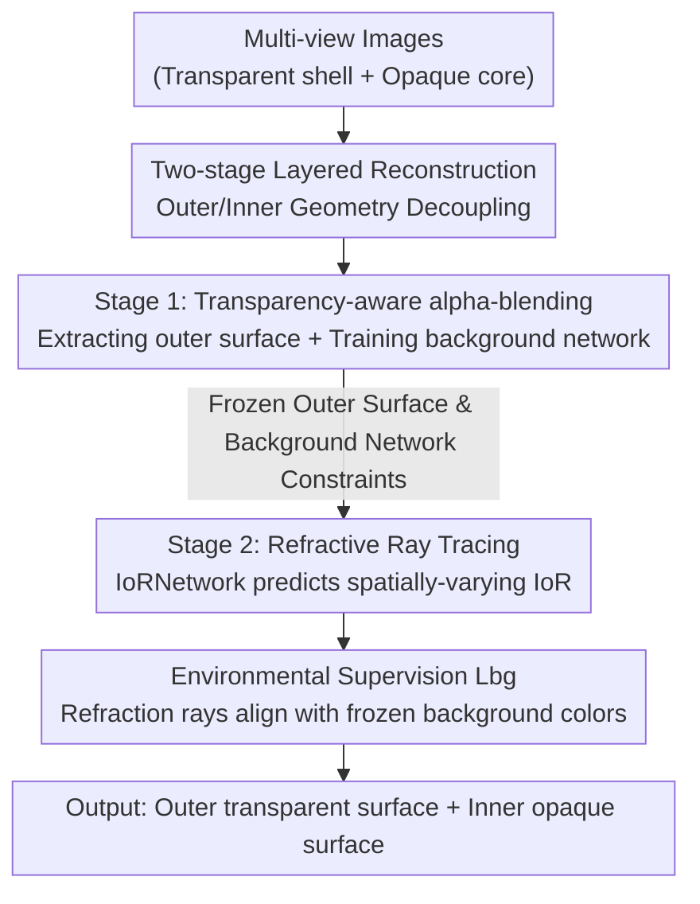

# Opti-NeuS: Neural Reconstruction for Dual-Layered Transparent and Opaque Objects

**Conference**: CVPR 2026  
**Paper**: [CVF Open Access](https://openaccess.thecvf.com/content/CVPR2026/html/Yang_Opti-NeuS_Neural_Reconstruction_for_Dual-Layered_Transparent_and_Opaque_Objects_CVPR_2026_paper.html)  
**Code**: None  
**Area**: 3D Vision  
**Keywords**: Transparent object reconstruction, neural implicit surfaces, refractive ray tracing, SDF, multi-view reconstruction

## TL;DR
Opti-NeuS utilizes "two-stage layered reconstruction + a learnable Index of Refraction network (IoRNetwork)" to decouple and reconstruct dual-layered objects consisting of a transparent shell and an opaque core without controlled environments or extra inputs. By first suppressing refraction to reconstruct the outer surface and then using Snell's Law to trace refractive rays for the interior, it achieves lower Chamfer Distance than Alpha-NeuS, NeTO, and NU-NeRF.

## Background & Motivation
**Background**: Multi-view 3D reconstruction for opaque objects has matured with NeRF, NeuS, and 3D Gaussian Splatting—all of which assume light travels in straight lines and use volume rendering or explicit splatting to infer geometry from multi-view images.

**Limitations of Prior Work**: This assumption breaks down with transparent objects. **Refraction** occurs at the interface, causing rays to bend significantly, which leads to pixel rays deviating from their true positions and making refractive rays indistinguishable, turning reconstruction into a highly ill-posed problem. Furthermore, the appearance of transparent surfaces changes drastically with the viewing angle. Existing transparent reconstruction methods (NeTO, ReNeuS, NEMTO, etc.) generally rely on specialized capture equipment or controlled environments and require extra inputs (masks, lighting, IoR, or outer geometry) to simplify refraction modeling, limiting their practical utility.

**Key Challenge**: Crucially, existing methods are mostly limited to either **purely transparent** or **purely opaque** materials, lacking "transparency-aware" separation capabilities. In a **dual-layered scene**—such as a glass ball containing an opaque object—refraction from the outer layer distorts the inner geometry, resulting in blurred boundaries and failing to reconstruct both layers cleanly.

**Goal**: To simultaneously reconstruct the transparent outer layer and the opaque inner layer of an object while correctly modeling the visual distortion caused by outer refraction, without relying on controlled environments or additional inputs.

**Key Insight**: The authors observed that the distortion of the inner geometry by outer refraction is "top-down." By first establishing the outer surface and freezing the background information it provides, the inner layer can be decoupled by using real refractive rays as constraints. Thus, reconstruction is split into **two serial stages**, each equipped with a specialized mechanism: Stage 1 extracts the transparent surface from the ambiguity of non-zero SDFs, and Stage 2 ensures refractive rays point toward the correct background color.

**Core Idea**: Use "transparency-aware threshold alpha-blending" to extract the transparent shell, followed by "refractive ray tracing with learnable spatially-varying IoR" to reconstruct the core based on Snell's Law, optimizing the two stages sequentially to achieve geometric decoupling.

## Method

### Overall Architecture
The input to Opti-NeuS is multi-view images of a dual-layered (transparent shell + opaque core) scene, and the output is the separated transparent outer surface and opaque inner surface. The pipeline is built upon the NeuS neural implicit surface (representing geometry with the SDF zero-isosurface and optimizing via volume rendering) but splits reconstruction into two **serial** stages to prevent outer refraction from interfering with the interior.

Stage 1 (Outer Transparent Reconstruction): Refraction is **suppressed**, and a transparency-aware alpha-blending threshold is used to extract the outer transparent surface, establishing a base geometry free from complex ray interference while training a background network $F_{bg}$. Stage 2 (Inner Opaque Reconstruction): The outer surface from Stage 1 is treated as a geometric constraint, the background network is **frozen**, and the IoRNetwork predicts spatially-varying indices of refraction. Rays are traced according to Snell's Law, ensuring the refracted ray color matches the frozen background to reconstruct the inner opaque SDF.

### Key Designs

**1. Two-stage Layered Reconstruction: Severing Refraction Pollution at the Source**

To address the core contradiction where outer refraction distorts inner geometry and blurs boundaries, the authors avoid simultaneous joint optimization. Instead, they split reconstruction into two sequential stages, achieving **simultaneous optical and spatial decoupling**. Stage 1 focuses only on the outer transparent SDF, intentionally suppressing refraction to stabilize the shell geometry while training a background network. Stage 2 trains the inner opaque SDF only after the outer geometry is known and the background network is frozen—at this point, the outer surface acts as a reliable "refractive interface," and inner optimization is localized within the shell. The benefit is twofold: the geometric constraints and background supervision provided by the outer layer are fixed, preventing inner training from skewing the outer layer. Compared to methods that mix materials in a single field, the SDFs for both layers are cleaner. The base geometry uses NeuS implicit surfaces where the zero-isosurface is $S=\{\mathbf{x}\in\mathbb{R}^3 \mid f(\mathbf{x})=0\}$, and volume rendering integrates color $C=\int_0^{+\infty} w(t)\,c(p(t),\mathbf{v})\,dt$ along the ray $p(t)=\mathbf{o}+\boldsymbol{\omega} t$, discretized as $\hat{C}=\sum_i T_i\alpha_i c_i$.

**2. Transparency-aware Threshold Alpha-blending: Extracting Surfaces with "Non-zero SDF"**

This is the core of Stage 1. The problem is that transparent objects allow light to pass through, so the opacity $\alpha$ and $\Delta\Phi_s$ at the surface are extremely small, contributing minimally to color. Standard volume rendering cannot distinguish the "true transparent surface" from "air." The discrete alpha in NeuS is $\alpha_i=\max\!\left(\frac{\Phi_s(f(p(t_i)))-\Phi_s(f(p(t_{i+1})))}{\Phi_s(f(p(t_i)))},\,0\right)$, where $\Phi_s(x)=(1+e^{-sx})^{-1}$ is the CDF of the logistic distribution. Alpha-NeuS demonstrated that transparent surfaces do not correspond to the zero-isosurface but rather to the **local non-negative minima** of the SDF. Using the Beer-Lambert attenuation from HF-NeuS, it unified transparency/opacity as $\alpha=1-T(t)=1-\exp(-\rho(t)z(t))$, where $\rho(t)=s(1-\Phi_s)\cos\theta$. Opaque regions ($\Phi_s\approx0.5$) respond strongly at the zero-isosurface, while transparent regions ($\Phi_s\approx1$) are exponentially amplified at local SDF minima. However, Alpha-NeuS still relies on a **fixed** iso-threshold, which fails when SDF values are unpredictable across scenes.

Opti-NeuS modifies this into an **adaptive** threshold: since the key to distinguishing "local non-negative minima" from "zero-isosurfaces" lies in the second derivative of the SDF along the ray, the authors derive a "sharpness" measure from the curvature of rendering weights $w''(t)=-s\,f''(t)\,\Phi_s'(f(t))\,T(t)$ (where $f''(t)>0$ at local non-negative minima and $f''(t)\approx0$ at the zero-isosurface). Normalized by the peak, this gives $\mathcal{S}(f)=\frac{w''(t)}{w_{\max}(t)}=\frac{2s\,e^{-sf}}{(1+e^{-sf})^2}\cdot f''$, resulting in an adaptive opacity $\alpha(f)=\frac{1}{1+e^{-\mathcal{S}(f)/s}}$. Stage 1 uses this adaptive alpha (Eq. 10), while Stage 2 uses the Beer-Lambert alpha (Eq. 6). Consequently, the transparent surface gains **enhanced awareness** in Stage 1 and contributes more to the final appearance, allowing for stable extraction without manual iso-threshold tuning for each scene. ⚠️ The rigorous derivation of the curvature/sharpness formulas is provided in the original paper's supplementary material.

**3. Refractive Ray Tracing with IoRNetwork: Correcting the Interior via Learnable Spatially-varying IoR**

Stage 2 addresses the visual distortion where the inner layer deviates from its true position due to refraction. Light bends at interfaces with different refractive indices, so reconstructing the core requires calculating the correct refractive ray path, which depends on two variables: the normal at the intersection ($\nabla\text{SDF}$) and the Index of Refraction (IoR). The refraction direction is given by Snell's Law: $\eta_{\text{prev}}\sin\theta_{\text{prev}}=\eta_{\text{next}}\sin\theta_{\text{next}}$. The refracted direction is $\mathbf{d}_{\text{next}}=\frac{\eta_{\text{prev}}}{\eta_{\text{next}}}{\mathbf{d}_{\text{prev}}}+\left(\frac{\eta_{\text{prev}}}{\eta_{\text{next}}}\cos\theta_{\text{prev}}-\cos\theta_{\text{next}}\right)\mathbf{n}_{\text{prev}}$. Concatenating refractive segments at each interface yields the full light path $p^{(k)}=\sum_i \mathbf{o}_i^{(k)}+z_i^{(k)}\mathbf{d}_i^{(k)}$.

The key innovation is that the IoR is no longer treated as a known constant but is predicted as a **spatially-varying** value by an MLP called the **IoRNetwork**, $g_r(x,y,z)\to(\eta,\mathbf{d}_r)$. 3D coordinates are encoded to 39 dimensions via positional encoding and passed through several fully connected layers (with skip connections) to output $\eta$ and the refractive direction. Lacking ground truth for IoR, the IoRNetwork is constrained entirely by the background network frozen in Stage 1 (see Design 4). To ensure physical plausibility and avoid sudden jumps in IoR between adjacent points, a consistency loss is added: $\mathcal{L}_{\text{consist}}=\frac{\sum_{i,j} w_{ij}\,|\eta_i-\eta_j|}{\sum_{i,j} w_{ij}}$, where the weight $w_{ij}=\exp(-\|\mathbf{p}_i-\mathbf{p}_j\|^2/2\rho^2)\cdot\frac{1+\cos(f_i,f_j)}{2}$ combines spatial proximity and feature similarity to ensure smooth spatial variation of the IoR. This design directly addresses the spatially-varying IoR emphasized in the abstract—unlike methods assuming a single global IoR, it can model non-homogeneous distributions within objects.

**4. Environmental Supervision Loss $\mathcal{L}_{bg}$: Providing Strong Gradients via Frozen Backgrounds**

Since the IoRNetwork has no ground truth, how does it know if its predictions are correct? The authors' solution is to let the refracted rays "verify their answers." The background network $F_{bg}$ trained in Stage 1 is **frozen** in Stage 2 to act as environmental supervision. The physical intuition is as follows: given the outer surface, only the **correct IoR** will refract the ray toward the true background color. If the IoR is wrong, the ray will point to the wrong background, resulting in a large rendering penalty. This is formalized as $\mathcal{L}_{bg}=\|C_{bg}(\mathbf{p}_{\text{out}},\mathbf{d}_{\text{exit}})-F_{bg}(\mathbf{p}_{\text{out}},\mathbf{d}_{\text{exit}})\|_2^2$, where $C_{bg}$ is the background color retrieved at the exit point of the ray traced with the predicted IoR, and $F_{bg}$ is the reference color from the frozen background network. For intersection calculations, the authors use a maximum bounding box algorithm to extract the most complete outer surface from Stage 1, removing floaters to reduce computation. This loss is critical because it converts "inner reconstruction" into "hitting the correct background with refractive rays," providing a strong and clear optimization direction for the IoRNetwork. Ablations show that using a newly trained NeRF for the background in Stage 2 instead of $\mathcal{L}_{bg}$ impairs initialization, convergence, and geometric detail.

### Loss & Training
Optimization follows a sequential two-stage strategy: Stage 1 trains the outer transparent SDF and background network $F_{bg}$ (extracting the transparent surface via adaptive alpha-blending); Stage 2 freezes the outer surface and $F_{bg}$ and trains the inner opaque SDF, primarily using the environmental supervision loss $\mathcal{L}_{bg}$ complemented by the IoRNetwork consistency loss $\mathcal{L}_{\text{consist}}$. More detailed ablations for the IoRNetwork, $\mathcal{L}_{\text{consist}}$, and learnable vertices are provided in the supplementary material.

## Key Experimental Results

### Main Results
The dataset is a mix of custom and public data: 7 synthetic scenes (Blender-built Bunny, Spot, Monkey, Jug, plus public Pig, Spherepot, Snowglobe) and 6 real scenes (Ballstatue, Realbottle, Ball, Magician-box, Toy-box, Sunglasses). Evaluation metrics are Chamfer Distance (CD) and Earth Mover's Distance (EMD). Baselines include NU-NeRF, Alpha-NeuS, and NeTO (NeTO uses object masks).

Overall comparison on synthetic datasets (CD / EMD, units $\times10^{-3}$, lower is better):

| Scene | NeTO CD | Alpha-NeuS CD | Opti-NeuS CD | Opti-NeuS EMD |
|------|---------|---------------|--------------|---------------|
| Bunny | 2.177 | 0.792 | **0.517** | **7.572** |
| Spot | 3.320 | 2.964 | **1.854** | **3.183** |
| Monkey | 6.727 | 2.391 | **1.542** | **5.616** |
| Jug | 1.584 | 1.278 | **0.884** | **4.239** |
| Spherepot | 2.215 | 1.582 | **1.103** | **7.952** |
| Snowglobe | 6.551 | **5.630** | 6.038 | 11.87 |
| **Mean** | 3.798 | 2.314 | **1.906** | **6.140** |

The average CD dropped from 2.314 (Alpha-NeuS) to 1.906, and EMD dropped from 8.404 to 6.140. The only scene where it was surpassed was Snowglobe with masks—here, Alpha-NeuS happened to obtain a very precise iso-threshold, slightly outperforming Ours (5.630 vs 6.038).

Comparison with NU-NeRF on outer/inner layers (Synthetic, CD / EMD, $\times10^{-3}$):

| Scene | Ours Outer CD | NU-NeRF Outer CD | Ours Inner CD | NU-NeRF Inner CD |
|------|-------------|-----------------|-------------|-----------------|
| Bunny | **0.212** | 0.251 | **0.104** | 1.077 |
| Spot | **1.063** | 2.116 | **0.375** | 2.561 |
| Jug | **0.332** | 0.735 | **0.432** | 2.306 |
| **Mean** | **0.536** | 1.034 | **0.304** | 1.981 |

The advantage in inner layer reconstruction is particularly significant (average CD 0.304 vs NU-NeRF 1.981)—NU-NeRF tends to reconstruct collapsed inner geometry with degraded details, whereas refractive ray tracing in this work preserves accurate spherical contours and clean inner surface boundaries.

### Ablation Study
(CD / EMD, $\times10^{-3}$, showing degradation after removing a module)

| Scene | w/o Trans-aware alpha CD | w/o Refrac. Tracing CD | w/o $\mathcal{L}_{bg}$ CD |
|------|----------------------|-----------------|--------------------------|
| Bunny | 156.68 | 113.25 | 10.45 |
| Spot | 32.28 | 65.22 | 13.38 |
| Jug | 21.15 | 184.28 | 12.35 |
| Spherepot | 149.85 | 342.95 | 91.68 |
| **Mean** | 89.99 | 176.43 | 31.97 |

Compared to the full model's average CD of 1.906, removing any of the three modules causes the error to skyrocket by one to two orders of magnitude.

### Key Findings
- **Refractive Ray Tracing has the highest impact**: Removing it caused the average CD to surge to 176.43 (from 1.906), as pixels failed to map to true spatial positions, leading to severe inner geometry distortion. This confirms that modeling refraction is the lifeblood of dual-layered transparent reconstruction.
- **Transparency-aware alpha-blending is indispensable**: Removing it reverts the model to the original NeuS alpha (Eq. 4), failing to extract the shell for transparent surfaces where the SDF is not zero, resulting in an average CD of 89.99.
- **$\mathcal{L}_{bg}$ is significant**: Removing it led to an average CD of 31.97. Retraining NeRF to learn the background in Stage 2 instead disrupts initialization and convergence, losing geometric details.
- **Failure/Degraded Scenarios**: In scenes like Monkey or Spherepot where light passes through the shell and interacts repeatedly with the interior, multiple refractions can smooth out fine details. Real-world scenes lack ground truth geometry, so only qualitative comparisons are possible.

## Highlights & Insights
- **Reframing "Inner Reconstruction" as "Striking the Right Background"**: Using the frozen background network from Stage 1 as supervision provides the IoRNetwork with strong gradients despite the lack of IoR ground truth. This "answer-key" style environmental supervision is a clever self-supervised approach applicable to other inverse rendering problems lacking physical parameters.
- **Spatially-varying IoR + Consistency Loss**: Moving beyond global single IoR assumptions, an MLP predicts point-wise IoR values constrained by spatial and feature similarity weights, better reflecting real non-homogeneous media.
- **Adaptive Transparency Threshold**: Using the second derivative of the SDF along the ray (curvature/sharpness metric) to distinguish "local non-negative minima" from "zero-isosurfaces" turns Alpha-NeuS's fixed iso-threshold into an adaptive one, solving the problem of unpredictable SDF values across scenes.
- **Sequential Decoupling Engineering**: The two-stage serial pipeline + freezing outer layers/backgrounds prevents inner optimization from back-propagating errors into the outer layer, providing a reusable paradigm for handling multi-layered or nested geometry.

## Limitations & Future Work
- **Multiple Refractions Smoothing Details**: The authors acknowledge that in scenes like Monkey and Spherepot, where light interacts repeatedly with the interior, fine-scale details are smoothed out.
- **Lack of Ground Truth for Real Scenes**: Real-world data lacks ground truth geometry, so quantitative advantages are primarily verified on synthetic data.
- **Suboptimal with Precise Masks**: In the Snowglobe scene, Alpha-NeuS with masks outperformed the proposed method because it obtained an extremely accurate iso-threshold, suggesting that adaptive thresholds offer less advantage in "prior-rich" scenarios.
- **Dependency on Stable Outer Layer**: Since the two stages are serial, poor reconstruction of the outer surface in Stage 1 will pollute Stage 2 through both geometric constraints and background supervision (⚠️ Note: This is an inference based on the pipeline structure, not explicitly discussed in the text).

## Related Work & Insights
- **vs Alpha-NeuS**: Both map transparent surfaces to local non-negative SDF minima and unify transparent/opaque handling, but Alpha-NeuS uses **fixed** iso-thresholds and cannot handle dual-layered mixed materials. Ours uses adaptive sharpness thresholds and separates layers via two stages.
- **vs NeTO**: Both rely on precise refractive ray tracing, but NeTO requires extra inputs like masks and is extremely sensitive to ray deviation (slight deviations cause significant degradation). Ours requires no extra inputs and uses an IoRNetwork for spatially-varying IoR.
- **vs NU-NeRF**: NU-NeRF also requires no extra inputs and can reconstruct inner layers, but the inner geometry is often distorted or collapsed (e.g., the squashed ball in Jug). Ours preserves accurate contours and clean boundaries.
- **vs NeuS / NeRF / 3DGS**: These methods assume straight-line propagation and are only suitable for opaque objects. Ours explicitly models refractive bending, extending neural implicit surfaces to dual-layered transparent-opaque scenes.

## Rating
- Novelty: ⭐⭐⭐⭐⭐ First to reconstruct dual-layered objects without controlled environments or extra inputs; the combination of IoRNetwork and frozen background supervision is highly innovative.
- Experimental Thoroughness: ⭐⭐⭐⭐ 13 scenes, 3 baselines, detailed layer-wise results, and three sets of ablations, though real scenes are qualitative and some details are in the supplement.
- Writing Quality: ⭐⭐⭐⭐ Clear motivation and derivations for the two stages, though moving curvature/sharpness details to the supplement slightly affects self-consistency.
- Value: ⭐⭐⭐⭐ Transparent reconstruction is a high-demand area for VR and photorealistic rendering; the move toward uncontrolled environments and multi-layer handling has strong practical potential.

<!-- RELATED:START -->

## Related Papers

- [\[CVPR 2026\] 3DReflecNet: A Large-Scale Dataset for 3D Reconstruction of Reflective, Transparent, and Low-Texture Objects](3dreflecnet_a_large-scale_dataset_for_3d_reconstruction_of_reflective_transparen.md)
- [\[ECCV 2024\] PISR: Polarimetric Neural Implicit Surface Reconstruction for Textureless and Specular Objects](../../ECCV2024/3d_vision/pisr_polarimetric_neural_implicit_surface_reconstruction_for_textureless_and_spe.md)
- [\[CVPR 2026\] DuoMo: Dual Motion Diffusion for World-Space Human Reconstruction](duomo_dual_motion_diffusion_for_world-space_human_reconstruction.md)
- [\[CVPR 2026\] ManifoldNeuS: Manifold-aware View Optimizability for Pose-Free Neural Surface Reconstruction](manifoldneus_manifold-aware_view_optimizability_for_pose-free_neural_surface_rec.md)
- [\[CVPR 2026\] JRM: Joint Reconstruction Model for Multiple Objects without Alignment](jrm_joint_reconstruction_model_for_multiple_objects_without_alignment.md)

<!-- RELATED:END -->
