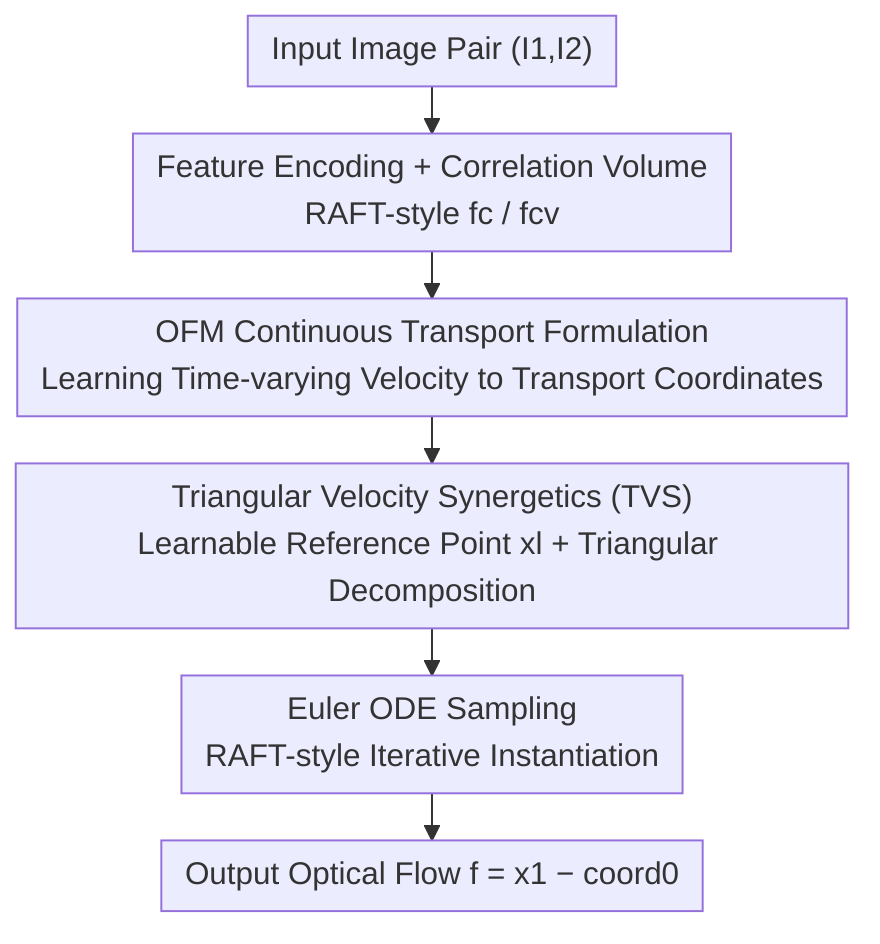

# Optical Flow Matching: Reframing Optical Flow as Continuous Transport Dynamics

**Conference**: CVPR 2026  
**Paper**: [CVF Open Access](https://openaccess.thecvf.com/content/CVPR2026/html/Luo_Optical_Flow_Matching_Reframing_Optical_Flow_as_Continuous_Transport_Dynamics_CVPR_2026_paper.html)  
**Code**: https://github.com/LA30/OFM (Available)  
**Area**: 3D Vision / Optical Flow Estimation  
**Keywords**: Optical Flow Estimation, Flow Matching, Continuous Transport, ODE Solving, Velocity Field  

## TL;DR
This work reframes optical flow from "discrete displacement regression between two frames" to "learning a velocity field for continuous transport of pixel coordinates over time." By employing a Triangular Velocity Synergetics (TVS) technique, the theoretical objectives of Flow Matching are aligned with the supervision signals usable by optical flow networks, achieving SOTA accuracy on Sintel / KITTI / Spring datasets alongside stronger cross-dataset generalization.

## Background & Motivation
**Background**: While modern optical flow estimation utilizes deep networks (e.g., PWC-Net, RAFT, GMFlow, FlowFormer), it still follows the "discrete correspondence" paradigm inherited from classical vision—networks perform feature matching and regress per-pixel displacements between two frames, essentially "finding corresponding points."

**Limitations of Prior Work**: This approach only recovers the **result** of motion (pixel displacement "where") without modeling **how** motion evolves continuously over time. Motion in the physical world is governed by smooth dynamics (as established in fluid mechanics and transport theory). Discrete displacement regression disconnects motion from its underlying physical process, leading to degraded temporal consistency under occlusion, large displacements, or illumination changes.

**Key Challenge**: Architectures for optical flow (cost volumes, attention matching) are tailored for "establishing pixel-to-pixel correspondence," which has clear physical meaning. In contrast, generative Flow Matching targets an abstract "velocity field." Directly applying Flow Matching to optical flow would force the network to predict quantities like "optical flow minus Gaussian noise," which lack geometric meaning and lead to highly unstable training.

**Goal**: (1) Provide a physically grounded continuous formulation for optical flow; (2) Enable this formulation to be supervised directly by existing optical flow ground truth $f_{gt}$ and seamlessly integrated into RAFT-style architectures.

**Key Insight**: Borrow the concept from Flow Matching of "learning a time-varying velocity field to transport samples along continuous trajectories," but shift the transport target from "Gaussian noise → data" to "pixel coordinates $x_0 \to x_1$." This restores the physical relationship between velocity and displacement, allowing the network to reason about how motion "develops" rather than just where it "occurs."

**Core Idea**: Replace "direct regression of two-frame displacement" with "learning a time-varying velocity field in the image coordinate domain + ODE integration." Use a triangular geometric transformation to convert abstract Flow Matching velocity targets into surrogate supervision equivalent to standard optical flow ground truth.

## Method

### Overall Architecture
OFM reformulates optical flow estimation as a continuous transport process: given an image pair $(I_1, I_2)$ and pixel coordinates $x_i$ in $I_1$, the goal is to predict the landing position $x_1$ in $I_2$, where optical flow is the displacement $f = x_1 - x_i$. The pipeline follows a RAFT-like backbone: context features $f_c$ and correlation volume features $f_{cv}$ are extracted first. The network predicts a **learnable coarse global flow reference point $x_l$**, from which perturbed starting points $x_0 = x_l + \alpha\epsilon$ are sampled. The network then estimates a velocity field $v_t = v_\theta(x_t, t \mid f_{cv}, f_c)$ at each time $t$, evolving coordinates from $x_0$ to $x_1$ via numerical ODE integration (Euler method). During training, **Triangular Velocity Synergetics (TVS)** is used to align the surrogate velocity target with optical flow ground truth, enabling standard supervision.

### Key Designs

**1. Reframing Optical Flow as Continuous Coordinate Transport (OFM formulation)**

To address the disconnection between motion and physical processes, OFM adapts Flow Matching logic to the coordinate domain: $x_t = a_t x_1 + b_t x_0$, where $x_1$ is the target coordinate distribution derived from flow ground truth, and $x_0$ is a prior coordinate distribution. Using the conditional optimal transport linear path $x_t = t x_1 + (1-t) x_0$, the conditional velocity simplifies to a constant $v_t(x_t \mid x_1) = x_1 - x_0$. This makes the conditional Flow Matching loss $L_{CFM} = \mathbb{E}\,\|V^{OF}_\theta(x_t,t\mid I_1,I_2) - v_t(x_t\mid x_1)\|^2$ computable. The starting point uses scaled Gaussian perturbations $x_0 = x_i + \alpha\epsilon$ to simulate Flow Matching noise initialization, anchored in real image geometry. Inference uses the Euler method to integrate the ODE $\mathrm{d}x_t/\mathrm{d}t = v(x_t,t)$ to find the destination. This restores physical coupling, resulting in smoother flow fields and improved geometric consistency.

**2. Triangular Velocity Synergetics (TVS)**

This is the core mechanism to solve training instability. A naive version (OFM-Naive) requires the network to predict $x_1 - x_0 = f - \alpha\epsilon$ (flow minus noise), which lacks geometric meaning (leading to convergence failure, e.g., KITTI Fl-all reaching 77.3% in ablation). Setting $\alpha=0$ collapses the prior to a Dirac delta. TVS introduces a constant reference point $x_l$ to redefine $x_0 = x_l + \alpha\epsilon$ and constructs two auxiliary paths: $y_t = t x_1 + (1-t)x_i$ and $z_t = t x_0 + (1-t)x_i$, with marginal velocities $v_t(y_t\mid x_1)=x_1-x_i$ and $v_t(z_t\mid x_0)=x_0-x_i$. These constant vectors form a triangle satisfying:

$$v_t(x_t\mid x_1) = v_t(y_t\mid x_1) - v_t(z_t\mid x_0).$$

The key insight is that the surrogate velocity $\hat v_t = v_t(y_t\mid x_1) = x_1 - x_i$ **is exactly the optical flow field**. Thus, the network can be directly supervised by standard optical flow ground truth $f_{gt}$ during training ($L(\theta)=\|\hat v_t - f_{gt}\|^2$). During inference, the true velocity for ODE stepping is recovered via the triangular relationship $v_t = \hat v_t - \bar v_t$ (where $\bar v_t = x_0 - x_i$).

**3. RAFT-style Instantiation + Learnable Reference Point + Euler Sampling**

The TVS framework is algorithm-agnostic and seamlessly integrates into RAFT-style iterative optimization skeletons. Instead of a fixed constant, $x_l$ is a **learnable variable** predicted by the model (representing coarse global flow), as $x_l$ should be close to $x_1$ to handle large displacements. Implementation-wise, it uses a Twins-SVT encoder and softmax feature matching for global flow. The decoder follows FlowDiffuser with temporal components and uses $x_t$ (rather than coord1) as the state input, maintaining RAFT's iterative refinement. Euler integration is performed for $K$ steps, with $f_{pred} = x_{pred} - \text{coord}_0$.

### Loss & Training
The training objective is the standard optical flow supervision on surrogate velocity $L(\theta)=\|\hat v_t - f_{gt}\|_2^2$. A multi-stage training strategy is adopted: Stage 1 on FlyingChairs (120k iter), Stage 2 on FlyingThings3D (150k), Stage 3 on a C+T+S+K+H mix (150k), and Stage 4 fine-tuning on KITTI (5k). An optional Stage 0 uses TartanAir for rigid flow pre-training. The primary hyperparameter is the scale factor $\alpha$ (default 10), with $K=3$ sampling steps.

## Key Experimental Results

### Main Results
In generalization evaluations (C+T protocol) and online tests, OFM achieved an average rank of 1.1, significantly outperforming recent methods:

| Dataset / Metric | OFM | DPFlow (CVPR'25) | FlowDiffuser (CVPR'24) | SEA-RAFT(L) |
|--------------|-----|------|------|------|
| Sintel train Clean (EPE↓) | **0.81** | 1.02 | 0.86 | 1.19 |
| Sintel train Final (EPE↓) | **2.16** | 2.26 | 2.19 | 4.11 |
| KITTI train Fl-epe↓ | **3.32** | 3.37 | 3.61 | 3.62 |
| KITTI train Fl-all↓ | **10.9** | 11.1 | 11.8 | 12.9 |
| Sintel test Clean / Final | **0.94 / 1.85** | 1.04 / 1.97 | 1.02 / 2.03 | 1.31 / 2.60 |
| Average Rank | **1.1** | 2.9 | 2.7 | 8.0 |

On Sintel online tests, OFM improved EPE by 28.5% and 8.4% compared to SEA-RAFT(L) and DPFlow, respectively. On the Spring benchmark (zero-shot), OFM set new records: 1px=3.660, EPE=0.468, Fl=1.477, outperforming several multi-frame methods.

Regarding efficiency (KITTI 376×1248): OFM(3-NFE) requires 15.6M parameters and 270ms, which is lighter and faster than FlowFormer++ (16.2M / 375ms).

### Ablation Study
| Configuration | Sintel Clean | Sintel Final | KITTI EPE | KITTI Fl-all | Description |
|------|------|------|------|------|------|
| OFM-baseline | 0.96 | 2.45 | 4.01 | 13.8 | Pure flow backbone without transport |
| OFM-Naive (1-NFE) | 15.73 | 15.67 | 35.35 | 77.3 | Direct theoretical target, **No convergence** |
| OFM-Model (1-NFE) | 1.49 | 2.88 | 7.14 | 17.0 | Time embedding only, worse than baseline |
| OFM-TVS (1-NFE) | 0.84 | 2.25 | 3.85 | 12.5 | Single-step sampling outperforms most |
| OFM-TVS (3-NFE) | **0.82** | **2.16** | **3.32** | **10.9** | Default full configuration |

### Key Findings
- **TVS is the Key to Success**: Removing it (OFM-Naive) causes training to fail. Adding time embeddings without the transport formulation (OFM-Model) performs worse than the baseline. All components must synergize.
- **Robustness to Hyperparameters**: Performance is stable across $\alpha\in\{5, 10, 15\}$.
- **Diminishing Returns with NFE**: Increasing $K$ from 1 to 4 yields marginal gains; $K=3$ offers the best balance. Single-step sampling already exceeds many two-frame methods.
- **Strong Compatibility**: OFM-TVS serves as a module that improves standard architectures like RAFT or SKFlow without extensive fine-tuning.

## Highlights & Insights
- **TVS aligns abstract targets with supervisable signals**: This is the most effective contribution. Instead of fitting a non-physical "flow minus noise" target, it allows the network to supervise a surrogate velocity $\hat v_t$ that equals the ground truth flow.
- **Learnable reference points** provide a good starting point close to the destination, reducing large displacement errors while reusing global matching capabilities.
- **Algorithm-Network Decoupling**: OFM-TVS does not rely on specific parameterization, making it compatible with the entire RAFT-style family.
- **Perspective Shift**: Reframing a discriminative task (optical flow) into a continuous transport ODE improves temporal stability and cross-domain generalization.

## Limitations & Future Work
- The current implementation relies on conditional optimal transport and Euler ODE solving. Advanced Flow Matching techniques like Shortcut Models could further improve efficiency.
- KITTI Fl-all performance still slightly trails DPFlow, indicating a gap in specific real-world driving scenarios.
- Future work may include upgrading $x_l$ with multi-hypothesis modeling or utilizing Rectified Flow to reduce sampling steps.

## Related Work & Insights
- **vs RAFT / GMFlow / FlowFormer**: These focus on discrete feature matching. OFM learns a time-varying velocity field and uses ODE integration to explicitly couple displacement with motion dynamics.
- **vs FlowDiffuser / DDVM**: These use generative diffusion but often remain in the discrete displacement domain. OFM operates in the coordinate domain with explicit physical coupling.
- **vs Flow Matching**: Original Flow Matching transports from noise to data in latent space; OFM transports image coordinates from a local perturbation to a target, using TVS to solve the target-supervision mismatch in the coordinate domain.

## Rating
- Novelty: ⭐⭐⭐⭐⭐ 
- Experimental Thoroughness: ⭐⭐⭐⭐ 
- Writing Quality: ⭐⭐⭐⭐ 
- Value: ⭐⭐⭐⭐⭐ 

<!-- RELATED:START -->

## Related Papers

- [\[CVPR 2026\] Rethinking Dense Optical Flow without Test-Time Scaling](rethinking_dense_optical_flow_without_test-time_scaling.md)
- [\[CVPR 2026\] Flow4DGS-SLAM: Optical Flow-Guided 4D Gaussian Splatting SLAM](flow4dgs-slam_optical_flow-guided_4d_gaussian_splatting_slam.md)
- [\[CVPR 2026\] GeodesicNVS: Probability Density Geodesic Flow Matching for Novel View Synthesis](geodesicnvs_probability_density_geodesic_flow_matching_for_novel_view_synthesis.md)
- [\[NeurIPS 2025\] E-MoFlow: Learning Egomotion and Optical Flow from Event Data via Implicit Regularization](../../NeurIPS2025/3d_vision/e-moflow_learning_egomotion_and_optical_flow_from_event_data_via_implicit_regula.md)
- [\[CVPR 2026\] UniPixie: Unified and Probabilistic 3D Physics Learning via Flow Matching](unipixie_unified_and_probabilistic_3d_physics_learning_via_flow_matching.md)

<!-- RELATED:END -->
