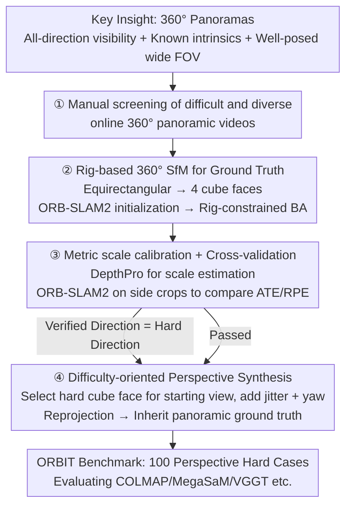

# ORBIT: Benchmarking SfM in the Wild with 360° Video

**Conference**: CVPR 2026  
**Paper**: [CVF Open Access](https://openaccess.thecvf.com/content/CVPR2026/html/Sabour_ORBIT_Benchmarking_SfM_in_the_Wild_with_360deg_Video_CVPR_2026_paper.html)  
**Code**: None (Google Research / DeepMind)  
**Area**: 3D Vision  
**Keywords**: SfM benchmark, camera pose estimation, 360° panoramic video, real-world dynamics, failure mode diagnosis

## TL;DR
ORBIT utilizes online 360° panoramic videos as "reliable sources of ground truth." Because panoramic cameras observe all directions, have known intrinsics, and "hide" no stable features, a custom rig-based SfM can yield credible trajectories. These panoramas are then cropped and reprojected into perspective videos that specifically target "difficult viewpoints," forming a benchmark of 100 real-world challenging cases. Results show that SOTA methods like COLMAP, MegaSaM, and VGGT fail significantly, revealing that SfM remains far from solved.

## Background & Motivation

**Background**: Recovering camera poses and 3D geometry from video (SfM) is a core component for spatial reasoning, AR/VR, robotics, and controllable 3D/4D world models. Current methods perform well on **short videos and static scenes**, with traditional tools like COLMAP/ORB-SLAM and new learning-based models like MegaSaM, VGGT, and MonST3R continuously improving performance.

**Limitations of Prior Work**: However, these methods often produce large errors or fail entirely when encountering complex real-world videos—those with significant moving objects, complex motion regions (rustling leaves, flowing water), or specular reflections. Worse, there is **no ground-truth benchmark that reflects these difficulties**: existing benchmarks are either synthetic (Sintel, TartanAir) or feature scenes that are too simple (RealEstate10k, ETH3D are almost entirely static), failing to measure actual progress in complex real-world scenarios.

**Key Challenge**: Obtaining high-quality camera ground truth for complex outdoor videos is **intrinsically difficult**. Many prior works use COLMAP outputs as ground truth, yet COLMAP itself fails on many real videos. While GPS/IMU/depth sensors can capture ground truth in controlled environments, such instruments are rarely available for in-the-wild web data. Consequently, the field is stuck in a deadlock: "there is a need to evaluate difficult scenes" versus "no ground truth is available for difficult scenes." Datasets like DynPose-100K and SpatialVID, which use COLMAP or MegaSaM predicted poses for labeling, have unverifiable ground truth and can only serve as training sets, not benchmarks.

**Goal**: (1) Identify a way to obtain **verifiable** camera ground truth for difficult outdoor scenes; (2) use it to construct an evaluation benchmark specifically designed to expose current SfM failure modes across diverse challenges.

**Key Insight**: The authors observe that 360° panoramic videos possess three properties highly favorable for SfM: ① The camera sees in **all directions**; even if parts of the field of view (FOV) are contaminated by dynamic objects or blur, static regions elsewhere nearly always provide stable features—"stable features cannot hide from the camera." ② Panoramic devices have **known intrinsics**, bypassing the problem of unknown focal lengths in wild videos. ③ The wide field of view itself makes pose estimation mathematically more well-posed. Thus, **running SfM on panoramas is far more reliable than on narrow-FOV videos**, allowing panoramic results to serve as pseudo-ground truth for evaluating other methods on challenging perspective crops.

**Core Idea**: Use reliable pose estimation from 360° panoramas to reverse-engineer ground truth for difficult perspective segments, decoupling ground-truth estimation from the task being evaluated.

## Method

### Overall Architecture
ORBIT is not a new algorithm but a **ground-truth construction + hard-case synthesis** pipeline, producing a benchmark of 100 video segments. The pipeline follows four steps: manually screening 360° panoramic videos from the web for sufficient motion and challenging content; using a rig-based SfM specifically designed for panoramas to estimate reliable camera trajectories as pseudo-ground truth; calibrating the arbitrary-scale trajectories to an approximate metric scale and filtering out untrustworthy segments via cross-validation; and finally, reprojecting the panoramas into perspective videos targeting "difficult directions" that inherit the panoramic ground-truth poses. The final 100 segments are selected from 80 independent panoramic videos, each 150–1000 frames at 30fps, with resolutions ranging from 671×377 to 3356×1888.

### Key Designs

**1. Core Insight: Decoupling Ground Truth Estimation from the Target Task**

The deadlock of obtaining ground truth for difficult wild scenes is broken by "viewing it with a different camera." 360° panoramas are significantly more SfM-friendly than narrow-FOV cameras: the camera captures all directions, meaning even if the foreground is entirely dynamic or low-texture, static structures in the rear or sides provide stable features. The known intrinsics eliminate focal length estimation. Poses estimated from panoramas are sufficiently credible to serve as pseudo-ground truth. The benchmark then evaluates methods on narrow perspective crops that **only see the difficult directions**. Crucially, while the evaluated algorithm sees only a "single projection, limited FOV" difficult segment, the ground truth was computed using the "full FOV + known calibration." Since they use **different viewpoints**, the ground truth remains robust even when the difficult segment is challenging, making ORBIT fundamentally more reliable than DynPose-100K (where ground truth and test input share the same monocular viewpoint and cannot be independently verified).

**2. Rig-based 360° SfM: Treating the Panorama as a Multi-Camera Rigid Rig**

Directly applying the equirectangular camera model in COLMAP presents issues: projection height is anisotropic (pixel shifts at the equator correspond to much larger 3D ray shifts than at the poles), and horizontal boundaries wrap around, requiring special handling of 3D points. This paper bypasses these issues by treating each panoramic frame as a **rigidly bound multi-perspective camera rig**. The spherical projection is reprojected into a cube map, taking four faces (front, back, left, right). To ensure robustness, a 120° FOV is used instead of 90°, allowing adjacent faces to overlap; the top and bottom faces are discarded as they often contain watermarks or pure sky. An improved version of ORB-SLAM2 runs on the forward-facing sub-video to guide initialization (leveraging its keyframe selection and relocalization logic). The first $k=32$ poses initialize a bundle adjustment (BA). In the BA stage, intra- and inter-face correspondences are recalculated using SIFT for incremental SfM. A **rig constraint** is applied: the four cube faces share the same projection center and have fixed relative orientations, optimized jointly as a rigid camera group. Traditional tools are preferred over newer methods like VGGT/MegaSaM here because they are easier to extend to 360° without retraining.

**3. Metric Scale Calibration + Cross-validation Filtering**

Due to gauge ambiguity, SfM outputs trajectories at an **arbitrary scale**, which affects scale-sensitive metrics like ATE. The authors use DepthPro, a zero-shot monocular metric depth model, to predict metric depth for each sub-video frame. The scale factor is determined by the ratio between the predicted depth and the $z$-depth of 3D points reconstructed by the rig-based SfM. Only robust segments (where the variance of the scale factor is less than its mean) are kept and scaled by the average. Subsequently, cross-validation is performed: ORB-SLAM2 is run **independently** on perspective crops offset by [90°, 180°, 270°] from the front face (avoiding the data used for initialization). Results are validated against the 360° rig trajectory using Umeyama alignment to ensure consistency in ATE and RPE. $\mathrm{ATE}(g,e)=\big(\sum_i\|g_i-e_i\|_2^2\big)^{1/2}$ measures absolute trajectory error, while RPE-T and RPE-R measure relative translation and rotation errors between adjacent frames. The pipeline achieves an ATE of only 0.07±0.04m on 360Loc (with LiDAR GT), which is orders of magnitude smaller than the typical >4m errors of baselines when they fail.

**4. Difficulty-oriented Perspective Synthesis: Targeting Hard Directions**

To ensure the benchmark videos mimic handheld camera motion, the viewpoint direction is **dynamically changed** rather than fixed. If a cube face failed in the step 3 cross-validation (meaning ORB-SLAM2 failed in that direction), it is flagged as a "difficult direction" signal and chosen as the initial viewpoint to maximize the challenge. Subsequent frames layer two types of motion: small frame-by-frame rotations to simulate hand jitter, and slow rotations around the vertical y-axis to simulate "looking around"—rotation angles are sampled from $\mathcal{N}([0,0,0],[1,20,2])$ every 30 frames and interpolated via SLERP. The FOV is slightly perturbed around 120°. The final perspective video inherits ground-truth poses from the original panorama (with rotations transformed according to the perturbations).

## Key Experimental Results

> Metric Definitions: **ATE** = Absolute Trajectory Error (meters, lower is better); **RPE-T / RPE-R** = Relative translation/rotation error; **Success** = Percentage of segments passing strict thresholds (ATE<0.5, RPE-R<0.4, RPE-T<2.0, twice the cross-validation threshold); **R-Success** = Success rate with doubled (relaxed) thresholds. For methods like COLMAP that may produce no output, the last known pose is used for missing frames; if there is no output for the entire segment, it is marked as a failure.

### Main Results
Results of six representative methods on the 100 ORBIT segments—**no method succeeds on all segments**, and every method fails on at least 20% of cases. Due to high ATE standard deviations, success rates are more representative than means:

| Method | Type | ATE↓ | RPE-R↓ | Success↑ | R-Success↑ |
|------|------|------|--------|----------|------------|
| COLMAP | Optimization | 5.40±12.58 | 2.07±3.17 | 25.27% | 32.96% |
| ORB-SLAM | Optimization | 4.61±6.39 | 1.08±0.78 | 1.09% | 2.19% |
| MegaSaM | Hybrid | 3.90±11.50 | 0.59±0.87 | **38.46%** | 51.64% |
| MegaSaM+RoMo | Hybrid | **3.42±10.75** | 0.62±0.85 | **38.46%** | 50.54% |
| MonST3R | Feed-forward | 4.46±8.54 | 1.10±1.02 | 0.0% | 6.59% |
| VGGT-Long | Feed-forward | 2.58±4.80 | 1.11±1.20 | 3.29% | 10.98% |

Even the best-performing MegaSaM only achieves a strict success rate of 38.46%. Interestingly, ranking by different metrics yields different results: COLMAP has the worst average ATE but a higher strict success rate (25.27%) than feed-forward methods, indicating it remains a good choice for less difficult scenes. Feed-forward methods (MonST3R/VGGT-Long) rarely match the ground truth perfectly but have lower error upper-bounds.

### Key Findings
- **Low correlation of failures indicates diagnostic value**: The correlation matrix for success/failure between different methods is generally low (excluding MegaSaM and MegaSaM+RoMo which share common roots, at 0.80). This suggests different methods fail on **different** segments, proving ORBIT is a diagnostic tool rather than just a collection of impossibly hard segments.
- **Challenges are structured and categorizable**: Over 90% of segments contain moving objects. The authors categorize challenges into seven types: low-texture static areas (snow/sand/underwater, ~10%), dark scenes (night/caves, ~10%), high-speed cameras (rafting/skiing), large camera rotations (to which MegaSaM is particularly sensitive), objects translating at the same speed as the camera (where COLMAP often fails), crowded people (~10%), and fluid textures (water noise).
- **RoMo motion masks improve high-error segments**: Feeding RoMo’s motion segmentation masks to MegaSaM significantly improves performance on high-error segments without hurting simple ones, though it increases the correlation with COLMAP/MonST3R results.

## Highlights & Insights
- **"Using a better-observed camera for GT" is a clever decoupling**: Separating the "difficult task" (narrow-FOV wild SfM) from the "reliable GT source" (full-FOV known-intrinsic SfM) and using different viewpoints ensures verifiable GT. This methodology is transferable to any benchmark construction where test input is restricted but a stronger observation form exists.
- **Rig-based 360° processing avoids equirectangular pitfalls**: Treating the panorama as four overlapping cube faces allows the reuse of mature perspective SfM/SLAM toolchains while maintaining the full-direction information of the panorama via rig constraints.
- **Difficulty-oriented synthesis + failure correlation metrics**: Automatically locating hard directions via "where ORB-SLAM2 fails" and proving the benchmark's diagnostic value through low failure correlation establishes a robust framework for benchmarking.

## Limitations & Future Work
- Pseudo-ground truth depends on the correctness of the rig-based SfM itself. Although cross-validation and manual inspection (checking for curved vertical lines or background drift) are used, it remains **pseudo-GT rather than sensor-grade hardware GT**; systematic errors might persist in extreme scenarios.
- The current ORBIT assumes **fixed intrinsics** (small perturbations around 120°) and does not cover cases where focal length varies within or between segments (though ORBIT 2 introduces 30°–120° FOV variations).
- Data is sourced from manually screened online videos; the screening criteria (sufficient motion, single shot) carry some subjectivity and are limited by the thematic distribution of public 360° videos.
- With only 100 segments, the scale is small and unsuitable for training, positioning it purely as an evaluation/diagnostic benchmark.

## Related Work & Insights
- **vs. DynPose-100K / SpatialVID**: These use COLMAP/MegaSaM predictions as labels, which are unverifiable and share the same viewpoint as the test input. ORBIT uses panoramic full-field reconstruction to reverse-engineer crops, providing verifiable GT.
- **vs. Princeton365**: Also based on 360° videos but uses IMU/marker calibration for GT, which is limited to controlled environments. ORBIT is built from wild web videos with much higher diversity (rafting, crowds, snow).
- **vs. Sintel / TartanAir / RealEstate10k / ETH3D**: Traditional SfM benchmarks are either synthetic or static. ORBIT specifically covers dynamic objects and complex camera motion in real-world hard cases.

## Rating
- Novelty: ⭐⭐⭐⭐⭐ "Using 360° panoramas to reverse-engineer verifiable GT" is a truly clever and previously underutilized insight.
- Experimental Thoroughness: ⭐⭐⭐⭐ Evaluated 6 representative methods + dual-dataset GT validation + failure correlation analysis, though the number of methods and scale could be larger.
- Writing Quality: ⭐⭐⭐⭐⭐ Motivation, pipeline, challenge categorization, and failure modes are explained clearly and thoroughly.
- Value: ⭐⭐⭐⭐⭐ Reveals that SOTA SfM success rates are below 40% in real difficult scenes, pointing out clear directions for field improvement with high diagnostic value.

<!-- RELATED:START -->

## Related Papers

- [\[CVPR 2026\] HumanOrbit: 3D Human Reconstruction as 360° Orbit Generation](humanorbit_3d_human_reconstruction_as_360_orbit_generation.md)
- [\[CVPR 2026\] GaussFusion: Improving 3D Reconstruction in the Wild with A Geometry-Informed Video Generator](gaussfusion_improving_3d_reconstruction_in_the_wild_with_a_geometry-informed_vid.md)
- [\[CVPR 2026\] Scene Grounding In the Wild](scene_grounding_in_the_wild.md)
- [\[CVPR 2026\] VGGT-360: Geometry-Consistent Zero-Shot Panoramic Depth Estimation](vggt-360_geometry-consistent_zero-shot_panoramic_depth_estimation.md)
- [\[CVPR 2026\] GeoCodeBench: Benchmarking PhD-Level Coding in 3D Geometric Computer Vision](benchmarking_phd-level_coding_in_3d_geometric_computer_vision.md)

<!-- RELATED:END -->
