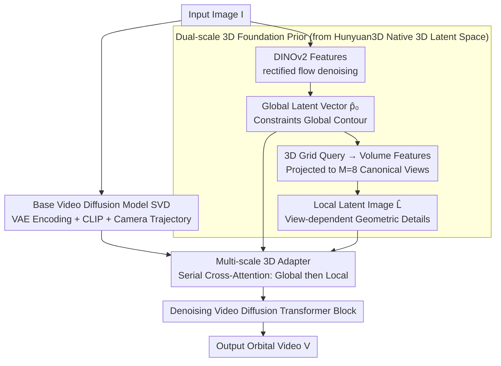

# Towards Realistic and Consistent Orbital Video Generation via 3D Foundation Priors

**Conference**: CVPR 2026  
**arXiv**: [2604.12309](https://arxiv.org/abs/2604.12309)  
**Code**: None  
**Area**: 3D Vision / Video Generation  
**Keywords**: Orbital Video Generation, 3D Priors, Video Diffusion, Multi-view Consistency, Shape Realism

## TL;DR

The authors propose leveraging the latent features of a 3D foundation generative model (Hunyuan3D) as shape priors. These are injected into a base video diffusion model through multi-scale 3D adapters to achieve geometrically realistic and view-consistent orbital video generation from a single image.

## Background & Motivation

**Background**: Orbital video generation (generating videos from object images and camera trajectories) has received significant attention. Existing methods mainly rely on pixel-level attention to ensure view consistency.

**Limitations of Prior Work**: Pixel-level attention fails to establish effective pixel correspondences under large viewpoint changes (e.g., front-to-back), leading to distortions and unnatural structures. Some methods attempt to use 2D foundation models (e.g., single-view depth maps) as geometric conditions, but 2.5D priors cannot model the complete object shape and remain insufficiently constrained for unobserved or occluded parts.

**Key Challenge**: Video diffusion models lack 3D world knowledge. Relying solely on 2D attention or 2.5D priors cannot guarantee shape realism under large viewpoint variations.

**Goal**: Utilize the ability of 3D foundation models to encode complete object shapes to provide effective 3D shape constraints for video generation.

**Key Insight**: The latent features of a 3D foundation model can serve as effective 3D shape priors, providing both auxiliary constraints and enhanced view consistency.

**Core Idea**: Extract two scales of latent features (global shape vector + view-dependent latent images) from a 3D foundation model and inject them into a video diffusion model via multi-scale adapters.

## Method

### Overall Architecture

Built upon the SVD video diffusion model, the input image is simultaneously fed into a 3D foundation model (Hunyuan3D) to obtain shape priors. Features of two scales are injected into each Transformer block via multi-scale 3D adapters using cross-attention mechanisms to guide video generation. At inference time, 3D feature extraction incurs only about 2 seconds of additional overhead.

### Key Designs

**1. Dual-scale 3D Foundation Prior: One for Global Contour, One for View Details**

The failure of pixel-level attention under large viewpoint changes stems from its lack of a complete shape concept. Ours counteracts this by extracting two granules of features from the 3D foundation model to fill this "3D world knowledge" gap. First is the global latent vector $\hat{\bm{p}}_0 \in \mathbb{R}^{L \times D}$, obtained by denoising via a rectified flow model conditioned on DINOv2 features of the input image. It compresses the entire object structure into a set of compact tokens, responsible for constraining "what the thing generally looks like." Second is the local latent image $\hat{\mathbf{L}} \in \mathbb{R}^{M \times H_l \times W_l \times D'}$, generated by querying volume features on a regular 3D grid using the global vector and projecting them onto $M=8$ canonical views, providing fine-grained geometry that varies with the viewpoint. These two are complementary: global vectors watch the overall contour, while local latent images fill in local details for each view. Crucially, the entire process stays in the latent space—no explicit mesh decoding is required, thus eliminating the time-consuming mesh extraction step without losing complete shape information.

**2. Multi-scale 3D Adapter: Injecting Priors via Plug-and-Play Cross-Attention without Modifying the Backbone**

Given the dual-scale priors, a method is needed to inject them without damaging the capabilities of the original video model. The adapter performs two serial stages of cross-attention on the input features $\mathbf{f}_i^{(0)}$ of each Transformer block: first fusing with the global vector to obtain $\mathbf{f}_i^{(1)}$, and then fusing with the local latent image to obtain $\mathbf{f}_i^{(2)}$. This follows a "shape first, details second" sequence. The global vector is replicated $N$ times so that all frames share the same shape reference, effectively pinning multi-view consistency to the same 3D object. Since these are bypass modules attached to the backbone and the 3D foundation model itself is frozen, the generation capabilities inherited from general pre-training are preserved. Furthermore, the prior extraction component does not need retraining if a stronger video backbone is adopted.

**3. Selecting Hunyuan3D as the Prior Source: Native 3D Generative Latent Space Beats the NVS Route for Shape Conditioning**

Not all 3D model features are equally effective. Hunyuan3D is chosen for two specific reasons: first, it avoids the intermediate NVS (New View Synthesis) step of "generating multi-view images then fusing," instead modeling the full object shape directly in a 3D latent space. Thus, the latent features naturally carry 3D structure rather than artifacts of 2D projections. Second, it decouples shape and appearance via explicit geometric supervision, resulting in a cleaner latent space semantic that is closer to "pure shape" information. In contrast, schemes like Hi3D that rely on NVS then refinement are time-consuming and couple shape quality with initial reconstruction, making them less ideal as conditions—this explains why Ours achieves more stable shape constraints with training-free single-pass inference despite also introducing 3D.

### Loss & Training

Standard denoising objective: $\mathcal{L} = \mathbb{E}[w(t) \| \mathcal{V}_\sigma(\bm{z}_t) - \bm{\epsilon} \|_2^2]$. The 3D foundation model is frozen, and only the adapters (0.3B parameters) are trained. Training is performed on Objaverse-XL synthetic rendered data for 80K iterations.

## Key Experimental Results

### Main Results

| Method | PSNR↑ | SSIM↑ | LPIPS↓ | CLIP-S↑ | MEt3R↓ |
|------|-------|-------|--------|---------|--------|
| SV3D | 20.48 | 0.91 | 0.12 | 92.84 | 0.07 |
| Hi3D | 19.32 | 0.90 | 0.14 | 90.61 | 0.09 |
| Hunyuan3D (Rendered) | 20.25 | 0.91 | 0.11 | 93.44 | - |
| Wonder3D | 19.53 | 0.89 | 0.15 | 89.03 | - |
| **Ours (21 frames)** | **22.78** | **0.92** | **0.09** | **94.19** | **0.05** |

### Ablation Study

| Configuration | PSNR↑ | CLIP-S↑ | MEt3R↓ |
|------|-------|---------|--------|
| No Prior (Baseline) | 20.06 | 91.26 | 0.08 |
| + Global Vector | 21.86 | 93.12 | 0.06 |
| + Global + Local (Full) | **22.78** | **94.19** | **0.05** |

### Key Findings

- Global vectors significantly improve multi-view consistency (MEt3R drops from 0.08 to 0.06) and shape realism (CLIP-S increases by nearly 2 points).
- Local volume features further enhance overall performance, especially visual fidelity (PSNR increases by approximately 1 point).
- 3D feature extraction overhead is minimal (Global vector 1.8s + Volume features 0.34s + Projection 0.11s).

## Highlights & Insights

- Using latent features of a 3D foundation model as conditions instead of explicit meshes is a key innovation: it avoids time-consuming mesh extraction while preserving complete shape information.
- Adapters act as soft constraints: the video model retains its randomness and ability to balance image/shape conditions without over-constraining the generation.

## Limitations & Future Work

- Currently trained only on synthetic data; domain gaps in real-world scenes may exist.
- The object orientation inferred by the 3D foundation model may not perfectly align with the target.
- Evaluation is limited to object-level videos and has not been extended to scene-level.
- Future work could extend to longer videos and more complex camera trajectories.

## Related Work & Insights

- **vs SV3D/Hi3D**: These methods lack 3D priors and produce unrealistic structures under large viewpoint changes; Ours addresses this via 3D foundation models.
- **vs Iterative Refinement Methods**: Methods like Hi3D require reconstructing a coarse 3D model and then refining it, which is time-consuming and couples quality to initial results; Ours utilizes training-free single-pass inference for priors.

## Rating

- Novelty: ⭐⭐⭐⭐ The idea of using 3D foundation model latent features as priors for video generation is novel.
- Experimental Thoroughness: ⭐⭐⭐⭐ Comparisons across multiple benchmarks/baselines + comprehensive ablation studies.
- Writing Quality: ⭐⭐⭐⭐ Clear description of the methodology.
- Value: ⭐⭐⭐⭐ Significant contribution to orbital video generation and new view synthesis.

<!-- RELATED:START -->

## Related Papers

- [\[CVPR 2026\] Geometry-as-context: Modulating Explicit 3D in Scene-consistent Video Generation to Geometry Context](geometry-as-context_modulating_explicit_3d_in_scene-consistent_video_generation_.md)
- [\[CVPR 2026\] ConsID-Gen: View-Consistent and Identity-Preserving Image-to-Video Generation](consid-gen_view-consistent_and_identity-preserving_image-to-video_generation.md)
- [\[CVPR 2026\] EgoControl: Controllable Egocentric Video Generation via 3D Full-Body Poses](egocontrol_controllable_egocentric_video_generation_via_3d_full-body_poses.md)
- [\[CVPR 2025\] Learning Temporally Consistent Video Depth from Video Diffusion Priors](../../CVPR2025/video_generation/learning_temporally_consistent_video_depth_from_video_diffusion_priors.md)
- [\[ICCV 2025\] NormalCrafter: Learning Temporally Consistent Normals from Video Diffusion Priors](../../ICCV2025/video_generation/normalcrafter_learning_temporally_consistent_normals_from_video_diffusion_priors.md)

<!-- RELATED:END -->
