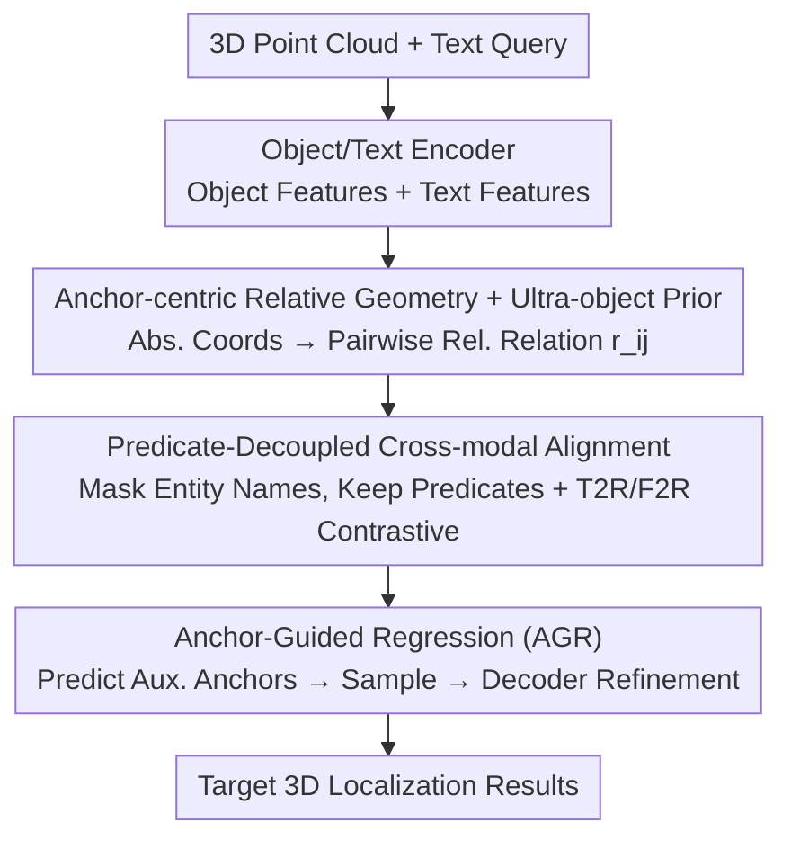

# ORD: Object-Relation Decoupling for Generalized 3D Visual Grounding

**Conference**: CVPR 2026  
**Paper**: [CVF Open Access](https://openaccess.thecvf.com/content/CVPR2026/html/Huang_ORD_Object-Relation_Decoupling_for_Generalized_3D_Visual_Grounding_CVPR_2026_paper.html)  
**Code**: To be confirmed  
**Area**: 3D Vision  
**Keywords**: 3D Visual Grounding, Target-Anchor Relation, Predicate Decoupling, Relative Geometry, Contrastive Alignment

## TL;DR
ORD proposes an "Object-Relation Decoupling" framework that explicitly models target-anchor spatial relations as first-class geometric/semantic primitives. By utilizing anchor-centric relative geometry, predicate-decoupled cross-modal alignment, and anchor-guided regression, it severs the dependence on "shortcuts from entity names," consistently outperforming SOTA on multiple 3D visual grounding benchmarks including NR3D/SR3D.

## Background & Motivation
**Background**: Text-guided 3D Visual Grounding (3DVG) aims to localize target objects in 3D scenes based on natural language. Mainstream approaches rely on strengthening cross-modal alignment through multi-view projections, entity-driven attention, and multi-step reasoning.

**Limitations of Prior Work**: These methods primarily focus on "absolute position" and "global matching," lacking explicit modeling of **relative relations** and local geometric constraints between objects. They struggle in real-world scenarios with complex relational structures and multi-anchor semantics. Even methods using language-conditioned Transformers to encode relative cues (like distance/orientation) **fail to decouple linguistic semantics from geometric relations**.

**Key Challenge**: Directly fusing sentence-level text embeddings with relative spatial features encourages the model to take "semantic shortcuts"—guessing relations based on surface semantics (entity names) rather than inferring them from geometry. Consequently, the relative relation module contributes less to localization, degrading overall performance. In short, the **tight coupling of text semantics and relative geometry** hinders true relational understanding and weakens generalization across views and compositions. Figure 1 provides an intuitive example: "trash bin closest to the wall" in the training set and "monitor closest to the window" in the test set both contain the predicate "closest to" but refer to different entities; if the model binds "closest" strictly to "trash bin," it fails on "monitor."

**Goal**: To strip target-anchor relations from entity semantics and model them explicitly as first-class citizens, enabling the model to learn **predicate-level, generalizable** relational knowledge.

**Key Insight**: The core hypothesis is that relative geometry should be aligned with "language carrying the relation (predicates)" rather than object names or attributes. Furthermore, relative geometry must be encoded in an **anchor-centric coordinate system** to remain robust to view and scale variations.

**Core Idea**: Object-Relation Decoupling (ORD)—comprising anchor-centric relative geometry encoding, predicate-decoupled mask alignment, and anchor-guided regression to cut off semantic shortcuts.

## Method

### Overall Architecture
ORD is an anchor-driven 3DVG framework. Inputs consist of a 3D point cloud and a natural language query. First, an Object Encoder and Text Encoder extract object and text features. Then, the **Spatial Relation Modeling Module** converts absolute coordinates into pairwise relative object-relation features, embedded by a relative position encoder. These relative relations are fused with object features (via the Spatial/Absolute Information Enhancement Module) while simultaneously being aligned with "predicate-only" text representations (via Predicate-Decoupled Alignment + Global Alignment). Finally, the **Anchor-Guided Regression Module** (AGR) predicts auxiliary anchors and samples their features for the Transformer decoder to output refined target/anchor localization results.

### Key Designs

**1. Anchor-centric Relative Geometry + Ultra-object Prior: Ensuring View and Scale Robustness**

Most 3DVG methods model spatial relations using absolute coordinates or pairwise distances/angles, which drift when the coordinate system or viewpoint changes. Ours adopts a "bone/ultra-bone" approach, characterizing only the **unit direction + normalized length** for each pair of objects. Given object proposals $V=\{O_i\}$ with centers $c_i$ and sizes $z_i$, a directed graph is constructed; for an edge $e=(i\to j)$, define $len_{ij}=\lVert c_i-c_j\rVert_2$ and $dir_{ij}=(c_i-c_j)/len_{ij}$. To provide a unified reference for the entire scene, all edges are averaged into an "**ultra-object**": $len_{avg}=\frac{1}{|E|}\sum len_{ij}$ and $dir_{avg}=\frac{1}{|E|}\sum dir_{ij}$, forming a global geometric token $g_{global}=[dir_{avg}^\top, len_{avg}]^\top \in \mathbb{R}^4$. This acts as a soft anchor to calibrate scales and suppress relation drift caused by reference frame changes. Each object then aggregates its associated edges $r_{ij}=C([b^x_{ij}],[b^y_{ij}],[b^z_{ij}],[len_{ij}],g_{global})$ (where $C$ is concatenation and $b$ is the direction triplet), projected by a relative position encoder into $R\in\mathbb{R}^{N_{obj}\times N_{obj}\times d_{in}}$. This "relative + global reference" encoding is more viewpoint-agnostic and scale-robust than pure absolute coordinates.

**2. Predicate-Decoupled Cross-modal Alignment: Masking Entity Names to Align Only "Relational Words"**

This is the core of breaking the semantic shortcut. Spatial relations should align with "language carrying the relation," not object names/attributes. Prior works often replace entity tokens with role labels (target/anchor), but surface priors still leak, entangling relation understanding with entity semantics. Ours uses a **Predicate-Decoupled Mask**: given a referring expression $S_i=\{w_k\}$, construct $S_i^{rel}=M_{pred}(S_i;C_{rel})$, where $C_{rel}$ is a set of spatial predicate categories (e.g., left of, right of, in front of, on, above, between, closest, farthest, and comparatives/superlatives). All tokens not in $C_{rel}$ (including object names and attributes) are replaced with [MASK]. The text encoder thus only sees pure predicate fragments. Masked-mean pooling is applied to predicate positions to obtain a compact predicate representation $T_i^{rel}=\text{MaskedMean}(E_{text}(S_i^{rel}))$. For example, "The target is on the right side of the anchors" is seen only as "is on the right side of." Based on this, two-way InfoNCE contrastive alignment is performed: **Text-to-Relation (T2R)** aligns predicates with relative relations $s^{t2r}_{ij}=\cos(T_i^{rel},R_j)$, and **Feature-to-Relation (F2R)** aligns fusion-derived scene object features with relations $s^{f2r}_{ij}=\cos(F_i,R_j)$, producing distributions $Q^{t2r}, Q^{f2r}$ via softmax with temperature $\tau$. The former enforces fine-grained "relation word ↔ pairwise geometry" alignment, while the latter captures "global object-text semantics," suppressing entity name leakage while preserving global context.

**3. Anchor-Guided Regression (AGR): Explicitly Injecting Target-Anchor Priors for Disambiguation**

Key cues in spatial relations include both target and anchor positions. To inject target-anchor priors into regression and disambiguate in complex multi-object scenes, an auxiliary anchor localization strategy is designed. Given aggregated features $F_{fuse}\in\mathbb{R}^{N_{obj}\times d_{in}}$, a linear projection $FC_{obj}$ maps them to the number of anchors $N_A$, yielding auxiliary anchor logits $L_{aux}\in\mathbb{R}^{N_{obj}\times N_{A}}$. An argmax over the anchor dimension provides regression indices $P_{anc}$, used to retrieve and sample predicted anchor features $F_{sampled}\in\mathbb{R}^{N_A\times d}$. Aggregated features $F_{agg}$ and sampled anchor features are then fed into a Transformer decoder for cross-modal interaction, outputting $F_{ref}\in\mathbb{R}^{(N_A+1)\times d}$ (comprising $N_A$ anchor slots + 1 target slot). Finally, a fully connected head $FC_o$ provides the anchor-guided regression prediction $L_{ref}$. By explicitly outputting dedicated anchor and target slots refined by the regression head, the decoder better distinguishes between anchors and targets in multi-object scenes, avoiding reference drift.

### Loss & Training
The total objective is a sum of several losses: $L = L_{Object} + L_{ref} + L_{Sent} + L_c + L_{TA}$.

- **Target-Anchor Relation Loss** $L_{TA}=L_r+L_{sym}$: $L_r$ is primary supervision for target $\to$ anchor correspondence; $L_{sym}=\lambda\cdot\text{MSE}(FR^\top, FR)$ ($\lambda=0.1$) is an auxiliary regularization imposing a symmetry constraint on the relation feature matrix to suppress noise-induced unilateral false high responses and smooth optimization.
- **Contrastive Loss** $L_c=L_{t2r}+L_{f2r}$: Uses InfoNCE on paired (scene object, text, relation) triplets, capturing both global (scene-text) and local (relation-structure) correspondences.
- **Localization Loss** $L_{ref}$: Merges auxiliary anchor indices $y_{anchor}$ and target index $y_{target}$ into a unified reference label $y_{ref}$, applying row-wise softmax cross-entropy to encourage logical outputs that distinguish anchor and target slots.
- Additional terms include sentence-level cross-entropy $L_{Sent}$ (following CoT3DRef) for the text module and object category cross-entropy $L_{Object}$ for feature-semantic alignment.

Training details: 3D point clouds are segmented into object instances (1,024 points each). NR3D/SR3D use a 70%/30% non-overlapping split. PyTorch + 2×RTX 4090, 110 epochs, batch size 18, initial learning rate 5e-4, hidden dimension 768, max 52 objects per scene, max token length 24.

## Key Experimental Results

### Main Results
Comparison on NR3D / SR3D (ReferIt3D) benchmarks against absolute-only and absolute+relative methods (accuracy acc, correct if predicted identity matches GT).

| Dataset | Method | Spatial Cues | Overall | Easy | Hard | View-Dep. | View-Indep. |
|--------|------|---------|---------|------|------|-----------|-------------|
| SR3D | CoT3DRef (ICLR'24) | Absolute | 73.2 | 75.2 | 67.9 | 67.6 | 73.5 |
| SR3D | ViewSRD (ICCV'25) | Absolute | 76.0 | 78.3 | 70.6 | 69.0 | 76.2 |
| SR3D | MiKASA (CVPR'24) | Abs.+Rel. | 75.2 | 78.6 | 67.3 | 70.4 | 75.4 |
| SR3D | **Ours** | Abs.+Rel. | **76.2** | 78.4 | 71.0 | 64.2 | 76.8 |
| NR3D | CoT3DRef (ICLR'24) | Absolute | 64.4 | 70.0 | 59.2 | 61.9 | 65.7 |
| NR3D | ViewSRD (ICCV'25) | Absolute | 69.9 | 75.3 | 64.8 | 68.6 | 70.6 |
| NR3D | MA2TransVG (CVPR'24) | Abs.+Rel. | 65.2 | 71.1 | 57.6 | 62.5 | 65.4 |
| NR3D | **Ours** | Abs.+Rel. | **71.6** | 76.4 | 67.0 | 69.8 | 72.5 |

ORD significantly outperforms SOTA on fine-grained relations: **View-dependent relations** (left/right/front/behind) reach 71.5/70.6/71.7/70.5, with a +7.2 gain over ViewSRD on "behind"; **View-independent relations** (closest/farthest/between/above/under) reach 73.4/59.7/74.7/70.5/83.0, showing significant gains (+19.8 for "under" vs. CoT3DRef). Ranking metrics (MRR=0.81, MR=1.85, MedR=1.01) indicate target objects are consistently ranked first.

### Ablation Study
Ablation on NR3D (Overall):

| Configuration | Overall | Hard | View-Dep | Description |
|------|---------|------|----------|------|
| w/o Anchors & ROR | 62.2 | 56.1 | 60.1 | Biggest drop without anchors + relative relations |
| w/o SFAM (G & P) | 69.1 | 64.3 | 69.1 | Disabling both Global and Predicate alignment |
| w/o SFAM G | 69.8 | 64.0 | 68.0 | Removing Global alignment |
| w/o SFAM P | 70.8 | 65.1 | 69.5 | Removing Predicate alignment |
| w/o SIEM & AIEM | 70.9 | 65.1 | 70.4 | Removing spatial/absolute enhancement |
| w/o AGRM | 71.0 | 65.0 | 67.0 | Removing Anchor-Guided Regression |
| **Ours (Full)** | **71.6** | **67.0** | **69.8** | Full model |

### Key Findings
- The most significant contribution comes from "Anchors + Relative Relations": removal results in a drop from 71.6 to 62.2 (−9.4), particularly in Hard and View-Dependent subsets.
- Predicate-Decoupled Alignment (SFAM) is critical; disabling it drops performance to 69.1, especially affecting the Hard subset.
- AGRM provides a smaller gain (to 71.6) but aids disambiguation in multi-view/complex scenes; $L_{sym}$ accelerates and stabilizes training.
- ORD fully leverages both absolute and relative coordinates, showing clear advantages over methods relying solely on absolute layouts (3D-SPS/BUTD-DETR/CoT3DRef) in complex spatial relation scenarios.

## Highlights & Insights
- **Predicate-Decoupled Masking is the most potent strategy**: By masking all tokens except spatial predicates, the model is forced to focus on geometric semantics, cutting off shortcuts from object names—a transferable insight for any language-geometric alignment task.
- **Ultra-object as a soft anchor is elegant**: Averaging all scene edges into a 4D global geometric token provides scale and orientation calibration with minimal cost, serving as a lightweight yet effective reference.
- **Modeling anchors as regressible slots**: AGR turns disambiguating "who is the anchor" from implicit attention to explicit supervision, making multi-anchor scenes more controllable.
- **Dual-path contrastive alignment (T2R + F2R)**: T2R handles fine-grained predicate-geometry alignment while F2R manages global object-text semantics, suppressing surface leakage without losing global context.

## Limitations & Future Work
- **Dependency on anchor annotations**: The method consumes anchor-level labels provided by CoT3DRef/SR3D for auxiliary anchor supervision; performance on datasets without such labels remains underexplored.
- **Hand-defined predicate set**: The masking relies on a predefined list $C_{rel}$. It may fail on out-of-vocabulary expressions or implicit spatial descriptions, limiting coverage in open-world scenarios.
- **Implementation details in supplementary**: Specific implementations of AIEM/SIEM and details of $L_r/L_{Sent}$ are in the supplementary material, slightly affecting standalone reproducibility.
- **Limited evaluation benchmarks**: Primarily focused on NR3D/SR3D; cross-benchmark generalization (e.g., ScanRefer) has not been fully verified.

## Related Work & Insights
- **vs. Absolute-only methods (3D-SPS / BUTD-DETR / CoT3DRef)**: These rely on centroid absolute coordinates + global matching; ORD adds explicit relative geometry and anchors, yielding significant gains on NR3D.
- **vs. Geometric bias without decoupling (ViL3DRel, etc.)**: These fuse semantics and geometry in a single path, still encouraging shortcuts; ORD separates them via predicate-decoupled masking.
- **vs. Decoupled representation with global coordinates**: These models lack explicit parameterization of target-anchor relative geometry in an anchor-centric frame, which ORD addresses.
- **vs. Hand-crafted losses for relative relations**: These often rely on limited relation types; ORD treats relations as first-class primitives with contrastive alignment, favoring transferability to unseen relation combinations.

## Rating
- Novelty: ⭐⭐⭐⭐ Object-relation decoupling + predicate masking effectively targets 3DVG shortcuts, though some parts combine existing ideas.
- Experimental Thoroughness: ⭐⭐⭐⭐ Comprehensive tables on NR3D/SR3D, fine-grained breakdowns, ranking metrics, and ablation of modules/losses; however, lacks ScanRefer.
- Writing Quality: ⭐⭐⭐ Logical flow and complete formulas, though key details are in supplementary and some table labels in the draft required reconciliation.
- Value: ⭐⭐⭐⭐ The predicate-decoupled mask is a generalizable idea with significant heuristic value for 3DVG and broader language-spatial alignment tasks.

<!-- RELATED:START -->

## Related Papers

- [\[CVPR 2026\] MonoVLM: Monocular 3D Visual Grounding with Vision Language Models](monovlm_monocular_3d_visual_grounding_with_vision_language_models.md)
- [\[CVPR 2026\] Scalable Object Relation Encoding for Better 3D Spatial Reasoning in Large Language Models](scalable_object_relation_encoding_for_better_3d_spatial_reasoning_in_large_langu.md)
- [\[CVPR 2026\] PV-Ground: Text-Guided Point-Voxel Interaction for 3D Visual Grounding](pv-ground_text-guided_point-voxel_interaction_for_3d_visual_grounding.md)
- [\[CVPR 2026\] UZ3DVG: Unaided Zero-Shot 3D Visual Grounding with Generated Language Conditions](uz3dvg_unaided_zero-shot_3d_visual_grounding_with_generated_language_conditions.md)
- [\[CVPR 2026\] S$^2$-MLLM: Boosting Spatial Reasoning Capability of MLLMs for 3D Visual Grounding with Structural Guidance](s2-mllm_boosting_spatial_reasoning_capability_of_mllms_for_3d_visual_grounding_w.md)

<!-- RELATED:END -->
