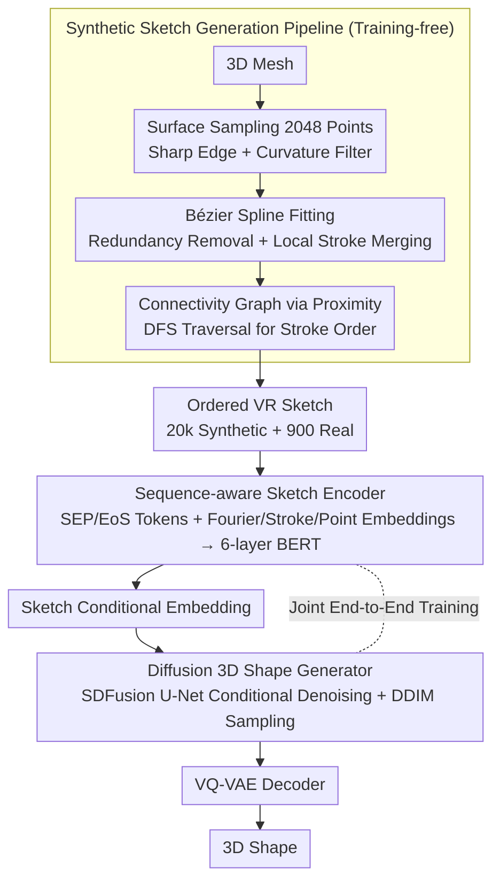

# Order Matters: 3D Shape Generation from Sequential VR Sketches

**Conference**: CVPR 2026  
**arXiv**: [2512.04761](https://arxiv.org/abs/2512.04761)  
**Authors**: Yizi Chen, Sidi Wu, Tianyi Xiao, Nina Wiedemann, Loic Landrieu (ETH Zurich, LIGM/ENPC/IP Paris)
**Code**: [VRSketch2Shape](https://chenyizi086.github.io/VRSketch2Shape_website/)  
**Area**: Others  
**Keywords**: VR sketching, 3D shape generation, stroke order, diffusion model, sketch-to-shape

## TL;DR
The authors propose VRSketch2Shape, a framework that models temporal stroke information of VR sketches for the first time. Utilizing a sequence-aware BERT encoder and a diffusion-based 3D generator (SDFusion), it generates high-fidelity 3D shapes from ordered VR sketches. The work also contributes a multi-category dataset containing 20k synthetic and 900 real sketches.

## Background & Motivation

Creating high-quality 3D content is core to architecture and industrial design. Traditional CAD tools (e.g., Blender) have steep learning curves unsuitable for rapid ideation. While text-guided 3D generation has progressed, natural language remains too ambiguous for precise geometric specifications.

VR sketching allows users to explore ideas directly in 3D space, eliminating perspective ambiguity and occlusion inherent in 2D sketching. However, existing VR sketch-to-shape methods face three challenges:

- **Data Scarcity**: The only public benchmark, 3DVRChair, contains only 1,005 sketch-shape pairs for the chair category.
- **Geometric Misalignment**: Hand-drawn sketches naturally contain perspective and depth errors, failing to align perfectly with target shapes.
- **Loss of Temporal Information**: Existing methods treat VR sketches as unordered point clouds, discarding signals like stroke order and length—which encode crucial information regarding connectivity, structure, and design intent.

Key Insight: **Order matters**. Human drawing follows a coarse-to-fine sequence, capturing global outlines before adding details. This sequence contains rich structural priors.

## Method

### Overall Architecture

The core claim is that stroke order is critical. Humans draw global contours before details, and this sequence encodes structural priors that previous point-cloud-based methods discarded. VRSketch2Shape adopts a three-stage pipeline: a training-free geometric pipeline for generating synthetic temporal sketches from 3D meshes to solve data scarcity; a sequence-aware BERT encoder to encode ordered strokes as conditions; and a diffusion-based generator (SDFusion) to generate 3D shapes. The encoder and diffuser are trained jointly end-to-end.

### Key Designs

**1. Training-free Synthetic Sketch Generation Pipeline: Mass-producing temporal sketches via geometric heuristics.**

The benchmark 3DVRChair has only 1,005 pairs, insufficient for training. This pipeline automatically generates VR sketches with stroke order from 3D meshes, yielding 20,838 samples in ~10 hours. It samples 2048 points on the mesh surface, using Sharp Edge Sampling and a curvature threshold (15) to preserve salient structural regions. EMAP fits Bézier splines (max order 2, min length 12), removing linear redundancies (cosine threshold 0.04) and merging strokes with endpoints closer than 2% of the shape size. Finally, a connectivity graph based on spatial proximity determines order via DFS, with a 10% probability of skipping the nearest connection to introduce randomness. For real sketches, 15 participants drew 900 sketches (300 chairs/200 tables/200 cabinets/200 planes) in a Unity VR interface with surface snapping to ensure geometric alignment.

**2. Sequence-aware Sketch Encoder: Encoding stroke order and length into tokens.**

To make "order" functional, sequential information is embedded at the token level. The encoder tokenizes the sketch into an ordered stroke sequence, inserting SEP (End of Stroke) and EoS (End of Sketch) markers:
$$\mathcal{S} = [p_1^1, \cdots, p_{n_1}^1, \text{SEP}, \cdots, p_1^S, \cdots, p_{n_S}^S, \text{SEP}, \text{EoS}]$$
Each 3D coordinate $(x, y, z)$ is encoded with Fourier features ($L=10$ frequencies) and passed through a 2-layer MLP to obtain spatial embeddings $E_{\text{spa}}(p) = \text{MLP}_{\text{spa}}([\Phi_{\text{spa}}(x), \Phi_{\text{spa}}(y), \Phi_{\text{spa}}(z)])$. Stroke index $s$ and point index $i$ use sinusoidal encodings with linear projections: $E_{\text{stroke}}(s) = \text{Lin}_{\text{stroke}}(\Phi_{\text{seq}}(s))$ and $E_{\text{point}}(i) = \text{Lin}_{\text{point}}(\Phi_{\text{seq}}(i))$. These sum to the final token embedding $E(p_i^s) = E_{\text{spa}}(p_i^s) + E_{\text{stroke}}(s) + E_{\text{point}}(i)$, processed by a 6-layer, 8-head BERT. Compared to SketchBERT, this uses Fourier features over raw coordinates, learnable stroke separators over concatenated one-hots, and continuous Fourier encodings over fixed lookups to handle variable-length 3D sketches. Augmentation includes masking 15% of strokes, 30% of remaining points, and randomly swapping 20% of stroke orders.

**3. Diffusion-based 3D Shape Generation: Denoising shapes conditioned on sketch encodings.**

Generation uses the SDFusion latent diffusion model. Ground truth shapes are voxelized and encoded into compact latent representations via a pre-trained 3D VQ-VAE. The U-Net predicts the denoised latent vector conditioned on the BERT encoder output. Inference uses 100-step DDIM sampling. During training, VQ-VAE is frozen, while U-Net and the sketch encoder are jointly optimized to ensure conditional encodings directly benefit generation quality.

## Key Experimental Results

### Table 2: Quantitative Main Results — Sketch-to-Shape Generation

| Method | 3DVRChair (chair only) | | VRSketch2Shape (chair) | | VRSketch2Shape (all) | |
|---|---|---|---|---|---|---|
| | F-score ↑ | CD ↓ | F-score ↑ | CD ↓ | F-score ↑ | CD ↓ |
| LAS-Diffusion⋆ | 26.1 | 66.0 | 37.0 | 51.1 | 40.2 | 27.1 |
| Luo et al. | 26.6 | 35.5 | 42.2 | 13.4 | 48.8 | 13.0 |
| **VRSketch2Shape (ours)** | **31.1** | **25.8** | **64.3** | **4.0** | **69.8** | **4.8** |

VRSketch2Shape leads significantly across all settings:
- On 3DVRChair, CD reduced by **27%** (25.8 vs 35.5).
- On VRSketch2Shape (all categories), F-score improved by **43%** (69.8 vs 48.8) and CD reduced by **63%** (4.8 vs 13.0).

### Table A-1: DDIM Steps and Speed-Accuracy Trade-off

| DDIM Steps | F-score ↑ | CD×1000 ↓ | Inference Time (s/sample) |
|---|---|---|---|
| 10 | 69.24 | 5.04 | 2.26 |
| 25 | 69.70 | 4.82 | 3.06 |
| 50 | 69.74 | 4.89 | 4.47 |
| 100 | 69.80 | 4.78 | 6.33 |

Performance remains near-optimal with only 10 DDIM steps, increasing inference speed by **3x**, making it suitable for interactive design.

### Key Findings from Ablation Study (Zero-shot, chair subset)
- **w/o ordering**: Performance drops significantly, confirming "order indeed matters."
- **w/o data augmentation**: Noticeable degradation; simple augmentations effectively improve robustness.
- **w/o synthetic pre-training**: Model collapses to trivial solutions; 200 real sketches are insufficient.
- **Replacing with SketchBERT encoder**: Accuracy drops sharply; 3D-specific design is vital.
- **Sketch as Point Cloud (PointNet++)**: Significant degradation, proving sequence modeling—not just the diffusion generator—provides the core gain.
- **Sketch as Images (VGG + Multi-view)**: Occlusion causes missing geometry; performance is significantly worse.

### Few-shot Synthetic-to-Real Transfer
Fine-tuning with only 50 real sketches per category approaches optimal performance. The strong zero-shot (no fine-tuning) performance validates the synthetic sketch pipeline.

### Partial Sketch Shape Completion
Keeping only the first 50% of sketch points achieves performance close to full sketches, reflecting the human habit of "drawing outlines before details."

## Highlights & Insights

- **First Modeling of VR Sketch Temporality**: Transitions VR sketches from unordered point clouds to ordered stroke sequences, proving stroke order's critical role in generation.
- **Training-free Synthetic Pipeline**: Automatically generates temporal sketches via geometry heuristics, producing 20k+ samples in 10 hours to replace expensive human labeling.
- **Strong Generalization**: Effective synthetic-to-real transfer (zero/few-shot); generates plausible outputs for unsnapped, free-hand, and even unseen categories.
- **Cross-modal Shape Completion**: Leverages temporal priors to infer complete 3D shapes from partial sketches, accelerating interactive design workflows.
- **End-to-End Single-Stage Training**: Unlike methods requiring multi-stage or modality alignment, the encoder and diffusion model are optimized jointly.

## Limitations & Future Work

- **Restricted SDF Resolution**: Uses a frozen 3D VQ-VAE ($64^3$ resolution), limiting fine-grained geometric details and sometimes resulting in smooth outputs.
- **Limited Category Diversity**: Trained on only 4 ShapeNet categories; performance may degrade on significantly different unseen categories (e.g., trucks, beds).
- **Inference Speed**: 100-step DDIM takes ~6.6s/sample, with 99% of time spent on latent denoising. While steps can be reduced, bottlenecks remain for real-time applications.
- **Surface Snapping Dependency**: Real sketch collection relied on snapping tools for alignment; performance decreases in purely unsnapped scenarios.

## Related Work & Insights

- **2D Sketch → 3D**: Methods like Doodle Your 3D or LAS-Diffusion learn deterministic mappings or diffusion but suffer from single-view ambiguity and occlusion.
- **VR Sketch → 3D**: Luo et al. and Chen et al. treat sketches as point clouds with PointNet++, discarding order; VRSketch2Gaussian uses 3D Gaussians but also ignores sequence.
- **Sketch Synthesis**: CLIPasso/DiffSketcher optimize parametric curves with pre-trained guidance; this work’s geometric heuristic pipeline is entirely training-free.
- **Sketch Encoding**: SketchBERT models sequences in 2D; this work’s Fourier features and learnable separators are better adapted for 3D.
- **3D Generation**: Latent diffusion models like SDFusion perform well for text/image conditioning; this work extends them to sequential VR sketch conditioning.

## Rating
- Novelty: ⭐⭐⭐⭐ — First systematic introduction of stroke temporality to VR sketch-to-shape generation.
- Experimental Thoroughness: ⭐⭐⭐⭐⭐ — Extensive evaluations across two datasets, multiple baselines, detailed ablations, and zero/few-shot/partial/free-hand scenarios.
- Writing Quality: ⭐⭐⭐⭐ — Clear structure, excellent visualizations, and rigorous methodology descriptions.
- Value: ⭐⭐⭐⭐ — Provides a complete data+model+pipeline solution for VR-driven 3D design; open-sourced dataset and code will drive field growth.

<!-- RELATED:START -->

## Related Papers

- [\[CVPR 2026\] ShapeR: Robust Conditional 3D Shape Generation from Casual Captures](shaper_robust_conditional_3d_shape_generation_from_casual_captures.md)
- [\[CVPR 2026\] Parallel Rigidity Matters for Bundle Adjustment](parallel_rigidity_matters_for_bundle_adjustment.md)
- [\[ECCV 2024\] Forest2Seq: Revitalizing Order Prior for Sequential Indoor Scene Synthesis](../../ECCV2024/3d_vision/forest2seq_revitalizing_order_prior_for_sequential_indoor_scene_synthesis.md)
- [\[CVPR 2026\] Z-Order Transformer for Feed-Forward Gaussian Splatting](z-order_transformer_for_feed-forward_gaussian_splatting.md)
- [\[CVPR 2026\] HandDreamer: Zero-Shot Text to 3D Hand Model Generation using Corrective Hand Shape Guidance](handdreamer_zero-shot_text_to_3d_hand_model_generation_using_corrective_hand_sha.md)

<!-- RELATED:END -->
