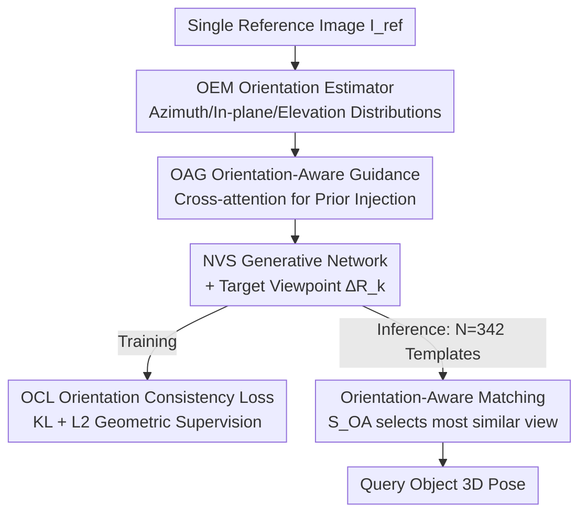

# OrienPose: Orientation-Guided Novel View Synthesis for Single-Image Unseen Object Pose Estimation

**Conference**: CVPR 2026  
**Paper**: [CVF Open Access](https://openaccess.thecvf.com/content/CVPR2026/html/Liu_OrienPose_Orientation-Guided_Novel_View_Synthesis_for_Single-Image_Unseen_Object_Pose_CVPR_2026_paper.html)  
**Code**: https://github.com/pubyLu/OrienPose  
**Area**: 3D Vision  
**Keywords**: Object Pose Estimation, Novel View Synthesis, Orientation Prior, Unseen Objects, Generate-and-Compare

## TL;DR
OrienPose explicitly injects the "orientation prior" of an object into the reference latent variables of Novel View Synthesis (NVS) and employs an orientation consistency loss to supervise view transformations at the geometric level. This converts unseen object pose estimation—from a single image without a CAD model—from an "unconstrained pixel-wise transformation" into a "geometrically defined transformation with a known starting point." On ShapeNet, it improves ACC30 by 7.3% and reduces median error by 7.3° compared to the previous SOTA, NOPE.

## Background & Motivation
**Background**: For estimating the 3D rotation of unseen objects from single or sparse RGB images, the "generate-and-compare" (G&C) paradigm is highly promising. This involves using a generative model to synthesize novel view templates from a reference image at known viewpoints, then matching these templates against a query image to determine the pose. This approach is more flexible than "render-and-compare" (which relies on CAD models) and does not require explicit/implicit 3D reconstruction, making it naturally suited for single-image unseen object scenarios. A representative work is NOPE (CVPR'24).

**Limitations of Prior Work**: NVS is essentially an ill-posed transformation problem—it attempts to learn a geometric mapping "? + ∆R = ?", but **the starting orientation is undefined**. Most existing NVS networks rely solely on pixel-level supervision ($L_2$ loss) without explicit geometric constraints to verify the correctness of the predicted transformation. Consequently, synthesized views often suffer from geometric distortion and blurred textures, leading to unreliable template matching and suboptimal pose estimation. While NOPE introduced explicit rotation information, it still frequently fails or flips for isotropic objects.

**Key Challenge**: The transformation "? + ∆R = ?" lacks a **defined starting orientation**. Without a defined starting point, $\Delta R$ has no anchor, and the transformation "drifts" in the latent space. Furthermore, pixel-level loss only measures visual similarity and fails to provide a geometric criterion for "correctness."

**Goal**: Transform this ill-posed problem into a well-defined transformation $O_{Ref} + \Delta R = O_{Syn}$. By **injecting orientation at the starting point** and **supervising orientation at the end point**, a geometrically self-consistent learning loop is established.

**Key Insight**: The authors observe that an object's **intrinsic orientation** is a geometric cue robust to degradation (blur, occlusion), acting as a suitable starting point for the transformation. However, orientation estimators are used as a **prior** rather than the final answer because their semantic coordinate systems are often misaligned with the standard pose coordinates; yet, they remain stable in modeling "consistent orientation distributions" even under significant view changes.

**Core Idea**: Replace "pixel-only $L_2$ supervision" with "orientation prior injection at the NVS start + orientation consistency supervision at the end," providing the ill-posed view transformation with a defined geometric origin and criterion.

## Method

### Overall Architecture
OrienPose follows the G&C paradigm: given a single reference image $I_{ref}$, an **Orientation-Aware NVS Network** generates multi-view templates under a set of predefined viewpoints $\Delta R_k$. These templates are then compared with the query image $I_{qry}$ to select the most similar pose. The key innovation is that NVS is "clamped" between two geometric constraints: Orientation-Aware Guidance (OAG) at the start and Orientation Consistency Loss (OCL) at the end.

### Key Designs

**1. Orientation-Aware Guidance (OAG): Defining the Start of the Transformation**

OAG explicitly injects the object orientation of the reference image into its latent representation. To avoid texture distortion and artifacts (common in NOPE's pixel-space injection), this process occurs entirely in the **latent space**. Orientation priors are provided by an Orientation Estimation Module (OEM), specifically a retrained Orient-Anything model. The orientation is represented by three discrete 1D probability distributions: azimuth $\alpha$, in-plane rotation $\theta$, and elevation $\omega$. For instance, the azimuth distribution is defined as $P^{\alpha}_{ref}(x|\alpha,\sigma_\alpha)\propto e^{cos(x-\alpha)/\sigma_\alpha^2}$. These distributions are embedded via an MLP into $E_{orien}$ and fused with image embeddings $E_{ref}$ using cross-attention, ensuring the NVS has a fixed anchor for the subsequent $\Delta R$ transformation.

**2. Orientation Consistency Loss (OCL): Geometric Criterion for Correctness**

To address the lack of geometric feedback in $L_2$ loss, OCL adds geometric supervision at the transformation endpoint. The total loss is $L=\lambda_1 L_2+\lambda_2 L_{OC}$, where $L_{OC}$ uses the **KL divergence** between synthesized and target orientation distributions:

$$L_{OC}=\mu_1 D_{KL}(P^{\alpha}_{gt},P^{\alpha}_{ref})+\mu_2 D_{KL}(P^{\theta}_{gt},P^{\theta}_{ref})+\mu_3 D_{KL}(P^{\omega}_{gt},P^{\omega}_{ref})$$

Supervising the azimuth, in-plane, and elevation angles ensures the network estimates orientations within the same coordinate domain as the injected prior, closing the $O_{Ref} + \Delta R = O_{Syn}$ loop.

**3. Orientation-Aware Similarity $S_{OA}$ for Template Matching: Beyond Appearance**

During inference, NVS generates $N=342$ templates. The matching stage utilizes an orientation-aware similarity $S_{OA}$ that combines the $L_2$ distance of latent features with the KL divergence of their orientation distributions:

$$S^k_{OA}=-\|E^k_{tmp}-E_{qry}\|_2^2-D_{KL}(O_{qry}\|O^k_{tmp})$$

This formulation combines appearance and geometric orientation, effectively resolving ambiguities in isotropic objects where shapes look similar but orientations differ.

### Loss & Training
The total objective is $L=\lambda_1 L_2+\lambda_2 L_{OC}$. Training follows the protocol of NOPE using ShapeNet rendered images. The OEM is retrained on the task dataset to align with pose estimation requirements. The NVS backbone is a U-Net style network with pose-conditioning mechanisms.

## Key Experimental Results

### Main Results
The model is trained on ShapeNet and tested on 10 ShapeNet classes and 5 NAVI instances, all of which are **unseen during training**. Metrics include ACC30 (percentage of errors $\le 30^\circ$) and Median error (MedErr).

| Dataset | Metric | OrienPose | NOPE (Prev. SOTA) | Gain |
|--------|------|-----------|-----------------|------|
| ShapeNet | ACC30 ↑ | 59.6 | 52.3 | +7.3% |
| ShapeNet | Median ↓ | 20.4° | 27.7° | −7.3° |
| NAVI (Real, sim2real) | ACC30 ↑ | 50.9 | 36.8 | +14.1% |
| NAVI (Real, sim2real) | Median ↓ | 35.7° | 49.1° | −13.4° |

OrienPose achieves current best performance on ShapeNet (excluding methods requiring CAD models). Notably, replacing the NVS in NOPE with a stronger diffusion model (Free3D) actually performed worse (ACC30 40.4), suggesting that **injecting orientation priors** is more effective than simply increasing generative capacity.

### Ablation Study
Ablation on the *bus* class of ShapeNet:

| Configuration | ACC30 ↑ | Median ↓ | Description |
|------|---------|----------|------|
| w/o OAG | 53.3 | 27.9° | Removing injection makes the starting point "undefined." |
| w/o $L_{OC}$ | 55.1 | 24.7° | Removing geometric supervision leaves only pixel $L_2$. |
| Full (OAG + $L_{OC}$) | 58.7 | 18.3° | The complete closed loop of injection and supervision. |

Removing OAG results in a larger performance drop than removing $L_{OC}$, confirming that a defined starting point is the most fundamental component.

### Key Findings
- **Orientation Injection > Stronger Generative Models**: Generative power cannot solve geometric ill-posedness as effectively as explicit orientation cues.
- **Robustness to Degradation**: The model maintains high performance under 10%–40% Gaussian blur. Performance drops under heavy occlusion (40%) due to structural ambiguity, but remains robust to minor occlusions.
- **Failure Modes**: Errors increase during significant view changes (angles between 45° and 90°), though it still outperforms NOPE.

## Highlights & Insights
- **Formalizing the Ill-posed Problem**: Explicitly defining the process as $O_{Ref} + \Delta R = O_{Syn}$ identifies the lack of an orientation origin as the root cause of prior failures.
- **Prior vs. Answer**: Using orientation labels as distributions/priors rather than direct pose outputs bypasses coordinate alignment issues.
- **Latent Space Injection**: Performing injection in the latent space prevents the generation artifacts and texture distortions seen when manipulating the pixel space.
- **Upgraded Matching**: $S_{OA}$ addresses the "shape similarity vs. orientation flip" ambiguity in isotropic objects.

## Limitations & Future Work
- **Large View Changes**: Significant error exists when images are $45^\circ$ to $90^\circ$ apart; future work may integrate sparse multi-view priors.
- **Heavy Occlusion**: 40% occlusion still introduces unavoidable shape ambiguities.
- **Dependence on OEM**: The system's performance is naturally bounded by the quality of the orientation distribution provided by the OEM.
- **Computational Overhead**: Generating 342 templates for template matching is computationally more expensive than direct regression methods.

## Related Work & Insights
- **vs. NOPE (CVPR'24)**: Both use G&C, but OrienPose adds intrinsic orientation priors and KL geometric supervision, leading to a 7.3% ACC30 gain on ShapeNet.
- **vs. RelPose / RelPose++ / PIZZA**: While these methods learn category-specific priors that are robust for sim2real, they lack 3D awareness. OrienPose outperforms them on both ShapeNet and NAVI.
- **vs. GigaPose / OnePose++**: These require CAD models or multi-view inputs, making them less applicable to the single-image unseen object setting where OrienPose excels.

## Rating
- Novelty: ⭐⭐⭐⭐⭐ 
- Experimental Thoroughness: ⭐⭐⭐⭐ 
- Writing Quality: ⭐⭐⭐⭐ 
- Value: ⭐⭐⭐⭐

<!-- RELATED:START -->

## Related Papers

- [\[CVPR 2026\] SmokeSVD: Smoke Reconstruction from A Single View via Progressive Novel View Synthesis and Refinement with Diffusion Models](smokesvd_smoke_reconstruction_from_a_single_view_via_progressive_novel_view_synt.md)
- [\[CVPR 2026\] PR-IQA: Partial-Reference Image Quality Assessment for Diffusion-Based Novel View Synthesis](pr-iqa_partial-reference_image_quality_assessment_for_diffusion-based_novel_view.md)
- [\[CVPR 2026\] From None to All: Self-Supervised 3D Reconstruction via Novel View Synthesis](from_none_to_all_self-supervised_3d_reconstruction_via_novel_view_synthesis.md)
- [\[CVPR 2026\] GeodesicNVS: Probability Density Geodesic Flow Matching for Novel View Synthesis](geodesicnvs_probability_density_geodesic_flow_matching_for_novel_view_synthesis.md)
- [\[CVPR 2026\] RF4D: Neural Radar Fields for Novel View Synthesis in Outdoor Dynamic Scenes](rf4dneural_radar_fields_for_novel_view_synthesis_in_outdoor_dynamic_scenes.md)

<!-- RELATED:END -->
