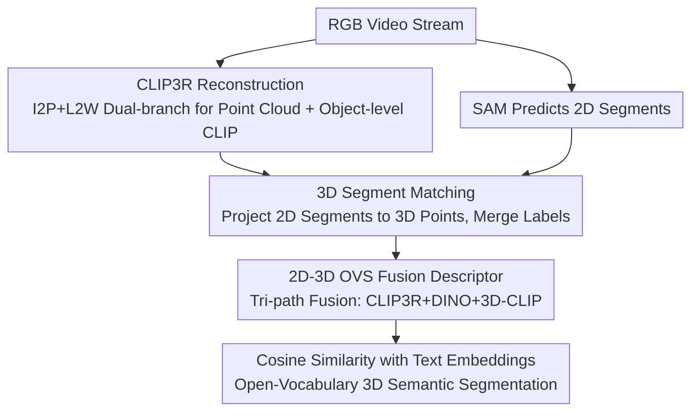

# Ov3R: Open-Vocabulary Semantic 3D Reconstruction from RGB Videos

**Conference**: CVPR 2026  
**Paper**: [CVF Open Access](https://openaccess.thecvf.com/content/CVPR2026/html/Gong_Ov3R_Open-Vocabulary_Semantic_3D_Reconstruction_from_RGB_Videos_CVPR_2026_paper.html)  
**Code**: Project Page https://zorangong.github.io/Ov3R_page/  
**Area**: 3D Vision  
**Keywords**: Open-vocabulary segmentation, 3D reconstruction, CLIP, Spatial AI, RGB video

## TL;DR
Ov3R performs simultaneous dense 3D reconstruction and open-vocabulary 3D semantic segmentation using only RGB video streams. It consists of CLIP3R, which directly infuses CLIP semantics into a reconstruction network for geometry and object-level semantics, and a 2D-3D OVS module that fuses tri-path features (CLIP3R, DINO, and 3D-CLIP) to "lift" 2D semantics to 3D. It achieves SOTA performance on Replica/7Scenes reconstruction and Replica/ScanNet open-vocabulary segmentation while maintaining approximately 15 FPS.

## Background & Motivation
**Background**: Spatial AI systems require agents to understand environment geometry and semantics in real-time, with dense 3D reconstruction as the core. Reconstruction has recently been reshaped by two categories of methods: NeRF/3DGS-driven SLAM, which provides dense reconstruction and accurate tracking but requires scene-level training and high computation; and "3R" models (e.g., end-to-end point map prediction pioneered by DUSt3R), which bypass explicit camera pose estimation to achieve real-time performance for the first time, albeit with weaker tracking precision. Parallelly, CLIP has catalyzed open-vocabulary 3D semantic understanding.

**Limitations of Prior Work**: Both lines of research have blind spots. In reconstruction, most SLAM/3R methods **focus solely on geometry and ignore semantics**, while the few semantic-aware methods are restricted to pre-defined closed-set categories. In open-vocabulary semantics, methods **rely heavily on offline preprocessing**—OpenScene/Open3DIS require pre-reconstructed 3D point clouds as input, HOV-SG requires RGB-D sequences, and OVO, despite being the first online open-vocabulary mapping method, still requires active depth sensors and parallel SLAM for explicit pose estimation, with CLIP descriptors computed only from 2D images, losing 3D geometric information.

**Key Challenge**: A gap exists between current SLAM and "ideal Spatial AI"—which requires "RGB-only, online, open-vocabulary, and 3D geometric awareness." Existing methods typically sacrifice some of these conditions (requiring depth, being offline, closed-set, or 2D-only).

**Goal**: To decompose the problem into two sub-problems: (i) making the reconstruction network inherently semantic-aware and strongly aligned with geometry; (ii) reliably lifting 2D semantics to 3D while imbuing them with 3D geometric awareness.

**Key Insight**: The authors propose **directly embedding CLIP semantics into the reconstruction process** (rather than post-hoc attachment) and **explicitly supplementing 3D geometric features** during open-vocabulary segmentation (rather than relying solely on 2D CLIP).

**Core Idea**: Replace the pipeline of "offline reconstruction followed by 2D semantic attachment" with "CLIP-informed 3R reconstruction (CLIP3R) + tri-path 2D-3D fusion descriptor (2D-3D OVS)" to obtain geometrically consistent and fine-grained semantically aligned 3D scenes from RGB-only video in one go.

## Method

### Overall Architecture
Ov3R consists of two loosely coupled modules: (i) CLIP3R, a 3R reconstruction model "infused" with CLIP semantics that predicts dense point maps from overlapping video segments while providing object-level semantics; (ii) 2D-3D OVS, an open-vocabulary semantic module that lifts 2D features to 3D by learning descriptors that fuse spatial, geometric, and semantic cues. Given an RGB video, CLIP3R produces scene point clouds while SAM predicts 2D segments. Each 2D segment is projected and matched to corresponding 3D points to form 3D segments. Finally, 2D-3D OVS extracts fusion descriptors to calculate cosine similarity with text embeddings of semantic categories, assigning the highest-scoring category to the 3D segment. The two modules are loosely coupled via CLIP features and can operate jointly or independently.

### Key Designs

**1. CLIP3R: Infusing CLIP Semantics Directly into Reconstruction**

To address the issue of reconstruction networks ignoring semantics, CLIP3R learns geometry and object-level semantics simultaneously within a 3R model. It is formulated as $\Phi_{3R}(I_i^{N\times H\times W\times 3})\to P_i^{H\times W\times 3}$. It follows a dual-branch structure: **I2P (Image-to-Points)** is a DUSt3R-style ViT predicting point maps aligned to a central keyframe coordinate system (using a shared encoder $E_{img}$, keyframe decoder $D_{key}$, and support decoder $D_{sup}$ without explicit pose estimation); **L2W (Local-to-World)** aligns local point maps to the scene level using a "reservoir-retrieval" strategy. CLIP3R enhances this by: (i) in I2P, fusing object-level CLIP features $F_{oCLIP}$ with ViT tokens via cross-attention: $F_{fuse}=F_{ViT}+\mathrm{softmax}(F_{ViT}F_{oCLIP}^T/\sqrt{d})F_{oCLIP}$; (ii) in L2W, adding a DPT prediction head to output object-level CLIP3R features $F_{CLIP3R}$. This embeds fine-grained semantics into the 3D reconstruction and enforces scene-wide semantic consistency. Training uses confidence-aware L1 losses $L_{I2P}, L_{L2W}$ and a feature alignment loss $L_{oCLIP}=\|F_{CLIP3R}-F_{oCLIP}\|_1$.

**2. Object-level CLIP3R Features: Refining Image-level CLIP via SAM Masks**

Standard CLIP embeddings are **image-level** and cannot model fine-grained semantics of individual objects. CLIP3R extracts object-level features $F_{oCLIP}$ instead: SAM is used to generate $M$ object masks $m^{H\times W\times 1}$. For each mask, CLIP patch embeddings are extracted, averaged, and upsampled to image resolution $F_{CLIP}$. These are then aggregated into a single feature map: $F_{oCLIP}=\sum_{i=0}^{M} m_i\cdot F_{CLIP_i}$. This step enables CLIP3R to understand scenes at an object level and provides the basis for semantic consistency supervision.

**3. 2D-3D Fusion Descriptor: Adding 3D Geometric Awareness to Segmentation**

To address the lack of 3D geometry in 2D CLIP-based semantics, 2D-3D OVS fuses three complementary features: CLIP3R for semantics, DINO for clear object boundaries, and a distilled 3D-CLIP point encoder for 3D geometric features. CLIP3R and DINO features are extracted at both **scene and instance levels**. These are concatenated and projected: $F_{cat}^{scene}=\mathrm{Linear}([\mathrm{Linear}(F_{DINO}^{scene}),F_{CLIP3R}^{scene}])$, and combined with original CLIP3R features via cross-attention to produce $D_{scene}$ and $D_{inst}$. The 3D-CLIP branch extracts geometric features from object point clouds, producing $D_{mask}$ after cross-attention with masked CLIP3R features. A shallow model learns weights to merge these via Hadamard product: $D=w_{scene}\odot D_{scene}+w_{inst}\odot D_{inst}+w_{mask}\odot D_{mask}$. The model is pre-trained using a sigmoid cosine similarity loss $L_{sim}$ between 2D segment-text pairs.

### Loss & Training
CLIP3R uses confidence-aware L1 point map losses (with $-\alpha\log C$ regularization) and the object-level CLIP alignment loss $L_{oCLIP}$. 2D-3D OVS uses a sigmoid cosine similarity loss $L_{sim}=-\frac{1}{|B|}\sum_i\sum_j\log\frac{1}{1+e^{z_{ij}(-kd_i\cdot t_j+b)}}$ ($z_{ij}\in\{1,-1\}$ denotes pair matching, $t_j$ is the CLIP text embedding). CLIP3R uses 24 encoder and 12 decoder blocks with window sizes $L=5$ (init) and $L=11$ (incremental). Training utilized 4×A100 GPUs, while inference is possible on a single 3090.

## Key Experimental Results

### Main Results
Reconstruction was evaluated on Replica and 7Scenes using Accuracy (cm), Completion (cm), and ATE RMSE. Segmentation was evaluated on Replica and ScanNetv2 using mIoU and mAcc.

| Task / Dataset | Method | Key Metrics | Notes |
|----------------|--------|-------------|-------|
| Replica Recon (Avg) | Ours (CLIP3R) | Acc 3.05 / Comp 2.12, ATE 6.00, **15 FPS** | Best among real-time 3R |
| Replica Recon | SLAM3R | Acc 3.57 / Comp 2.62, ATE 6.61, 24 FPS | Prev. gen real-time 3R |
| Replica Recon | Spann3R | Acc 10.32 / Comp 13.33, >50 FPS | Fast but poor quality |
| Replica Recon | DUSt3R | Acc 3.49 / Comp 2.48, ATE 4.76, <1 FPS | Offline 3R, slow |

In reconstruction, Ov3R exceeds existing real-time 3R methods (Spann3R, SLAM3R) in accuracy and completeness while maintaining 15 FPS.

| Task / Dataset | Method | All mIoU / mAcc | Notes |
|----------------|--------|-----------------|-------|
| Replica Seg (GT Geom) | Ours (2D-3D OVS) | **31.9 / 42.3** | Best overall trade-off |
| Replica Seg (GT Geom) | OVO-mapping | 26.5 / 35.8 | Prev. online SOTA |
| Replica Seg (CLIP3R Geom)| Ours | 30.4 / 41.2 | Best in RGB-only online setting |

In segmentation, Ov3R outperforms all baselines (including offline methods) on Replica, particularly on low-frequency "Tail" categories (22.8/31.5 mIoU/mAcc) compared to Open3DIS (4.9/9.4 mIoU/mAcc).

### Ablation Study

| Module | Configuration | Key Metrics | Mechanism |
|------|------|----------|------|
| CLIP3R | (A) w/o CLIP-insert | Acc 3.31 / Comp 2.35 / ATE 6.46 | Removing I2P CLIP injection degrades recon |
| CLIP3R | (C) Vanilla CLIP | Acc 3.18 / Comp 2.20 / ATE 6.28 | Object-level features are superior |
| CLIP3R | Full | **Acc 3.05 / Comp 2.12 / ATE 6.00** | Full injection and supervision |
| 2D-3D OVS | (D) w/o DINO | mIoU 28.05 | Missing boundary cues |
| 2D-3D OVS | (E) w/o 3D encoder | mIoU 28.46 | Missing geometric cues |

### Key Findings
- **CLIP cues benefit geometry**: Removing CLIP injection (A) degraded reconstruction and tracking, proving semantics actively assist geometry.
- **Object-level > Image-level CLIP**: Using vanilla CLIP (C) led to sub-optimal results, justifying the need for SAM-refined object features.
- **2D and 3D are both essential**: Segmentation performance drops without DINO (geometry-only) or without a 3D encoder (image-only).
- **Efficiency bottleneck is SAM2**: While CLIP3R and OVS run at ~15 FPS, the serial pipeline is limited by SAM2's speed.

## Highlights & Insights
- **"Semantics-infused Reconstruction"**: Directly embedding CLIP into the 3R network improves geometric accuracy, breaking the "semantics as a downstream task only" paradigm.
- **Tri-path Role Division**: CLIP3R provides semantics, DINO provides boundaries, and 3D-CLIP provides geometry, with the distilled 3D encoder aligning geometry to the language-aligned CLIP space.
- **Modular Loosely Coupled Design**: Flexibility to perform reconstruction or segmentation independently.
- **Online RGB-only**: Eliminates the need for depth sensors and explicit camera tracking, lowering the threshold for open-vocabulary 3D understanding.

## Limitations & Future Work
- **Weak Pose Accuracy**: 3R models inherit lower pose precision; the authors plan to integrate global BA from SLAM.
- **Real-time Bottleneck**: SAM2 is currently the serial bottleneck; faster SAM variants are needed for strict real-time performance.
- **Reliance on Multiple Base Models**: The "stack" of SAM, CLIP, DINO, and 3D-CLIP means failures in any single model's out-of-domain performance can propagate.
- **Tracking Performance**: Still trails VGGT-SLAM (which uses SL(4) optimization) in specific scenarios due to the purely feed-forward nature of 3R.

## Related Work & Insights
- **vs. OVO**: OVO requires RGB-D and explicit SLAM. Ov3R is **RGB-only**, does not require explicit tracking, and adds 3D geometric awareness to descriptors.
- **vs. SLAM3R / Spann3R**: These focus only on geometry. Ov3R provides significantly better accuracy and adds semantics at similar speeds.
- **vs. OpenScene / Open3DIS**: These are offline and require pre-reconstructed clouds. Ov3R is online and significantly more robust on "Tail" (low-frequency) categories.

## Rating
- Novelty: ⭐⭐⭐⭐ Solid combination of "semantics-infused reconstruction" and tri-path fusion.
- Experimental Thoroughness: ⭐⭐⭐⭐⭐ Comprehensive coverage across reconstruction, segmentation, and tracking datasets.
- Writing Quality: ⭐⭐⭐⭐ Clear logic and notation, though tri-path fusion equations are dense.
- Value: ⭐⭐⭐⭐⭐ A highly practical RGB-only, online, open-vocabulary framework for Spatial AI.

<!-- RELATED:START -->

## Related Papers

- [\[CVPR 2026\] OVI-MAP: Open-Vocabulary Instance-Semantic Mapping](ovi-map_open-vocabulary_instance-semantic_mapping.md)
- [\[CVPR 2026\] EmbodiedSplat: Online Feed-Forward Semantic 3DGS for Open-Vocabulary 3D Scene Understanding](embodiedsplat_online_feed-forward_semantic_3dgs_for_open-vocabulary_3d_scene_und.md)
- [\[CVPR 2026\] OpenVoxel: Training-Free Grouping and Captioning Voxels for Open-Vocabulary 3D Scene Understanding](openvoxel_training-free_grouping_and_captioning_voxels_for_open-vocabulary_3d_sc.md)
- [\[ICLR 2026\] OVSeg3R: Learn Open-vocabulary Instance Segmentation from 2D via 3D Reconstruction](../../ICLR2026/3d_vision/ovseg3r_learn_open-vocabulary_instance_segmentation_from_2d_via_3d_reconstructio.md)
- [\[CVPR 2026\] OnlinePG: Online Open-Vocabulary Panoptic Mapping with 3D Gaussian Splatting](onlinepg_online_open-vocabulary_panoptic_mapping_with_3d_gaussian_splatting.md)

<!-- RELATED:END -->
