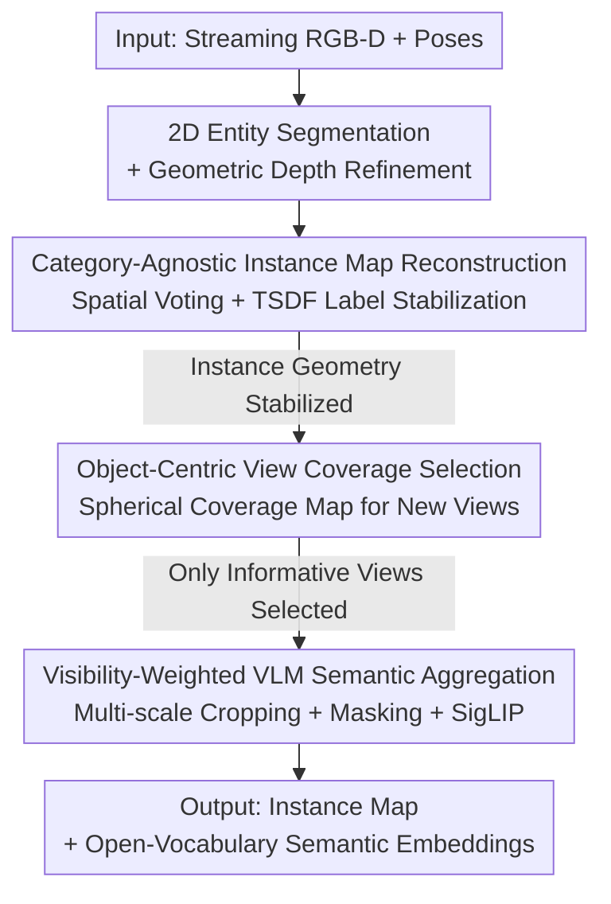

# OVI-MAP: Open-Vocabulary Instance-Semantic Mapping

**Conference**: CVPR 2026  
**Paper**: [CVF Open Access](https://openaccess.thecvf.com/content/CVPR2026/html/Deng_OVI-MAP_Open-Vocabulary_Instance-Semantic_Mapping_CVPR_2026_paper.html)  
**Code**: https://ovi-map.github.io  
**Area**: 3D Vision / Open-Vocabulary Semantic Mapping / Embodied Perception  
**Keywords**: Open-vocabulary, instance-semantic mapping, TSDF, view selection, VLM

## TL;DR
OVI-MAP completely decouples "constructing instance maps" from "assigning semantic labels": it first incrementally reconstructs a **category-agnostic** 3D instance map from RGB-D streams purely based on geometry, and then employs an **object-centric view coverage** strategy to select a sparse set of highly informative views to pass to VLMs for semantic extraction. This pipeline achieves open-vocabulary instance-level semantic understanding at real-time frame rates, outperforming existing online mapping methods on ScanNet and Replica.

## Background & Motivation

**Background**: Indoor 3D semantic/instance mapping is a foundational capability for embodied perception, supporting language-guided navigation, manipulation, and AR/VR scene understanding. The mainstream approach utilizes voxel representations (most commonly Truncated Signed Distance Fields, TSDF) due to their capability for real-time fusion, resilience to pose drift, and dense geometric consistency. Recent panoptic mapping systems further couple volumetric reconstruction with semantics to obtain temporally consistent, queryable panoptic maps.

**Limitations of Prior Work**: These pipelines are almost entirely **closed-set**—they assume a fixed semantic ontology and learn category-specific predictors, storing only a single integer category label per voxel/point. Extending them to open-set recognition is extremely difficult: ① The open-set features extracted by VLMs are high-dimensional continuous vectors, and storing them directly at voxel resolution incurs massive computational and memory overheads; ② Existing volumetric mapping systems rely on semantic labels to guide instance segmentation and association; without semantics, object instance grouping becomes unstable and prone to fragmentation; ③ Lacking consistent 3D instances, aggregating pixel-wise open-set features across time is highly noisy due to occlusions, view changes, background noise, and 2D segmentation inconsistencies. Although segmentation models like SAM provide high-quality object proposals, running them on every frame is too expensive for real-time online mapping.

**Key Challenge**: Closed-set semantic labels act as a "crutch" for instance association in existing methods, yet they also serve as a "shackle" that prevents open-vocabulary expansion—instance grouping depends on semantics, while semantics requires a closed set. Meanwhile, there is a sharp computation/memory trade-off between "pixel-wise dense VLM feature fusion" and "real-time online execution."

**Goal**: Construct online and in real-time: (i) a category-agnostic 3D instance map, and (ii) zero-shot open-vocabulary semantic embeddings for each instance.

**Key Insight**: The key observation of the authors is that **semantics is not required for instance formation**. Assessing whether an object is a distinct individual entity can be determined purely based on geometry and regional consistency evidence; semantics only needs to be assigned when "sufficiently informative views" are observed.

**Core Idea**: **Decouple instance reconstruction from semantic inference**. Build the instance map stably using geometry first, and then perform open-vocabulary semantics using VLM features from a minimal set of selected views, fundamentally avoiding the pitfalls of "storing high-dimensional features per voxel" and "relying on semantics to guide instance grouping."

## Method

### Overall Architecture
The input is a streaming RGB-D sequence with camera poses $\{(I_t, D_t), T_t\}_{t=1}^{\infty}$, where $T_t \in SE(3)$ represents the pose. The entire pipeline is coupled via two logically decoupled branches:

**Geometric Branch (A $\rightarrow$ B)** focuses solely on geometry without touching semantics: each RGB-D frame first undergoes category-agnostic 2D entity segmentation, followed by geometric refinement using depth. The segmented masks are then 3D-projected (lifted) into point clouds. They are associated with existing instances or initialized as new ones via "spatial voting." Finally, they are incrementally fused into a global TSDF voxel grid with stabilized instance labels, producing a **category-agnostic** 3D instance map that progressively improves as observations accumulate.

**Semantic Branch (C $\rightarrow$ D)** proceeds only after the geometry stabilizes: for each 3D instance, depth-guided raycasting is used to re-project it onto new frames. An "object-centric view coverage" module determines if the current view provides new surface observations. Only views bringing new information are selected, cropped multi-scaled with background masking, and fed into the VLM to extract features. These features are then aggregated via visibility weighting into a stable, open-set semantic embedding for each instance.

The framework diagram below illustrates the data flow from top to bottom, where node names correspond directly to the "Key Designs":

The hierarchical division of "pure geometry on the top half, semantic labeling on the bottom half" is itself a structural manifestation of **Design 1: Decoupling**.

### Key Designs

**1. Decoupling Instance Reconstruction and Semantic Inference: Freeing Instance Grouping from Closed-set Labels**

This is the governing philosophy of the paper, targeting the deadlock where "instance grouping depends on semantics, and semantics requires a closed set." The authors fully segregate the two aspects in time and data flow: the instance map is built incrementally **only** from geometric and region consistency evidence, requiring absolutely no category labels; semantics is **only** computed when a view offers strong, novel evidence. This decoupling provides mutual benefits: the instance side remains stable and efficient in open worlds since it relies solely on geometry, avoiding failure when encountering unseen categories; the semantic side naturally suppresses noise accumulated across frames by triggering only when "evidence is strong and information is new," keeping the expensive VLM computational cost **controllably** low. This fundamentally contrasts with solutions that "store dense semantic fields per voxel" or "rely on semantics to guide instance association."

**2. Category-Agnostic Instance Map Reconstruction: Purely Geometric Spatial Voting + TSDF Label Stabilization**

Addressing Limitation ② (instability of instance grouping without semantics). The scene is maintained in a TSDF voxel grid $\mathcal{V}$, where each voxel $v$ stores $(v_\text{tsdf}, v_\text{weight}, v_\ell)$, where $v_\ell \in \mathbb{N}$ denotes the instance ID (0 represents unassigned). Instances are represented by a set of dynamic 3D superpoints $S = \{S_1,\dots,S_K\}$. Each frame first uses CropFormer for category-agnostic entity segmentation to obtain $\{M_{t,j}\}$, which is then refined via MaskFusion using depth-discontinuity-based geometric segmentation $G_t$: $\hat{M}_{t,j} = \text{MaskFusion}(M_{t,j}, G_t)$. This uses geometric boundaries to separate adjacent objects that are visually indistinguishable (e.g., identical color/texture), mitigating under-segmentation. Each refined segment is projected into a global point cloud $P_{t,j}$ using its pose and depth.

Association is performed using **spatial voting** rather than semantic similarity: the instance labels that appear most frequently in the voxels where points in $P_{t,j}$ fall are counted, $\Omega_{j,k} = |\{\mathbf{x}\in P_{t,j} : V(\mathbf{x})_\ell = k\}|$. The optimal label is selected as $k^* = \arg\max_k \Omega_{j,k}$. If $\Omega_{j,k^*} > \theta_\text{assoc}$, the point cloud is assigned to the superpoint $S_{k^*}$; otherwise, a new superpoint is initialized. After assignment, the surface points of the instance are fused into the TSDF using standard weighted fusion, and the voxel-wise "label support count" is used for stabilization: $O_v(k^*) \leftarrow O_v(k^*) + 1$. At the end of the frame, each voxel is updated as $v_\ell = \arg\max_k O_v(k)$. This multi-frame voting-based label update makes the instance ID increasingly stable over time without requiring closed-set labels or hierarchical category priors. Spatial adjacent superpoints are also merged to handle over-segmentation (details in supplementary material).

**3. Object-Centric View Coverage Selection: Selecting Views Based on "How Much New Surface is Observed" Instead of Large Mask Size**

Addressing the challenge of "pixel-wise dense fusion of VLM features being costly and noisy," with the goal of **minimizing redundant VLM queries**. Each instance $S_k$ maintains a view coverage map on a unit sphere, $\text{Cov}_k \in \{0,1\}^{180\times240}$, tracking the directions from which it has been observed. For each visible point $\mathbf{x}\in P_{t,k}$ in frame $t$, its observation direction relative to the instance bounding box center $c_k$ is computed as $\mathbf{d}_{t,\mathbf{x}} = \frac{\mathbf{x}-\mathbf{c}_k}{\|\mathbf{x}-\mathbf{c}_k\|}$ and converted to spherical coordinates $(\theta,\phi)$ to map to the corresponding bin. The "novelty" of the current view is measured by the ratio: $\eta_{t,k} = \frac{|\text{BinsNewOccupied}(P_{t,k})|}{|\text{BinsOccupied}(P_{t,k})|}$, indicating how many bins in this observation are occupied for the first time. Views are selected for VLM feature extraction only if $\eta_{t,k} > \theta_\text{novel}$, after which the corresponding bins are set to 1. This significantly differs from heuristics like OpenMask3D's "selecting views with the most visible pixels": the latter repeatedly selects large, front-facing views, failing to capture the full shape of the object. On the other hand, the coverage method explicitly prefers new views that "expand the explored surface," yielding more diverse and informative observations—reducing VLM queries to approximately 47% of pixel-counting methods in practice (see ablation).

**4. Visibility-Weighted VLM Semantic Aggregation: Stable, View-Invariant Instance-Level Open-Set Embeddings**

Semantics are extracted only after instance geometry stabilizes. For each selected view, VLM features are extracted from two crops: a cropped image containing the object bound $\mathbf{f}_{t,k}^{(1)} = F_\text{VLM}(I_t, P_{t,k})$, and a masked version excluding background pixels $\mathbf{f}_{t,k}^{(2)} = F_\text{VLM}(I_t \odot M_{t,k})$ (multi-scale cropping + background masking, minimizing background bias). Each instance maintains a running feature $\mathbf{f}_k$, incrementally updated via visibility weighting:

$$\mathbf{f}_k \leftarrow \frac{w_\text{sum}}{w_k + w_\text{sum}} \mathbf{f}_k + \frac{w_k}{2(w_k + w_\text{sum})} \cdot (\mathbf{f}_{t,k}^{(1)} + \mathbf{f}_{t,k}^{(2)})$$

where $w_k$ is the number of visible pixels of the object in the current frame, and $w_\text{sum}$ is the cumulative pixel count from all prior observations. ⚠️ Note that the specific ratio of the two weight terms in the formula is subject to the original text. This visibility weighting ensures that observations with higher clarity and cleaner bounding boxes contribute more, yielding stable and view-invariant embeddings. During inference, text labels are encoded into the same space using SigLIP and matched via cosine similarity, enabling zero-shot recognition and language-based retrieval (including abstract queries like "where to sleep").

### Loss & Training
This method is a **training-free** online system that does not involve network training or new loss functions. The 2D segmentation uses off-the-shelf CropFormer + depth-based geometric segmenters, the semantic backbone uses off-the-shelf SigLIP, and geometric fusion is based on Voxblox++'s TSDF (voxel size 0.1m). Text labels are encoded with the same SigLIP and matched with instance features using cosine similarity, without requiring fine-tuning.

## Key Experimental Results

Datasets: Replica and ScanNet, with 200 frames uniformly sampled per sequence for a fair comparison using the same input trajectory and reconstructed geometry; Replica uses a 51-category label set, and ScanNet uses ScanNet200. Hardware: RTX 3090 + i7-12700K.

### Main Results

**Instance Segmentation (Table 2)**: Reconstructed instances are projected onto the GT mesh for vertex-wise comparison, reporting mIoU and AP@{25,50,75}.

| Dataset | Method | Online | mIoU | AP75 | AP50 | AP25 |
|--------|------|------|------|------|------|------|
| Replica | Mask3D (Offline) | ✘ | 23.1 | 14.3 | 31.2 | 56.2 |
| Replica | OVO-SLAM (Online) | ✔ | 42.7 | 11.1 | 23.6 | 32.8 |
| Replica | **Ours** | ✔ | 36.3 | **22.0** | **50.8** | **76.7** |
| ScanNet | Mask3D (Trained on ScanNet) | ✘ | 47.6 | 16.9 | 36.1 | 47.8 |
| ScanNet | OVO-SLAM (Online) | ✔ | 39.8 | 2.0 | 7.4 | 14.4 |
| ScanNet | **Ours** | ✔ | 41.2 | 9.8 | 24.0 | 37.4 |

Our method comprehensively and substantially outperforms the online baseline OVO-SLAM at high IoU thresholds (AP75/AP50). While Mask3D performs best on ScanNet, it was natively trained on ScanNet (introducing data bias).

**Open-Vocabulary Semantic Segmentation (Table 3)**: Reporting mIoU, mAcc, and instance-level AP; also compared under a 30 FPS real-time constraint (processing semantics only every $n$ frames).

| Dataset | Method | Online | mIoU | mAcc | AP25 | AP50 |
|--------|------|------|------|------|------|------|
| Replica | OpenScene (Offline) | ✘ | 19.8 | 33.9 | – | – |
| Replica | OVO-SLAM | ✔ | 24.9 | **34.0** | 28.1 | 17.5 |
| Replica | **Ours** | ✔ | **26.5** | 32.2 | **34.5** | **21.2** |
| Replica | OVO-SLAM (30 fps) | ✔ | 21.8 | 27.5 | 21.5 | 15.2 |
| Replica | **Ours (30 fps)** | ✔ | **27.0** | 32.5 | 31.8 | 17.7 |
| ScanNet | OVO-SLAM | ✔ | 14.6 | **27.8** | 19.4 | 12.6 |
| ScanNet | **Ours** | ✔ | **17.5** | 27.6 | **23.4** | **15.7** |

Our method achieves the highest instance-level semantic accuracy among online systems, even outperforming offline approaches such as OpenScene/OpenNeRF. Notably, under the 30 FPS real-time constraint, OVI-MAP undergoes almost no degradation (Replica mIoU even increases from 26.5 to 27.0), whereas OVO-SLAM degrades markedly on Replica (24.9 $\rightarrow$ 21.8) due to the lightweight nature of our view-selection-based semantic extraction, allowing more frequent updates without timing out.

### Ablation Study

**View Selection Strategy (Table 4, Replica)**: AQ = Average number of VLM queries per instance (lower is better).

| Configuration | mIoU | AP25 | AP50 | AQ↓ |
|------|------|------|------|------|
| Random 8 Views | 23.8 | 31.4 | 18.6 | 50.3 |
| Pixel Counting [46] | 26.5 | 33.2 | 19.8 | 18.7 |
| **View Coverage (Ours)** | 26.5 | **34.5** | **21.2** | **8.6** |
| GT Inst. + View Cov. (Oracle) | 37.6 | 36.2 | 36.2 | 10.4 |

Random selection performs the worst. Our coverage-based method achieves comparable or slightly superior accuracy compared to pixel-counting while slashing VLM queries from 18.7 to 8.6 (approx. 47%), showing that "explicitly modeling view novelty" cuts redundant observations without sacrificing semantic consistency.

**Impact of 2D Instance Segmentation Quality (Table 5, Replica)**:

| 2D Segmentation Source | Instance AP50 | Semantic mIoU | Semantic AP50 |
|-------------|-----------|-----------|-----------|
| SAM2 (High recall but over-segmented) | 27.8 | 20.2 | 18.6 |
| **CropFormer (Ours)** | **50.8** | **26.9** | **22.0** |
| GT 2D Instance Mask (Oracle) | 65.7 | 26.6 | 27.3 |

CropFormer yields tighter and more consistent entity boundaries, easily outperforming SAM2 on both instance and semantic tasks (semantic mIoU +6.7). This indicates that cleaner instance boundaries lead to more discriminative VLM embeddings.

**Feature Fusion Methods (Table 6, Replica)**:

| Fusion Method | mIoU | AP25 | AP50 |
|----------|------|------|------|
| Simple Average | 26.5 | 33.2 | 19.8 |
| **Visibility Pixel Weighting (Ours)** | **26.9** | **36.4** | **22.0** |
| Clustering: Max Cosine Similarity | 25.1 | 33.1 | 19.7 |
| Clustering: Min L1 Distance | 24.8 | 32.8 | 19.5 |

Visibility weighting yields the best overall performance; complex clustering-based fusion drops in accuracy due to over-emphasizing redundant features, showing that simple yet visibility-aware fusion is sufficient.

### Key Findings
- **View selection is the most significant contributor**: The coverage-based selection halves VLM queries (to 47%) with virtually no drop in accuracy, which is key to enabling both "real-time" and "open-vocabulary" capabilities simultaneously.
- **Instance boundary quality directly dictates semantic quality**: Moving to cleaner 2D segmentation (CropFormer vs SAM2) yields a +6.7 boost in semantic mIoU and +23 in instance AP50, validating the decoupled path of "getting the instances right first."
- **Simplicity beats complexity**: Visibility-weighted averaging beats various clustering fusions, showing that multi-view aggregation intrinsically suppresses noise without requiring complex feature clustering.
- **Real-time robustness**: Under 30 FPS constraints, our method experiences nearly zero performance drop compared to OVO-SLAM's massive degradation, proving the engineering utility of lightweight semantic extraction.

## Highlights & Insights
- **The observation that "instances do not require semantics" is pivotal**: Handing instance formation entirely over to geometry/regional consistency breaks the deadlock of "grouping depends on semantics, and semantics requires closed sets," serving as the anchor for the entire methodology.
- **Shifting view selection from "large mask selection" to "novel surface detection"**: Modeling view novelty via spherical coverage maps is intuitive and lightweight. This general trick can be transferred to any multi-view feature aggregation task (such as keyframe selection for NeRF/3DGS, active reconstruction).
- **Visibility-weighted incremental feature updates**: Using visible pixel counts as weights ensures that "clearer" observations contribute more. It is simple but more robust than clustering—such "observation-quality weighting" can be reapplied to any cross-frame feature fusion.
- **Completely training-free**: Assembling off-the-shelf CropFormer + depth segmentation + SigLIP + TSDF accomplishes SOTA online open-vocabulary mapping with high engineering viability.

## Limitations & Future Work
- The authors acknowledge that the method still relies heavily on 2D segmentation quality, suffering on small or visually complex objects. Semantic embeddings extracted from masked RGB crops are also affected by segmentation errors and background bias. Current VLMs have weak vision-language alignment, causing ambiguity in label assignment.
- We observe that evaluating open-vocabulary features by projecting them onto closed-set labels (due to closed-set GT) might understate the true open-vocabulary capabilities; mismatches like "pillow $\rightarrow$ cushion" or "table $\rightarrow$ dining table" in qualitative results are mapping issues rather than recognition errors.
- Experiments are only verified on indoor RGB-D datasets (Replica/ScanNet), sampling only 200 frames per sequence. Overall stability, drift, and performance in larger-scale, long-duration, outdoor/dynamic scenes remain to be validated.
- Future directions: The authors propose exploring tighter vision-language coupling and more adaptive feature fusion. Using faster real-time alternatives to CropFormer could also be considered to further speed up frame rates.

## Related Work & Insights
- **vs OVO-SLAM [29]**: Both perform online open-vocabulary mapping, but OVO-SLAM relies on the slow and over-segmenting output of SAM and lacks efficient view selection. Our method uses category-agnostic instance reconstruction combined with object-centric view selection, proving cleanly superior under high IoU thresholds and real-time constraints.
- **vs OpenMask3D [46]**: Both perform instance-level semantic aggregation (which is more robust than pixel-wise fusion), but OpenMask3D assumes instance masks are given and operates offline. Its view selection uses a "visible pixel counting" heuristic, whereas our coverage-based selection halves the query amount.
- **vs OpenScene / OpenNeRF / ConceptFusion**: These distill/fuse pixel-wise VLM features into point clouds or neural fields, requiring global optimization or dense 3D semantic fields, making them unsuitable for online incremental setups. Our method calculates semantics only per instance and only for selected views, making it real-time and scalable.
- **vs OpenFusion [53] / TSDF Panoptic Fusion [31,61]**: Traditional TSDF panoptic fusion couples instance association with closed-set predictions, preventing open-vocabulary capabilities. Our spatial voting association requires no closed-set labels or category priors.

## Rating
- Novelty: ⭐⭐⭐⭐ "Decoupled instance and semantics + object-centric view coverage" cleanly targets crucial bottlenecks in online open-vocabulary mapping with elegant logic.
- Experimental Thoroughness: ⭐⭐⭐⭐ Evaluated on two datasets across instance and semantic tasks with four sets of ablations and 30 FPS comparisons. However, the limitation to indoor RGB-D and the 200-frame setup is slightly narrow.
- Writing Quality: ⭐⭐⭐⭐ Progression through motivation, method, and experiments flows smoothly. Figures 2 and 3 clearly detail the pipeline and view-selection strategy.
- Value: ⭐⭐⭐⭐ Training-free, real-time, and SOTA, with direct engineering value for queryable scene understanding in embodied navigation/manipulation and AR/VR.

<!-- RELATED:START -->

## Related Papers

- [\[CVPR 2026\] OnlinePG: Online Open-Vocabulary Panoptic Mapping with 3D Gaussian Splatting](onlinepg_online_open-vocabulary_panoptic_mapping_with_3d_gaussian_splatting.md)
- [\[CVPR 2026\] Ov3R: Open-Vocabulary Semantic 3D Reconstruction from RGB Videos](ov3r_open-vocabulary_semantic_3d_reconstruction_from_rgb_videos.md)
- [\[CVPR 2026\] EmbodiedSplat: Online Feed-Forward Semantic 3DGS for Open-Vocabulary 3D Scene Understanding](embodiedsplat_online_feed-forward_semantic_3dgs_for_open-vocabulary_3d_scene_und.md)
- [\[CVPR 2026\] ExtrinSplat: Decoupling Geometry and Semantics for Open-Vocabulary Understanding in 3D Gaussian Splatting](extrinsplat_decoupling_geometry_and_semantics_for_open-vocabulary_understanding_.md)
- [\[ICLR 2026\] OVSeg3R: Learn Open-vocabulary Instance Segmentation from 2D via 3D Reconstruction](../../ICLR2026/3d_vision/ovseg3r_learn_open-vocabulary_instance_segmentation_from_2d_via_3d_reconstructio.md)

<!-- RELATED:END -->
