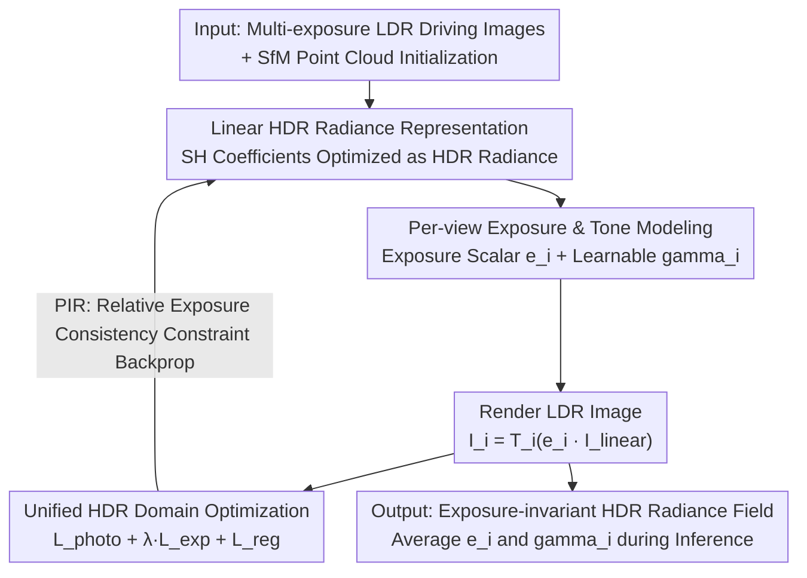

# P2GS: Physical Prior-guided Gaussian Splatting for Photometrically Consistent Urban Reconstruction

**Conference**: CVPR 2026  
**Paper**: [CVF Open Access](https://openaccess.thecvf.com/content/CVPR2026/html/Shimomura_P2GS_Physical_Prior-guided_Gaussian_Splatting_for_Photometrically_Consistent_Urban_Reconstruction_CVPR_2026_paper.html)  
**Code**: None  
**Area**: 3D Vision  
**Keywords**: Gaussian Splatting, HDR Radiance Field, Exposure Decoupling, Autonomous Driving Simulation, Photometric Consistency

## TL;DR
P2GS shifts the optimization of 3DGS from LDR pixel space to the linear HDR domain. Using only LDR images, it jointly solves for "view-independent HDR radiance + per-view exposure + per-view tone mapping," effectively eliminating exposure seams and photometric inconsistencies in multi-camera driving data to achieve exposure-invariant reconstruction suitable for autonomous driving simulation.

## Background & Motivation

**Background**: With explicit, differentiable, and real-time rasterization, 3DGS has become a robust foundation for closed-loop autonomous driving simulation and perception models. Works like StreetGS and DrivingGaussian decouple scenes into static backgrounds and dynamic vehicles, while PVG models time-varying radiance fields using periodic temporal components, focusing primarily on dynamic objects.

**Limitations of Prior Work**: 3DGS implicitly assumes consistent exposure and tone mapping across all views, fitting rendered colors directly to observed LDR pixels. However, real-world driving data involves different ISP pipelines and exposure controls for each camera, alongside fluctuating outdoor lighting. Consequently, inter-camera exposure differences and sensor noise are "baked into" the radiance field, causing seams, color shifts, and uneven shading in static background regions (walls, roads, vegetation) critical for simulation—a typical symptom is one side of the image being noticeably darker.

**Key Challenge**: When fitting colors in the LDR domain, 3DGS entangles "intrinsic scene radiance" with "camera-dependent exposure/tone response." Existing mitigation strategies either require multi-exposure inputs and static scenes (GaussHDR), become unstable without HDR supervision (Se-HDR), or perform per-view color correction only in 2D, lacking physical consistency (Luminance-GS). These methods rely on controlled or dense views and cannot scale to large, sparsely sampled driving scenarios.

**Goal**: Decouple radiance, exposure, and tone mapping within the explicit 3DGS framework to achieve cross-view photometric consistency without relying on HDR supervision or multi-exposure data.

**Key Insight**: Starting from the physical process of image formation, if one reverts to the linear HDR domain, "scene radiance" itself is view-independent. Differences between cameras are manifested only as an exposure scalar and a tone curve. By treating these three as separable and jointly optimizable quantities in the HDR domain, distortions can be stripped away.

**Core Idea**: Propose the "Physical Invariance Principle (PIR)"—in the linear HDR domain, the radiance ratio across views is determined solely by the exposure ratio. Using this as a physical constraint, the radiance field, exposure, and tone mapping are optimized unified in the HDR domain to decouple camera-dependent photometric distortions from true scene radiance.

## Method

### Overall Architecture
P2GS adds three components to standard 3DGS: (i) radiance representation in the linear HDR domain, (ii) per-view exposure + tone (brightness) modules, and (iii) a unified optimization framework enforcing cross-view radiance consistency. The forward process follows a clear physical image formation chain: Spherical Harmonic (SH) coefficients of each Gaussian are optimized as **linear HDR radiance**. After rendering the pixel-level HDR radiance $\hat{I}^i_{\text{linear}}$, it is multiplied by the view's exposure scalar $e_i$ and passed through a learnable tone (gamma) curve $T_i$ to produce the LDR image. This is compared with the observed LDR via a photometric loss, while relative exposure consistency constraints and regularizations are applied in the HDR domain for backpropagation. During inference, exposure and gamma are averaged across all training views to ensure stable, flicker-free rendering.

### Key Designs

**1. Physical Invariance Principle (PIR): Radiance ratio determined by exposure as a constraint**

This is the pivot of the paper, addressing the entanglement of radiance and exposure. PIR states that in the linear HDR domain, the ratio of radiance observed for the same scene point from two views depends only on the ratio of their exposures: $\frac{I^{(i)}_{\text{linear}}}{I^{(j)}_{\text{linear}}} = \frac{e_i}{e_j}$. This invariance transforms an entangled optimization problem into an enforceable hard constraint. By forcing the radiance ratio to equal the exposure ratio in the HDR domain, intrinsic scene radiance is naturally stripped of camera-dependent photometric distortions. Unlike HDR-NeRF variants that handle lighting in LDR space, PIR preserves the physical invariance of radiance in the linear HDR domain, eliminating the need for HDR supervision.

**2. Linear HDR Radiance Representation: SH coefficients expressing HDR radiance**

Conventional 3DGS fits rendered color $\hat{C}$ to LDR pixels, effectively absorbing exposure and tone non-linearity into SH coefficients. P2GS optimizes each coefficient $c_k$ as **linear HDR radiance**, yielding a physically meaningful radiance field $\hat{I}^i_{\text{linear}}$. The pixel-level synthesis follows standard 3DGS $\alpha$-blending: $\hat{I}^i_{\text{linear}}(u)=\sum_{k\in K(u)} c_k(u)\,\alpha'_k\prod_{j<k}(1-\alpha'_j)$. The imaging model for view $i$ is explicitly written as $I_i = T_i(e_i\cdot \hat{I}^i_{\text{linear}})$, cleanly separating scene-dependent radiance from camera-specific photometric factors $(e_i, T_i)$, making the entire pipeline differentiable and interpretable.

**3. Per-view Exposure and Tone Modeling: Scalar and gamma curve for camera variance**

To handle varying exposure controls and ISP responses, each view is assigned two lightweight parameters. Exposure is a positive scalar $e_i\in\mathbb{R}^+$ that scales HDR radiance $I^i_{\text{exposed}}=e_i\cdot\hat{I}^i_{\text{linear}}$, initialized as $e_i\sim\mathcal{N}(1.0,0.05^2)$ to avoid over/under-exposure early in training. Unlike methods requiring multi-exposure supervision, $e_i$ is learned jointly with radiance under HDR domain constraints, achieving unsupervised exposure decoupling. Tone mapping is approximated by a learnable gamma curve: $T_i(x)=\mathrm{clamp}(x^{1/\gamma_i},0,1)$. Its derivative $\partial T/\partial\gamma_i=-(\ln x/\gamma_i^2)x^{1/\gamma_i}$ enables efficient gradient optimization. $\gamma_i$ is initialized near the sRGB prior $\gamma\approx 2.2$. Before tone mapping, $I^i_{\text{exposed}}$ is clipped to $[10^{-6},10]$ to prevent numerical overflow.

**4. Unified HDR Domain Optimization: PIR constraints + regularization for ill-posedness**

The total loss is $L_{\text{total}}=L_{\text{photo}}+\lambda_{\text{exp}}L_{\text{exp}}+L_{\text{reg}}$. Photometric reconstruction $L_{\text{photo}}=(1-\lambda_{\text{dssim}})L_1+\lambda_{\text{dssim}}L_{\text{DSSIM}}$ aligns synthesized LDR with observed LDR. Relative exposure consistency $L_{\text{exp}}=\frac{1}{M}\sum_{(i,j)\in P}\lVert \alpha_{ij}\hat{I}^i_{\text{linear}}-\hat{I}^j_{\text{linear}}\rVert_1$ ($\alpha_{ij}=e_j/e_i$) is the differentiable implementation of PIR, enforcing linear consistency of radiance intensity in the HDR domain. Since $L_{\text{exp}}$ only constrains ratios, a global scale ambiguity $\{e_i\}\to\{c\,e_i\}$ exists. $L_{\text{reg}}$ addresses this with three terms: $\lambda_{\text{escale}}\mathbb{E}_i[(e_i-1)^2]$ softly anchors the absolute scale to 1.0; $\lambda_{\text{evar}}\mathrm{Var}(e_i)$ suppresses exposure variance between views (excessive variance could mimic tone non-linearity); $\lambda_\gamma\mathbb{E}_i[(\gamma_i-\gamma_{\text{prior}})^2]$ pulls gamma toward the sRGB prior. With $\lambda_{\text{evar}}=\lambda_\gamma=0.1$ and $\lambda_{\text{escale}}=0.01$, the optimization is stabilized through weak global anchoring and strong inter-view regularization.

### Loss & Training
P2GS follows standard 3DGS optimization with an exposure regularization weight $\lambda_{\text{exp}}=0.01$. No HDR supervision or multi-exposure data is required. During inference, rendering uses the mean exposure $e_{\text{render}}=\frac1N\sum_i e_i$ and mean gamma $\gamma_{\text{render}}=\frac1N\sum_i\gamma_i$ across all training views to eliminate temporal brightness flickering in video sequences.

## Key Experimental Results

### Main Results
On the Waymo Open Dataset (large-scale real driving), two custom photometric metrics are introduced: **HIS (HDR Inconsistency Score)** to measure temporal stability of exposure compensation, and **Std-Luminance** to measure inter-view brightness consistency (lower is better).

| Dataset | Metric | P2GS (Ours) | PVG | 3DGS | Note |
|--------|------|------|----------|------|------|
| Waymo (Recon) | SSIM ↑ | **0.939** | 0.858 | 0.928 | ~6.9% Gain over PVG |
| Waymo (Recon) | LPIPS ↓ | **0.209** | 0.336 | 0.230 | ~37.7% Gain over PVG |
| Waymo (Recon) | HIS ↓ | **0.092** | 0.365 | 0.102 | 74.7% lower than PVG; even lower than GT (0.096) |
| Waymo (Recon) | Std-Luminance ↓ | **0.034** | 0.042 | 0.041 | 19.0% lower than PVG |
| Waymo (Recon) | PSNR ↑ | 31.02 | 30.68 | 33.62 | PSNR favors pixel noise; hence not highest |

3DGS achieves the highest PSNR because it rewards fitting pixel-level noise in the real data. P2GS prioritizes radiance consistency over pixel-perfect noise fitting, resulting in better perceptual and photometric fidelity. HIS/Std-Luminance scores lower than the original GT suggest P2GS actively removes inherent inter-camera exposure noise from the dataset. P2GS also leads in New View Synthesis (NVS) across metrics except PSNR (SSIM 0.896 / LPIPS 0.246).

CARLA controlled experiments (fixed geometry/pose, varying ISO exposure) verify robustness:

| Setting | Task | P2GS SSIM/PSNR/LPIPS | 3DGS+AT | Luminance-GS |
|------|------|------|------|------|
| ISO std2 | Recon | **0.851 / 23.76 / 0.241** | 0.844 / 22.28 / 0.262 | 0.770 / 17.36 / 0.331 |
| ISO std4 | Recon | **0.847 / 22.91 / 0.250** | 0.807 / 19.11 / 0.293 | 0.387 / 11.43 / 0.612 |
| ISO std2 | NVS | **0.836 / 22.72 / 0.255** | 0.812 / 19.63 / 0.295 | 0.756 / 16.99 / 0.364 |

As noise increases to std4, P2GS shows only slight degradation (PSNR 23.76→22.91), while affine compensation fails due to non-linear distortions and Luminance-GS degrades significantly in sparse outdoor scenes.

### Ablation Study
Ablation of loss components on Waymo:

| Config | SSIM ↑ | PSNR ↑ | LPIPS ↓ | Note |
|------|--------|--------|---------|------|
| Full model | **0.941** | **33.61** | **0.214** | Complete P2GS |
| w/o $L_{\text{exp}}$ | 0.920 | 27.88 | 0.237 | Removing PIR consistency drops PSNR by ~5.7 |
| w/o $L_{\text{reg}}$ | 0.920 | 27.47 | 0.234 | Removing regularizers drops PSNR by ~6.1 |

### Key Findings
- Removing either $L_{\text{exp}}$ or $L_{\text{reg}}$ results in a PSNR drop from 33.61 to roughly 27–28, indicating that PIR constraints and regularization are interdependent and essential for radiance-exposure decoupling.
- The HIS/Std-Luminance scores being lower than the GT is noteworthy: P2GS does not just reconstruct; it actively cleanses exposure inconsistencies inherent in the dataset.
- Scene-wise, P2GS shows the most significant improvement in seam suppression and shading consistency on static backgrounds (walls, roads, vegetation), which are the most critical regions for closed-loop simulation.

## Highlights & Insights
- **Explicit physical image formation in 3DGS optimization**: Parameterizing camera differences with a single exposure scalar and a gamma curve is minimalist yet differentiable. It remains fully compatible with standard 3DGS rasterization without sacrificing speed (90 FPS on Waymo).
- **PIR as an unsupervised physical prior**: The constraint (radiance ratio = exposure ratio) requires no HDR ground truth, resolving an otherwise ill-posed decoupling problem. This logic is transferable to other reconstruction tasks requiring device response removal.
- **Critique of PSNR on noisy driving data**: High PSNR in noisy datasets can be misleading as it rewards the reproduction of sensor noise. The proposal of HIS and Std-Luminance targets photometric consistency, highlighting a need for new evaluation metrics in driving simulation.

## Limitations & Future Work
- P2GS reconstructs a view-independent linear HDR radiance field but **does not decouple intrinsic material properties from external lighting**, precluding fully relightable rendering.
- Experiments focus on **static backgrounds**; dynamic object reconstruction is left for future work. While claimed to be compatible with dynamic Gaussian extensions, it is unverified here. PIR might not hold if object radiance changes over time.
- Evaluation relies on custom metrics HIS/Std-Luminance defined in the appendix. Precise calculations should follow the original appendix; cross-work comparisons require caution due to potential variations in metric definitions.

## Related Work & Insights
- **vs PVG**: PVG models background/foreground with a unified time-varying field but assumes photometric consistency. P2GS addresses the neglected "cross-view inconsistency" and leads in SSIM/LPIPS/HIS.
- **vs GaussHDR / Se-HDR**: GaussHDR requires multi-exposure input; Se-HDR is unstable without HDR supervision. P2GS achieves unsupervised exposure decoupling using only single-exposure LDR via the PIR constraint.
- **vs Luminance-GS / Affine Compensation**: These perform per-view correction in 2D or at the affine level, lacking physical consistency. P2GS performs correction within the 3D physical optimization, showing superior robustness to strong exposure noise.

## Rating
- Novelty: ⭐⭐⭐⭐ Embedding the PIR physical prior into 3DGS for unsupervised decoupling is elegant; however, individual components (HDR domain, gamma) have precedents in earlier literature.
- Experimental Thoroughness: ⭐⭐⭐⭐ Uses real (Waymo) and controlled (CARLA) datasets with NVS and noise robustness curves; however, ablation is limited to loss terms rather than the decoupling modules themselves.
- Writing Quality: ⭐⭐⭐⭐ Physical motivation and PIR derivation are clear. Figure 2 explains the forward chain well. Reliance on appendix for metric definitions slightly affects self-contained readability.
- Value: ⭐⭐⭐⭐ Directly addresses photometric consistency in static backgrounds—a major pain point for autonomous driving simulation—while maintaining standard 3DGS performance.

<!-- RELATED:START -->

## Related Papers

- [\[CVPR 2026\] WeatherCity: Urban Scene Reconstruction with Controllable Multi-Weather Transformation](weathercity_urban_scene_reconstruction_with_controllable_multi-weather_transform.md)
- [\[ICLR 2026\] G4Splat: Geometry-Guided Gaussian Splatting with Generative Prior](../../ICLR2026/3d_vision/g4splat_geometry-guided_gaussian_splatting_with_generative_prior.md)
- [\[CVPR 2026\] GIFSplat: Generative Prior-Guided Iterative Feed-Forward 3D Gaussian Splatting from Sparse Views](gifsplat_generative_prior-guided_iterative_feed-forward_3d_gaussian_splatting_fr.md)
- [\[CVPR 2026\] ParticleGS: Learning Neural Gaussian Particle Dynamics from Videos for Prior-free Physical Motion Extrapolation](particlegs_learning_neural_gaussian_particle_dynamics_from_videos_for_prior-free.md)
- [\[CVPR 2026\] Urban-GS: A Unified 3D Gaussian Splatting Framework for Compact and High-Fidelity Aerial-to-Street Reconstruction](urban-gs_a_unified_3d_gaussian_splatting_framework_for_compact_and_high-fidelity.md)

<!-- RELATED:END -->
