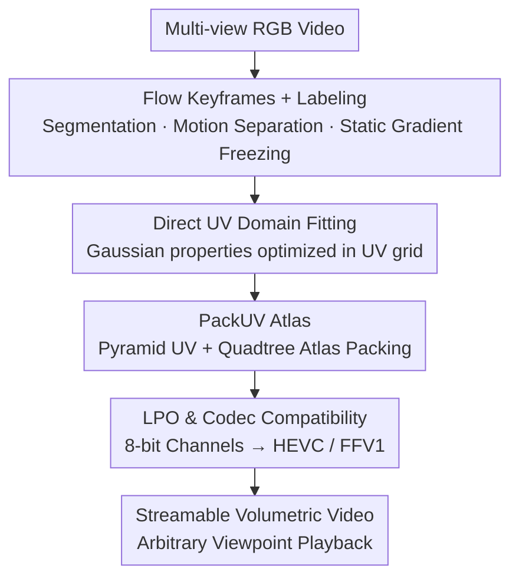

# PackUV: Packed Gaussian UV Maps for 4D Volumetric Video

**Conference**: CVPR 2026  
**Paper**: [CVF Open Access](https://openaccess.thecvf.com/content/CVPR2026/html/Rai_PackUV_Packed_Gaussian_UV_Maps_for_4D_Volumetric_Video_CVPR_2026_paper.html)  
**Code**: [Project Page](https://ivl.cs.brown.edu/packuv)  
**Area**: 3D Vision  
**Keywords**: Volumetric Video, 3D Gaussians, UV Atlas, Video Coding, Temporal Consistency

## TL;DR
PackUV "packs" all attributes of 4D Gaussians (3DGS sequences) into a structured multi-scale 2D UV atlas. Combined with PackUV-GS—a method that performs fitting directly in the UV domain using optical flow keyframes and motion-static separation—it enables volumetric video to be stored and streamed losslessly using standard video codecs like HEVC or FFV1 for the first time. It outperforms all existing baselines in rendering quality for sequences up to 30 minutes with large motion and frequent disocclusions.

## Background & Motivation
**Background**: Volumetric video aims to reconstruct dynamic 4D scenes from multi-view cameras for free-viewpoint rendering. 3D Gaussian Splatting (3DGS) has become the mainstream representation due to high quality and real-time rendering, with subsequent works (Deformable3DGS, 4DGS, RealTime4DGS, 3DGStream, etc.) extending it to dynamic scenes.

**Limitations of Prior Work**: Existing methods face three bottlenecks. Deformation field-based methods can only handle short sequences of a few seconds due to high VRAM overhead and an inability to model disocclusion (e.g., new objects entering). Online/streaming methods (3DGStream, ATGS) support longer sequences but suffer from poor long-term temporal consistency and degradation or gradient explosion under large motion. Crucially, 4D Gaussian attributes are **unstructured, permutation-invariant point sets** that require custom compression and **cannot interface with standard video codec infrastructure**, hindering practical storage and distribution.

**Key Challenge**: The strength of 3DGS (unordered point sets) is the root cause of its incompatibility with video encoding—video codecs require structured, spatially sorted, and temporally coherent 2D image frames. Existing "3DGS to 2D" approaches (UVGS, SOG) are either limited to static scenes or perform **post-hoc UV projection after optimization**. This post-processing only projects Gaussian centers and loses surface details, causing information loss and flickering in pre-trained 4D sequences.

**Goal**: To develop a 4D representation that retains the structural advantages of UV mapping without sacrificing 3DGS reconstruction quality, supporting arbitrary-length dynamic scenes and native compatibility with standard video codecs.

**Core Idea**: Instead of "optimizing 3DGS then projecting," this work **fits Gaussians directly in the UV domain**. All Gaussian attributes are organized into a progressive multi-scale UV atlas (PackUV). A streaming fitting process (PackUV-GS) utilizing optical flow keyframes and motion-static labeling stabilizes long sequences. Finally, low-precision optimization ensures each channel fits into 8-bit format for direct input to HEVC/FFV1.

## Method

### Overall Architecture
PackUV consists of two components: **PackUV** is the representation (how 4D Gaussians are arranged into an encodable atlas), and **PackUV-GS** is the fitting method (how this representation is grown from multi-view video).

Prerequisites: 3DGS represents a scene as a set of Gaussian primitives, each with position $\mu\in\mathbb{R}^3$, covariance $\Sigma$, spherical harmonic color $c$, and opacity $o$. UVGS converts each center $\mu_i=(x_i,y_i,z_i)$ to spherical coordinates $(\rho_i,\theta_i,\phi_i)$ and discretizes the azimuth/polar angles into an $M\times N$ UV map:

$$u_i=\left\lfloor\frac{\pi+\theta_i}{2\pi}\times M\right\rfloor,\quad v_i=\left\lfloor\frac{\phi_i}{\pi}\times N\right\rfloor.$$

As multiple Gaussians may fall into the same UV pixel, UVGS stores $K$ layers per pixel sorted by opacity to capture surface details, resulting in a mapping $f(u,v,k)=\{\rho,r,s,o,c\}\in\mathbb{R}^D$. PackUV adopts this "point-to-map" discretization but transforms it from a one-time post-processing step into a **constraint throughout optimization**, using pyramid packing for storage.

Pipeline: Multi-view RGB video → Flow-based keyframe segmenting → Per-camera flow/motion labeling → Direct Gaussian attribute optimization in UV domain → Pyramid UV atlas packing → Low-precision quantization to 8-bit channels → Standard video encoding (HEVC/FFV1).

### Key Designs

**1. Flow Keyframes + Gaussian Labeling: Stabilization via Motion-Static Separation**

This design addresses the failure of deformation methods in long sequences and streaming methods under large motion. PackUV-GS divides multi-view video into $m$ temporal segments. By calculating the optical flow magnitude $M(t)$ for a reference view, the $m-1$ highest peaks (with minimum interval $\theta$) are selected as boundaries. The first frame of each segment is a **keyframe**. Keyframes are initialized from the previous keyframe to ensure continuity, while transition frames within a segment are initialized from the preceding frame with minimal refinement iterations. Substantial drift or disocclusions trigger new keyframes. This prevents error accumulation over time.

Additionally, **Gaussian Labeling** performs motion-static separation: RAFT estimates forward flow $F^c_{(t-1)\to t}$ per camera. A binary motion mask $M^c_t(p)=\mathbb{1}[\,\|F^c_{t-1\to t}(p)\|_2>\tau\,]$ is generated. To determine if a Gaussian is dynamic, **covariance-aware projection** is used: the 3D covariance is projected to 2D $\Sigma^{2D}_{i,c}=J_c\Sigma^{3D}_{i,cam}J_c^\top$, and the elliptical region covered by the Gaussian is defined by the Mahalanobis distance $d^2(p)=(p-m_{i,c})^\top(\Sigma^{2D}_{i,c})^{-1}(p-m_{i,c})\le 9$. If any pixel in the ellipse falls in the motion mask, the Gaussian is labeled dynamic for that camera, with global aggregation $D_i=\bigvee_c D_{i,c}$ performed across views. **Static Gaussian gradients are frozen** $\nabla_{\theta_i}L\leftarrow D_i\,\nabla_{\theta_i}L$, and optimizer momentum for static Gaussians is periodically reset to prevent drift.

**2. Direct UV Domain Fitting: From Post-processing to Native Optimization**

To solve the loss of surface detail in UVGS post-processing, PackUV-GS **optimizes Gaussians directly in UV space**. Utilizing a fixed resolution and $K$ layers, a UV tensor $U\in\mathbb{R}^{M\times N\times K\times D}$ stores attributes $U[u_i,v_i,k]=g_i$. This approach preserves a structured format while **naturally enforcing Gaussian sparsity** via the grid. Two UV pruning mechanisms are introduced: **Valid UV Projection Pruning**—removing Gaussians that do not satisfy the discretization after densification—and **Max-K UV Pruning**—retaining only the Top-K Gaussians per pixel by opacity. Removing this component (reverting to post-hoc projection) causes a PSNR drop from 27.41 to 23.81.

**3. PackUV Atlas: Pyramid UV + Quadtree Packing for Efficiency**

Storing all $K$ layers at full $M\times N$ resolution is memory-intensive. The authors observe that due to opacity sorting and occlusion, **deeper layers (higher $K$) contain fewer visible Gaussians**. Thus, they use a **pyramid progressive resolution**, halving dimensions for each subsequent layer. These layers are packed into a single atlas $A$ using **quadtree recursive subdivision**. This packing achieves **88.5% pixel utilization**, much higher than grid layouts. Training maintains the progressive resolution, while packing occurs post-convergence for storage/streaming.

**4. Low-Precision Optimization (LPO): 8-bit Channels for Video Codecs**

To interface with video infrastructure, PackUV-GS uses **Low-Precision Optimization (LPO) during training** rather than post-training quantization. During iterations, the renderer uses a uniformly quantized $K$-bit proxy $\tilde\theta$, while gradients pass through via a straight-through estimator (STE) to update the FP32 master weights. This "compensates" for quantization errors during training. Attributes like $s, r, \alpha, c$ are stored at 8-bit, while $x$ uses 16-bit (split into two 8-bit channels). This allows the sequence of UV atlases to be encoded using standard 8-bit lossless codecs (FFV1/HuffYUV) or lossy codecs (HEVC), achieving zero quality loss in lossless modes.

### Loss & Training
The photometric loss combines L1 and SSIM: $L_{photo}=(1-\lambda_{ssim})\|\hat I^c_t-I^c_t\|_1+\lambda_{ssim}(1-\text{SSIM}(\hat I^c_t,I^c_t))$. Regularization includes scale $L_{scale}=\mathbb{E}_i[\max\{0,\max(s_i)-s_{max}\}]^2$ and opacity $L_{opacity}=\mathbb{E}_i\,\alpha_i(1-\alpha_i)$. The total loss is $L=L_{photo}+L_{depth}+\lambda_{scale}L_{scale}+\lambda_{opacity}L_{opacity}$. Hyperparameters: $M_0=N_0=1024$, $K=8$, keyframe threshold $\theta=30$. Training is conducted on a single RTX 3090.

## Key Experimental Results

### Main Results
Evaluated on PackUV-2B, SelfCap, and N3DV datasets across 60-frame windows.

| Method | PackUV-2B PSNR↑ | SelfCap PSNR↑ | N3DV PSNR↑ | Stream | Codec |
|------|------|------|------|------|------|
| 3DGStream | 23.17 | 19.77 | 31.17 | Full | No |
| 4DGS | 23.11 | 19.56 | 29.81 | No | No |
| RealTime4DGS | 21.37 | 19.46 | 32.29 | No | No |
| ATGS | 21.42 | 15.48 | 30.99 | Pseudo | No |
| GIFStream | 21.92 | 19.78 | 31.10 | Pseudo | Partial |
| **Ours (PackUV-GS)** | **27.41** | **22.52** | **32.81** | Full | Full |

On the challenging PackUV-2B dataset (large motion, 360° coverage), PackUV-GS outperforms the runner-up by **4.2 dB PSNR**. It is the only method offering **Full streaming and Full codec compatibility**.

### Ablation Study
Ablation on PackUV-2B:

| Configuration | PSNR↑ | SSIM↑ | LPIPS↓ | Note |
|------|------|------|------|------|
| Full Model | 27.41 | 0.84 | 0.28 | — |
| w/o Keyframe | 20.95 | 0.77 | 0.38 | -6.46 dB (Most critical) |
| w/o UV Optim | 23.81 | 0.79 | 0.33 | Revert to post-projection (-3.60 dB) |
| w/o Labeling | 25.42 | 0.82 | 0.31 | -2 dB |
| No Atlas | 27.43 | 0.84 | 0.28 | Quality remains identical |
| No LPO | 27.52 | 0.85 | 0.27 | Minimal impact on quality |

### Key Findings
- **Keyframes are the most vital**: Removing them causes a 6.46 dB drop, proving gradient resets are essential for long-term quality.
- **Direct UV optimization is crucial**: Reverting to post-hoc projection drops PSNR by 3.60 dB.
- **Atlas packing and LPO are lossless**: "No Atlas" and "No LPO" show nearly identical quality to "Full," indicating these steps achieve storage and codec goals without sacrificing reconstruction fidelity.
- **PackUV-2B Dataset**: A massive new dataset containing 100 sequences (avg. 10 mins, max 30 mins) with up to 88 synced cameras at 90 FPS.

## Highlights & Insights
- **Value of Infrastructure Integration**: While other works chase marginal PSNR gains, PackUV enables **lossless 4D Gaussian encoding via HEVC/FFV1**, bridging the gap between research and practical streaming/distribution.
- **Hierarchy of Sparsity**: The "deeper layers are sparser" observation is thoroughly exploited via opacity sorting, pyramid resolution, and quadtree packing (88.5% utility).
- **Covariance-Aware Labeling**: Using Mahalanobis distance ($d^2\le 9$) for motion labeling is far more robust than point-center heuristics and could be applied to other dynamic 3DGS tasks.
- **LPO vs. Post-hoc Quantization**: Training with quantized proxies via STE ensures the model "compensates" for precision loss, enabling 8-bit compatibility with negligible quality impact.

## Limitations & Future Work
- **Optical Flow Dependency**: Keyframe logic and labeling rely heavily on RAFT. Failures in flow (e.g., reflections, transparency, extreme speed) likely lead to artifacts.
- **Spherical UV Topology**: Projecting to a single UV map works well for centered, convex objects but may face conflicts for complex topologies or multiple disassociated subjects.
- **Dataset Bias**: The significant 4.2 dB gain is on the custom PackUV-2B dataset; on simpler datasets like N3DV, the margin is smaller (< 0.6 dB).
- **Future Directions**: Exploring robust motion estimators beyond flow, adaptive multi-sphere UV layouts for multi-subject scenes, and lossy coding trade-offs at lower bitrates.

## Related Work & Insights
- **vs UVGS (Post-processing)**: UVGS projects after fitting, losing detail; Ours **optimizes within UV space** to maintain structure nativesly.
- **vs Deformation Methods (4DGS / Grid4D)**: These methods struggle with long sequences and disocclusions; Ours handles arbitrary lengths via keyframes.
- **vs Streaming Methods (3DGStream / ATGS)**: Prior streaming methods suffer from temporal drift and lack standard codec support; Ours is the first unified representation for both.
- **vs Static Compression (SOG)**: Static methods don't account for temporal coherence; Ours leverages video codecs to handle spatiotemporal redundancies.

## Rating
- Novelty: ⭐⭐⭐⭐⭐ First 4D representation to enable zero-loss integration with standard video codecs. 
- Experimental Thoroughness: ⭐⭐⭐⭐⭐ Large-scale dataset plus detailed ablations across multiple dimensions.
- Writing Quality: ⭐⭐⭐⭐ Clear formulation and logic; atlas packing logic is well-rationalized.
- Value: ⭐⭐⭐⭐⭐ Directly applicable to AR/VR and volumetric content delivery.

<!-- RELATED:START -->

## Related Papers

- [\[CVPR 2026\] Volumetric Functional Maps](volumetric_functional_maps.md)
- [\[CVPR 2026\] V-DPM: 4D Video Reconstruction with Dynamic Point Maps](v-dpm_4d_video_reconstruction_with_dynamic_point_maps.md)
- [\[CVPR 2026\] MV2UV: Generating High-quality UV Texture Maps with Multiview Prompts](mv2uv_generating_high-quality_uv_texture_maps_with_multiview_prompts.md)
- [\[CVPR 2026\] GP-4DGS: Probabilistic 4D Gaussian Splatting from Monocular Video via Variational Gaussian Processes](gp-4dgs_probabilistic_4d_gaussian_splatting_from_monocular_video_via_variational.md)
- [\[CVPR 2026\] Mark4D: Temporally-Consistent Watermarking for 4D Gaussian Splatting](mark4d_temporally-consistent_watermarking_for_4d_gaussian_splatting.md)

<!-- RELATED:END -->
## Related Papers

- [\[CVPR 2026\] Volumetric Functional Maps](volumetric_functional_maps.md)
- [\[CVPR 2026\] V-DPM: 4D Video Reconstruction with Dynamic Point Maps](v-dpm_4d_video_reconstruction_with_dynamic_point_maps.md)
- [\[CVPR 2026\] MV2UV: Generating High-quality UV Texture Maps with Multiview Prompts](mv2uv_generating_high-quality_uv_texture_maps_with_multiview_prompts.md)
- [\[CVPR 2026\] GP-4DGS: Probabilistic 4D Gaussian Splatting from Monocular Video via Variational Gaussian Processes](gp-4dgs_probabilistic_4d_gaussian_splatting_from_monocular_video_via_variational.md)
- [\[CVPR 2026\] Vista4D: Video Reshooting with 4D Point Clouds](vista4d_video_reshooting_with_4d_point_clouds.md)

<!-- RELATED:END -->
