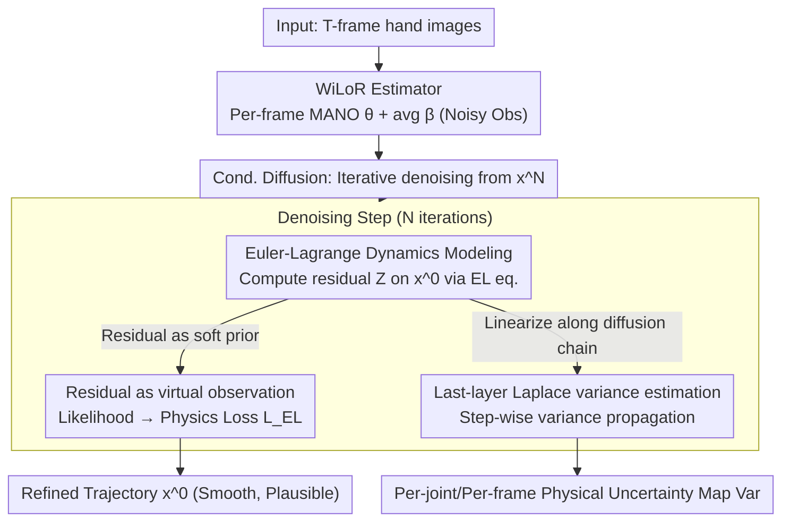

# PAD-Hand: Physics-Aware Diffusion for Hand Motion Recovery

**Conference**: CVPR 2026  
**arXiv**: [2603.26068](https://arxiv.org/abs/2603.26068)  
**Code**: None  
**Area**: 3D Vision  
**Keywords**: Hand Motion Recovery, Physics-Aware Diffusion Model, Euler-Lagrange Dynamics, Laplace Approximation, Uncertainty Estimation

## TL;DR

PAD-Hand is proposed as a physics-aware conditional diffusion framework that integrates Euler-Lagrange dynamics residuals into the diffusion process as virtual observations. By estimating joint-wise and frame-wise dynamic variance through last-layer Laplace approximation, it achieves hand motion recovery with both physical plausibility and uncertainty awareness, reducing acceleration error by 50.1% on DexYCB.

## Background & Motivation

1. **Background**: Monocular 3D hand reconstruction has made significant progress. Large-scale pre-trained models (e.g., WiLoR) have improved single-frame accuracy, but temporal inconsistency persists. Existing methods primarily capture kinematic patterns and remain insensitive to dynamics.

2. **Limitations of Prior Work**: (1) Image-based estimations lack temporal consistency, suffering from inter-frame jitter; (2) Existing physics-constrained methods (e.g., directly forcing EL residuals to zero) are deterministic—assuming observed motion perfectly satisfies physical equations, ignoring uncertainty from estimation noise and physical model approximations; (3) Deterministic physics constraints may lead to difficult optimization landscapes or sub-optimal solutions.

3. **Key Challenge**: 3D hand estimation is inherently noisy and physical models are only approximations; the assumption of forcing zero residuals is unrealistic. A probabilistic physics integration is needed to allow the model to reason on the motion data manifold and produce a distributed solution space.

4. **Goal**: (1) Probabilistically integrate physical dynamics into the diffusion model to replace hard constraints; (2) Provide interpretable physical consistency measures (variance) to indicate unreliable frames/joints.

5. **Key Insight**: Euler-Lagrange (EL) dynamics residuals are treated as "virtual observations" sampled from a certain distribution, whose likelihood is coupled with visual data terms to guide the reverse diffusion process.

6. **Core Idea**: Use probabilistic physics (virtual observations + Laplace approximation variance) instead of deterministic physics constraints for diffusion-based hand motion recovery.

## Method

### Overall Architecture

The paper addresses temporal jitter in monocular hand reconstruction and the "one-size-fits-all" limitation of forcing physics residuals to zero. The pipeline consists of two stages: first, an off-the-shelf single-frame estimator (e.g., WiLoR) extracts per-frame MANO poses $\theta_{1:T}$ and an average shape $\beta_{avg}$ from $T$ frames as noisy initial observations; then, these observations are fed into a conditional diffusion model, which iteratively denoises from a pure noise state $x^N_{1:T}$ to approach smooth, physically plausible clean motion $x^0_{1:T}$. Unlike standard diffusion, the variance of dynamics residuals $\text{Var}(\mathcal{F}^n_{1:T})$ is propagated through each denoising step. Consequently, the output includes both the refined trajectory $x^0_{1:T}$ and a joint-wise, frame-wise physical uncertainty map $\text{Var}(\mathcal{F}^0_{1:T})$, identifying "physically unreliable" frames.

### Key Designs

**1. Euler-Lagrange Hand Dynamics Modeling: Physics equations from first principles**

Temporal jitter arises because networks only learn kinematic patterns. Instead of implicitly learning physics priors, the authors model the hand as a rigid-body linkage system. Using generalized coordinates $\mathtt{q} = \{R, t, \theta\}$ (wrist rotation, translation, 15 joint angles), the Euler-Lagrange equation is formulated:

$$M\ddot{q} + C + g = \mathcal{F}$$

where $M$ is the generalized mass matrix, $C$ represents Coriolis/centrifugal forces, $g$ is gravity, and $\mathcal{F}$ is the net generalized force. The mass and inertia tensors for each hand part are calculated by tetrahedralizing the MANO mesh to compute volume and multiplying by documented density $\rho$. This provides a computational metric for physical plausibility.

**2. Probabilistic Physics Integration as Virtual Observations: Soft priors instead of hard constraints**

Prior methods force the residuals to zero, assuming observed motion perfectly satisfies physics. Since 3D estimates are noisy and physical models are approximations, this often results in rugged optimization landscapes. The authors calculate the EL residual on the denoised result:

$$Z_t = M_t\ddot{q}_t + C_t + g_t - \hat{\mathcal{F}}_t$$

Instead of a zero-constraint, $Z_t$ is treated as a **virtual observation sampled from $\mathcal{N}(Z(x^0_{1:T}), \sigma^2 I)$**. Motions that are more physically plausible yield residuals closer to 0 and higher likelihood. The negative log-likelihood defines the physics loss $\mathcal{L}_{EL} = \frac{1}{2\sigma_n}\|Z_{1:T}(x^0_{1:T})\|^2$. Coupled with visual data terms, this allows the model to balance image fidelity and physical consistency without being biased by approximate physics. Critically, residuals are computed on $x^0_{1:T}$ sampled during reverse diffusion rather than the direct prediction $\hat{x}_{1:T}$, as $Z(\mathbb{E}[x^0]) \neq \mathbb{E}[Z(x^0)]$ due to Jensen's inequality for non-linear $Z$.

**3. Last-Layer Laplace Approximation (LLLA): Quantifying "Prediction Uncertainty"**

Since physics is probabilistic, uncertainty should be quantifiable. The authors apply a posterior Laplace approximation to the backbone's last-layer parameters (LLLA), yielding a Gaussian posterior $p(\hat{x}_{1:T}|x^n_{1:T},n,D) \approx \mathcal{N}(f_\phi, \text{diag}(\gamma^2_\phi))$. To obtain the final trajectory uncertainty, variance is propagated through the reverse diffusion chain:

$$\text{Var}(x^{n-1}_{1:T}) = A_n^2\text{Var}(x^n_{1:T}) + B_n^2\text{Var}(\hat{x}_{1:T}) + \Sigma_n^2 + 2A_nB_n\text{Cov}(x^n, \hat{x})$$

At $x^0$, the state variance is mapped to force variance using Jacobian linearization: $\text{Var}(\mathcal{F}_{1:T}) \approx J_{\mathcal{F}} \text{Var}(x^0_{1:T}) J^\top_{\mathcal{F}}$. This results in a per-joint, per-frame dynamic variance map, where high variance indicates low physical consistency or unreliable estimations.

### Loss & Training

- Total Loss: $\mathcal{L}_{total} = \lambda_1 \mathcal{L}_{data} + \lambda_2 \mathcal{L}_{EL}$, where $\lambda_1 = 2000, \lambda_2 = 500$
- Data Loss: $\mathcal{L}_{data} = \mathbb{E}_{n}\|x_{1:T} - f_\phi(x^n_{1:T}, y_{1:T}, n)\|^2$
- Backbone: Transformer encoder-decoder (4-layer encoder, 4-layer decoder, 8 heads, dim=512) with MeshCNN for spatial features.
- Sequence length $T=16$, diffusion steps $N=4$, Monte Carlo samples $S=20$.
- Optimizer: AdamW, lr=$2\times10^{-4}$ with 0.8 decay every 10 epochs.

## Key Experimental Results

### Main Results

DexYCB Results (Initialized from WiLoR):

| Method | Input | Type | PA-MPJPE↓ | MPJPE↓ | ACCEL↓ |
|------|------|------|-----------|--------|--------|
| WiLoR | Image | D | 4.88 | 12.75 | 6.70 |
| Deformer | Sequence | D | 5.22 | 13.64 | 6.77 |
| TCMR | Sequence | D | 6.28 | 16.03 | - |
| MaskHand | Image | P | 5.0 | 11.70 | - |
| **PAD-Hand** | Sequence | P | **4.63** | **10.56** | **3.34** |

HO3D Results:

| Method | PA-MPJPE↓ | ACCEL↓ |
|------|-----------|--------|
| WiLoR | 7.50 | 4.98 |
| Deformer | 9.40 | 6.37 |
| **PAD-Hand** | **7.43** | **2.71** |

### Ablation Study

Ablation on DexYCB:

| Configuration | PA-MPJPE↓ | MPJPE↓ | ACCEL↓ |
|------|-----------|--------|--------|
| WiLoR (baseline) | 4.88 | 12.75 | 6.70 |
| Only $\mathcal{L}_{data}$ | 4.65 | 10.62 | 3.36 |
| $\mathcal{L}_{data} + \mathcal{L}^D_{EL}$ (Det. Physics) | 4.66 | 10.61 | 3.35 |
| $\mathcal{L}_{data} + \mathcal{L}_{EL}$ (Prob. Physics, Ours) | **4.63** | **10.56** | **3.34** |

### Key Findings

- **50.1% Reduction in Acceleration Error**: Dropping from 6.70 to 3.34 mm/frame², proving that physics constraints significantly improve motion smoothness.
- **Improved Accuracy**: PA-MPJPE decreased by 5.1% and MPJPE by 17.2%, enhancing physical plausibility without sacrificing reconstruction precision.
- **Probabilistic > Deterministic Physics**: The probabilistic approach consistently outperformed deterministic penalties $\mathcal{L}^D_{EL}$, validating the use of residuals as virtual observations.
- **Variance Alignment with EL Residuals**: High variance regions coincide with high physical residuals, demonstrating that variance is a reliable indicator of uncertainty.
- **Generalization**: On HO3D, ACCEL dropped from 4.98 to 2.71 (45.6% reduction), showing robust cross-dataset performance.

## Highlights & Insights

- **Soft Priors via Virtual Observations**: Instead of forcing residuals to zero, their likelihood is integrated into the diffusion objective, allowing for the coexistence of approximate physical models and observation noise.
- **End-to-End Variance Propagation**: Propagating variance through the entire diffusion chain to obtain $x^0$ uncertainty is a novel and rigorous approach for generative models.
- **Spatial-Temporal Fusion**: Combining MeshCNN for topology-aware spatial features with Transformers for temporal dependencies provides an elegant architecture.

## Limitations & Future Work

- The physical model lacks explicit modeling of object geometry and contact forces, limiting accuracy in hand-object interaction scenarios.
- Variance estimation depends on LLLA and Monte Carlo sampling (S=20), which is computationally expensive.
- Validated only on the MANO model; not yet extended to full-body or other articulated structures.
- Diffusion is limited to 4 steps, which is efficient but may constrain the modeling of highly complex motions.

## Related Work & Insights

- **vs Zhang et al. (2025)**: Previous work used diffusion with physics regularization but relied on hand-object proximity and deterministic physics; this work uses probabilistic EL residuals without requiring object information.
- **vs BioPR**: A deterministic physics-constrained method (MPJPE 12.81 vs. ours 10.56), showing a significant performance gap.
- **vs Rixner et al./Bastek et al.**: Introduces virtual observations from general physics-informed diffusion frameworks into 3D hand recovery, adding variance estimation.
- Uncertainty estimation can be directly applied to active learning (labeling high-variance sequences) or as confidence weights in downstream hand-object interaction tasks.

## Rating

- Novelty: ⭐⭐⭐⭐ Combination of probabilistic physics and diffusion variance propagation is fresh.
- Experimental Thoroughness: ⭐⭐⭐⭐ Strong results on DexYCB/HO3D with clear ablation and qualitative variance visualization.
- Writing Quality: ⭐⭐⭐⭐ Rigorous mathematical derivation, though formula-heavy.
- Value: ⭐⭐⭐⭐ Provides a quantifiable metric for physical consistency in hand recovery, useful for AR/VR and Embodied AI.

<!-- RELATED:START -->

## Related Papers

- [\[CVPR 2026\] HandDreamer: Zero-Shot Text to 3D Hand Model Generation using Corrective Hand Shape Guidance](handdreamer_zero-shot_text_to_3d_hand_model_generation_using_corrective_hand_sha.md)
- [\[CVPR 2026\] UST-Hand: An Uncertainty-aware Spatiotemporal Point Cloud Interaction Network for 3D Self-supervised Hand Pose Estimation](ust-hand_an_uncertainty-aware_spatiotemporal_point_cloud_interaction_network_for.md)
- [\[ICML 2026\] PhysHanDI: Physics-Based Reconstruction of Hand-Deformable Object Interactions](../../ICML2026/3d_vision/physhandi_physics-based_reconstruction_of_hand-deformable_object_interactions.md)
- [\[CVPR 2026\] TokenHand: Discrete Token Representation for Efficient Hand Mesh Reconstruction](tokenhand_discrete_token_representation_for_efficient_hand_mesh_reconstruction.md)
- [\[CVPR 2026\] Glove2Hand: Synthesizing Natural Hand-Object Interaction from Multi-Modal Sensing Gloves](glove2hand_synthesizing_natural_hand-object_interaction_from_multi-modal_sensing.md)

<!-- RELATED:END -->
