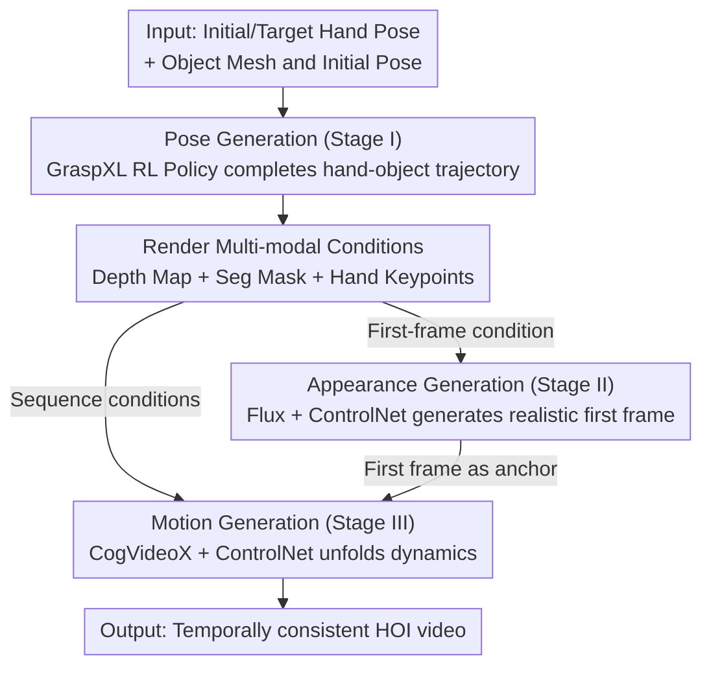

# PAM: A Pose-Appearance-Motion Engine for Sim-to-Real HOI Video Generation

**Conference**: CVPR 2026  
**arXiv**: [2603.22193](https://arxiv.org/abs/2603.22193)  
**Code**: [https://gasaiyu.github.io/PAM.github.io/](https://gasaiyu.github.io/PAM.github.io/)  
**Area**: 3D Vision / Diffusion Models / Video Generation  
**Keywords**: Hand-Object Interaction, sim-to-real, controllable video generation, diffusion models, data augmentation

## TL;DR
PAM is proposed as the first engine to generate realistic hand-object interaction (HOI) videos using only initial/target hand poses and object geometry. By decoupling the process into three stages—pose, appearance, and motion generation—it achieves an FVD of 29.13 (vs. InterDyn's 38.83) and an MPJPE of 19.37mm (vs. CosHand's 30.05mm) on DexYCB. The generated synthetic data also effectively augments downstream hand pose estimation tasks.

## Background & Motivation

1. **Background**: The reconstruction and synthesis of hand-object interaction (HOI) are becoming increasingly important in embodied AI and AR/VR. Data-driven methods require large-scale annotated HOI datasets, but the extremely high cost of manual annotation limits scalability.

2. **Limitations of Prior Work**: Current HOI generation methods are divided into three fragmented directions: (1) Pose synthesis (e.g., GraspXL) only predicts MANO trajectories without generating pixels; (2) Single-image generation (e.g., Affordance methods) generates appearance from masks or 2D cues but lacks dynamics; (3) Video generation methods (e.g., InterDyn, ManiVideo) require **complete pose sequences and a real first frame** as input, making true sim-to-real deployment impossible (as simulators lack real first-frame images).

3. **Key Challenge**: No unified framework can simultaneously handle pose, appearance, and motion. In particular, video generation methods depend on a real first frame, which is the critical disconnection in the sim-to-real pipeline—simulators only produce geometry and pose data, not realistic first-frame images.

4. **Goal**: Design a minimal-condition HOI video generation engine that requires only initial and target hand poses + object geometry to generate realistic, temporally consistent HOI videos, bridging the sim-to-real gap.

5. **Key Insight**: The problem is decoupled into three stages that can be optimized separately: first, an RL policy generates pose sequences; second, a controllable image diffusion model generates the first-frame appearance; finally, a controllable video diffusion model generates the complete video. Multi-modal conditions (depth maps, segmentation masks, hand keypoints) serve as a triple constraint for geometry, semantics, and detail.

6. **Core Idea**: Construct a sim-to-real HOI video generation engine that does not require a real first frame through a three-stage decoupled architecture (Pose $\rightarrow$ Appearance $\rightarrow$ Motion) and multi-modal conditional control.

## Method

### Overall Architecture
PAM aims to solve a specific breakpoint in the sim-to-real pipeline: simulators can provide object geometry and hand poses but cannot provide realistic first frames, whereas previous HOI video generation methods require a real first frame as input. Consequently, PAM decomposes the "pose-to-video" path into three segments, using specialized models for each. Given initial MANO hand pose $\mathbf{h}_0$, object mesh $\mathbf{m}$, initial object pose $\mathbf{o}_0$, and target hand pose $\mathbf{h}_T$, the system $f_\theta: (\mathbf{h}_0, \mathbf{m}, \mathbf{o}_0, \mathbf{h}_T) \rightarrow \{I_t\}_{t=0}^T$ outputs the entire realistic video. Phase one completes the sparse "start + end poses" into a full hand-object trajectory $\{\mathbf{h}_t, \mathbf{o}_t\}$. Phase two "paints" the realistic first frame $I_0$ based on the geometric conditions of the trajectory's first frame. Phase three uses this first frame as an anchor to unfold the entire dynamic sequence. None of the stages touch a real first frame, allowing the pipeline to truly connect the simulator to real video.

### Key Designs

**1. Pose Generation (Stage I): Completing "Endpoint Poses" into Physically Plausible Trajectories**

The simulator only provides the starting and target hand poses; the transition is empty. In this stage, PAM reuses the pre-trained RL policy from GraspXL. By feeding $\mathbf{h}_0$, $\mathbf{o}_0$, and object mesh $\mathbf{m}$, the policy generates a temporally coherent hand-object interaction trajectory $\{\mathbf{h}_t, \mathbf{o}_t\}$ within the simulation. RL is chosen over supervised regression because the former can generate a large volume of plausible interactions based on physical constraints without relying on expensive manual annotations. GraspXL possesses strong generalization and does not require pre-defined reference grasps, making this stage nearly plug-and-play for new objects. This trajectory serves as the source for all conditional maps (depth, mask, keypoints) in subsequent stages.

**2. Appearance Generation (Stage II): "Painting" the Missing Real First Frame with Geometric Cues**

The most critical step in the pipeline is synthesizing the realistic first frame that the simulator cannot provide. PAM fine-tunes the Flux image diffusion model and uses ControlNet to integrate three channels of conditions: depth map $D_0$, segmentation mask $S_0$, and hand keypoint map $K_0$ (each $H \times W \times 3$). These are encoded by a VAE into a latent of $\frac{H}{8} \times \frac{W}{8} \times 16$, concatenated along the channel dimension, and injected into the first two layers of the DiT via zero-convolutions. Only ControlNet is updated during training while the Flux backbone is frozen. Triple conditions are necessary because depth handles global geometry and masks handle semantic attribution, but neither clearly defines the number of fingers or their specific poses; hand keypoints explicitly lock the hand structure. This synergy allows the generated first frame to be both geometrically aligned and anatomically correct—something single-image methods relying only on masks cannot achieve.

**3. Motion Generation (Stage III): Expanding Dynamics with the First Frame as an Anchor**

With the first frame and a complete trajectory, the final stage extends the single frame into a video without frame-to-frame inconsistency. PAM uses CogVideoX as the video diffusion backbone, also equipped with ControlNet. The depth, mask, and keypoints for each frame are rendered into a sequence of conditions, encoded by a video VAE into a $\frac{T+1}{4} \times \frac{H}{8} \times \frac{W}{8} \times 16$ latent, and injected into 12 duplicate DiT blocks of CogVideoX via zero-convolutions. Condition types remain consistent with Stage II to ensure the video style matches the first frame. Unlike frame-by-frame generation (e.g., CosHand), the temporal attention inherent in CogVideoX naturally constrains inter-frame consistency, preventing flickering. During training, each condition channel is randomly masked with a 0.2 probability, forcing the model not to over-rely on a single modality and improving robustness and generalization.

### Core Problem Example
Consider "grabbing a mustard bottle": the input consists only of an initial pose $\mathbf{h}_0$ with the hand open above a table, the bottle's mesh and initial pose, and a target pose $\mathbf{h}_T$ where the hand grips the bottle. Stage I uses the GraspXL policy to fill the gap, simulating how the hand reaches and closes its fingers to create the full trajectory $\{\mathbf{h}_t, \mathbf{o}_t\}$. Using the first frame's pose, depth maps, segmentation masks, and keypoints are rendered and fed to Stage II (Flux+ControlNet). This "paints" an RGB first frame $I_0$ with realistic textures, lighting, and correct finger counts—replacing the missing real image from the simulator. Finally, the full sequence of three-channel condition maps and $I_0$ are passed to Stage III (CogVideoX), producing a realistic "reach $\rightarrow$ contact $\rightarrow$ grip" video that is temporally coherent and stylistically consistent with the first frame, all without using any real-world footage.

### Loss & Training
Both appearance and motion stages are trained using standard diffusion denoising objectives. Data is sourced from the s0-split of DexYCB (6400 training / 1600 validation). In both stages, only the respective ControlNets are updated while base model weights are frozen, concentrating training on the condition injection branches.

## Key Experimental Results

### Main Results
Comparison on the DexYCB dataset:

| Method | FVD↓ | MF↑ | LPIPS↓ | SSIM↑ | PSNR↑ | MPJPE↓(mm) | Resolution |
| :--- | :--- | :--- | :--- | :--- | :--- | :--- | :--- |
| CosHand | 58.51 | 0.591 | 0.139 | 0.767 | 23.20 | 30.05 | 256×256 |
| InterDyn | 38.83 | 0.680 | 0.119 | 0.848 | 24.86 | - | 256×384 |
| **Ours (all)** | **29.13** | **0.712** | **0.069** | **0.914** | **30.17** | **19.37** | **480×720** |

On OAKINK2: FVD dropped from 68.76 (CosHand) to 46.31, and MPJPE dropped from 14.49 to 7.01.

### Ablation Study (Condition Combinations, DexYCB)

| Condition Config | FVD↓ | MF↑ | MPJPE↓(mm) | Note |
| :--- | :--- | :--- | :--- | :--- |
| Seg only | 33.23 | 0.695 | 21.14 | Segmentation mask only |
| Depth only | 30.00 | 0.703 | 23.16 | Depth map only |
| Hand only | 33.41 | 0.713 | 20.70 | Keypoints only; lowest MPJPE but poor quality |
| Depth+Seg | 29.32 | 0.712 | 22.51 | Geometry + Semantics |
| All three | **29.13** | **0.712** | **19.37** | Optimal performance |

### Key Findings
- The three-condition combination is globally optimal—keypoints alone minimize MPJPE (explicit pose constraint) but result in poor appearance quality, while depth and segmentation provide global context.
- Downstream task verification: Training with 3,400 generated videos (207k frames) showed that 50% real data combined with all synthetic data matches the 100% real data baseline (PA-MPJPE: 5.5 vs. 5.5), proving the practical value of synthetic data.
- Zero-shot cross-dataset: Models trained on DexYCB still generate reasonable results on OAKINK2 (bimanual interaction), benefiting from the generalization of the pre-trained video diffusion model.
- Compared to CosHand (relying only on hand masks), the multi-condition approach + video diffusion base model leads to comprehensive improvements.

## Highlights & Insights
- **Decoupled Three-stage Design**: Pose, appearance, and motion are optimized separately to leverage their respective strengths (RL for physical pose, diffusion for realistic appearance and dynamics), avoiding the difficulties of end-to-end training. This decoupling can be transferred to other sim-to-real generation tasks.
- **No Real First Frame Needed**: Unlike previous methods requiring ground-truth first frames, this work replaces them via the appearance generation stage, achieving the first complete simulator $\rightarrow$ real video pipeline.
- **Downstream Value of Synthetic Data**: Beyond measuring generation quality, the work validates the effectiveness of generated videos as training data for downstream tasks, where 50% real + synthetic data equals the 100% real baseline.

## Limitations & Future Work
- Dependent on GraspXL's pose generation quality; unrealistic poses lead to unrealistic videos.
- Error accumulation may occur across the three serial stages (inaccurate pose $\rightarrow$ inaccurate rendering $\rightarrow$ degraded video quality).
- Currently limited to single hand-single object scenarios; bimanual or multi-object interactions require framework expansion.
- Appearance diversity is constrained by Flux and ControlNet capabilities; complex backgrounds and lighting variations may be insufficient.
- Future work could explore unifying the three stages into an end-to-end model to reduce information loss between steps.

## Related Work & Insights
- **vs. InterDyn**: InterDyn uses ControlNet with hand mask sequences for video generation but underutilizes conditions and requires a real first frame. Ours uses multi-modal conditions without a first frame, reducing FVD from 38.83 to 29.13.
- **vs. CosHand**: CosHand relies solely on hand masks and lacks explicit temporal modeling, leading to inter-frame inconsistency. Ours uses a video diffusion base model + temporal attention to ensure continuity.
- **vs. ManiVideo**: ManiVideo introduces occlusion-aware representations but requires human appearance data (which simulators cannot provide), making it unsuitable for sim-to-real.

## Rating
- Novelty: ⭐⭐⭐⭐ The decoupling into three stages and multi-modal control is innovative in its objective of "no real first frame needed," even if the individual components are established.
- Experimental Thoroughness: ⭐⭐⭐⭐⭐ Comprehensive experiments across DexYCB and OAKINK2, involving ablation studies, downstream validation, and zero-shot transfer.
- Writing Quality: ⭐⭐⭐⭐ Clear diagrams and well-defined problem statements.
- Value: ⭐⭐⭐⭐⭐ High practical utility for synthetic data generation in embodied AI, proving the feasibility of sim-to-real HOI video generation.

<!-- RELATED:START -->

## Related Papers

- [\[CVPR 2026\] Captain Safari: A World Engine with Pose-Aligned 3D Memory](captain_safari_a_world_engine_with_pose-aligned_3d_memory.md)
- [\[ICLR 2026\] MoSA: Motion-Coherent Human Video Generation via Structure-Appearance Decoupling](../../ICLR2026/video_generation/mosa_motion-coherent_human_video_generation_via_structure-appearance_decoupling.md)
- [\[CVPR 2026\] SynMotion: Semantic-Visual Adaptation for Motion Customized Video Generation](synmotion_semantic-visual_adaptation_for_motion_customized_video_generation.md)
- [\[CVPR 2026\] ExPose: Reinforcing Video Generation Models for Extreme Pose Estimation](expose_reinforcing_video_generation_models_for_extreme_pose_estimation.md)
- [\[CVPR 2026\] StreamDiT: Real-Time Streaming Text-to-Video Generation](streamdit_real-time_streaming_text-to-video_generation.md)

<!-- RELATED:END -->
