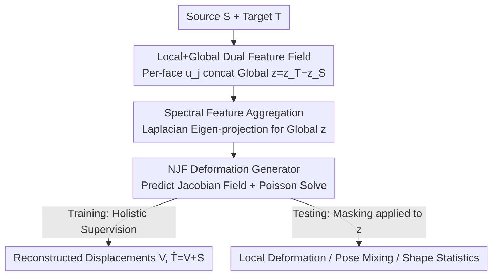

# PaNDaS: Learnable Shape Interpolation Modeling with Localized Control

**Conference**: CVPR 2026  
**Paper**: [CVF Open Access](https://openaccess.thecvf.com/content/CVPR2026/html/Besnier_PaNDaS_Learnable_Shape_Interpolation_Modeling_with_Localized_Control_CVPR_2026_paper.html)  
**Code**: None (Project Page: https://daidedou.sorpi.fr/publication/pandas)  
**Area**: 3D Vision  
**Keywords**: Mesh deformation, non-rigid shape interpolation, localized control, Neural Jacobian Fields, triangular meshes

## TL;DR
PaNDaS constructs a deformation feature field by combining per-face local features on the source mesh with a global encoding of the target mesh. Fed into a deformation generator based on Neural Jacobian Fields and trained only with holistic deformation supervision, the model enables localized non-rigid interpolation of arbitrary regions during inference via binary masking of the global features. It achieves state-of-the-art accuracy in both holistic and local interpolation across hand, body, and face datasets.

## Background & Motivation
**Background**: 3D shape interpolation—finding a natural, near-isometric non-rigid motion trajectory $\gamma:[0,1]\to D(S)$ given a source mesh $S$ and target $T$—is fundamental to animation, motion modeling, and character generation. Mainstream approaches fall into two categories: geometric optimization (ARAP, geodesics under various elastic/Riemannian metrics) and autoencoder-based methods that compress shapes into a global latent space for interpolation (e.g., ARAPReg, LIMP, 3D-CODED, NJF).

**Limitations of Prior Work**: ① Handle-based methods (ARAP, Neural Shape Deformation Prior) only provide the final deformation without intermediate frames; direct linear interpolation between source and target often leads to self-intersections and physically implausible intermediate poses. ② Methods compressing deformations into a **global** latent vector struggle with **localized control**, as a single vector affects the entire shape. ③ Existing localized control methods either hard-code the correspondence between latent points and vertices (VCMC, which limits detail and fixes topology) or rely on extra priors like texture maps, user prompts, or skeletal joints, often requiring expensive test-time optimization. ④ Parametric templates like SMPL/MANO allow localized control but require manual rigging and skinning, and projecting geometry onto low-dimensional coarse templates smoothes out high-frequency details in fingers, faces, and clothing.

**Key Challenge**: The contradiction between "localized controllability" and "no requirements for correspondences, templates, or extra priors." Vertex-level local editing traditionally sacrifices either generalization (fixed correspondences) or ease of use (requiring rigs, textures, or optimization).

**Goal**: To predict complete, physically reasonable, and near-isometric non-rigid motion trajectories for **any selected region** of a source mesh, purely data-driven, without pre-computed correspondences or templates, and generalizing across unaligned raw scans.

**Key Insight**: Instead of using a single global latent to represent the entire shape, it is better to **simultaneously learn a global shape latent and per-point local latents**. By distributing deformation information across each triangular face, localized control is transformed into direct operations (masking) on local features.

**Core Idea**: Replace a single global latent with a "per-face local feature field + global encoding" combined with a Neural Jacobian Field generator. Training utilizes only holistic deformations, while masking is applied to the global features during inference to transform a holistic model into a locally controllable interpolator at zero cost.

## Method

### Overall Architecture
The core of PaNDaS is a deformation model: given a source mesh $S$ in a neutral pose and a target deformation $T$, it outputs per-vertex displacements $V=(v_i)$ such that $\hat T = V + S \simeq T$. The architecture consists of three modules. First, per-face **local deformation features** $u_j=g_{\theta_2}(S)_j\in\mathbb{R}^l$ are extracted from $S$ using DiffusionNet. Second, a global encoder $f_{\theta_1}$ compresses target $T$ into a **global feature** $z=f_{\theta_1}(T)\in\mathbb{R}^r$. These are concatenated into a per-face deformation feature field $\omega_j=(u_j,z)$, which is fed into a **deformation generator** $h_{\theta_3}$. The generator predicts per-face Jacobian matrices, from which a smooth displacement field is recovered via Poisson solving.

The critical insight is that **no masks are needed during training**; the model is supervised using only holistic $(S,T)$ pairs. Since $\omega_j=(u_j,0)$ corresponds to $(S,S)$ (no deformation), localized control is achieved at test time by zeroing out the global component $z$ (masking) for specific regions. This allows the unselected faces to remain stationary while the selected ones deform toward the target.

### Key Designs

**1. Local + Global Dual Latent Feature Field: Moving Local Control from Global Vectors to Individual Faces**

To address the localized control limitations of global latents, PaNDaS assigns a feature $\omega_j=(u_j,z)$ to every triangular face $t_j$. $u_j$ is a per-face local feature extracted by DiffusionNet on the source mesh, encoding the local geometry of the source. $z$ is the global deformation encoding of the target, computed as the difference $z=z_T-z_S$ to ensure $z=0$ when $S=T$. Because local information is distributed across faces, localized control does not require retraining; it is achieved purely by manipulating $z$ during inference.

**2. Spectral Feature Aggregation: Laplacian Eigen-projection for Remesh-Robust Global Encoding**

Instead of traditional max-pooling or area-weighted sums, the authors propose a new aggregator for pooling per-face features $(b_j)_j$ into a global vector $z$. Let $e^k$ be the $k$-th eigenvector of the cotangent Laplacian $\Delta_T$ of the target mesh. Per-face features are projected onto the spectral basis $b_j=p_1 e^1_j + p_2 e^2_j + \cdots$, where the $k$-th projection coefficient is the area-weighted average:

$$p_k = \frac{1}{\mathrm{Area}(T)}\sum_{j=1}^{m_T}\mathrm{Area}(t_j)\,b_j\,e^k_j$$

The first $s$ coefficients are concatenated and passed through a linear layer to obtain $z \in \mathbb{R}^r$. By using spectral projections, the global encoding becomes insensitive to mesh connectivity or resolution, which is vital for handling unaligned scans.

**3. Neural Jacobian Field Generator: Predicting Jacobians for Remesh-Invariance**

Regressing per-vertex displacements directly often causes artifacts in large non-linear deformations. PaNDaS follows the Neural Jacobian Fields (NJF) approach: the generator predicts a Jacobian matrix $J_j$ for each face, followed by solving the Poisson equation to find the displacement $V$ that best fits the Jacobian field:

$$\min_V \sum_j \lVert J_j-(\nabla V)_j\rVert^2,\qquad \nabla_S v = \nabla_T M J$$

where $M$ is the mass matrix of $S$. Unlike original NJF, which concatenates triangle centroids to global codes, PaNDaS **predicts Jacobians directly from $\omega_j$**, utilizing its inherent local features.

**4. Test-time Masking: Holistic Training Unlocking Local Interpolation**

This is the key to transforming a holistic model into a locally controllable interpolator. Validated only on full $(S,T)$ pairs during training, the model can apply a per-face binary mask $M=(M_j)\in\{0,1\}^m$ to $z_T$ at test time. The resulting local feature field $\omega_j^{\text{partial}}=(u_j,\,M_j\odot z_T)$ allows for localized motion:

$$\gamma(t)=h\big((1-t)\,\omega_S + t\,\omega^{\text{partial}}\big)$$

Pose mixing is also possible by combining global encodings $z_1, \dots, z_k$ with respective masks $M_1, \dots, M_k$: $z_{\text{new}}=\frac{1}{k}\big(M_1\odot z_1+\cdots+M_k\odot z_k\big)$.

### Loss & Training
The model is trained to reconstruct $T$ from $S$ using an MSE reconstruction loss:

$$\mathcal{L}^{\text{rec}}(T,\hat T)=\frac{1}{n_S}\sum_{i=1}^{n_S}\lVert y_i-(x_i+v_i)\rVert_2^2$$

To ensure smoother deformations, a **normal regularization** term is added. Normals $\vec n_{j,J}$ are computed via cross-products of the predicted Jacobians $J_j$ and compared to target normals $\vec n_{j,T}$ using cosine distance:

$$\mathcal{L}^n(T,\hat T)=\frac{1}{m_T}\sum_{j=1}^{m}\big[1-\vec n_{j,T}\cdot\vec n_{j,J}\big]$$

The total loss is $\mathcal{L}=\mathcal{L}^{\text{rec}}+\lambda^n\mathcal{L}^n$.

## Key Experimental Results

### Main Results
Evaluated on MANO (hands), DFAUST (bodies), and COMA (faces). Holistic interpolation compared against ARAPReg, SMS, and NJF:

| Dataset | Metric | Ours | ARAPReg | SMS / NJF |
|--------|------|------|---------|-----------|
| DFAUST (Mean) | MSE ↓ | **4.1** | 6.2 | 7.2 (SMS) |
| DFAUST (Mean) | Cosd ↓ | **0.10** | 0.17 | 0.14 (SMS) |
| COMA (Mean) | MSE ↓ | **0.06** | 0.08 | 0.27 (NJF) |
| COMA (Mean) | Cosd ↓($10^{-2}$) | **1.3** | 1.4 | 2.5 (NJF) |

The method leads significantly in large non-linear movements (e.g., Jumping in DFAUST, where MSE is 5.8 vs ARAPReg's 10.6).

### Local Deformation and Scan Generalization
Local interpolation (e.g., deforming only the left half of the body in DFAUST) compared against VCMC and Local ARAP; scan interpolation compared against NJF and ARAP:

| Task | Metric | Ours | ARAP | Others |
|------|------|------|------|------|
| DFAUST Local Interp. | MSE ↓ | **3.4** | 4.4 | 6.0 (VCMC) |
| DFAUST Local Interp. | Cosd ↓ | 0.09 | **0.08** | 0.15 (VCMC) |
| DFAUST Scan Local Interp. | CD ↓($10^{-3}$) | **4.80** | 6.03 | 6.67 (NJF) |
| DFAUST Scan Local Interp. | HD ↓ | **0.65** | 0.71 | 0.79 (NJF) |

PaNDaS significantly outperforms VCMC and counterparts in local MSE and outperforms NJF/ARAP in CD/HD for raw scans.

### Key Findings
- **Superiority in non-linear deformations**: Improvement is most pronounced in scenarios like jumping or raw scan processing where linear methods (ARAP) fail or cause self-intersections.
- **Normal regularization is vital**: Without it, intermediate frames exhibit visible artifacts and instability.
- **Robustness by design**: Inherently robust to remeshing and requires no pre-computed correspondences or skeletons.
- **"Soft" locality**: While Poisson solving doesn't strictly confine deformation within a mask, displacements decay rapidly outside the masked boundary, providing sufficient practical locality.

## Highlights & Insights
- **Decoupling Local Control from Supervision**: Training on holistic data and enabling local control via masks is an elegant strategy. It demonstrates that if a feature field is per-face, local deformation is just a zeroed-out special case of the global one.
- **Spectral Aggregator**: Replacing max-pooling with Laplacian projections is a clever "trick" to inherit remeshing invariance, which could be useful in other mesh-based encoding tasks.
- **Arithmetic in Feature Space**: Interpolation and pose mixing map to simple linear algebra on the feature field $\omega$, turning complex shape statistics into Euclidean operations.

## Limitations & Future Work
- **Requirement for Registered Training Data**: Although remesh-robust at test time, the model still requires registered meshes for training. Future work could explore training directly on raw scans.
- **Boundary Artifacts**: Simple binary masking can lead to artifacts at the selection transition; weighted masking or learned mixing could improve results.
- **Soft constraints**: Locality is a property of the Poisson solver's decay rather than a hard constraint, which may be insufficient for tasks requiring strict isolation of rigid parts.

## Related Work & Insights
- **vs NJF (Neural Jacobian Fields)**: Both predict per-face Jacobians, but NJF concatenates global codes to vertex coordinates, failing in localized deformation. PaNDaS predicts purely from feature space, leading to better local geometry and scan handling.
- **vs ARAP**: ARAP is real-time but only provides the final state; linear interpolation across intermediate frames leads to artifacts. PaNDaS provides learned, physically plausible trajectories.
- **vs VCMC / SMS**: VCMC hard-codes latent-to-vertex correspondences, limiting it to fixed topologies. PaNDaS’s per-face feature field provides detail without topological constraints.
- **vs Parametric Templates (SMPL/MANO)**: Parametric models require manual rigging and skinning while losing high-frequency details. PaNDaS operates purely on the surface domain to preserve details.

## Rating
- Novelty: ⭐⭐⭐⭐ (Clever decoupling of local control via masking; spectral aggregator is innovative.)
- Experimental Thoroughness: ⭐⭐⭐⭐ (Covers domains across hands/bodies/faces and tasks across holistic/local/scans.)
- Writing Quality: ⭐⭐⭐⭐ (Clear motivation, formalization, and derivation.)
- Value: ⭐⭐⭐⭐ (Practical for animation and shape statistics; templates/skeletons/textures are no longer required.)

<!-- RELATED:START -->

## Related Papers

- [\[CVPR 2026\] LoG3D: Ultra-High-Resolution 3D Shape Modeling via Local-to-Global Partitioning](log3d_ultra-high-resolution_3d_shape_modeling_via_local-to-global_partitioning.md)
- [\[ECCV 2024\] ShapeFusion: A 3D Diffusion Model for Localized Shape Editing](../../ECCV2024/3d_vision/shapefusion_a_3d_diffusion_model_for_localized_shape_editing.md)
- [\[CVPR 2026\] OLATverse: A Large-scale Real-world Object Dataset with Precise Lighting Control](olatverse_a_large-scale_real-world_object_dataset_with_precise_lighting_control.md)
- [\[CVPR 2026\] CUBE: Representing 3D Faces with Learnable B-Spline Volumes](cube_bspline_3d_faces.md)
- [\[CVPR 2026\] Solving Minimal Problems Without Matrix Inversion Using FFT-Based Interpolation](solving_minimal_problems_without_matrix_inversion_using_fft-based_interpolation.md)

<!-- RELATED:END -->
