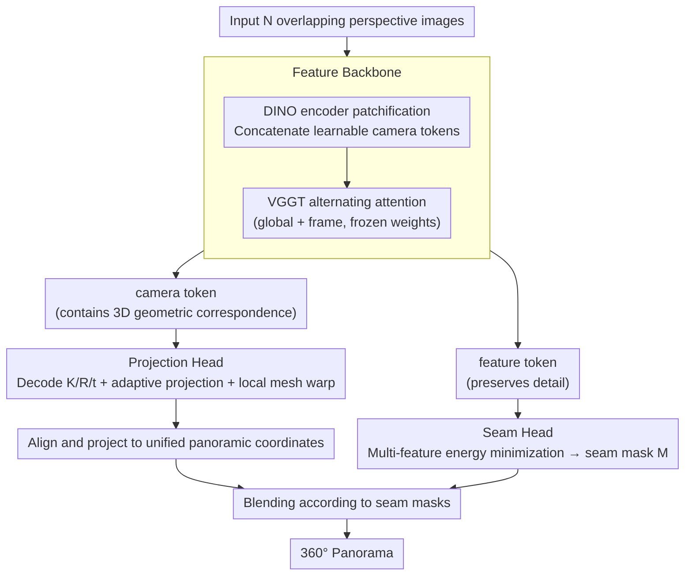

# Pano360: Perspective to Panoramic Vision with Geometric Consistency

**Conference**: CVPR2026  
**arXiv**: [2603.12013](https://arxiv.org/abs/2603.12013)  
**Code**: [KiMomota/Pano360](https://github.com/KiMomota/Pano360)  
**Area**: 3D Vision  
**Keywords**: panorama stitching, 3D geometric consistency, transformer, multi-view alignment, seam detection

## TL;DR

Pano360 is proposed to extend panoramic stitching from traditional 2D pairwise matching to a 3D photogrammetric space. By utilizing a Transformer architecture to achieve global geometric consistency alignment across multiple views, it reaches a 97.8% success rate in challenging scenarios such as weak textures, large parallax, and repetitive patterns.

## Background & Motivation

Panoramic image stitching is widely required in downstream tasks like autonomous driving, VR, and 3D Gaussian Splatting. Existing methods face several core issues:

**Error accumulation in pairwise matching**: Both traditional methods (SIFT/ORB/LoFTR + RANSAC) and learning-based methods (UDIS/UDIS2) are limited to establishing 2D feature correspondences pair-by-pair. During multi-image stitching, projection errors accumulate progressively, leading to severe distortion.

**Feature matching failure in challenging scenes**: Reliable feature matches are scarce in scenes with weak textures, large parallax, or repetitive patterns, causing homography estimation to fail easily.

**Ignoring 3D projective geometry**: Existing methods focus on visual seamlessness but ignore global 3D projective consistency, resulting in geometric distortion.

**High post-processing costs**: CNN-based methods (e.g., UDIS2) require complex post-processing to complete multi-image alignment, limiting practical utility.

**Key Insight**: Multi-view geometric correspondences can be directly constructed in 3D space, which is more accurate and globally consistent than 2D correspondences. Therefore, the authors extend the 2D alignment task to a 3D photogrammetric space to fundamentally solve the error accumulation problem.

## Method

### Overall Architecture

Pano360 adopts a dual-branch Transformer architecture. Given $N$ partially overlapping images, a single forward pass jointly predicts all parameters required for stitching:

$$f(\{I_i\}_{i=1}^N) = \{P_i, W_i, M_i\}_{i=1}^N$$

Where $P_i$ is the global projection transformation, $W_i$ is the local deformation field (handling parallax), and $M_i$ is the seam mask. The complete pixel transformation is:

$$\mathcal{W}_i(\mathbf{u}) = P_i(\mathbf{u}) + W_i(\mathbf{u})$$

Framework pipeline: (a) Project perspective images to a unified panoramic coordinate system using camera parameters → (b) Extract overlapping regions → (c) Seam decoder generates seam masks for each image → (d) Blend to generate the final panorama using masks and aligned images.

### Key Designs

**1. Feature Backbone**

- Each image is patchified via a pre-trained DINO encoder.
- Learnable camera tokens are prepended to the embedding sequence of all images to learn global geometric relationships across images.
- An $L$-layer alternating attention mechanism (global attention + frame attention) from a pre-trained VGGT is used to process the sequence.
- Two outputs: camera tokens (sent to the projection head for 3D geometry information) and feature tokens (sent to the seam head to preserve details).

**2. Projection Head**

- Decodes intrinsics $\mathbf{K}_i$ and extrinsics $\{\mathbf{R}_i, \mathbf{t}_i\}$ for each image from the predicted camera tokens.
- Assumes all cameras share the same focal length with the principal point at the image center; the first image is fixed as the reference frame ($\mathbf{R}_1=\mathbf{I}, \mathbf{t}_1=\mathbf{0}$).
- Supports adaptive selection of projection formats: rectilinear, equirectangular, spherical, etc.
- For large parallax scenes, an additional local mesh warp $W_i$ is calculated to correct residual misalignments.

**3. Seam Head — Multi-feature Joint Optimization**

The core is modeling seam detection as an energy minimization problem:

$$E(\mathcal{I}) = E_l(\mathcal{I}) + E_c(\mathcal{I})$$

- $E_l$: Label cost, a hard constraint ensuring pixels only come from valid image regions.
- $E_c$: Continuity cost, penalizing different labels for adjacent pixels to encourage continuous and inconspicuous seams.

The pixel-level cost function integrates three types of information:

$$C(p) = F_{color}(p) + F_{gradient}(p) \times F_{ratio}(p)$$

| Cost Term | Definition | Function |
|-----------|------------|----------|
| $F_{color}$ | Color difference between overlapping images $\|I_i(p) - I_j(p)\|$ | Guides seams away from color discontinuities |
| $F_{gradient}$ | Gradient magnitude $|\nabla I_i(p)| + |\nabla I_j(p)|$ | Guides seams away from sharp object edges |
| $F_{ratio}$ | Texture complexity map | Penalizes visually complex areas (with parallax/depth changes) to guide seams to uniform regions |

Novelty: **Simultaneously considers color differences and gradients of all overlapping images**, avoiding local optima associated with pairwise calculations. The calculated seam mask serves as a pseudo-label to supervise seam decoder training.

### Loss & Training

The multi-task loss consists of three components:

| Loss Term | Formula | Description |
|-----------|---------|-------------|
| $\mathcal{L}_{cam}$ | $\sum_{i=1}^N \|\hat{\mathbf{g}}_i - \mathbf{g}_i\|_\epsilon$ (Huber loss) | Supervises camera parameter prediction |
| $\mathcal{L}_{seam}$ | $\sum_{i=1}^N \|\hat{M}_i - M_i\|$ (L1 loss) | Supervises seam mask prediction |
| $\mathcal{L}_{proj}$ | Predefined projection format loss | Adapts the network to different projection formats with continuous gradients |

Training details:
- VGGT alternating attention module weights are initialized from pre-trained models and **frozen**.
- Uncertainty terms are removed to accelerate convergence.
- Data normalization: All quantities are represented in the first frame's coordinate system to ensure input permutation invariance.
- Data augmentation: Random rotation jitter of up to 2° for yaw/pitch/roll.

**Pano360 Dataset**: 200 real-world scenes (50% tourism, 30% extreme sports, 20% extreme lighting), with 3 focal lengths × 24 frames = 72 images per scene (2048×2048), totaling 14,400 frames with GT camera parameters covering a full 360° FoV.

## Key Experimental Results

### Main Results: Panoramic Quality Comparison on Pano360 Dataset

| Method | QA_q ↑ | QA_a ↑ | BRIS ↓ | NIQE ↓ | Remarks |
|--------|--------|--------|--------|--------|---------|
| AutoStitch | 3.28 | 2.81 | 49.84 | 5.01 | Trad. Features |
| APAP | 3.53 | 3.66 | 45.66 | 3.77 | Trad. Features |
| GES-GSP | 3.74 | 3.72 | 44.22 | 3.95 | Trad. Features |
| UDIS2‡ | 2.87 | 2.34 | 58.62 | 4.91 | Pairwise only |
| **Pano360 (Ours)** | **4.09** | **3.94** | **37.96** | **3.37** | — |

(Using Scene (c) as an example, which includes challenging repetitive textures, abnormal lighting, and large FoV)

### Success Rate and Speed Comparison

| Method | Geometry Feature Dependent | Success Rate (%) | Runtime |
|--------|----------------------------|------------------|---------|
| LoFTR+RANSAC | ✓ | 63.4 | ~13s |
| LightGlue+RANSAC | ✓ | 66.7 | ~11s |
| ELA | ✓ | 80.1 | ~90s |
| GES-GSP | ✓ | 83.3 | ~20s |
| APAP | ✓ | 30.0 | >300s |
| **Pano360 (Ours)** | ✗ | **97.8** | **~5s** |

### Generalization on UDIS-D Dataset

| Method | PSNR ↑ | SSIM ↑ | PIQE ↓ | NIQE ↓ |
|--------|--------|--------|--------|--------|
| UDIS2‡ | 25.43 | 0.838 | 48.09 | 6.11 |
| DHS‡ | 25.88 | 0.845 | 45.73 | 6.18 |
| **Pano360 (Ours)** | **25.97** | **0.852** | **42.12** | **5.78** |

(Pano360 was not trained on UDIS-D; it outperforms specialized fine-tuned methods when generalizing to pairwise scenarios)

### Ablation Study

| $\mathcal{L}_{cam}$ | $\mathcal{L}_{proj}$ | $\mathcal{L}_{seam}$ | QA_q ↑ | BRIS ↓ | NIQE ↓ |
|:---:|:---:|:---:|--------|--------|--------|
| ✗ | ✗ | ✗ | 2.76 | 62.47 | 5.31 |
| ✓ | ✗ | ✗ | 3.45 | 47.43 | 4.65 |
| ✓ | ✓ | ✗ | 3.68 | 43.71 | 3.97 |
| ✗ | ✗ | ✓ | 3.01 | 51.12 | 4.83 |
| ✓ | ✓ | ✓ | **4.09** | **37.96** | **3.37** |

**Key Findings**:
- Pose-guided alignment ($\mathcal{L}_{cam}$) contributes the most, with QA_q increasing from 2.76 to 3.45.
- The projection function further eliminates non-perspective distortions, reducing BRIS by ~4 points.
- Joint optimization of all three is optimal. Seams without alignment yield limited results (precise alignment is a prerequisite for good seams).
- Seam ablation: removing color terms leads to visible chromatic aberration; removing texture maps leads to ghosting (seams passing through people).

## Highlights & Insights

1. **Paradigm shift**: Moving from 2D pairwise matching to 3D global alignment is a major breakthrough in panoramic stitching, utilizing multi-view geometric consistency in 3D space to filter unreliable matches.
2. **Clever architecture reuse**: Utilizing the alternating attention modules of pre-trained VGGT (inherently 3D-aware) with frozen weights achieves powerful cross-view feature aggregation at a low training cost.
3. **Scalability**: Supports input from a few to hundreds of images, running over 10x faster than pairwise methods in large-scale scenes.
4. **Multi-feature joint seam optimization**: Simultaneously considers color, gradient, and texture of all overlapping images, avoiding local optima found in pairwise calculations.
5. **High-quality dataset**: 14,400 frames of real-world data covering challenging conditions like extreme motion and night scenes, filling a gap in the field's data availability.

## Limitations & Future Work

1. **Lack of distortion support**: The current model assumes input images have no inherent distortion (e.g., fisheye), limiting applicability to more camera types.
2. **Limitations with extreme parallax**: When objects are captured from very different angles, 3D reconstruction is still required for correct stitching; image-level warps are insufficient.
3. **VGGT frozen weights trade-off**: While freezing attention modules reduces training costs, it may limit further adaptation to the panoramic stitching task.
4. Future directions: (a) Introduce depth estimation for complex parallax; (b) Extend to video panoramic stitching/real-time scenes; (c) Support heterogeneous lenses (mixed fisheye+perspective input).

## Related Work & Insights

- **VGGT** [Wang et al.]: Provides 3D-aware Transformer features, used as the foundation for the backbone.
- **UDIS/UDIS2** [Nie et al.]: Representative CNN learning methods, though limited to pairwise stitching.
- **GES-GSP** [Du et al.]: Traditional geometry-preserving method, which still fails under repetitive textures.
- **LoFTR/LightGlue**: Modern feature matching methods used with RANSAC, but with success rates of only 60-67%.
- Insight: **The approach of elevating 2D tasks to 3D space is worth emulating in other geometric vision tasks**, such as registration and optical flow estimation.

## Rating

| Dimension | Score (1-10) | Description |
|-----------|:------------:|-------------|
| Novelty | 8 | The 2D→3D paradigm shift is novel; architecture cleverly reuses VGGT |
| Technical Depth | 8 | Projection head, seam head, and multi-task loss designs are complete |
| Experimental Thoroughness | 8 | Multi-dataset validation, extensive ablation, generalization, and qualitative comparison |
| Value | 8 | 97.8% success rate and 5s runtime; suitable for large-scale scenes |
| Writing Quality | 7 | Clear overall, though some formula layouts are slightly crowded |
| **Total Score** | **8.0** | Solid work in panoramic stitching with paradigm innovation and strong experiments |

<!-- RELATED:START -->

## Related Papers

- [\[CVPR 2026\] SwiftTailor: Efficient 3D Garment Generation with Geometry Image Representation](swifttailor_efficient_3d_garment_generation_with_geometry_image_representation.md)
- [\[CVPR 2026\] VGGT-Det: Mining VGGT Internal Priors for Sensor-Geometry-Free Multi-View Indoor 3D Object Detection](vggt-det_mining_vggt_internal_priors_for_sensor-geometry-free_multi-view_indoor_.md)
- [\[CVPR 2026\] Complet4R: Geometric Complete 4D Reconstruction](complet4r_geometric_complete_4d_reconstruction.md)
- [\[CVPR 2026\] Generalizable Human Gaussian Splatting via Multi-view Semantic Consistency](generalizable_human_gaussian_splatting_via_multi-view_semantic_consistency.md)
- [\[CVPR 2026\] GAP: Action-Geometry Prediction with 3D Geometric Prior for Bimanual Manipulation](action-geometry_prediction_with_3d_geometric_prior_for_bimanual_manipulation.md)

<!-- RELATED:END -->
