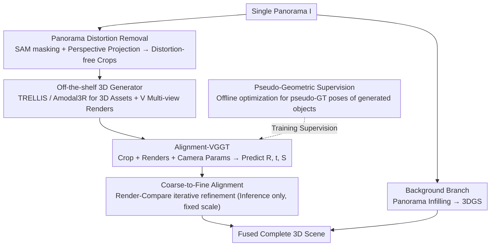

# Pano3DComposer: Feed-Forward Compositional 3D Scene Generation from Single Panoramic Image

**Conference**: CVPR 2026  
**arXiv**: [2603.05908](https://arxiv.org/abs/2603.05908)  
**Code**: Yes (Project Page)  
**Area**: 3D Vision  
**Keywords**: Panoramic 3D reconstruction, compositional scene generation, feed-forward transformation prediction, VGGT, 3D Gaussian Splatting

## TL;DR
Pano3DComposer is proposed as a modular feed-forward framework for compositional 3D scene generation from a single panorama. Through a plug-and-play Object-World Transformation Predictor based on Alignment-VGGT, generated 3D objects are transformed from local to world coordinates, accomplishing high-fidelity 3D scene generation in approximately 20 seconds on an RTX 4090.

## Background & Motivation
**Background**: 3D scene generation serves as the foundation for VR/AR and digital twins. Current methods primarily rely on perspective images with limited fields of view; panoramas provide full $360^{\circ}$ spatial context but introduce significant distortion issues.

**Limitations of Prior Work**:
   - Feed-forward scene understanding methods (Total3D, InstPIFu) are limited by a lack of precise 3D mesh supervision and poor generalization.
   - Feed-forward multi-instance generation models (MIDI, SceneGen) require expensive fine-tuning, with object generation and layout tightly coupled.
   - Compositional optimization methods (GALA3D, LayoutYour3D) involve time-consuming iterative optimization, failing to meet efficiency requirements.
   - Panorama-specific methods (DeepPanoContext, PanoContext-Former) can only generate textureless meshes.

**Key Challenge**: Achieving decoupling between object generation and layout estimation while maintaining high efficiency and addressing panoramic distortion.

**Goal**: (a) Converting time-consuming iterative optimization $\rightarrow$ feed-forward inference; (b) Object-layout coupling $\rightarrow$ decoupled design; (c) Panoramic distortion $\rightarrow$ perspective projection preprocessing.

**Key Insight**: Shifting the object-world coordinate transformation problem from difficult 3D space to more robust 2D image space, utilizing correspondences between multi-view renders and target crops.

**Core Idea**: Utilizing Alignment-VGGT in a single feed-forward pass to predict the rotation, translation, and anisotropic scaling for 3D objects from local to world coordinates.

## Method

### Overall Architecture
The problem addressed is: given a $360^{\circ}$ panorama, directly reconstruct an editable scene composed of independent 3D objects and background via feed-forward inference, without relying on slow per-object optimization. The pipeline receives an equirectangular panorama $\mathbf{I} \in \mathbb{R}^{H \times W \times 3}$. In the preprocessing stage, objects are detected and "rectified" from the distorted panorama into standard crops using perspective projection. The object branch generates 3D assets using off-the-shelf generators, followed by the Object-World Transformation Predictor which calculates the world-coordinate transformation in one pass. Simultaneously, the background branch converts the infilled panorama into 3DGS. Finally, all aligned objects and the background are fused into a complete scene. This decoupled design ensures that object generation and placement are independent, allowing generators to be replaced freely.

### Key Designs

**1. Panorama Distortion Removal: Projecting distorted objects into standard perspective views before inputting to off-the-shelf 3D generators.**

Equirectangular projection severely stretches objects in a panorama, preventing general image-to-3D models from working correctly. During preprocessing, SAM is used to extract a mask $\mathbf{M}_i$ for each object. Based on its spherical longitude and latitude $(\theta_i, \phi_i)$ and field of view $\alpha_i$, a perspective projection is performed to obtain a distortion-free crop:

$$\mathbf{I}_i^{\text{crop}} = \Pi_{\text{persp}}(\mathbf{I} \odot \mathbf{M}_i;\ \theta_i, \phi_i, \alpha_i)$$

This approach isolates panoramic distortions from the generator—the resulting standard perspective view can be processed by any off-the-shelf 3D generator (TRELLIS, Amodal3R, etc.) without requiring specific fine-tuning for panoramas.

**2. Alignment-VGGT: Solving object-to-world alignment in 2D image space rather than 3D space.**

Generated 3D objects reside in their local coordinate systems; placing them back in the scene requires rotation $\mathbf{R}$, translation $\mathbf{t}$, and anisotropic scaling $\mathbf{S}$. Direct alignment in 3D space is prone to errors in monocular panoramic depth estimation. This method moves alignment to 2D: adapting the VGGT architecture, the first image in the input sequence is the target crop $\mathbf{I}_i^{\text{crop}}$, followed by $V$ multi-view renders $\{\mathbf{I}_{i,v}^{\text{gen}}\}_{v=1}^V$ of the generated object. Camera parameters are included to resolve intrinsic/extrinsic ambiguities. A scaling head is added to predicted the anisotropic scaling factors $\hat{\mathbf{S}} = \text{diag}(\hat{s}_x, \hat{s}_y, \hat{s}_z)$. The predicted relative pose is transformed back to the unknown local extrinsic $\mathbf{E}_0^{\text{obj}}$, which, combined with world extrinsics, yields the final non-rigid transformation $\mathbf{T}_i$. This is effective because visual correspondences naturally exist between renders and crops, which are more robustly established in 2D image space than via monocular depth.

**3. Pseudo-Geometric Supervision: Calculating "Pseudo-GT Poses" for each generated object to avoid misguidance from GT geometry annotations.**

Directly using GT mesh poses for supervision is problematic because the generated geometry inevitably differs from the GT shape. To resolve this, a differentiable optimizer is run offline for each generated object (using bidirectional Chamfer distance if GT mesh is available, otherwise unidirectional Chamfer + Mask) to find a tailored pseudo-GT transformation $(\mathbf{R}^\star, \mathbf{t}^\star, \mathbf{S}^\star)$. The network is then supervised using L1 loss against these pseudo-GT values. This ensures the supervision signal aligns with the actual geometry being processed. The total loss consists of three weighted terms:

$$\mathcal{L} = \lambda_{\text{CD}}\mathcal{L}_{\text{CD}} + \lambda_{\text{PGD}}\mathcal{L}_{\text{PGD}} + \lambda_{\text{MASK}}\mathcal{L}_{\text{MASK}}$$

**4. Coarse-to-Fine Alignment: Using rendering feedback to iteratively reduce bias for out-of-distribution samples.**

The feed-forward predictor may lose precision on out-of-distribution inputs. A C2F Refiner, also based on Alignment-VGGT, is trained to iteratively refine the pose during inference: at each step, it renders the object at the current pose, compares it with the target crop, and predicts a relative pose update $\Delta\mathbf{T}^{(k)}$ (scaling is fixed here, only rotation and translation are updated). Convergence is monitored via Chamfer distance, stopping when $\mathcal{L}_{\text{CD}}^{(k)} - \mathcal{L}_{\text{CD}}^{(k+1)} < \tau$. This feedback-loop-based refinement improves accuracy on unseen domains without requiring gradient optimization or retraining.

### Loss & Training
- Chamfer Loss $\mathcal{L}_{\text{CD}}$: Bidirectional with GT mesh, otherwise unidirectional + depth back-projected point cloud.
- PGD Loss $\mathcal{L}_{\text{PGD}}$: L1 regression for quaternion rotation, translation, and scaling.
- Mask Loss $\mathcal{L}_{\text{MASK}}$: MSE + IoU between rendered and instance masks.
- DINOv2 backbone and VGGT frame attention layers are frozen. Learning rate $1 \times 10^{-4}$, trained on a single 4090 for approximately 2 days.

## Key Experimental Results

### Main Results

| Method | CD-S↓ | CD-O↓ | F-Score-S↑ | F-Score-O↑ | IoU-B↑ | Training Resources | Inference Time |
|------|-------|-------|-----------|-----------|--------|---------|---------|
| OPT (Optimization) | 0.1059 | 0.1128 | 0.5535 | 0.5640 | 0.4010 | — | 120s |
| ICP | 0.2483 | 0.2305 | 0.4524 | 0.4896 | 0.2830 | — | 1s |
| DeepPanoContext | 0.7851 | 0.1657 | 0.3101 | 0.3822 | 0.0021 | — | 14s |
| SceneGen | 0.1765 | 0.0914 | 0.4575 | 0.4827 | 0.1124 | 56 GPU days | 63s |
| **Ours** | **0.0787** | **0.0765** | **0.6923** | **0.6926** | **0.5679** | 2 GPU days | 20s |
| Ours-C2F | **0.0784** | **0.0762** | **0.6930** | **0.6937** | **0.5699** | 4 GPU days | 24s |

### Ablation Study

| Configuration | CD-S↓ | CD-O↓ | F-Score-S↑ | F-Score-O↑ | IoU-B↑ |
|------|-------|-------|-----------|-----------|--------|
| $\mathcal{L}_{\text{CD}}$ only | 0.8688 | 0.9027 | 0.1980 | 0.1888 | 0.0906 |
| + $\mathcal{L}_{\text{PGD}}$ | 0.1266 | 0.1219 | 0.5675 | 0.5670 | 0.4670 |
| + $\mathcal{L}_{\text{MASK}}$ | 0.1120 | 0.1063 | 0.5788 | 0.5850 | 0.4818 |
| w/o Camera Info | 0.1850 | 0.1705 | 0.4673 | 0.4691 | 0.3830 |

### Key Findings
- Training with only Chamfer loss yields poor results (CD-S 0.87); adding Pseudo-Geometric Distillation ($\mathcal{L}_{\text{PGD}}$) improves this significantly to 0.13.
- Performance drops markedly without camera parameter inputs, validating the importance of camera priors.
- Compared to SceneGen, training resources are reduced 28x (2 vs 56 GPU days), and inference is 3x faster (20s vs 63s).
- The C2F mechanism adds only 4s to inference but significantly improves generalization in real-world scenes.

## Highlights & Insights
- **Ingenious Pseudo-Geometric Supervision**: Since generated objects differ from GT shapes, using GT pose labels misguides the network. Tailoring pseudo-GT parameters for specific generated geometries solves the shape discrepancy problem and provides high-quality supervision for the feed-forward predictor.
- **Sifting from 3D to 2D Alignment**: By avoiding inaccurate monocular panoramic depth and leveraging multi-view rendered correspondences in 2D space, the framework achieves a more robust and practical design.
- **Modular Flexibility**: The 3D generator can be swapped (e.g., TRELLIS, Amodal3R) without requiring joint training.

## Limitations & Future Work
- Dependent on SAM segmentation quality; heavy occlusion or small objects may lead to segmentation failure.
- Currently trained/evaluated on indoor scenes (3D-FRONT, Structured3D); generalization to outdoor scenes is unverified.
- Each object requires independent 3D asset generation (~4s/object), causing total time to scale linearly with object count.
- The C2F mechanism still relies on depth estimation for reference point clouds; inaccurate depth may limit refinement potential.

## Related Work & Insights
- **vs SceneGen**: SceneGen performs end-to-end multi-instance generation but requires extensive fine-tuning for panoramas (56 GPU days). This decoupled design is more flexible with 28x lower training costs.
- **vs GALA3D / DreamScene**: These use SDS for appearance optimization (30-60min/object) and rely on LLM prompts for layout, which often violates physical constraints. This work derives layout directly from the panorama efficiently.
- **vs CAST**: CAST predicts alignment parameters but couples object generation and alignment, preventing plug-and-play generator replacement.

## Rating
- Novelty: ⭐⭐⭐⭐ Pseudo-geometric supervision and Alignment-VGGT are creative, though the overall framework is modular assembly.
- Experimental Thoroughness: ⭐⭐⭐⭐ Extensive ablations on synthetic and real scenes, though more quantitative evaluation on diverse real-world scenes would be beneficial.
- Writing Quality: ⭐⭐⭐⭐ Clear method descriptions and complete mathematical derivations.
- Value: ⭐⭐⭐⭐ An efficient and practical solution for panoramic 3D scene generation with direct value for VR/AR applications.

<!-- RELATED:START -->

## Related Papers

- [\[CVPR 2026\] PanoVGGT: Feed-Forward 3D Reconstruction from Panoramic Imagery](panovggt_feed-forward_3d_reconstruction_from_panoramic_imagery.md)
- [\[CVPR 2026\] UniSH: Unifying Scene and Human Reconstruction in a Feed-Forward Pass](unish_unifying_scene_and_human_reconstruction_in_a_feed-forward_pass.md)
- [\[CVPR 2026\] Particulate: Feed-Forward 3D Object Articulation](particulate_feed-forward_3d_object_articulation.md)
- [\[CVPR 2026\] InstantHDR: Single-forward Gaussian Splatting for High Dynamic Range 3D Reconstruction](instanthdr_singleforward_gaussian_splatting_for_hi.md)
- [\[CVPR 2026\] EmbodiedSplat: Online Feed-Forward Semantic 3DGS for Open-Vocabulary 3D Scene Understanding](embodiedsplat_online_feed-forward_semantic_3dgs_for_open-vocabulary_3d_scene_und.md)

<!-- RELATED:END -->
