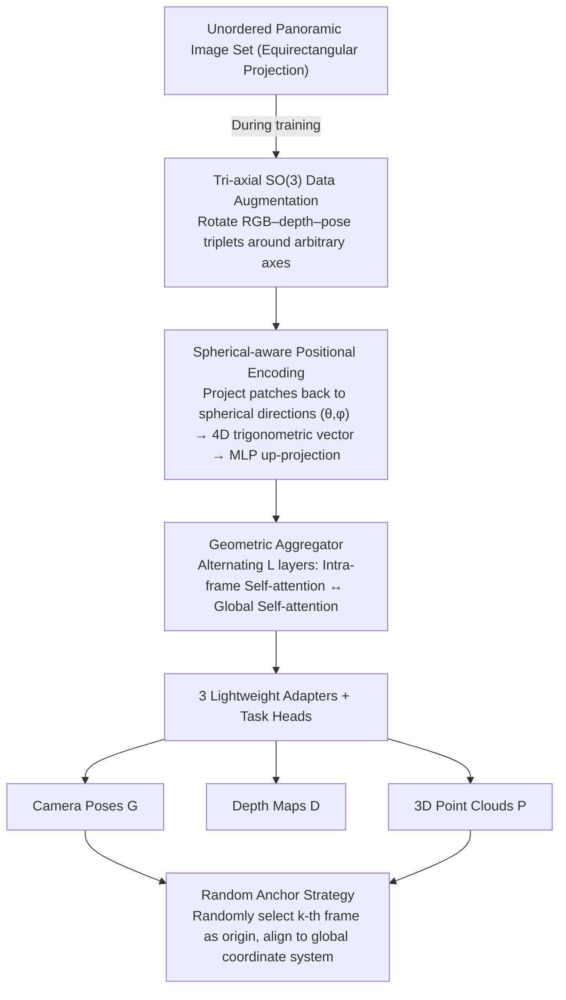

# PanoVGGT: Feed-Forward 3D Reconstruction from Panoramic Imagery

**Conference**: CVPR 2026  
**arXiv**: [2603.17571](https://arxiv.org/abs/2603.17571)  
**Code**: Available (Upcoming)  
**Area**: 3D Vision  
**Keywords**: Panoramic 3D reconstruction, feed-forward multi-view reconstruction, spherical positional encoding, $SO(3)$ data augmentation, large-scale panoramic datasets

## TL;DR
The authors propose PanoVGGT, a permutation-equivariant Transformer framework capable of jointly predicting camera poses, depth maps, and globally consistent 3D point clouds from one or more unordered panoramic images in a single feed-forward pass. They also contribute PanoCity, a large-scale dataset containing over 120,000 outdoor panoramic images.

## Background & Motivation
**Background**: Feed-forward 3D reconstruction models such as DUSt3R, VGGT, and $\pi^3$ have achieved significant success on perspective images, enabling the joint inference of depth, pose, and 3D structure in a single forward pass.

**Limitations of Prior Work**:
   - These models are inherently based on pinhole projection assumptions, leading to seams, parallax inconsistencies, and geometric drift when directly processing equirectangular panoramas.
   - Splitting panoramas into multiple perspective crops and then stitching them introduces artifacts.
   - Existing panoramic datasets suffer from insufficient scale, incomplete annotations, and inadequate viewpoint overlap.

**Key Challenge**: Panoramas possess non-pinhole distortions and spherical geometric properties. The positional encoding, data augmentation, and geometric reasoning strategies of existing feed-forward models are inapplicable.

**Goal**: (a) Extend the feed-forward 3D reconstruction paradigm to the panoramic image domain; (b) Build a sufficiently large-scale panoramic dataset to support training.

**Key Insight**: Through spherical-aware positional encoding and $SO(3)$ rotation augmentation, the Transformer learns to perform effective geometric reasoning in the spherical domain.

**Core Idea**: Use spherical positional encoding + tri-axial rotation augmentation + random anchor strategy to extend the feed-forward reconstruction paradigm of VGGT/$\pi^3$ to panoramic imagery.

## Method

### Overall Architecture
Given an unordered set of panoramic images $\{I_i\}_{i=1}^N$, the encoder-aggregator-decoder structure outputs camera poses $G = \{g_i\}$, depth maps $D = \{D_i\}$, and 3D point clouds $P = \{P_i\}$ in the world coordinate system. During training, a tri-axial $SO(3)$ rotation augmentation is applied to each panoramic triplet. Subsequently, patches are processed by a geometric aggregator (alternating intra-frame/global attention) using spherical-aware positional encoding. Finally, three task heads predict poses, depth, and point clouds, respectively, which are aligned to a unified global coordinate system via a random anchor strategy. The model is permutation-equivariant, meaning the input order does not affect the output.

### Key Designs

**1. Spherical-aware Positional Encoding: Adapting ViT's position prior to equirectangular projection distortions**

The limitation of pinhole models is that equirectangular projection flattens the sphere into a rectangle, causing horizontal sampling to be stretched as latitude approaches the poles. Standard ViT positional encodings, which are uniformly arranged by rows and columns, fail to capture this spatially varying sampling density. PanoVGGT avoids encoding by pixel coordinates and instead maps each patch back to its spherical center direction $(\theta, \phi)$. This is then encoded into a 4D circularly symmetric vector $p_{\text{vec}} = [\sin\theta, \cos\theta, \sin\phi, \cos\phi]$ and projected to a high-dimensional embedding $p_{\text{embed}} \in \mathbb{R}^C$ via an MLP. Using trigonometric functions instead of raw angles naturally maintains wrapping continuity at the longitude seam $\theta=\pm\pi$, ensuring the left and right boundaries are not "torn" apart in the encoding space.

This design works synergistically with the $SO(3)$ augmentation: since the positional encoding is tied to the **geometric orientation** of the patch and does not change with image content rotation, the model is forced to decouple projection distortions from semantic content. This achieves distortion invariance without the need for expensive spherical convolutions.

**2. Geometric Aggregator: Alternating inference between intra-frame and cross-frame features**

The aggregator consists of $L$ layers of alternating attention blocks. Each block first performs **intra-frame self-attention**, where tokens within the same panorama attend to each other to capture local geometry and projection distortions. This is followed by **global self-attention**, where tokens from all panoramas are mixed to establish cross-view correspondences. The aggregated features are fused with spherical embeddings through three lightweight adapters and fed into task heads for camera pose, local point clouds, and global point clouds. This alternating arrangement allows the model to preserve single-frame details while reconstructing consistent global structures.

**3. Random Anchor Strategy: Pinning the global coordinate system while maintaining permutation equivariance**

Permutation equivariance is desirable, but it introduces ambiguity regarding which frame should serve as the origin of the global coordinate system. Systems like VGGT fix the first frame as the origin, which introduces an ordering bias. PanoVGGT randomly selects a panoramic image $k$ as the anchor during each training iteration, aligning all poses and point clouds to a coordinate system centered on the $k$-th frame. This randomness ensures no single frame has fixed priority, preserving permutation equivariance, while providing a stable "center-out" geometric reference within each batch.

**4. Panorama-specific Tri-axial $SO(3)$ Data Augmentation: Maximizing geometric benefits from the sphere**

Panoramas cover the entire sphere and can be rotated around any axis by any angle while remaining geometrically self-consistent. PanoVGGT samples a random rotation $R_{\text{aug}} \in SO(3)$ for each RGB–depth–pose triplet, updates the poses as $g_i' = R_{\text{aug}} \cdot g_i$, and resamples the images and depth maps back to the equirectangular format. This effectively expands the training viewpoints significantly, mitigating data scarcity.

### Loss & Training
- **Scale-consistent local/global geometry loss**: $\mathcal{L}_{\text{lp}} + \mathcal{L}_{\text{gp}}$, ensuring metric consistency through an optimal scale $s^*$ estimated by a closed-form solution.
- **Normal consistency regularization**: $\mathcal{L}_{\text{nor}}$, penalizing differences in surface normal angles.
- **Relative pose supervision**: Rotation $\mathcal{L}_{\text{rot}}$ (angular distance) + Translation $\mathcal{L}_{\text{trans}}$ (L1).
- Total loss: $\mathcal{L} = \mathcal{L}_{\text{lp}} + \mathcal{L}_{\text{gp}} + \mathcal{L}_{\text{nor}} + 0.1(100 \cdot \mathcal{L}_{\text{trans}} + \mathcal{L}_{\text{rot}})$.
- Trained on 8×A100 GPUs for approximately 10 days.

## Key Experimental Results

### Main Results—Camera Pose Estimation

| Method | Matterport3D AUC@30↑ | PanoCity AUC@30↑ | PanoCity Rot. Error↓ | PanoCity Trans. Error↓ |
|------|---------------------|-----------------|------------------|------------------|
| BiFuse++ | 0.007 | 0.833 | 1.655° | 5.044° |
| VGGT | 0.034 | 0.205 | 7.659° | 35.867° |
| $\pi^3$ | 0.047 | 0.571 | 7.669° | 16.780° |
| $\pi^3$* (Retrained on Pano) | 0.305 | 0.682 | — | — |
| **Ours** | **0.459** | **0.949** | **0.873°** | **2.168°** |

### Monocular Depth Estimation

| Method | Matterport3D Abs Rel↓ | Stanford2D3D Abs Rel↓ | PanoCity Abs Rel↓ |
|------|---------------------|----------------------|------------------|
| EGFormer | 0.0987 | 0.0929 | 0.0363 |
| BiFuse++ | 0.1076 | 0.1120 | 0.0200 |
| Ours (Mono) | 0.0884 | 0.0711 | 0.0312 |
| Ours (Multi-view) | **0.0840** | 0.0778 | **0.0196** |

### Key Findings
- PanoVGGT significantly outperforms competitors in pose estimation: AUC@30 on Matterport3D improved from 0.305 ($\pi^3$*) to 0.459, reaching 0.949 on PanoCity.
- It exceeds specialized monocular depth estimation models even while being a single, unified multi-task model.
- BiFuse++ performs poorly on Matterport3D/Stanford2D3D because its self-supervised training relies on ordered narrow-baseline frames, which is incompatible with sparse, unordered panoramas.
- The scale of the PanoCity dataset (120k frames) far exceeds existing datasets (Matterport3D 10k, Structured3D 12k) and offers complete multi-view overlap.

## Highlights & Insights
- **The synergy between spherical positional encoding and $SO(3)$ augmentation is ingenious**: Rotating content under fixed positional encoding forces the network to decouple projection distortions from semantics.
- **Random Anchor Strategy**: A simple yet effective solution to the global coordinate system ambiguity in permutation-equivariant models, proving more robust than the fixed-first-frame strategy.
- **PanoCity Dataset Contribution**: Provides the first large-scale outdoor panoramic dataset with continuous trajectories, full 6DoF poses, and high-precision depth.
- **Over-complete Supervision**: Simultaneously regressing depth and 3D point clouds (which are theoretically interchangeable) significantly improves prediction accuracy.

## Limitations & Future Work
- Training resolution is limited to $336 \times 672$, potentially losing high-frequency details from original $4096 \times 2048$ images.
- Indoor datasets (Matterport3D, Stanford2D3D) have few multi-view samples with poor overlap, limiting the thoroughness of indoor evaluations.
- The model scale (DINOv2 backbone) is large; inference efficiency on edge devices has not been discussed.
- PanoCity is a synthetic dataset; the domain gap with real-world panoramas requires further analysis.

## Related Work & Insights
- **vs VGGT / $\pi^3$**: These models are based on pinhole assumptions; PanoVGGT bridges the performance gap for panoramas via spherical encodings and rotation augmentation.
- **vs BiFuse++**: BiFuse++ is panorama-specific but relies on narrow-baseline self-supervision, failing on sparse unordered viewpoints where PanoVGGT excels.
- **vs Traditional Panoramic Methods**: Most existing methods focus on single tasks; PanoVGGT is the first unified feed-forward model for joint pose-depth-point cloud reconstruction in the panoramic domain.

## Rating
- Novelty: ⭐⭐⭐⭐ (Clever synergy of encoding and augmentation, but architecture follows VGGT/$\pi^3$)
- Experimental Thoroughness: ⭐⭐⭐⭐⭐ (Multiple datasets, multi-task evaluation, cross-domain generalization, and high-quality dataset contribution)
- Writing Quality: ⭐⭐⭐⭐ (Clear structure and well-described methods/dataset)
- Value: ⭐⭐⭐⭐⭐ (PanoCity dataset + the panoramic feed-forward reconstruction paradigm has significant impact)

<!-- RELATED:START -->

## Related Papers

- [\[CVPR 2026\] Pano3DComposer: Feed-Forward Compositional 3D Scene Generation from Single Panoramic Image](pano3dcomposer_feed-forward_compositional_3d_scene_generation_from_single_panora.md)
- [\[CVPR 2026\] Gen3R: 3D Scene Generation Meets Feed-Forward Reconstruction](gen3r_3d_scene_generation_meets_feed-forward_reconstruction.md)
- [\[CVPR 2026\] VGG-T3: Offline Feed-Forward 3D Reconstruction at Scale](vgg-t3_offline_feed-forward_3d_reconstruction_at_scale.md)
- [\[CVPR 2026\] Any4D: Unified Feed-Forward Metric 4D Reconstruction](any4d_unified_feed-forward_metric_4d_reconstruction.md)
- [\[CVPR 2026\] AMB3R: Accurate Feed-forward Metric-scale 3D Reconstruction with Backend](amb3r_accurate_feed-forward_metric-scale_3d_reconstruction_with_backend.md)

<!-- RELATED:END -->
